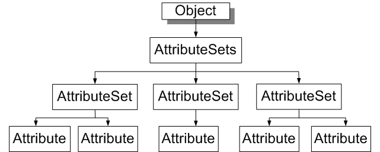
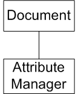

# Attributes

### Introduction to Attributes and AttributeSets.

The Autodesk Inventor API provides the means to append data, in the form of named data or a name-value pair, to objects in Autodesk Inventor. Attributes are how the programmer stores nongraphical data on Autodesk Inventor objects, and for this data to be maintained by Autodesk Inventor. Attribute data is also accessible using Apprentice Server. Attribute data is persistent by default. However, if the Transient property is set to true, the data is to be maintained during the current Autodesk Inventor session only.

You can append the following types of data: integer, double, string, byte array, or any combination of these. Applications differentiate their attributes from those of other applications through the use of AttributeSets. An AttributeSet can contain any number of Attributes, and an object can contain any number of AttributeSets, dependant only on system resources. Most persistent objects (SketchLine, Constraint, Parameter, and so on) in Autodesk Inventor support Attributes. Brep objects support attributes in the current session, with attributes maintained across parametric changes and model re-computations.

There is no direct User Interface equivalent to Attributes. Similar API functionality exists in AutoCAD through Extended Entity Data, otherwise known as XED or xdata.

### The purpose of Attributes

Attributes are commonly used to attach application-specific data to objects within Autodesk Inventor. A typical example is in referencing records in an external database, such as Microsoft Access or Oracle. An attribute appended to a part occurrence may contain a key value. An application can use this value to identify a unique database record (perhaps using ODBC or OLEDB). Thus Autodesk Inventor maintains an attribute value that is a persistent link to further data in an external database. This database can be used for Bill of Materials reports, data updates, and so on.

It is useful to be able to locate Autodesk Inventor objects containing attributes of a certain value. Use the AttributeManager object to accomplished this. The following object model diagrams show that this object is separate from the Attribute and AttributeSets objects. The AttributeManager object is obtained from the document object (DrawingDocument, PartDocument, AssemblyDocument, ApprenticeServerDocument and so on.)

### AttributeSet and Attribute Object Model Diagram



### AttributeManager Object Model Diagram



### Accessing Attributes through the API

To take full advantage of attributes, it is necessary to add, modify and erase Attributes and AttributeSets programmatically. The AttributeSets object also supports the DataIO object, allowing attribute data to be written out in XML form.

|  |
| --- |
| **Note:** Since Autodesk Inventor 9, Attributes and AttributeSets also support the Transient property. If this property is set to true, or if the AttributeSet is created using the AddTransient method of AttributeSets, the attribute data is not persisted beyond the current session. This is useful if you want to do some short-term data manipulation but do not wish to 'dirty' the document. For example, when working with Brep objects at the session level. |

### Creating an AttributesSet

The first step in appending data to an Autodesk Inventor object is to create and add a new AttributeSet object to the AttributeSets collection. This is obtained through the AttributeSets property of the object to which the attributes are to be attached. Initially, this AttributeSet can be empty of Attributes. So, assuming an assembly document contains a single part occurrence oMyPartOccurrence:

|  |
| --- |
| ``` 
 Dim oAttribSets As AttributeSets
 Set oAttribSets = oMyPartOccurrence.AttributeSets
 
 Dim oAttribSet As AttributeSet
     
 On Error Resume Next
 Set oAttribSet = oAttribSets.Add("MyAttribSet")
 If Err Then
   Set oAttribSet = oAttribSets.Item("MyAttribSet")
 End If
 ``` |

The preceding sample code obtains the AttributeSets collection object from the part occurrence, and then adds
a new AttributeSet object named "MyAttribSet" to the collection, if one doesn't already exist.

### Creating Attributes and adding or modifying values

Next, declare and add an Attribute to the AttributeSet object using the add method of the AttributeSet object.

|  |
| --- |
| ``` 
 Dim oAttrib As Inventor.Attribute
 If oAttribSet.Count = 0 Then
   Set oAttrib = oAttribSet.Add("MyAttrib", kStringType, "Some Text")
 End If
 ``` |

This code adds a single attribute of type String, containing the text "Some Text", after first
checking that the AttributeSet doesn't already contain attributes. An alternative is to check
if existing attributes have the same name, and if not, add the new attribute anyway since there
is no naming conflict. To modify the value of an existing attribute, update its Value property.

### Retrieving attributes values

When obtaining the value of an existing attribute, you usually know its name. The Item method of
both AttributeSets allow the use of a name string to identify the required object. Alternatively, the
Item method accepts a numeric index value, allowing iteration of all available AttributeSets. In this
example, we use the previously named attributes.

|  |
| --- |
| ``` 
 Dim oAttribSets As AttributeSets
 Set oAttribSets = oMyPart.AttributeSets
 
 Dim oAttrib As Inventor.Attribute
 Set oAttrib = oAttribSets.Item("MyAttribSet").Item("MyAttrib")
 Debug.Print oAttrib.Value
 ``` |

For clarity and brevity, the previous example doesn't perform any error checking. You could use the NameIsUsed property (see the next section) to check whether the attribute exists. Given the existence of the attribute 'MyAttrib' this code prints out its value, "Some Text".

### Deleting Attributes

Deleting attributes is straightforward, except that it is always wise to check for the existence of attributes contained in an AttributeSet before deleting that AttributeSet. If the AttributeSet contains attributes, delete those attributes before deleting the AttributeSet. It is the programmer's responsibility to ensure it's safe to delete attributes and AttributeSets. There is no Recycle Bin for attributes, although you can undo the last operation. If orphaned attributes exist due to the owning object being deleted or inaccessible, such attributes should be purged using the PurgeAttributeSets method of the AttributeManager.

The following code uses the delete method of the Attribute object, followed by the delete method of the parent AttributeSet object.

|  |
| --- |
| ``` 
 Dim oAttribSets As AttributeSets
 Set oAttribSets = oMyPart.AttributeSets
 
 If oAttribSets.NameIsUsed("MyAttribSet") Then
   Set oAttrib = oAttribSets.Item("MyAttribSet").Item("MyAttrib")
   oAttrib.Delete
   oAttribSets.Item("MyAttribSet").Delete
 End If
 ``` |

Again, the previous code uses minimal error checking, though it does demonstrate the use of the NameIsUsed property to verify the existence of the AttributeSet.

### Searching for Attributes using the AttributeManager object

An assembly may contain hundreds or thousands of objects, be they occurrences, dimensions, constraints, or any other persistent object. If all these objects contain attributes as described in the preceding sections, it would be a very slow and tedious process to search each object for a given AttributeSet or Attribute. Brep objects are another example, with a potentially large number of objects to iteration through. Thankfully, Autodesk Inventor provides an API to help - the AttributeManager object. You can obtain this object from the Document object, and from derived documents such as AssemblyDocument. The AttributeManager object provides a number of methods. For example, to find if an AttributeSet, Attribute or Attribute value exists, or to return objects based on specific attribute values.

|  |
| --- |
| **Note:** A helpful feature of the AttributeManager object is that wildcard characters are legal when used to specify AttributeSet or Attribute names. So, it is possible to perform searches for objects using partial name or value strings. |

AttributeManager methods such as OpenAttributeSets return an AttributeSetsEnumerator object. This is a list of AttributeSets. The OpenAttributeSets method requires a list of objects for which you need AttributeSets. The AttributeSetsEnumerator returned has its AttributeSets ordered in the same way as your list of objects, therefore you can easily match which AttributeSet relates to which object by their numerical index. This technique can help to improve performance with large numbers of attributes.

The following code assumes a PartDocument object containing a single part, which in turn has faces to which attributes are attached. This example uses OpenAttributeSets to find AttributeSet "Test" on these face objects, and prints out the value of the first attribute in the AttributeSet. This would be much quicker than opening each face.

|  |
| --- |
| ``` 
 Dim oDoc As PartDocument
 Set oDoc = ThisApplication.ActiveDocument
 
 Dim oFaceColl As ObjectCollection
 Set oFaceColl = ThisApplication.TransientObjects.CreateObjectCollection
 For Each oFace In oDoc.ComponentDefinition.SurfaceBodies.Item(1).Faces
   oFaceColl.Add oFace
 Next
 
 Dim oSet As AttributeSet
 Dim oSetEnum As AttributeSetsEnumerator
 
 Set oSetEnum= oDoc.AttributeManager.OpenAttributeSets(oFaceColl,"Test")
 For Each oSet In oSetEnum
   If oSet.Count > 0 Then
     Debug.Print oSet.Item(1).Value
   End If
 Next
 ``` |

Other methods supported by the AttributeManager object include FindObjects. As its name suggests, this method returns a collection of objects corresponding to specified AttributeSet or Attribute names, or attribute values.

### Performance

Conceptually, attributes are appended to persistent objects in Autodesk Inventor. In reality, the link is rather more tenuous. Autodesk Inventor is a parametric modeler; a uniform system for parts and assemblies. Objects in Inventor easily change, whether driven by parameters or as a result of a modeling operation such as the addition of a hole. So a persistent object such as a face is not necessarily as persistent or consistently identifiable as it first appears.

Autodesk Inventor has a complex search algorithm to enable it to consistently identify objects throughout their lifetime. This mechanism is employed by ReferenceKeys, a concept similar to handles in AutoCAD. This internal ReferenceKeys mechanism provides a reliable and robust link between an AttributeSet and the object to which it is appended. However, the link is potentially expensive in terms of processing time, particularly when you are working with large numbers of Attributes. There are several ways to mitigate the effects of this performance issue.

* Autodesk Inventor builds a cache of object-to-AttributeSet links as these links are referenced. This cache greatly reduces access time for subsequent references. You can force Autodesk Inventor to build the entire cache, for all objects, by calling the FindObjects method with no arguments. Then perform your query. Note though that continued modeling operations will destroy the cache.* When working with large numbers of Attributes, enclose your Attribute editing in a Transaction or ChangeProcessor. This tells Autodesk Inventor not to use its own automatic transaction and undo mechanism, greatly improving performance.

### Also consider

Attributes are often used in conjunction with ReferenceKeys. Use Referencekeys to obtain a persistent identifier for a given Autodesk Inventor object. This identifier is valid from session to session. For example, an application can establish a relationship between objects in an assembly by storing a ReferenceKey for one object in a persistent attribute on another.