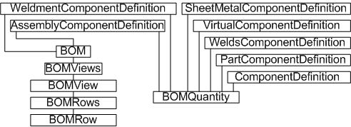

# Bill of Materials

### Introduction to the BOM

Autodesk Inventor keeps track of which parts comprise an assembly. This information can be tabulated into a bill
of materials report, commonly used in the manufacturing and assembly processes. Minimally, a BOM lists components,
quantity, and relevant totals. Additionally, a BOM likely includes part or stock numbers, cut length figures, and so on.
Autodesk Inventor can add all this information to a drawing in the form of a table.

### The purpose of the BOM API

The API allows the following actions on BOM data.

* Data can be queried and exported.
* Quantity totals can be modified - for example, overriding a value or setting a quantity to be a parameter value.
* The BOM component type (the BOM structure) can be modified.

A typical use for the BOM API is to query and export data for a specific use, perhaps to be read by other software downstream.

The BOM Structure defines the status of the component in the BOM. BOM Structure has five basic options:

* Normal
* Phantom
* Reference
* Purchased
* Inseparable

Phantom components exist in the design but are not separate line items in the BOM. Reference components are
excluded from the BOM entirely, existing only to augment the content of a design. A Purchased component is
considered a single BOM line item, even if it is a subassembly. An Inseparable component is similar to a
Purchased component, in that it is considered a single item, except that it is typically fabricated.

### BOM Object Model Diagram



### Working with the BOM through the API

Autodesk Inventor maintains the BOM internally, updating types and quantities as changes are made to an
assembly. These changes may be implemented through the user interface or through the modeling functions of
the Autodesk Inventor API. The BOM API can make additional changes to the BOM data, and can query and
export that data. Autodesk Inventor makes use of PropertySet objects to store some BOM data for a
component. Client code can access this data directly.

### Querying the BOM

The following sample code demonstrates use of the API to query an assembly for BOM data. The code assumes that the sample assembly, Arbor\_Press.iam, is open in Autodesk Inventor.
The code omits error checking for the sake of clarity and brevity. Always check that return values are of the expected type.

First, obtain the BOM object for this assembly's ComponentDefinition.

|  |
| --- |
| ``` 
 Dim oBOM As BOM
 Set oBOM = ThisApplication.ActiveDocument.ComponentDefinition.BOM ``` |

From the BOM object, get the base BOMView object, named "Structured." A BOM may also contain
views where the items have been reordered or renumbered.

|  |
| --- |
| ``` 
 Dim oBOMView As BOMView
 Set oBOMView = oBOM.BOMViews.Item("Structured") ``` |

Iterate through the rows in the BOM view, obtaining each BOMRow object.

|  |
| --- |
| ``` 
 Dim i As Long
 For i = 1 To oBOMView.BOMRows.Count
 
   Dim oRow As BOMRow
   Set oRow = oBOMView.BOMRows.Item(i) ``` |

For some of the BOM data, we'll need to query a property set of the component referenced by
each row. The PropertySets collections are accessed through the parent document of the
ComponentDefinition, so obtain the ComponentDefinition of the component.

|  |
| --- |
| ``` 
   Dim oCompDef As ComponentDefinition
   Set oCompDef = oRow.ComponentDefinitions.Item(1) ``` |

The required property set is named "Design Tracking Properties." Obtain this from the owning document of the component.

|  |
| --- |
| ``` 
   Dim oPropSet As PropertySet
   Set oPropSet = oCompDef.Document.PropertySets.Item("Design Tracking Properties") ``` |

Now we have all the information necessary to list the BOM content. Obtain variable information such as the
item number and quantity from the BOMRow object, and the part number and description from the property set.

|  |
| --- |
| ``` 
   Debug.Print "#: "; oRow.ItemNumber; _
               " Quantity:"; oRow.ItemQuantity; _
               "Part: "; oPropSet.Item("Part Number").Value; _
               " Desc: "; oPropSet.Item("Description").Value
 Next ``` |

The preceding code iterates through all the BOMRows in the BOMView object, printing BOM data to the
VBA debug window. The output should appear something like the following example.

|  |
| --- |
| ``` 
 #: 1 Quantity: 1 Part: Arbor Press Desc: 
 #: 2 Quantity: 1 Part: FACE PLATE Desc: 
 #: 3 Quantity: 1 Part: PINION SHAFT Desc: 
 #: 4 Quantity: 1 Part: LEVER ARM Desc: 
 #: 5 Quantity: 1 Part: THUMB SCREW Desc: 
 #: 6 Quantity: 1 Part: TABLE PLATE Desc: 
 #: 7 Quantity: 1 Part: RAM Desc: 
 #: 8 Quantity: 2 Part: HANDLE CAPipt Desc: 
 #: 9 Quantity: 1 Part: COLLAR Desc: 
 #: 10 Quantity: 1 Part: GIB PLATE Desc: 
 #: 11 Quantity: 1 Part: GROOVE PIN Desc: 
 #: 12 Quantity: 4 Part: ANSI B18.3 - 1/4 - 20 - 7/8 Desc: Hexagon Socket Head Cap Screw
 #: 13 Quantity: 4 Part: ANSI B18.3 - 10-32 UNF x 0.58 Desc: Hexagon Socket Set Screw - Flat Point
 #: 14 Quantity: 1 Part: ANSI B18.6.2 - 10-32 UNF - 0.1875 Desc: Slotted Headless Set Screw - Flat Point - UNF (Fine Thread - Inch) ``` |

### Summary

Autodesk Inventor can keep track of components in an assembly for the purposed of producing a bill or materials.
Components referenced by the BOM can be assigned specific types indicating whether - and how - they should be
incorporated into the BOM. Views of the BOM can be renumbered and reordered. The API allows this data to
be queried and exported, either in predefined file formats or by reading and manipulating the BOM data directly.

### Also consider

The BOM objects described previously are global in nature. The API also supports the PartsList
object in the drawing environment. This can be considered a local snapshot of the parts of the
BOM relevant to that drawing's parts list.