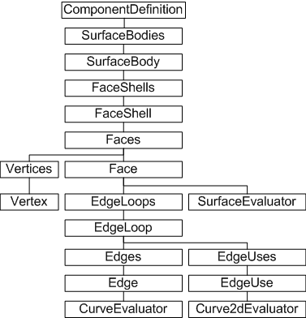
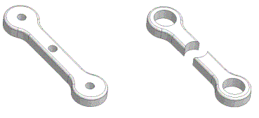
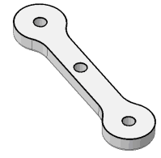
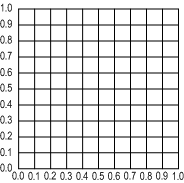
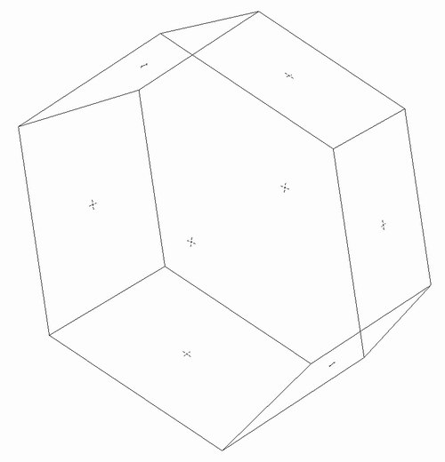

# Boundary Representation

### Introduction to Boundary Representation

Conceptually, Autodesk Inventor solids are comprised of features. Sketch profiles are extruded, lofted, revolved, and so on to create solids. Edges of solids have fillets and chamfers applied to them. None of these features are static. All of them are changeable by editing the feature, which may cause changes to other dependent features. Therefore, the surface of an Autodesk Inventor solid is very changeable, too. In other words, the surface information, defined as the boundary between the inside and the outside of the solid, is dynamic.

### The purpose of Boundary Representation data

Developer applications frequently need access to this boundary representation data. For example, a cutting application needs to know the shape of a solid so it can prepare a path for a cutting tool. A way is needed to iterate through this boundary information, and that is the purpose of the Boundary Representation API (commonly known as the BRep API).

### Boundary Representation (BRep) Object Model Diagram



### Working with the BRep API

The BRep API has a number of hierarchical objects. The topmost is the SurfaceBodies collection of SurfaceBody objects. A SurfaceBody object represents a discrete part.

Faces enclose a volume. A Face represents any geometry; planes, cylinders, free-form surfaces, and so on. A simple example is a solid cylinder. The cylinder consists of three faces. Two planar faces that act as the ends of a cylinder and one cylindrical face that acts as the side of the cylinder.

A FaceShell object represents a connected set of faces. A FaceShell for a simple cylinder has the two planar end faces, and the non-planar side face. Typically a SurfaceBody contains a single FaceShell object, but it is possible to have more, as in the following illustration:



The SurfaceBody on the left has one FaceShell. Increasing the hole diameter results in the SurfaceBody on the right, comprised of two FaceShell objects.

### EdgeLoop, Edge, and EdgeUse objects

EdgeLoop objects define a face boundary. Several EdgeLoop objects can exist for a given face. The following figure highlights the four EdgeLoop objects for the top face of this solid.



An Edge object is similar but defines only the connectivity between two adjacent faces, so typically represents only part of an EdgeLoop. An Edge object is shared between faces, unlike an EdgeUse object. A face has its own set of EdgeUse objects, which apply only to that face. They are defined in terms of the 2D parameter space of that face. Typically, there are two EdgeUse objects for each Edge Object. Edge objects are shared between faces but EdgeUse objects are not. They contain information specific to a face, including a conceptual flow direction for the face edges, useful in traversing faces.

In the BRep API, a vertex indicates a connection of at least two edges. Vertices are implied by the edges in the model.

BRep objects expose the Geometry property that returns the underlying geometry of the object.

### Parameter space

When working with planar objects, it is common to define them in terms of their own plane. Typically, the object is divided into some conceptually convenient number of divisions to reference a given point on its surface. For example, a surface can be parameterized as follows:



Surfaces are parameterized in their 2D space. Edges (curves) are parameterized in a linear fashion. However, both can be evaluated to return coordinates in 3D space. This means that to obtain model-space X Y Z coordinates of a point on a surface, it is necessary to supply the 2D parameter-space coordinates. To obtain a point on an edge, supply a single parameter-space unit to obtain the model-space X Y X coordinates. The BRep API offers several Evaluator objects, through which you can define and obtain this parameter information. The evaluator objects provide methods for converting between parameter space and model space.

### Using the API to traverse the BRep hierachy

This sample traverses the BRep hierarchy of an open part document, locating all planar faces. Using the SurfaceEvaluator object, it then determines the center of each face by dividing each side of the 2D parameter range box in half. A sketch point is added at every center point, each created on a new planar sketch.

The following code omits error checking for the sake of clarity and brevity. Always check that return values are of the expected type.

As indicated by the object model diagram, BRep information is obtained from the component definition, so the first step is to get the part component definition for the open part document. Then iterate through the SurfaceBodies collection of SurfaceBody objects. The SurfaceBody object has a Faces property providing direct access to that objects collection of faces. The following code begins to loop through that collection of faces:

|  |
| --- |
| ``` 
 Dim oPartDef As PartComponentDefinition
 Set oPartDef = ThisApplication.ActiveDocument.ComponentDefinition
     
 Dim oSurfaceBody As SurfaceBody
 Dim oFace As Face
 
 For Each oSurfaceBody In oPartDef.SurfaceBodies
   For Each oFace In oSurfaceBody.Faces
 ``` |

This sample deals only with planar faces, so check the surface type before obtaining the surface evaluator and the parameter range box for this face:

|  |
| --- |
| ``` 
   If oFace.SurfaceType = kPlaneSurface Then
             
     Dim oEval As SurfaceEvaluator
     Set oEval = oFace.Evaluator
     
     Dim oRange As Box2d
     Set oRange = oEval.ParamRangeRect
 ``` |

To calculate the center point of the range box, determine the range of each side and halve it.

|  |
| --- |
| ```         
     Dim params(0 To 1) As Double
     params(0) = oRange.MinPoint.X + (oRange.MaxPoint.X - oRange. _
         MinPoint.X) * 0.5
     params(1) = oRange.MinPoint.Y + (oRange.MaxPoint.Y - oRange. _
         MinPoint.Y) * 0.5
 ``` |

The point is in the 2D parameter space of the face. Use the GetPointAtParam method to obtain the X Y Z coordinate of that point in model space, and then create a corresponding Point object.

|  |
| --- |
| ```     
     Dim cenPt() As Double
     oEval.GetPointAtParam params, cenPt
     
     Dim oPoint As Point
     Set oPoint = ThisApplication.TransientGeometry.CreatePoint _
         (cenPt(0), cenPt(1), cenPt(2))
 ``` |

Add a new sketch to the sketches collection of the part component definition. Add a sketch point to the sketch, at the previously determined face center point. Use the ModelToSketchSpace method to create the point in the 2D plane of the sketch. Finally, move on to the next Face object or the next SubrfaceBody object.

|  |
| --- |
| ```     
     Dim oSketch As PlanarSketch
     Set oSketch = oPartDef.Sketches.Add(oFace)
         
     Dim oPoint2D As Point2d
     Set oPoint2D = oSketch.ModelToSketchSpace(oPoint)
     
     Dim oSkPnt As SketchPoint
     Set oSkPnt = oSketch.SketchPoints.Add(oPoint2D)
 
   End If
   
   Next
 Next
 ``` |

The sample places new sketches and sketch points in the part document. The sketch points are located at the center of all planar faces. For example, a tapered hexagonal solid results in placement of the following sketch points (here shown in wireframe mode):



### BRep objects and Reference Keys

Due to the transient nature of BRep objects, it is necessary to minimize the time a reference to a BRep object is maintained. Any time the model is recomputed, the BRep object references become invalid. Use reference keys to maintain a persistent reference to a particular BRep object between model recomputes.

For example, a reference to a BRep Face object becomes invalid if features that reference that face are added or modified. To handle this case, create a reference key to the face before any features edits, and then use this reference key to obtain the face after each feature has been added.

### Summary

The BRep API comprises a group of objects that define the boundary between the inside and the outside of a solid. In addition, these objects provide topological information, indicating contiguous edges and adjacent faces so the developer can traverse these edges and faces. The BRep API also provides evaluator objects to work with BRep surfaces and edges (curves) in their respective parameter spaces. BRep objects expose a Geometry property, through which the underlying geometry of the object can be obtained.

### Also consider

Boundary Representation data is transient. It is generated during the session, and changes as the model changes. The model cannot be changed through BRep data. Instead, parts and assemblies must be modified through regular modeling operations - editing features, moving parts, and so on. Refer to individual feature descriptions for their specific parameters.