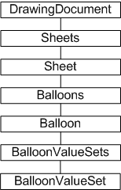
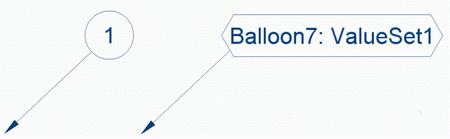

# Balloons

### Introduction to balloons

Autodesk Inventor users can add balloon notation to a drawing view
or selection of parts automatically. These enumerated balloons are
typically associated with a parts list, also generated automatically.
Either the balloons or the list can have their values overridden, or
new part numbers can be attached to custom parts. Balloons can be of
various styles. The balloons and associated parts list can be updated
to reflect the current content of the drawing view.

### The purpose of balloons

Balloons and their associated parts list are a common means of
calling out engineering requirements and specifications for
manufacturing parts. Autodesk Inventor automates much of the process,
including balloon placement. Balloon placement, type, and content can
all be modified through the API.

|  |
| --- |
| **Note:** Balloon notation referencing properties (specified through styles) currently cannot be changed through the API. |

### Balloons Object Model Diagram



### Balloons API structure

Balloons have content in the form of notation. This notation may be
a part number, the date the part was created, the mass of the part, the
author, and so on. It is typically a part number corresponding to items
in a parts list.

The Balloon object references a BalloonValueSets collection
comprised of BalloonValueSet objects. These BalloonValueSet objects
also have a value and an override value, corresponding to the same
functionality through the Autodesk Inventor user interface. The balloon
type can be set through the SetBalloonType method of the balloon
object. Balloons can reference an existing sketched symbol in place of
the standard balloon shapes.

### Using the balloon API

The following sample code makes changes to balloons on a drawing
sheet, and so assumes an open drawing with balloons attached to parts.
The code modifies the type and value of all the balloons. It omits
error checking for the sake of clarity and brevity. Always check that
return values are of the expected type.

The first step is to obtain the active sheet in the drawing. The
sample performs a count of the number of balloons and value sets,
overriding the balloon values with these counts, so the balloon count
is first initialized.

|  |
| --- |
| ``` Dim oDrawDoc As DrawingDocument Set oDrawDoc = ThisApplication.ActiveDocument      Dim oSheet As Sheet Set oSheet = oDrawDoc.ActiveSheet      Dim BalloonCount As Long BalloonCount = 1 ``` |

The intention is to change values in all balloons on the sheet, not
just in a view. The following code iterates through the balloons
collection, obtaining each balloon object in turn. The balloon type is
changed to hexagonal, and the balloon placement direction is changed to
kBottomDirection.

|  |
| --- |
| ``` Dim oBalloon As Balloon      For Each oBalloon In oSheet.Balloons     oBalloon.SetBalloonType (kHexagonBalloonType)     oBalloon.PlacementDirection = kBottomDirection ``` |

Typically, a balloon has a single ValueSet object associated with
it, but it's safe to iterate through the BalloonValueSets collection
object. The code overrides each balloons value set or sets with a
string, comprised of the balloon count and value set count values.

|  |
| --- |
| ```     Dim ValueSetCount As Long     ValueSetCount = 1              For Each oBalloonValueSet In oBalloon.BalloonValueSets         oBalloonValueSet.OverrideValue = "Balloon" & _            BalloonCount & ": ValueSet" & ValueSetCount         ValueSetCount = ValueSetCount + 1     Next     BalloonCount = BalloonCount + 1 Next ``` |

In the following figure, the balloon on the right demonstrates the
changes the preceding code applied to the balloon on the left.



### Summary

Balloons are typically, though not exclusively, used as notation to
identify parts in a drawing, with part numbers corresponding to items
in a part list. The balloon API provides the means to modify balloon
content, type, and position.

### Also consider

Other types of notation available in the drawing sheet environment
include drawing dimensions, drawing sketches, drawing text, and custom
tables.