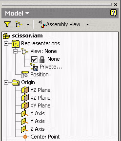
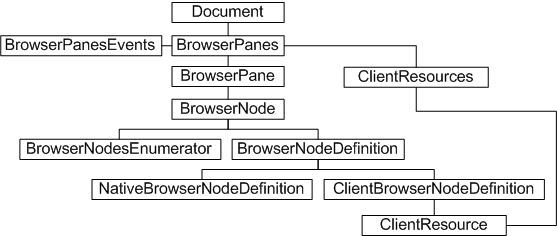
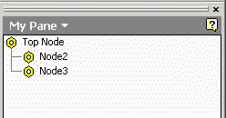

# Browser Nodes

### Introduction to Browser Nodes

A significant element of the Autodesk Inventor user interface is the browser. In a part file, this displays the names of features, sketches, work features and so on. In an assembly file, it also shows part or subassembly occurrences and assembly features. It provides a convenient and intuitive means of traversing and selecting objects and features in the model hierarchy. Typically, the status of each object or feature is indicated by a graphical icon at the appropriate tree node. The following figure represents a browser tree view of a model assembly.



### The purpose of browser node customization

The Autodesk Inventor API allows customization of the browser pane. This can mean adding a new pane, perhaps containing an ActiveX control. This topic is covered in a separate overview - see the [Browser](Browser_Overview.md) pane overview.

The API also enables iteration of existing browser tree nodes and the addition of browser panes containing custom tree structures representing your own data, complete with your own graphical icons. For example, you can represent a file system, your organization's management hierarchy, or some discipline-specific data such as HVAC throughput.

### Browser API Object Model diagram



### Iterating browser nodes through the API

The following code iterates through the browser model tree of an open part or assembly document, printing the node labels to the VBA debug screen (the "Immediate" window in VBA, if enabled). This code omits error checking for the sake of clarity and brevity. Always check that return values are of the expected type.

This code defines two routines. The first one obtains the top-level objects and then the second routine is called recursively (it repeatedly calls itself) to iterate through the entire browser tree structure. Add this code to an *ApplicationProject* code module in VBA.

First, obtain the *Document* object.

|  |
| --- |
| ``` 
 Private Sub QueryModelTree()
     Dim Doc As Document
     
     If (ThisApplication.Documents.Count <> 0) Then
         Set Doc = ThisApplication.ActiveDocument
     Else
         MsgBox "There are no open documents!"
         Exit Sub
     End If
 ``` |

Now obtain the top node for the browser pane of the model tab.

|  |
| --- |
| ``` 
     Dim oTopNode As BrowserNode
     Set oTopNode = Doc.BrowserPanes("Model").TopNode
 ``` |

From the top node, call the routine named "recurse", which prints the node definition label and moves on to the next node, if any.

|  |
| --- |
| ``` 
     Call recurse(oTopNode)
 End Sub
 ``` |

The second routine calls itself for each node in the collection of browser nodes, printing the node definition label of each node.

|  |
| --- |
| ``` 
 Sub recurse(node As BrowserNode)
     If (node.Visible = True) Then
         Debug.Print node.BrowserNodeDefinition.Label
         Dim bn As BrowserNode
         For Each bn In node.BrowserNodes
             Call recurse(bn)
         Next
     End If
 End Sub
 ``` |

For the assembly tree denoted by the first figure, this results in a report similar to the following example.

|  |
| --- |
| ``` 
 scissor.iam
 Representations
 View: None
 None
 Private...
 Position
 Origin
 YZ Plane
 XZ Plane
 XY Plane
 X Axis
 Y Axis
 Z Axis
 Center Point?
 ``` |

�and so on.

### Creating a custom pane and adding browser nodes

The preceding code simply iterated through an existing tree node hierarchy.

The following code adds a new pane tab and then adds several levels of tree nodes. This results in a new tab on the browser pane in the user interface, in addition to the standard model, library and representations tabs. Add this code to the *ThisDocument* module in VBA.

First, obtain the *BrowserPanes* collection for the current document. As noted in the object model diagram, new panes are added to this collection, and also this object provides access to the client node resources through which new icons may be added.

|  |
| --- |
| ``` 
 Sub AddNodes()
 
 Dim oPanes As BrowserPanes
 Set oPanes = ThisDocument.BrowserPanes
 
 Dim oRscs As ClientNodeResources
 Set oRscs = oPanes.ClientNodeResources
 ``` |

Create a standard Microsoft Windows *IPictureDisp* referencing an icon (.bmp) bitmap file. Change the file referenced here as appropriate - here the code references *test.bmp*. This is the icon that will be displayed at this node. Add the *IPictureDisp* to the client node resource. (If an invalid icon is supplied, the icon will default to the standard "Notepad" icon.)

|  |
| --- |
| ``` 
 Dim oIcon As IPictureDisp
 Set oIcon = LoadPicture("c:\temp\test.bmp")
 
 Dim oRsc As ClientNodeResource
 Set oRsc = oRscs.Add("Test", 1, oIcon)
 ``` |

Before adding a new pane tab to the panes collection, define the top node the pane will contain. Pass this node when creating the new pane "My Pane" through the *AddTreeBrowserPane* method.

|  |
| --- |
| ``` 
 Dim oDef As BrowserNodeDefinition
 Set oDef = oPanes.CreateBrowserNodeDefinition("Top Node", 3, oRsc)
 
 Dim oPane As BrowserPane
 Set oPane = oPanes.AddTreeBrowserPane("My Pane", "MyGUID", oDef)
 ``` |

Add two child nodes to the tree, labeled Node 2 and Node 3.

|  |
| --- |
| ``` 
 Dim oDef1 As BrowserNodeDefinition
 Dim oNode1 As BrowserNode
 
 Set oDef1 = oPanes.CreateBrowserNodeDefinition("Node2", 5, oRsc)
 Set oNode1 = oPane.TopNode.AddChild(oDef1)
 
 Dim oDef2 As BrowserNodeDefinition
 Dim oNode2 As BrowserNode
 
 Set oDef2 = oPanes.CreateBrowserNodeDefinition("Node3", 6, oRsc)
 Set oNode1 = oPane.TopNode.AddChild(oDef2)
 
 End Sub
 ``` |

The preceding routine results in a new pane and tree structure as follows (substituting your icon).



Browser nodes can be reordered. The *BrowserPane.Reorder* method allows one or more nodes to be repositioned within the tree hierarchy. (Note: this is not possible with the assembly pane.)

If a custom pane has browser nodes that are conceptually connected to objects (sketches, faces, constraints, and so on) in the model, this relationship can be created and maintained through the use of reference keys. The *ClientBrowserNodeDefinition* object supports the *GetReferenceKey* method.

By default, the browser pane is saved with the document. This means it is the responsibility of the application to either remove its browser UI, or reconnect and synchronize with the browser when the document is next present.

### Events

The *BrowserPanesEvents* property of the *BrowserPanes* collection object returns the *BrowserPanesEvents* object, supporting browser node event notification. This allows applications to emulate Autodesk Inventor's behavior by reacting to user manipulation of the tree nodes. Events supported include node label editing, node activation, and object highlighting. These events are in addition to those supported by the *BrowserPane* object.

### Summary

The browser customization API can be divided into two areas: adding an ActiveX control to a browser pane, or adding a hierarchical tree node structure to a browser pane. The latter allows an application to represent its data or constructs in a graphical manner already familiar to the user, complete with custom icons and labels. Events allow the application to be notified when the user selects a tree node.

### Also consider

For complex user interactions, standard or custom ActiveX controls can be added to browser panes. The browser panes collection object acts as an ActiveX container.