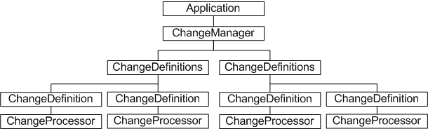
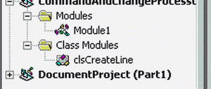
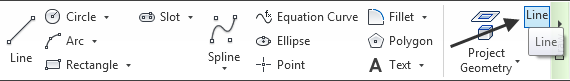
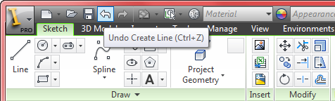

# Change Processor

### Introduction to the change processor

Autodesk Inventor users can undo actions. They can undo edits that have changed the document. They can redo their undo - in other words, they can recommit changes they had previously undone. These actions are evident in the user interface. The Edit menu indicates the last command that can be undone, as well as any command that can be redone.

For developers using the Autodesk Inventor API, the change processor can be used to achieve the same thing.

### The purpose of the change processor

Developers typically use the API transaction mechanism (TransactionManager and associated objects) to group actions atomically, and to commit or roll back those actions. This works well in the context of the application, but it is not well integrated into the user interface, and is distinct from the Autodesk Inventor internal transaction mechanism.

Ideally, a mechanism should exist to allow Autodesk Inventor to take care of transacting developer-defined actions, and to integrate any roll-back and commit actions into its user interface. This is the purpose of the change processor.

An action encapsulated in a change processor automatically benefits from Autodesk Inventor's transaction mechanism as a named action. It also automatically becomes part of the Autodesk Inventor undo and redo sequence, with the named action visible through the user interface.

The change processor object also has methods for writing and reading script strings. Developers can use these strings to persist application-specific actions.

The change processor is the preferred transaction mechanism in most cases, when compared to transactions administered through the transaction manager API.

### The change processor object model diagram



### Working with the change processor API

The change processor relies on event callbacks. The developer code to be transacted (the drawing of sketches, creating features and so on) is started as a result of a call to the execute method of the change processor. The change processor object is created by the CreateChangeProcessor method of the ChangeDefinition object, which is the named atomic unit subject to Autodesk Inventor's undo and redo mechanism.

There can be any number of change definition objects, contained by the ChangeDefinitions collection object. In addition, the ChangeManager object can create any number of ChangeDefinitions collections. Each ChangeDefinitions object is associated with a unique string for the purposes of identification. This string can be anything, but most often will be the unique CLSID of the application.

The code to be transacted is executed by calling the execute method of the ChangeProcessor encapsulating that code. There can be only one ChangeProcessor object created by the ChangeDefinition object, but that ChangeProcessor object can be deleted and recreated. As an example, consider code to be executed as the result of a button press. The button may never be pressed, so the ChangeProcessor need not be created until it is, and can be deleted afterwards. The ChangeDefinition is always there, ready to create the ChangeProcessor. This is why the code to be transacted is executed as an event callback. The ChangeProcessor is created on the fly, and its execute method is called explicitly.

### A ChangeProcessor in action

The following sample first defines a class comprised of three subroutines and some global data. This class is later instantiated and responds to button and change processor events.

This sample omits error checking for the sake of clarity and brevity. Always check that return values are of the expected type.

Create a new VBA project and add a new class module named clsCreateLine. Add the following code to the general declarations section of the new class module. This code defines the change definition, change processor, and button definition as global objects able to respond to events.

|  |
| --- |
| ``` 
 Option Explicit
 Private WithEvents mobjChangeDef As ChangeDefinition
 Private WithEvents mobjChangeProcessor As ChangeProcessor
 Private WithEvents mobjButtonDefinitionEvents As ButtonDefinition
 ``` |

Now add the first of the three subroutines to the class. This one is called when the class is instantiated and is where initialization code should be located. The handler for the button is created here.

|  |
| --- |
| ``` 
 Private Sub Class_Initialize()
     Dim objCommandMgr As CommandManager
     Set objCommandMgr = ThisApplication.CommandManager
 
     Dim colControlDefs As ControlDefinitions
     Set colControlDefs = objCommandMgr.ControlDefinitions
     
     Dim objButtonDef As ButtonDefinition
     Set objButtonDef = colControlDefs.Item("CreateLine")
     
     Set mobjButtonDefinitionEvents = objButtonDef
 End Sub
 ``` |

The second subroutine to add to the class defines what happens when the button is pressed. This is where the change processor is created from the existing ChangeDefinition object, and its execute method is called.

|  |
| --- |
| ``` 
 Private Sub mobjButtonDefinitionEvents_OnExecute(ByVal Context As NameValueMap)
 
     Dim objChangeMgr As ChangeManager
     Set objChangeMgr = ThisApplication.ChangeManager
     
     Dim colChangeDefs As ChangeDefinitions
     
     Set colChangeDefs = objChangeMgr.Item("My_unique_CP_ID")
     Set mobjChangeDef = colChangeDefs.Item("CreateLine")
     Set mobjChangeProcessor = mobjChangeDef.CreateChangeProcessor
     
     Dim objActiveDoc As Document
     Set objActiveDoc = ThisApplication.ActiveDocument
     
     mobjChangeProcessor.Execute objActiveDoc
 End Sub
 ``` |

The third and last subroutine to add to the clsCreateLine class definition defines what happens when the execute event of the change processor is called. This is the transacted code. The following example adds a sketch line to the open part document.

|  |
| --- |
| ``` 
 Private Sub mobjChangeProcessor_OnExecute(ByVal Document As Document, ByVal Context As NameValueMap, Succeeded As Boolean)
     Dim objPartDoc As PartDocument
     Set objPartDoc = Document
          
     Dim objPartCompDef As PartComponentDefinition
     Set objPartCompDef = objPartDoc.ComponentDefinition
     
     Dim objTransGeom As TransientGeometry
     Set objTransGeom = objPartDoc.Parent.TransientGeometry
     
     Dim colLine As SketchLine
     Set colLine = objPartCompDef.Sketches(1).SketchLines.AddByTwoPoints _
         (objTransGeom.CreatePoint2d(0, 0), objTransGeom.CreatePoint2d(4, 0))
 End Sub
 ``` |

This completes the class definition. Now add the code that instantiates this class. Add a new code module to the modules section of your VBA project. First, add a global declaration of the new class to the general declarations section, as follows.

|  |
| --- |
| ``` 
 Option Explicit
 Public mobjCreateLine As clsCreateLine
 ``` |

Next, add the public subroutine that will be called to run this application. This does three things. It calls the subroutine to set up the ChangeDefinition object, and it calls the subroutine to add a button to the command panel. Both subroutines are defined in this module. Lastly, it instantiates the clsCreateLine class defined previously.

|  |
| --- |
| ``` 
 Sub CreateLineUsingChangeProcessor()
     Call AddCreateLineChangeDef
     Call AddLineButton
     Set mobjCreateLine = New clsCreateLine
 End Sub
 ``` |

Now add the subroutine that creates the ChangeDefinition object. This object is created through the Add method if the ChangeDefinitions object, which is created through the Add method of the ChangeManager object. A unique ID is associated with the ChangeDefinitions object, to aid in identification elsewhere in the application. Similarly, the ChangeDefinition is named too, however this information is used in the user interface. The 'Create Line' text in the following code will be displayed in the Autodesk Inventor Edit menu as the last command that can be undone. If undone, it will display as the command that can be redone.

|  |
| --- |
| ``` 
 Private Sub AddCreateLineChangeDef()   
     Dim objChangeMgr As ChangeManager
     Set objChangeMgr = ThisApplication.ChangeManager
     
     Dim colChangeDefs As ChangeDefinitions
     Set colChangeDefs = objChangeMgr.Add("My_unique_CP_ID")
      
     Dim objDhangeDef As ChangeDefinition
     Set objDhangeDef = colChangeDefs.Add("CreateLine", "Create Line")     
 End Sub
 ``` |

Finally, add the subroutine that adds the button to the command panel. This uses the standard user interface customization API. User interface customization is covered elsewhere in the Autodesk Inventor programming Help.

|  |
| --- |
| ``` 
 Private Sub AddLineButton()
     Dim objCommandMgr As CommandManager
     Set objCommandMgr = ThisApplication.CommandManager
     
     Dim colControlDefs As ControlDefinitions
     Set colControlDefs = objCommandMgr.ControlDefinitions
     
     Dim objButtonDef As ButtonDefinition
     Set objButtonDef = colControlDefs.AddButtonDefinition("Line", _
         "CreateLine", kShapeEditCmdType, "", "Create Line", "Line")
 
     Call ThisApplication.UserInterfaceManager.Ribbons("Part").RibbonTabs("id_TabSketch").RibbonPanels("id_PanelP_2DSketchDraw").CommandControls.AddButton(objButtonDef)
     
     objButtonDef.Enabled = True   
 End Sub
 ``` |

Once all the preceding code is added, the VBA project browser should appear as follows.



Start a new part document in Autodesk Inventor, and run the CreateLineUsingChangeProcessor subroutine. A new Line button is added to the command panel as follows:



Pressing this button causes a sketch line to be created in the part document. Now look at the Edit menu. Notice the ChangeProcessor named Create Line is available for undo. Pressing the Undo button causes the sketch line to disappear, and the Create Line ChangeProcessor is available for redo. The menu appears as follows:



### Summary

Use the change processor API to take advantage of Autodesk Inventor's own transaction and undo/redo mechanism. It is no longer necessary to explicitly define the start, end, and nesting of transactions. Developer code can be executed as an atomic named unit, and can be undone and redone through the Autodesk Inventor user interface.

### Also consider

For cases where a fine degree of granular control is required, the transaction API may still be appropriate. The developer can nest transactions in a specific manner and add checkpoints for partial rollback.