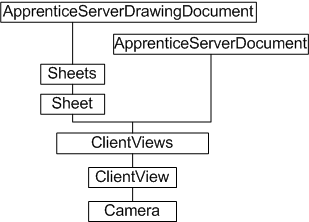
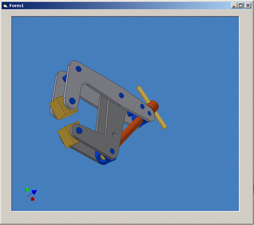

# Client Views

### Introduction to client views

A subset of the Autodesk Inventor API, with a few additions, is provided for developers wishing to work with Autodesk Inventor documents outside of the Autodesk Inventor environment. This API is provided through Apprentice Server - an ActiveX server that can be incorporated into other applications. Apprentice Server has no user interface, and most of its API is read-only.

One part of the Apprentice Server API that has no direct equivalent in Autodesk Inventor is the ClientView object. When writing an application outside of Autodesk Inventor, the ClientView object provides a convenient means of displaying an Autodesk Inventor document in a similar manner to Autodesk Inventor itself.

### The purpose of client views

The ClientView object allows the developer to associate an Autodesk Inventor document with a window handle in their standalone application, and to manipulate the view of the document through the use of the Camera object. The view orientation can be modified, as can the perspective, extents, and mouse-driven applied transformation. A client view can provide a visually appealing graphic with minimal effort on the part of the developer.

### ClientView object model diagram



### Working with client views through the API

Creation of a new ClientView object is only possible through Apprentice Server. It is not currently possible to add a new ClientView object within the Autodesk Inventor environment. For example, using VBA to call the Add method of a ClientView object obtained through the Sheet object of a Drawing document will fail.

The ClientView object is always associated with a window handle (hWnd). The ClientViews collection object provides two methods for creating a new ClientView object; Add and AddBySubset. The latter method is likely to be depreciated. The Add method associates a document client view with a given window handle.

### Setting up a client view in Apprentice Server

The following example uses Visual Basic, though any fully ActiveX-compliant environment should work. The code omits error checking for brevity and clarity. Always check that return values are of the expected type and in the expected range.

In Visual Basic, add a PictureBox control to a new form. Keep the default control name Picture1. Double-click the control to enter the code module, and add the following code in the declarations section:

|  |
| --- |
| ``` 
 Dim oSvr As ApprenticeServerComponent
 Dim oAppDoc As ApprenticeServerDocument
 Dim oClientView As ClientView
 ``` |

At this point, Visual Basic has no idea what an ApprenticeServerComponent is. A reference to the Apprentice Server type library is needed. In the Visual Basic user interface, select Project, then References. In the list of available references, put a check against the item labeled Autodesk Inventor's Apprentice Object Library. This points to the RxApprentice.tlb type library.

Continue adding code. In the Form\_Load sub, add the following:

|  |
| --- |
| ``` 
 Private Sub Form_Load()
   Dim filename As String
   filename = "C:\Autodesk\Inventor 10\Tutorial Files\analyze-2.iam"
   Set oSvr = New ApprenticeServerComponent
   Set oAppDoc = oSvr.Open(filename)
   Set oClientView = oAppDoc.ClientViews.Add(Picture1.hWnd)
 End Sub
 ``` |

The preceding code references an assembly file. Change this reference to suit. An instance of the ApprenticeServerComponent is created, and the assembly document is opened by Apprentice Server. The last line adds a new ClientView object to the document's ClientViews collection, and references the window handle (hWnd) of the Picture1 control.

In the Picture1\_Click sub, add the following code:

|  |
| --- |
| ``` 
 Private Sub Picture1_Click()
   Dim oCamera As Camera
   Set oCamera = oClientView.Camera
   oCamera.ViewOrientationType = kIsoBottomLeftViewOrientation
   oCamera.Perspective = True
   oCamera.Apply
   Me.Refresh
 End Sub
 ``` |

The preceding code responds to a click event on the Picture1 control, setting various camera properties before refreshing the view. The ISO orientation type is set to bottom left, and perspective viewing is enabled.

Lastly, add the following code to the Form\_Paint event. This is to ensure the view is maintained if the window is changed in any way. The Update method takes a Boolean argument; true if the view is dynamically updated, to improve performance.

|  |
| --- |
| ``` 
 Private Sub Form_Paint()
   oClientView.Update (False)
 End Sub
 ``` |

The following figure shows the results of running the sample code and clicking on the picture control:



### ClientViews and Autodesk Inventor Read-only mode

The ClientView object in the Apprentice Server API provides a convenient means of displaying Autodesk Inventor documents outside of Autodesk Inventor, but it does require Apprentice Server. For how to get Apprentice Server, please refer to: [**Apprentice Server**](Apprentice_Overview.md).

A full installation of Autodesk Inventor will also install
Autodesk Inventor Read-only mode. This is a user application for viewing
Autodesk Inventor files. Autodesk Inventor Read-only mode is distinct from
client views , and has no API but provides the same quality view as Inventor.

### Summary

An application developer wishing to use an Autodesk Inventor API to display Autodesk Inventor documents in their application
can use ClientView. The Apprentice Server API provides the ClientView object, enabling Autodesk Inventor files to be viewed and manipulated in a client window.

A user application for viewing Autodesk Inventor files is installed with Autodesk Inventor. It is named Autodesk Inventor Read-only Mode, and is accessible though the Microsoft Windows Start menu.

### Also consider

Autodesk has viewers for many of its products, but an increasingly popular format is DWF (Drawing Web Format). Autodesk Inventor can export DWF files for publishing.