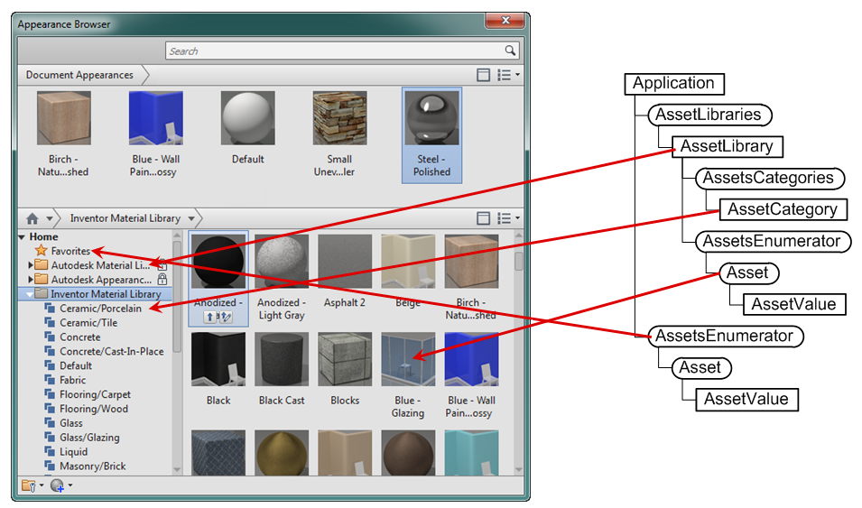
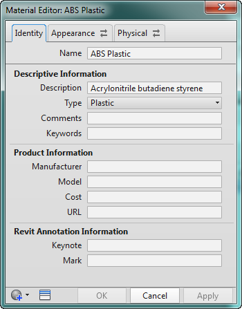
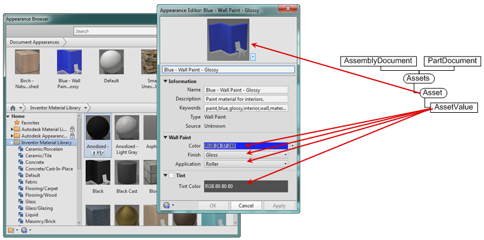

# Consistent Materials (Materials and Appearances)

## A Big Change from Materials and Render Styles

If you’ve used the Material and RenderStyle API objects in the past to work with materials and colors in Inventor there has been a large change in Inventor that has introduced completely new API objects for materials and colors.

Previous to Inventor 2013, Inventor had its own system for defining materials and colors, which was exposed through the API as the Material and RenderStyle objects. Recently Autodesk has introduced a common way of defining materials and colors that allows a single set of materials and colors to be used by all Autodesk applications. This way models transferred from one application to another will carry their material and will appear the same. This new Autodesk component is referred to as Consistent Materials.

Inventor 2013 was updated to use Consistent Materials, but the API was not. Instead, the existing Material and RenderStyle objects were re-plumbed to work on top of Consistent Materials. This works in most cases but since they’re not a complete 1-for-1 match there are some things that don’t work and other things you don’t have access to. Most existing programs that still use the Material and RenderStyle objects should continue to work. Inventor 2014 introduces new API functionality specifically for Consistent Materials and new programs should begin to use the new API and existing programs that use the Material and RenderStyle objects can be upgraded as-needed. The Material and RenderStyle objects are now hidden and are no longer officially supported.

The new API functionality provides full access to consistent material information and provides support for using, editing, and creating new materials and colors and for working with the libraries that contain them. Consistent materials provides better integration between Autodesk applications and also supports additional capabilities relative to materials and colors. However, as a result of the additional capabilities and flexibility the API is not as easy to use as the previous Material and RenderStyle objects. The new consistent material API is discussed below.

## Introduction to Consistent Materials

For those of you familiar with the Material and RenderStyle objects a brief comparison between with consistent materials will be useful. For those of you not familiar with the old API objects this will still be useful in introducing some of the concepts used in the consistent materials portion of the API.

With the old Material and RenderStyle API there were distinct objects with properties that defined all of the information associated with that particular object. For example, the Material object had properties like Density, PoissonsRatio, SpecificHeat, etc. This made it simple to use from an API developer’s standpoint because it was easy to see what the object supported and you could easily get and set the values associated with the object.

Consistent materials takes a different approach. Rather than having specific objects for each class of data and a unique property for each value, consistent materials takes a very general approach. The primary object in consistent materials is an Asset object, where Asset objects represent materials, physical properties, and colors (which are now referred to as appearances). An asset is essentially a collection of values. The set of values associated with an asset is not pre-defined by the API definition like it was with the Material and RenderStyle objects. You now have to determine, from either examining existing objects or using documentation, what values to expect for asset objects that represent certain types of materials, physical properties, or appearances. There are six API samples that make examining existing assets relatively easy by writing out all of the information associated with the material, appearance, and physical property assets.

[Write out all appearances](../sample-programs/DumpAllAppearances_Sample.md)
[Write out document appearances](../sample-programs/DumpDocumentAppearances_Sample.md)
[Write out all materials](../sample-programs/DumpAllMaterials_Sample.md)
[Write out document materials](../sample-programs/DumpDocumentMaterials_Sample.md)
[Write out all physical properties](../sample-programs/DumpAllPhysicalProperties_Sample.md)
[Write out document physical properties](../sample-programs/DumpDocumentPhysicalProperties_Sample.md)

## Asset Libraries

Assets exist within libraries. A single library can contain multiple assets of different types. For example it’s common to have a single library that contains material, physical property, and appearance assets. Libraries are represented by .adsk files. The Appearance Browser and Material Browser provide the user-interface to these libraries and the assets they contain. The Appearance Browser is shown below along with the portion of the API object model that provides access to these libraries and their assets.



Assets are categorized within a library. The API also provides access to these categories and the assets within each category.

Libraries can be locked which means they’re read-only and as a result any of the properties that edit a library will fail. Even in the case where a library is not locked, the types of edits you can do are limited; you can delete and rename assets but not create or modify them. Creation or editing of assets is only done on assets contained within a document. There is functionality to easily copy assets from one library to another or between libraries and documents. Using this you can copy and asset to a document, edit it, and copy it back to the library. To create a new asset you create it in a document and then copy it to a library.

## Assets

As discussed above, an asset is a generic object that contains a collection of values. In Inventor there are three primary types of assets; materials, physical properties, and appearances. Material assets are the simplest. They primarily serve to group a physical asset and appearance together. Conceptually a material can be described by its physical properties (density, Poisson’s ratio, yield strength, etc.) and how it looks or its appearance. A material property has some basic information that identifies it, (name, description, type, etc.), and it references a physical properties asset and an appearance asset. You can see this when using the user-interface too, as shown below. After selecting a material in the Material Browser, the attributes of the material are represented on three tabs in the Material Editor; Identity, Appearance, and Physical. The Appearance and Physical tabs allow you to view and edit the associated appearance and physical property assets.



As already discussed, an asset is a collection of values. These values can be of different types. They can be simple types like floats, integers, strings, and Booleans, but they can also be more complex types like color, filename, reference to other assets, textures, and choices. When editing an asset you need to be aware of what values to expect and their types. For example, choice asset values always need to be set with one of the pre-defined choices. The picture below shows the user-interface for editing an asset and the API objects that provide the equivalent functionality.



## Using Assets

Consistent materials are more complicated to use than the previous Material and RenderStyle objects but for the most common operations there isn’t too much difference. The most common use is to assign an existing material to a part or an appearance to an occurrence, part, body, feature, or face. It is possible to create new assets and edit existing ones but it’s not that common to use the API to do that.

Below is an example that illustrates assigning an existing appearance to an assembly occurrence. This sample demonstrates the issue discussed earlier where an asset has to exist in the document before it can be used. This checks to see if the asset is already local and if it is uses it, and if not, copies it into the document from a library.

The principles demonstrated in the sample below also apply when working with materials. The only differences being that you'll use the MaterialAssets collection on the library and you'll set the ActiveMaterial property of the PartDocument instead of the appearance property.

``` Public Sub SetOccurrenceAppearance()
     Dim asmDoc As AssemblyDocument
     Set asmDoc = ThisApplication.ActiveDocument
     
     ' Get an appearance from the document.  To assign an appearance is must
     ' exist in the document.  This looks for a local appearance and if that
     ' fails it copies the appearance from a library to the document.
     Dim localAsset As Asset
     On Error Resume Next
     Set localAsset = asmDoc.Assets.Item("Bamboo")
     If Err Then
         On Error GoTo 0
         
         ' Failed to get the appearance in the document, so import it.
         
         ' Get an asset library by name.  Either the displayed name (which
         ' can changed based on the current language) or the internal name
         ' (which is always the same) can be used.
         Dim assetLib As AssetLibrary
         Set assetLib = ThisApplication.AssetLibraries.Item("Autodesk Appearance Library")
         'Set assetLib = ThisApplication.AssetLibraries.Item("314DE259-5443-4621-BFBD-1730C6CC9AE9")
         
         ' Get an asset in the library.  Again, either the displayed name or the internal
         ' name can be used.
         Dim libAsset As Asset
         Set libAsset = assetLib.AppearanceAssets.Item("Bamboo")
         'Set libAsset = assetLib.AppearanceAssets.Item("ACADGen-082")
         
         ' Copy the asset locally.
         Set localAsset = libAsset.CopyTo(asmDoc)
     End If
     On Error GoTo 0
            
     ' Have an occurrence selected.
     Dim occ As ComponentOccurrence
     Set occ = ThisApplication.CommandManager.Pick(kAssemblyOccurrenceFilter, "Select an occurrence.")
     
     ' Assign the asset to the occurrence.
     occ.appearance = localAsset
 End Sub ``` |