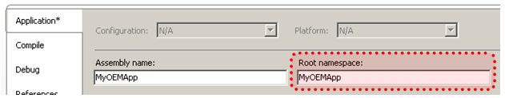
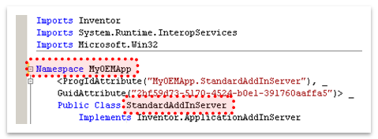
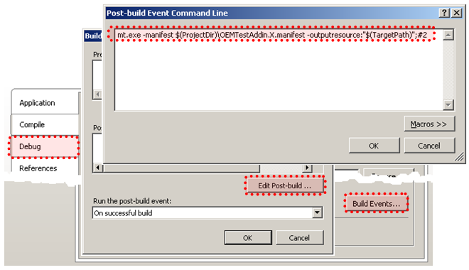

# Converting an Existing Add-In to be Registry-Free

The following describes the process of converting a standard add-in into a registry-free add-in.
Since the process is different for the different programming languages, the process is described
for Visual Basic, C#, and VC++.

## Making your **Visual Basic** Add-In Registry Free

1. Create a new file in the same folder as your project file with the name "MyOEMApp.X.manifest",
   where MyOEMApp will be replaced with the name of your add-in. Add the following to the manifest file.
   The portions highlighted in yellow need to be edited to match your add-in.

   ``` <?xml version="1.0" encoding="UTF-8" standalone="yes"?>
 <assembly xmlns="urn:schemas-microsoft-com:asm.v1" manifestVersion="1.0">
   <assemblyIdentity name="MyOEMApp" version="1.0.0.0" />
   <clrClass clsid="{2bf59d73-5170-4524-b0e1-391760aaffa5}" 
             progid="MyOEMApp.StandardAddInServer" 
             threadingModel="Both" 
             name="MyOEMApp.MyOEMApp.StandardAddInServer" 
             runtimeVersion="" />
   <file name="MyOEMApp.dll" hashalg="SHA1" />
 </assembly>
 ``` |

   The “name” attribute of the clrClass element consists of three parts, separated by periods.
   The first is the name of the root namespace, which is highlighted below.

   

   The second part is the namespace that the COM class is defined within. For this example is it MyOEMApp
   and is highlighted below. The Last piece is the name of the class that implements the ApplicationAddInServer
   interface, which is “StandardAddInServer” in this example and is also highlighted below.

   
2. The next step is to add a post-build process to incorporate this manifest into your dll.
   The post-build process calls mt.exe which is a Microsoft utility that will embed the manifest
   into your add-in’s dll. You define a post-build step through the Compile tab of the Application
   Properties dialog. On the Compile tab, click the “Build Events…” button and then on the “Build Events”
   dialog click the “Edit Post-build…” button. Finally enter the lines below into the “Post-build Event
   Command Line” dialog, as shown below; OEMTestAddin is the name of your add-in.

   ```

   call "%VS100COMNTOOLS%vsvars32"
   mt.exe -manifest "$(ProjectDir)OEMTestAddin.X.manifest" -outputresource:"$(TargetPath)";#2
   ```

   
3. Remove any code associated with registering the add-in in the registry. This typically
   just means removing the Register and Unregister methods from your add-in class. The AddInGuid
   property is in the same region as the registration functions, so if you intend on using this
   property in other areas of your add-in you’ll want to be careful not to delete it.

Skip to step 4 below, which is the same for all languages.