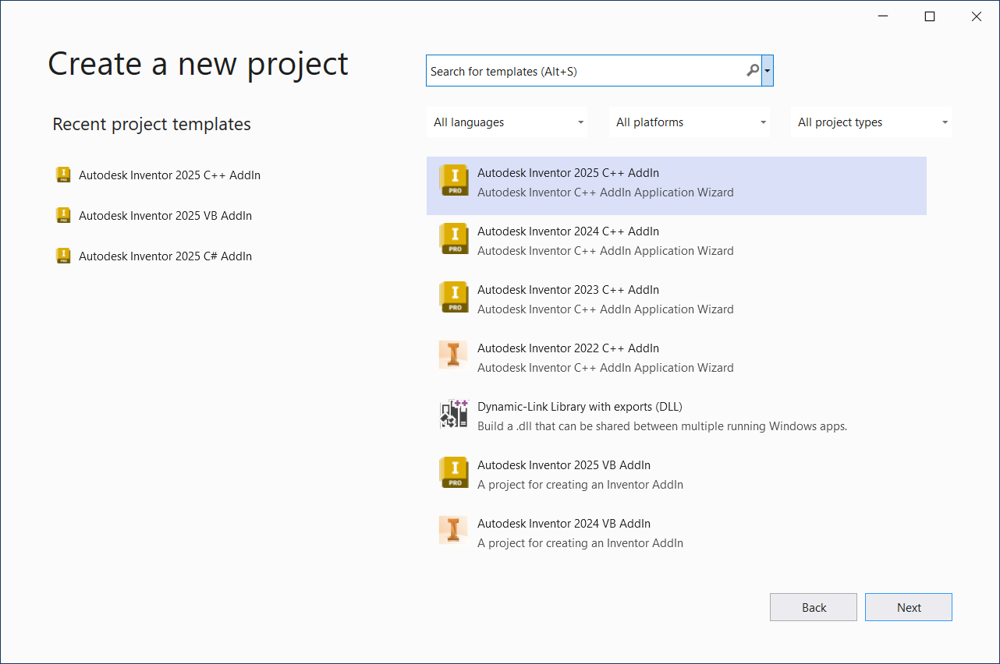
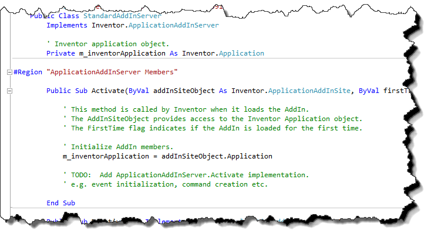
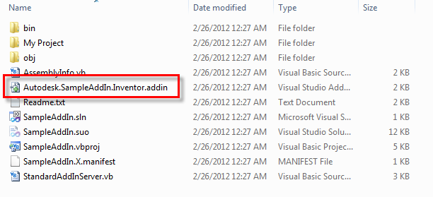
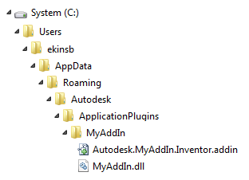
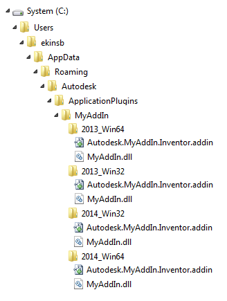
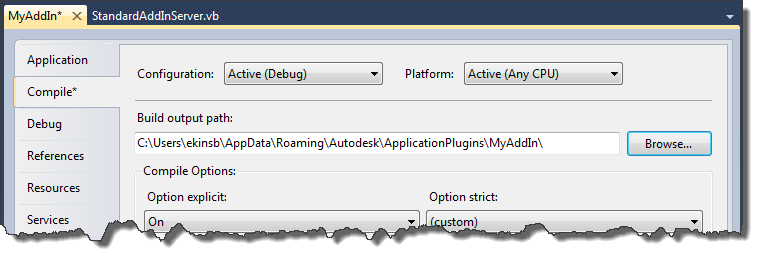
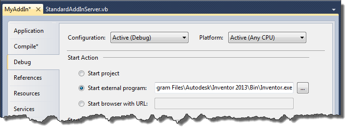

## What is an Add-In?

Inventor's Add-In functionality is a way for a program to connect to Inventor and
use it's API. The other common ways of accessing Inventor's API are from Inventor's
VBA and from an external exe. All of these are valid ways of using Inventor's API
and each has their own advantages and disadvantages. Which one to use will depend
on what your program needs to do and how it will be used by the end-user. Add-ins
are typically used in the case where you want to add new functionality to Inventor
in the form of custom commands. Add-in's have the following capabilities that make
them ideal for this.

* Add-ins are loaded automatically when Inventor is started. This simple action provides
  some powerful capabilities. First, once an add-in has been installed on a computer,
  the user doesn't need to do anything special or know anything about programming
  to be able to access the capabilities it provides. Second, it allows the add-in
  to add its user-interface into Inventor's, i.e. ribbon buttons, browser tabs, etc.
  Third, the add-in can connect to events to monitor and respond to user activity
  in Inventor.
* Add-ins run in-process to Inventor, providing much better performance than an external
  exe.
* Add-ins can be written in any of the most popular languages so you're not limited
  to using a language you're not familiar with or that may be outdated but can take
  advantage of the latest programming technologies available.

## Creating an Add-In

|  |
| --- |
| **Note:** Inventor has been upgrated from .Net Framework to .Net 8 since Inventor 2025, and the Inventor Addin Templates for Visual Studio 2022 have been upgrated to make use of .Net 8 since Invnetor 2025. The Visual Studio 2022 version 17.8 or later is required to make use of the upgrated addin wizards. |

To create an add-in you'll need to use Visual Studio.
It's possible to create an add-in using any language that supports creating
a dll COM component, but all of the samples and tools provided with the SDK are limited to Visual Basic,
C#, and C++. It's possible to create add-ins using the free Express editions but with some severe limitations.
For example, debugging is not possible in Visual Basic Express 2010. Because of this the
professional version is recommended. The Express editions are adequate for developing standalone
executable and are an excellent choice for getting started with Inventor's API. But for add-in
development you should plan on Visual Studio Professional. The choice to use one
of the other versions of Visual Studio with more features than the Professional
version would be solely based on your needs and is not a requirement of Inventor.

For the next step, use the **Inventor Add-In** template in Visual Studio to create
your add-in. In order to use the add-in template you'll need to install the SDK
DeveloperTools.msi. The location and installation instructions for the
SDK is described in the [Introduction to Using Inventor's Programming
Interface](UsingSDK.md) overview.

With the add-in wizards installed, you can create a new project in Visual Studio selecting
the **Autodesk Inventor \* AddIn** template as shown below. On the creation dialog you should choose "All\*" the the filters to see all of the available templates(custom templates are not displayed for specific filter).



The project that's created using the template is a skeleton add-in. When Inventor
starts your add-in it begins by calling the Activate method, which is shown in the
picture below. A critical thing happens in this call, an object is passed to your
add-in through the addInSite argument of the Activate method. This object supports
an Application property which your add-in can use to gain access to Inventor's Application
object and the entire API. You'll notice that the template is assigning the reference
returned by the Application property to a local member variable so the add-in can
maintain a reference to the Application object. It's also typically in the Activate
method where your add-in will add its user interface to the Inventor's user interface
using Inventor's API. It will also connect to any events that it needs to monitor.
Once it's been loaded and is running the add-in doesn't do anything except react
to events as they occur. For example, it would respond to the click when the user
clicks one of its custom commands.



To quickly test that the use of the add-in template resulted in the creation of
a working add-in you can compile the project as-is. This will compile your add-in
as a dll. The next step is to make your add-in known to Inventor.

### Making Your Add-In Known to Inventor

Every time Inventor starts it looks for add-ins that have been installed and loads
them. In previous versions before Inventor 2012 it used the registry to find the add-ins.
This registry-based look-up is still supported for legacy add-ins, but a new registry-free
method of making your add-in known to Inventor is now supported and is the recommended
approach to use. When an add-in is created using the add-in template a registry-free
add-in is created.

In order to allow your add-in to be found by Inventor, you need to place a special
file in one of a few different directories. This file describes your add-in and
also indicates where your add-in dll is on the computer. When Inventor is started,
it scans these directories and reads these files to determine which add-ins should
be loaded.

The file that Inventor looks for has a *.addin* extension. A .addin file was
automatically created for you when you created your add-in project, as is illustrated
below.



The conents of the .addin file are shown below. As you can see it uses xml to format
the data.

``` <Addin Type="Standard">
 <!--Created for Autodesk Inventor Version 17.0--> 
 <ClassId>{51e6ad8e-5eaa-42a1-b845-a68802a26bf7}</ClassId>
 <ClientId>{51e6ad8e-5eaa-42a1-b845-a68802a26bf7}</ClientId>
 <DisplayName>SampleAddIn</DisplayName>
 <Description>SampleAddIn</Description> 
 <Assembly>SampleAddIn.dll</Assembly>
 <OSType>Win64</OSType>
 <LoadAutomatically>1</LoadAutomatically> 
 <UserUnloadable>1</UserUnloadable>
 <Hidden>0</Hidden> 
 <SupportedSoftwareVersionGreaterThan>16..</SupportedSoftwareVersionGreaterThan>
 <DataVersion>1</DataVersion> 
 <LoadBehavior>2</LoadBehavior> 
 <UserInterfaceVersion>1</UserInterfaceVersion>
 </Addin> 
 ``` |

The following describes the different elements of the .addin file:

**Addin** - (Required) The outermost element to involve all other elements. The Type attribute specifies the addin type, valid values are "Standard" and "Translator".

**ClassId** - (Required) Specifies the ClassId GUID associated with an Add-in.
This may or may not change from one release to the next. If you look at your add-in
code you'll see this specified as a GuidAttribute for your add-in class. In almost
all cases you don't need to do anything with this but use what is provided.

**ClientId** - (Required) Specifies a GUID that is used as the add-in identifier.
This value should remain unchanged across releases and different versions of the
add-in. This value is used to identify the owner of API-created objects such as
ribbons, toolbars, etc. In almost all cases this will be the same as the ClassId.

**DisplayName** - (Required) Specifies the display name of the add-in as it will
appear in the Add-in manager. The Language attribute can be specified for local languages, if not specified it defaults to English, below example sets the DisplayName for French:

<DisplayName Language="1036">Convertisseur: DWF</DisplayName>

**Description** - (Required) This is a description of your add-in and is displayed in the
bottom of the Add-In Manager dialog when the add-in is selected from the list. The Language attribute can be specified for local languages, if not specified it defaults to English, below example sets the Description for French:

<Description Language="1036">Convertisseur Autodesk interne DWF</Description>

**Assembly** - This is the path to you add-ins dll. This can be a full path or a relative path
where it's relative to the location of your .addin file. It can also be relative to the Inventor\bin
directory however since you're not allowed to install into that directory with Administrator privileges
it's not recommended that you use that directory. A path relative to the location of the .addin
file is recommended and is discussed in more detail below.

**OSType** - (Optional) Specifies if your add-in will work with only a 64 or 32 bit operating system.
Valid values for this are "Win32" or "Win64". If this value is not specified it's assumed the add-in is
assumed to be valid for both.

**LoadAutomatically** - (Optional) Specifies whether the add-in should be allowed to load automatically
as per the load behaviors defined by the add-in. Value can be 0 or 1. Assumed to be true (1) if this value
is not specified. If set to false (0), the add-in needs to be manually loaded using the add-in manager.

**LoadBehavior** - (Optional) Specifies when the add-in should be loaded in Inventor. This is important
for better startup performance. This option can be specified using one of the following values:

0 - Load immediately on startup **(not recommended)**
1 - Load when any document is opened
1 - Load when a part document is opened (same as previous)
2 - Load when an assembly document is opened
3 - Load when a presentation document is opened
4 - Load when a drawing document is opened
10 - Load only on demand, either through the API or using the Add-In Manager.

Assumed to be **0** if this value is not specified.

**UserUnloadable** - (Optional) Specifies whether the add-in should be allowed to load automatically
as per the load behaviors defined by the add-in. Value can be 0 or 1. Assumed to be true (1) if this value
is not specified. If set to false (0), the add-in needs to be manually loaded using the add-in manager.

**Hidden** - (Optional) Specifies whether the add-in should be hidden in the Add-in Manager’s list of
add-ins. Assumed to be false if this value is not specified (i.e. add-in is visible). Value can be 0 or 1.

**SupportedSoftwareVersionEqualTo
SupportedSoftwareVersionGreaterThan
SupportedSoftwareVersionLessThan
SupportedSoftwareVersionNotEqualTo**  - (Optional) Specifies the version(s) of Inventor that the add-in should
be available in. Combinations of these can be used. These values are ignored if the manifest file is located in
a version-specific folder.Versions are declared in the format of Major#.Minor#.ServicePack# / or BuildIdentifier#. SupportedSoftwareVersionEqualTo and SupportedSoftwareVersionNotEqualTo support multiple version entries seperated by a semicolon (;).

**DataVersion** - (Optional) Specifies the version of add-in data contained within Inventor documents that
this version of the add-in supports. This is used by add-ins that store migrating data in Inventor documents,
which is indicated by the "DocumentInterests" set on the document.

**UserInterfaceVersion** - (Optional) Specifies the version of the add-in's user interface. Changing
this version results in all of the add-in’s UI getting cleaned up during Inventor start-up.

Below elements are specifically for translator add-ins.

**FileExtensions** - (Optional) Specifies the file extensions of the translator add-in can import from or export to. If multiple file extensions are specified the delimiter semicolon can be used between them. Below is sample to specify the FileExtensions:

<FileExtensions>.CATPart;\*.CATProduct;\*.cgr</FileExtensions>

**FilterText** - (Optional) Specifies the filter text for a translator add-in. The Language attribute can be specified for local languages, if not specified it defaults to English, below example sets the FilterText for French:

<FilterText Language="1036">Fichiers CATIA V5 (\*.CATPart;\*.CATProduct;\*.cgr)</FilterText>

**SupportsSaveCopyAs** - (Optional) Specifies whether the translator add-in supports the Save Copy As. Value can be 0 or 1. Assumed to be false (0) if this value is not specified. If set to true (1), the FilterText will be availabe in the Save Copy As dialog.

**SupportsSaveCopyAsFrom** - (Optional) Specifies which documents the translator add-in supports to export. Valid values are the Inventor documents extensions with semicolon as delimiter. Below is sample to specify the SupportsSaveCopyAsFrom:

<SupportsSaveCopyAsFrom>.ipt;.iam</SupportsSaveCopyAsFrom>

**SupportsOpen** - (Optional) Specifies whether the translator add-in supports to open a foreign data. Value can be 0 or 1. Assumed to be false (0) if this value is not specified.

**SupportsOpenInto** - (Optional) Specifies which documents the translator add-in supports to open into. Valid values are the Inventor documents extensions with semicolon as delimiter. Below is sample to specify the SupportsOpenInto:

<SupportsOpenInto>.ipt;.iam</SupportsOpenInto>

**SupportsImport** - (Optional) Specifies whether the translator add-in supports importing data. Value can be 0 or 1. Assumed to be false (0) if this value is not specified. If set to true (1), the FilterText will be availabe in the Open dialog.

**SupportsImportInto** - (Optional) Specifies which documents the translator add-in supports to import into. Valid values are the Inventor documents extensions with semicolon as delimiter. Below is sample to specify the SupportsImportInto:

<SupportsImportInto>.ipt;.iam</SupportsImportInto>

### Where to Put Your Files

Now that you have your add-in dll and have created your .addin file you need to know where to place those files
so that Inventor can find and load your add-in.

The following four locations are supported. You can choose any one of the four depending
on the needs of your add-in. Your .addin file can exist in any one of the following four
locations or any subdirectory. The "%XXXX%" portion of each of the
paths is an operating system defined variable. When using Explorer you can
enter it as part of the path and Explorer will evaluate it to use the actual
path defined by the variable.

1. **All Users, Version Independent**

   Windows 10/11 - %ALLUSERSPROFILE%\Autodesk\Inventor Addins\
2. **All Users, Version Dependent**(Since Invetnor 2024 the below folder is used to
   place the .addin manifest files instead of the legacy
   %ALLUSERSPROFILE%\Autodesk\Inventor 20xx\Addins\ folder)

   Windows 10/11 - %PROGRAMFILES%\Autodesk\Inventor 20xx\Bin\Addins\
3. **Per User, Version Dependent**

   In Windows 10/11 - %APPDATA%\Autodesk\Inventor 20xx\Addins\
4. **Per User, Version Independent**

   In Windows 10/11 - %APPDATA%\Autodesk\ApplicationPlugins

There are a couple of things to consider when determining where to put your add-in. If you choose
a location that is available to all users it will require administrator privileges to install your
add-in. In most cases, computers are rarely shared amongst multiple users so a per-user installation
is usually sufficient.

If you plan on actively updating your add-in for each release of Inventor then making it version dependent
can be good so that the user will only have access to an add-in that was written for and tested with the
version of Inventor they're using. Because significant effort is made to allow the API to be upward compatible
you should be able to run older add-ins with newer versions of Inventor. Because of this you can supply
and add-in and not tie it to a specific version assuming that it will continue to run as newer versions of
Inventor are released.

Also, because you can specify versions that your add-in is compatible within the .addin file you can still
use a version independent .addin location and control the versioning through the .addin file.

### Drag and Drop Add-In Deployment

A new feature added in Inventor 2013 is the ability to create an add-in that can be deployed by
simply copying a directory into a certain location on the user's computer. The change made to
enable this is that Inventor looks in the four directories above for .addin file and now also looks
in any subdirectories within those four directories. If you create a directory that contains your
.addin file and your addin dll and set the Assembly element of your .addin file to have just the
name of your dll without any path, you can copy that folder to any of the folders above and
Inventor will find and load your addin. Below is an example of the directories and files for an add-in named "MyAddin". This
shows the full path for the "%APPDATA%\Autodesk\ApplicationPlugins" location.



It's also possible to create much more complex configurations for a drag and drop type of add-in. For example you can have an
add-in where you have one dll for 32-bit and another one for 64-bit. You might also have a dll that is specific to a certain
version of Inventor and a different dll for another Inventor version. The possible directory structure to support this is
shown below. In order for it to support multiple versions of Inventor you must put the folder in one of the two version
independent folders. An example of how the folders might look for an add-in like this is demonstrated in the picture below.
What's happening here is that you are essentially delivering four different add-ins, each with their own .addin file and dll. Which
version and which OS the add-ins load is controlled by the contents of the .addin file for each of the add-ins.



### Debugging Your Add-In

Once you've compiled your add-in and have a dll you'll need to follow the steps below in order to enable debugging.
With registry-free add-ins there isn't any difference between debugging with 32 or 64-bit Inventor.

1. You need to copy your .addin file and the add-in dll into one of the locations where Inventor looks for .addin files, as described
   above. This allows Inventor to find your add-in.
2. You need to change setting in your project so that when you compile your project, the dll is output to the directory above. This
   is so Visual Studio and Inventor will be using the same dll. The project setting to change is shown below.

   
3. You need to set the debug setting so that when you start your project from Visual Studio it will automatically start Inventor.
   The project setting to change is shown below.

   

Now you can add break points to your add-in and begin debugging (F5) from Visual Studio. Inventor should begin running and
your break points should be hit when those lines are executed.

### Writing Your Add-In Code

The actual code of your add-in isn't anything specific to an add-in but uses the Inventor API to interact with
Inventor. The only thing that's somewhat unique to an add-in is that some API calls have an argument for a *ClientId*. This is
the ClientID of your add-in as identified in your .addin file. This is typically used when you're creating user-interface elements
in Inventor. Inventor uses this to remember which add-in created what.

---

|  |  |
| --- | --- |
| © Copyright 2025 Autodesk, Inc. | Comment on this page. |