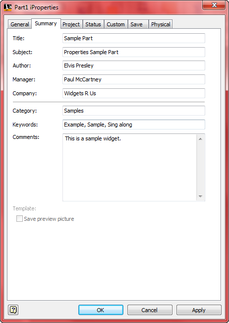
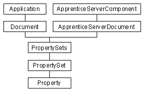
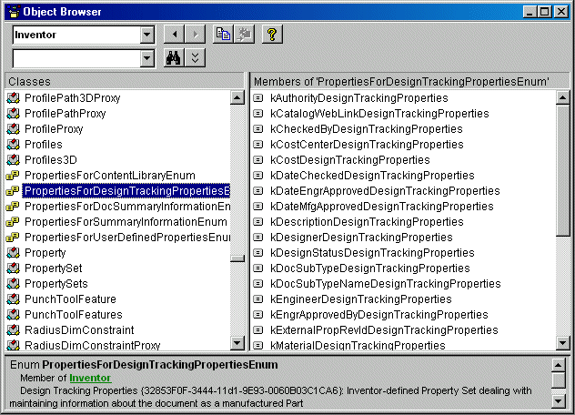

# Document Properties

## Introduction

Autodesk Inventor has a set of properties associated with every document. The properties for a file can be viewed and set from inside Autodesk Inventor using the "File | Properties" command. The dialog displayed for this command is shown below. You can also access the properties using Windows Explorer by right-clicking on the file and selecting the "Properties" option. Autodesk Inventor's Design Assistant also provides access to document properties. You also have full access to the property information using the API.



## Accessing Properties Using the API

Using the API, you have complete read and write access to the document properties using both Autodesk Inventor and Apprentice. In fact more functionality is exposed through the API than through the various property-related user interfaces. The diagram below shows the object hierarchy for properties.



From the hierarchy diagram you can see that properties are accessible from Autodesk Inventor and Apprentice. You can also see the structure in which the properties are stored. The various properties are grouped within "property sets." From the Document object (or the ApprenticeServerDocument object when using Apprentice) you can obtain the PropertySets collection object. The PropertySets collection object provides access to all of the property sets in a document. The PropertySet object represents each property set and each property set provides access to the properties it owns.

The sample below illustrates obtaining the PropertySets collection object using Apprentice.

|  |
| --- |
| ``` 
 ' Declare the Apprentice object
 Dim oApprentice As New ApprenticeServerComponent
 
 ' Open a document using Apprentice
 Dim oApprenticeDoc As ApprenticeServerDocument
 Set oApprenticeDoc = oApprentice.Open("C:\Test\part.ipt")
   
 ' Obtain the PropertySets collection
 Dim oPropsets As PropertySets
 Set oPropsets = oApprenticeDoc.PropertySets
 ``` |

The sample below illustrates obtaining the PropertySets collection object using Autodesk Inventor.

|  |
| --- |
| ``` 
 ' Declare the Application object
 Dim oApplication As Inventor.Application
 
 ' Obtain the Inventor Application object.  
 ' This assumes Inventor is already running.
 Set oApplication = GetObject(, "Inventor.Application")   
 
 ' Set a reference to the active document.
 ' This assumes a document is open.
 Dim oDoc As Document
 Set oDoc = oApplication.ActiveDocument
       
 ' Obtain the PropertySets collection object
 Dim oPropsets As PropertySets
 Set oPropsets = oDoc.PropertySets
 ``` |

The PropertySets collection object supports methods to iterate through and access all the PropertySets in the collection. Each property set has two identifiers: the display name and the internal name. The display name is a string that helps to identify the type of information stored by the properties within the property set. Usually the display names are unique but this is not guaranteed. The internal name is another identifier of a property set and is guaranteed to be unique. The internal name is actually a GUID converted to a string. The following code can be added to either of the samples above to show the display name and internal name of every property set in a document.

|  |
| --- |
| ``` 
 ' Iterate through all the PropertySets one by one using for loop
 Dim oPropSet As PropertySet
 For Each oPropSet in oPropsets
     ' Obtain the DisplayName of the PropertySet
     Debug.Print "Display name: " & oPropSet.DisplayName 
 
     ' Obtain the InternalName of the PropertySet
     Debug.Print "Internal name: " & oPropSet.InternalName
 
     ' Write a blank line to separate each pair.
     Debug.Print                            
 Next
 ``` |

When a new Autodesk Inventor document is created, Inventor adds a standard set of property sets. The following are the display names, internal names, and brief description of all of the pre-defined property sets. Prior to Autodesk Inventor 6 some of the Autodesk Inventor properties used standard property sets as defined by Microsoft. Starting with Autodesk Inventor 6 all property sets used are now exclusive to Autodesk Inventor. This change was made to solve problems that occurred when moving files from one language to another. The current set of property sets and their internal names are shown below.

Summary Information, {F29F85E0-4FF9-1068-AB91-08002B27B3D9}
Document Summary Information, {D5CDD502-2E9C-101B-9397-08002B2CF9AE}
Design Tracking Properties, {32853F0F-3444-11D1-9E93-0060B03C1CA6}
User Defined Properties, {D5CDD505-2E9C-101B-9397-08002B2CF9AE}

The properties sample delivered in the SDK demonstrates the reading and writing the properties and also serves as a tool to view the properties of a document. The sample is available in the "SDK\Samples\VB.NET\Standalone
Applications\ApprenticeServer\Properties" directory.

If you want to access a particular property set and know either its display name or internal name you can access it directly using the Item property of the PropertySets object. The alternative is to iterate through the collection looking for a particular property set. You can use the display name or internal name but because the display name is not guaranteed to be unique the internal name will be more reliable. Also if your application will be used in other countries, you should use the internal name because it will always remain the same and will not be affected by localization changes made. The sample below illustrates obtaining a specific property set using the display name.

|  |
| --- |
| ``` 
 ' Get a reference to the "Design Tracking Properties" PropertySet
 Dim oPropSet As PropertySet
 Set oPropSet = oPropsets.Item("Design Tracking Properties")
 ``` |

Using the internal name to obtain a specific property set is done in the same way, but first you need to know what the internal name is. The internal names for the Autodesk Inventor-created property sets are listed above. You can also find the internal names using the Object Browser. If you select the enumerator for the property set you're interested in, the internal name is displayed as part of the description at the bottom of the browser as shown below.



The sample below shows how to access a property set using the internal name.

|  |
| --- |
| ``` 
 ' Get a reference to the "Design Tracking Properties" PropertySet
 Dim oPropSet As PropertySet
 Set oPropSet = oPropsets.Item("{32853F0F-3444-11d1-9E93-0060B03C1CA6}")
 ``` |

Once you have obtained a property set you have access to the properties it contains.
A property is basically just a name and a value. Each property is identified by a Property ID (a Long). The ID value is guaranteed to be unique among all properties within a specific property set. The value of a property is a Variant so it can contain almost any type of value: Integer, Double, String, Dates, and arrays of these types. The thumbnail property also returns an IPictureDisp object that can be used by standard picture controls.

Just as the PropertySets object is a collection of different PropertySet objects, the PropertySet object in turn is a collection of different Property objects and similar to the PropertySets collection object, the PropertySet object supports methods to iterate through and access all the properties in a particular set. It also provides direct access to a particular property if its name or property ID is known. The following code segment shows how to access all the properties in a PropertySet.

|  |
| --- |
| ``` 
 Dim oPropSet As PropertySet
 For Each oPropSet In oPropSets    
     ' Iterate through all the Properties in the current set.
     Dim oProp As Property
     For Each oProp in oPropset
         ' Obtain the Name of the Property
 	Dim Name As String
 	Name = oProp.Name 
 
 	' Obtain the Value of the Property
 	Dim Value As Variant
 	Value = oProp.Value
 
         ' Obtain the PropertyId of the Property
 	Dim PropertyId As Long
 	PropertyId = oProp.PropId         
     Next     
 Next ``` |

Properties can also be accessed directly if their names (called property IDs) are known. All of the Autodesk Inventor-native and Microsoft-defined properties have their property IDs specified in the corresponding enum. As shown in the previous diagram of the object browser, each property has a corresponding enum value. This is its PropertyID. The sample below directly accesses a specific property using the internal name of the property set and the unique ID of the property.

|  |
| --- |
| ``` 
 ' Access the value of the "Cost" Property of 
 ' "Design Tracking Properties" PropertySet
 Dim Value As Variant
 Value = oPropsets.Item("{32853F0F-3444-11d1-9E93-0060B03C1CA6}").ItemByPropId(kCostDesignTrackingProperties).Value 
 ``` |

## Creating, Changing and Deleting Properties

### Creating new PropertySets and Properties

Autodesk Inventor allows users to create their own properties, which are added to the "Custom Properties" collection. These properties are added to the "User Defined Properties" PropertySet. The API also supports the creation and edit of custom properties. In addition it also supports the creation of totally new PropertySets and Properties.

The steps involved in creating a new collection of properties are:

1. Add a new PropertySet object to the PropertySets collection. The PropertySets collection object supports the Add method, which allows for the addition of a new PropertySet to the collection.- Add new properties to the newly created PropertySet object. The PropertySet object supports the Add method, which allows for addition of new properties to the PropertySet.

|  |
| --- |
| ```    
 'declare new PropertySet object to be added
 Dim oNewPropertySet As PropertySet
 
 On Error Resume Next
 ' Try to obtain the PropertySet to see if it already exists
 Set oNewPropertySet = oPropsets.Item("New PropertySet")
     
 ' If PropertySet does not exist then add the new PropertySet
 If Err Then       
         ' Add the new PropertySet
         Set oNewPropertySet = oPropsets.Add("New PropertySet")
 	
 	' Adding the new Property to the new PropertySet
         Call oNewPropertySet.Add("A Value", "New Property", 2)
 End If
 ``` |

Display names and internal names for property sets must be unique with respect to all other property sets in the document. In the sample above, no internal name is specified, which causes Autodesk Inventor to create one. When creating properties, the name, display name, and ID must be unique with respect to other properties in that property set. The ID must be greater than 1, (the ID of 1 is reserved by Microsoft) and less than 255.

The above sample demonstrates how to create a new property set and add a property to that set. Autodesk Inventor permits adding properties to new property sets and the "Custom" property sets. Adding properties to the standard property sets is blocked.

### Changing the Names and Values of Properties

The Autodesk Inventor API allows you to change both the names and values of properties that have been created by third parties, but only the value of pre-defined properties can be changed. For example, the PropertySet object's DisplayName property can be changed for user-created PropertySet objects but not for pre-defined PropertySets. The InternalName property cannot be reset for any of the PropertySet objects. For the Property object, the Name and Value can be changed for properties created by third parties but not for pre-defined properties.  You can tell if a property is read-only or not by referring to the helpstring associated with the corresponding enum for the property. The PropID is read-only and cannot be changed for any of the properties.

The name of a property can be changed by using the Name property of the Property object. The value of a property can be changed using the Value property of the Property object. However, for pre-defined properties you need to be careful to use the correct type when setting the value. For example, let's consider changing the value of the "Date Checked" property (of the "Design Tracking Properties" PropertySet). This needs to be set using a Variant of Date type, otherwise Autodesk Inventor functions that read this value may not work correctly. The sample below illustrates setting this property to a specific date.

|  |
| --- |
| ``` 
 ' Get a reference to the "Date Checked" property.
 Dim oProp As Property
 Set oProp = oPropSets.Item("{32853F0F-3444-11d1-9E93-0060B03C1CA6}").ItemByPropId(kDateCheckedDesignTrackingProperties)
 
 ' Define a Date variable with the desired date.
 Dim NewDate As Date
 NewDate = "Jan 1, 2000"
 
 ' Assign the date to the property.
 oProp.Value = NewDate
 ``` |

The following code could cause problems in Autodesk Inventor because a String rather than a Date type of variable is assigned to the property.

|  |
| --- |
| ``` 
 ' Get a reference to the "Date Checked" property.
 Dim oProp As Property
 Set oProp = oPropSets.Item("{32853F0F-3444-11d1-9E93-0060B03C1CA6}").ItemByPropId(kDateCheckedDesignTrackingProperties)
 
 ' Assign the date to the property.
 oProp.Value = "Jan 1, 2000"
 ``` |