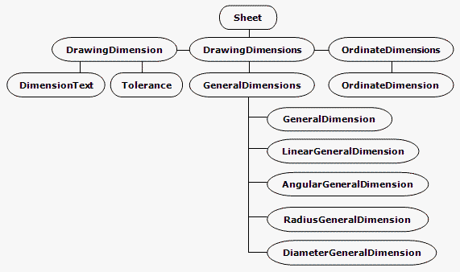
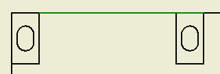
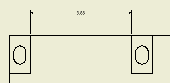

# Drawing Dimensions

### Introduction to Drawing Dimensions

Autodesk Inventor has two different types of dimensions - model and drawing. These can be thought of as
controlling and documenting, respectively. Model dimensions are typically parametric constraints intended to
control part or feature size. Sketch dimensions are included in this category since they directly affect
model size and constraints.

Drawing dimensions simply document a given dimension on a drawing sheet, and
have no effect on model size or constraints. However, drawing dimensions can be promoted from a draft view
to an underlying sketch, or can be retrieved from a sketch or model.

Drawing dimensions are associative, but not parametric. There are various types of drawing dimensions
supported, including general, linear, ordinate, radius, diameter, and angular. Options controlling the
appearance of dimensions are specified through dimension styles, enabling support of common dimension
standards. Individual settings may be overridden to suite.

### A look at the Drawing Dimensions API

The Drawing Dimensions API provides access to all drawing dimensions on a sheet. Objects corresponding
to the available dimension types are derived from a common object named DrawingDimension which contains
common methods and properties, such as tolerance, precision, text and so on.

Ordinate dimensions differ
from other types in that a given sequence of dimension values will reference the same single point of
origin. Figure 1 shows the object model diagram.



Figure 1

### Geometry Intent

Drawing dimension creation methods expect geometry points to be supplied in the form of GeometryIntent
objects. To better understand such objects, imagine a leader line and arrow pointing to a user-selected
point on a drawing line. Leader line associativity to the selected spot on the drawing line needs to be maintained, but there is no
point geometry midway on the drawing line to reference. In this case, a GeometryIntent object
encapsulates the intent to reference a location on the drawing line, a certain distance from a particular
end.

Similarly, dimensions require GeometryIntent objects because, unlike the Autodesk Inventor modeling
environment, the drawing environment contains only 2D lines, arcs and circles - no points. So, a GeometryIntent
object for a dimension might reference a particular end of a line or arc, or the center of a circle or arc.

### Sample

This sample VBA code listing may be cut and pasted into a module in the Autodesk Inventor VBA editor. Make
sure all grayed sections are present. Immediately before each grayed section is text describing that section's
purpose and operation - do not copy this text into the editor. The code omits error checking for the sake of
clarity and brevity. In your code, always check that return values are of the expected type. Ensure that the
Autodesk Inventor Object Library is available in your project; in the Visual Basic Editor, pick
Tools > References, and check the appropriate reference.

### Creating a Linear Dimension

This code creates a simple linear dimension of a curve on a drawing sheet. It assumes the curve is
selected before the code is run. Figure 2 shows two lines selected in the sample Vertical Plate.idw.



Figure 2

Select the highlighted lines, then run the VBA code. The code first obtains the active sheet from the active document.

|  |
| --- |
| ``` 
 Sub CreateDimension()
         
     Dim oDoc As DrawingDocument
     Set oDoc = ThisApplication.ActiveDocument
     
     Dim oSheet As Sheet
     Set oSheet = oDoc.ActiveSheet
 ``` |

Next, obtain DrawingCurve objects from the selected lines. DrawingCurve objects are acceptable for creation of GeometryIntent objects.

|  |
| --- |
| ``` 
     Dim oCurve1 As DrawingCurve
     Set oCurve1 = oDoc.SelectSet(1).Parent
     
     Dim oCurve2 As DrawingCurve
     Set oCurve2 = oDoc.SelectSet(2).Parent
 ``` |

Now we're ready to create the GeometryIntent objects. Since we're using the DrawingCurve end points, there
is no need to specify a point on the geometry, which would be provided by the optional second argument
for CreateGeometryIntent.

|  |
| --- |
| ``` 
     Dim oIntent1 As GeometryIntent
     Set oIntent1 = oSheet.CreateGeometryIntent(oCurve1)
         
     Dim oIntent2 As GeometryIntent
     Set oIntent2 = oSheet.CreateGeometryIntent(oCurve2)
 ``` |

Create a 2D point for the location of the dimension line.

|  |
| --- |
| ``` 
     Dim oPt As Point2d
     Set oPt = ThisApplication.TransientGeometry.CreatePoint2d(15, 15)
 ``` |

Create a linear dimension on the sheet, using the two GeometryIntent objects as
dimension extension line origin points, and the 2D point for the dimension line location.

|  |
| --- |
| ``` 
     Dim oLinDim As LinearGeneralDimension
     Set oLinDim = oSheet.DrawingDimensions.GeneralDimensions.AddLinear(oPt, oIntent1, oIntent2)
     
 End Sub
 ``` |

The sample code will produce a result similar to that shown in Figure 3.



Figure 3