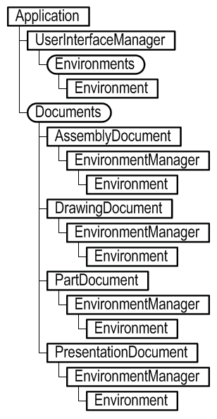
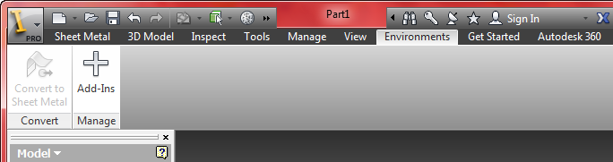
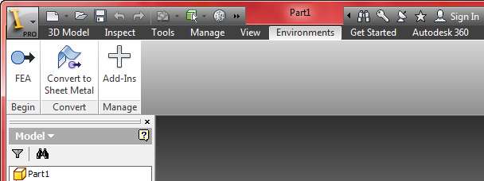
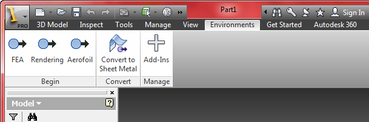
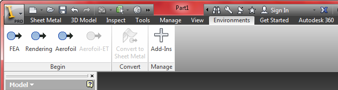

# Environments

### Introduction to Environments

To the Autodesk Inventor user, an environment, such as the assembly environment or the sketch environment, simply means that tools are made available to accomplish the task at hand. Menus and panel bars appropriate to the workflow are presented to the user. For example, the sketch environment provides commands to create sketch lines, circles and so on, but not commands for placing or copying components which are actions specific to the assembly environment.

### The purpose of Environments

If all Autodesk Inventor commands were present and available on the menus and panel bar all the time, the user interface would be very cluttered and confusing. Environments provide a means to present a focused subset of commands. Taking this a step further, a client application may define custom environments in addition to Autodesk Inventor's set of built-in environments. The application may define the environment as transient, or it may be persistent across sessions. Additionally, a given environment may have a number of edit-targets, any of which may have focus. For example, an application may define an FEA environment. The results of FEA computation models may result in a number of different solution results, each represented by a node on the browser.

### Environments Object Model Diagram



### Working with Environments through the API

### Creating an environment

Every document has a built-in base environment. A client application may create a new custom environment by adding to the Environments collection, and will typically copy some components used in another environment, such as command bars, to the new one. Command bars can inherit their properties from the parent environment if the InheritAll property of the CommandBarList is set to true.

The samples that follow show how to add new environments to Autodesk Inventor. The figure below shows the initial view of the Applications menu and the panel bar, with no additional environments or edit targets added. The example code will add three new environments. Lastly, it will create an edit target within one of these environments.



The first step is to get the Environments collection from the UserInterfaceManager. From this, obtain a built-in environment to use as the basis for the new environment. This sample and the following code omit error checking for the sake of clarity and brevity. Always check that return values are of the expected type.

|  |
| --- |
| ``` 
 Sub AddParallelEnv1()
     Dim oEnvs As Environments
     Set oEnvs = ThisApplication.UserInterfaceManager.Environments
     
     Dim oEnv As Environment
     Set oEnv = oEnvs("MBxSheetMetalEnvironment")
 ``` |

Next, add a new environment to the environments collection. Here, we use a display name of "FEA" - this is the name that will be displayed in the Applications menu. The string "FEA Env's internal name" is this the internal name for the new environment - its equivalent to the internal names of built-in environments, such as "DLxDrawingEnvironment". (A ClientId is not supplied so this environment is not persisted.)

|  |
| --- |
| ``` 
     Dim oNewEnv As Environment
     Set oNewEnv = Nothing
     Set oNewEnv = oEnvs.Add("FEA", "FEA Env's internal name")
 ``` |

This example will use the same default command bar as the source environment, and will populate the new environment's panel bar with some command bars. It will also copy the command bars from the context menu.

|  |
| --- |
| ``` 
     oNewEnv.DefaultRibbonTab = oEnv.DefaultRibbonTab
     Dim sTabs(0 To 1) As String
     sTabs(0) = "id_TabSheetMetal"
     sTabs(1) = "id_TabFlatPattern"
    
     
     oNewEnv.AdditionalVisibleRibbonTabs = sTabs
     oNewEnv.InheritAllRibbonTabs = True
 ``` |

In this case the new environment will inherit all the command bars from the parent environment.

|  |
| --- |
| ``` 
     oNewEnv.PanelBar.CommandBarList.InheritAll = True
     oNewEnv.ContextMenuList.InheritAll = True
 ``` |

All that remains is to add the new environment to the list of parallel environments (thus adding the environment to the list of available environments, as indicated by the Applications menu shown in the figure below.

|  |
| --- |
| ``` 
     Dim oParEnvs As EnvironmentList
     Set oParEnvs = ThisApplication.UserInterfaceManager.ParallelEnvironments
     Call oParEnvs.Add(oNewEnv)
 End Sub
 ``` |



Next, add another two environments named "Rendering" and "Aerofoil", based on the assembly and weldment environments respectively. This code is much the same as that in the previous section.

|  |
| --- |
| ``` 
 Sub AddParallelEnv2()
     Dim oEnvs As Environments
     Set oEnvs = ThisApplication.UserInterfaceManager.Environments
     
     Dim oEnv As Environment
     Set oEnv = oEnvs("AMxAssemblyEnvironment")
       
     Dim oNewEnv As Environment
     Set oNewEnv = Nothing
     
     Set oNewEnv = oEnvs.Add("Rendering", "Rendering Env's internal name")
     
     Dim sTabs(0 To 1) As String
     sTabs(0) = "id_TabAssemble"
     sTabs(1) = "id_TabDesign"
     
     oNewEnv.DefaultRibbonTab = oEnv.DefaultRibbonTab
     oNewEnv.InheritAllRibbonTabs = False
     
     Dim oParEnvs As EnvironmentList
     Set oParEnvs = ThisApplication.UserInterfaceManager.ParallelEnvironments
     
     Call oParEnvs.Add(oNewEnv)    
 End Sub
 
 
 Sub AddParallelEnv3()
     Dim oEnvs As Environments
     Set oEnvs = ThisApplication.UserInterfaceManager.Environments
     
     Dim oEnv As Environment
     Set oEnv = oEnvs("AMxWeldmentEnvironment")
     
     Dim oNewEnv As Environment
     Set oNewEnv = oEnvs.Add("Aerofoil", "Aerofoil Env's internal name")
      
     oNewEnv.DefaultRibbonTab = oEnv.DefaultRibbonTab
     oNewEnv.InheritAllRibbonTabs = True
     
     Dim oParEnvs As EnvironmentList
     Set oParEnvs = ThisApplication.UserInterfaceManager.ParallelEnvironments
     
     Call oParEnvs.Add(oNewEnv)    
 End Sub
 ``` |

The preceding code will add the new FEA, Rendering and Aerofoil environments to Autodesk Inventor's Applications menu, as shown below. Each environment has its own set of command bars, but so far none has a specific edit target defined.



Now to add an edit target to one of these new environments. This indicates a specific editing requirement. An example in Autodesk Inventor is the sketch editing facility within the Part environment. The code is much the same as previously except now the SetCurrentEnvironment method of the EnvironmentManager object is used - this sets the environment for this document but it is not persisted.

|  |
| --- |
| ``` 
 Sub ActivateET()
     Dim oEnvs As Environments
     Set oEnvs = ThisApplication.UserInterfaceManager.Environments
     
     Dim oEnv As Environment
     Set oEnv = oEnvs("MBxSheetMetalEnvironment")
   
     Dim oPartDoc As PartDocument
     Set oPartDoc = ThisApplication.ActiveDocument
     
     Dim oNewEnv As Environment
     Set oNewEnv = oEnvs.Add("Aerofoil-ET", "ET Env's internal name")
     
     oNewEnv.DefaultRibbonTab = oEnv.DefaultRibbonTab
     oNewEnv.InheritAllRibbonTabs = True
      
     Call oPartDoc.EnvironmentManager.SetCurrentEnvironment(oNewEnv, "ET's Cookie")   
 End Sub
 ``` |

The result of this code is indicated in the following figure. Note that the Applications menu now has the new Aerofoil-ET edit target checked instead of the Part edit target. Note too the change to the panel bar.



Although the previous edit target is not persisted in the sense that it will not be active when the document is next loaded, you can return to this edit target by calling the SetCurrentEnvironment method again.

|  |
| --- |
| ``` 
 Sub ActivateETAgain()
     Dim oEnvs As Environments
     Set oEnvs = ThisApplication.UserInterfaceManager.Environments
     
     Dim oPartDoc As PartDocument
     Set oPartDoc = ThisApplication.ActiveDocument
     
     Dim oNewEnv As Environment
     Set oNewEnv = Nothing
     
     Set oNewEnv = oEnvs("ET Env's internal name")
     
     Call oPartDoc.EnvironmentManager.SetCurrentEnvironment(oNewEnv, "ET's Cookie")
 End Sub
 ``` |

However, an edit target can be made persistent by setting the OverrideEnvironment property of the EnvironmentManager object. Thus, when a document is loaded, the specified edit target will be present.

|  |
| --- |
| ``` 
 Sub TestOverrideEnv()
     Dim oEnvs As Environments
     Set oEnvs = ThisApplication.UserInterfaceManager.Environments
     
     Dim oEnv As Environment
     Set oEnv = oEnvs("MBxSheetMetalEnvironment")
     
     Dim oPartDoc As PartDocument
     Set oPartDoc = ThisApplication.ActiveDocument
     
     Dim oNewEnv As Environment
     Set oNewEnv = oEnvs.Add("OverrideTmp", "OverrideTmp Env's internal name")
     
     oNewEnv.DefaultRibbonTab = oEnv.DefaultRibbonTab
     oNewEnv.InheritAllRibbonTabs = True
     
     Dim oEnvMgr As EnvironmentManager
     Set oEnvMgr = oPartDoc.EnvironmentManager
 
     oEnvMgr.OverrideEnvironment = oNewEnv
 End Sub
 ``` |

### Summary

The combination of custom environments, and the ability to define transient or overridden edit targets within those environments, allows client applications to define a user interface specific to their purpose, with full control over what is presented to the user. They can behave in the same manner as built-in Autodesk Inventor environments, with environments and edit targets pushed onto the environment stack, and with Autodesk Inventor's Return button traversing back through the stack as expected.

### Also consider

For additional control over what buttons are enabled in specific scenarios, use the DisabledCommandList object. This is available both at the document and environment level, and is complementary to the Enabled property of the ControlDefinition object. Commands placed in the DisabledCommandList object at the environment level will be grayed-out within that environment.