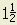
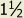

# XML Tags for FormattedText

This table and the tag list below indicates which text formatting tags are supported by the listed API
calls. For example, the table shows that the HoleTag.FormattedText property supports style overrides, line breaks, fractions
and super/subscripts. Details of these XML tags are can accessed by clicking on the relevant table column title, or just
scroll down to the appropriate section.

|  |  |  |  |  |  |  |  |  |  |  |  |  |  |  |  |  |
| --- | --- | --- | --- | --- | --- | --- | --- | --- | --- | --- | --- | --- | --- | --- | --- | --- |
| API | [Style Override](#StyleOverride) | [Line Break](#Br) | [Fraction, Sub/Superscript](#Stack) | [Derived Properties](#DerivedProperty) | [Document Properties](#Property) | [Physical Properties](#PhysicalProperty) | [Parameter](#Parameter) | [Prompted Text](#Prompt) | [Dimension Placeholder](#DimensionValue) | [DrawingView Name](#DrawingViewName) | [DrawingView Scale](#DrawingViewName) | [DrawingViewSheet Index/Name/zone](#DrawingViewName) | [DrawingViewParentSheet Index/Name/zone](#DrawingViewName) | [Delimiter](#Delimiter) | [Hole Properties](#HoleProperty) | [Model State](#ModelState) |
| DimensionText.FormattedText | P | P | P |  |  |  | P |  | P |  |  |  |  |  |  |  |
| DrawingNote.FormattedText | P | P | P | P | P | P | P |  |  |  |  |  |  |  |  |  |
| DrawingViewLabel.FormattedText | P | P | P | P | P | P |  |  |  | P | P | P | P | P |  | P |
| GeneralNote.FormattedText | P | P | P | P | P | P | P |  |  |  |  |  |  |  |  |  |
| GeneralNotes.AddByRectangle FormattedText arg | P | P | P | P | P | P | P |  |  |  |  |  |  |  |  |  |
| GeneralNotes.AddFitted FormattedText arg | P | P | P | P | P | P | P |  |  |  |  |  |  |  |  |  |
| HoleTableCell.FormattedText | P | P | P |  |  |  | P |  |  |  |  |  |  |  | P |  |
| HoleTag.FormattedText | P | P | P |  |  |  |  |  |  |  |  |  |  |  |  |  |
| LeaderNote.FormattedText | P | P | P | P | P | P | P |  |  |  |  |  |  |  |  |  |
| LeaderNotes.Add FormattedText arg | P | P | P | P | P | P | P |  |  |  |  |  |  |  |  |  |
| RevisionTableCell.FormattedText | P | P | P |  |  |  |  |  |  |  |  |  |  |  |  |  |
| TextBox.FormattedText | P | P | P | P | P | P | P | P |  |  |  |  |  |  |  |  |
| TextBoxes.AddByRectangle FormattedText arg | P | P | P | P | P | P | P | P |  |  |  |  |  |  |  |  |
| TextBoxes.AddFitted FormattedText arg | P | P | P | P | P | P | P | P |  |  |  |  |  |  |  |  |
| DrawingStandardStyle.SetViewLabelDefaults | P | P | P | P | P | P |  |  |  | P | P | P | P | P |  |  |
| DrawingStandardStyle.GetViewLabelDefaults | P | P | P | P | P | P |  |  |  | P | P | P | P | P |  |  |
| DrawingStandardStyle.GetViewAnnotationDefaults | P | P | P | P | P | P |  |  |  | P |  | P |  |  |  |  |
| DrawingStandardStyle.SetViewAnnotationDefaults | P | P | P | P | P | P |  |  |  | P |  | P |  |  |  |  |
| DrawingViewAnnotation.FormattedText | P | P | P | P | P | P |  |  |  | P |  | P |  |  |  |  |
| DrawingViewAnnotation.SecondFormattedText | P | P | P | P | P | P |  |  |  | P |  | P |  |  |  |  |

**Style Override** <StyleOverride>

The StyleOverride tag defines all text style information. The various style
options are defined within the tag using attributes. These attributes are
described below.

**Font** – Sets which font to use. The input to this attribute is the name of the
font.

**FontSize** – Sets the size of the font. The input to this attribute is the size
in centimeters.

**Bold** – Allows you to turn bolding on or off. The input to this attribute is
the String "True" or "False".

**Italic** – Allows you to turn italics on or off. The input to this attribute is
the String "True" or "False".

**Underline** – Allows you to turn underlining on or off. The input to this
attribute is the String "True" or "False".

**Strikethrough** – Allows you to turn strikethrough on or off. The input to this
attribute is the String "True" or "False".

**Example:**

"<StyleOverride Font='Arial'
Bold='True'>Notice</StyleOverride>: All holes larger than
0.500 <StyleOverride Font='AIGDT'>n</StyleOverride> are to
be checked."

This results in the following text:  **Notice**: All holes larger than 0.500 nare to be checked.

The first StyleOverride tag defines the font to be Arial and Bold. This is
applied to the text “Notice” since that is what is between the opening and
closing tags for this style override. The second StyleOverride just changes
the font, but uses the font AIGDT which contains some common mechanical
drafting symbols. In this example it uses the character “n” which corresponds
to the diameter symbol in this font.

---

**Line Break**  

This is the equivalent of a carriage return. Well-formed XML requires opening
and closing tags, i.e.   . In the case of the line break
there will never be text between the tags (this is call an “empty tag”) so you
can simplify the definition and combine the opening and closing tags into a
single tag using  .

**Example:**

"Line 1: Line 2: Line3:"   results in the following text:

Line1:

Line2:

Line3:

---

**Derived Properties** <DerivedProperty>

The DerivedProperty tag specifies that information derived from the document
will be used in the text string. Derived properties are different from
standard document properties in that they are created "on the fly" from
information associated with the document. Currently, if a derived property
is used it must be the only text input for the
formatted string. The StyleOverride tag can be used to control the style but
no other text can be mixed with the derived property text. In order to define
which derived property is to be used the following attribute is used:

**DerivedID** – The ID value that corresponds to a particular derived property.
These ID’s are defined in the DerivedPropertyEnum enum list. Derived
properties that are associated with a model will be extracted from the model
associated with the first view placed on the sheet.

* kDerivedModelFilename – Filename of the model.
* kDerivedModelFilenameAndPath – Full path of the model.
* kDerivedModelVersion – Internal version number of the model.
* kDerivedDrawingFilename – Filename of the drawing.
* kDerivedDrawingFilenameAndPath – Full path of the drawing.
* kDerivedDrawingVersion – Internal version number of the drawing.
* kDerivedNumberOfSheets – The number of sheets in the drawing.
* kDerivedSheetNumber – The number of this sheet.
* kDerivedSheetSize – The size of this sheet.
* kDerivedSheetRevision – The revision number of this sheet.
* kDerivedSheetName – The name of this sheet.

---

**Document Properties** <Property>

The Property tag specifies that the value of a document property is to be used
in the text string. Currently, if a document property is used it must be the
only text input for the formatted string. The StyleOverride tag can be used to
control the style but no other text can be mixed with the property text. In order to
define which property is to be used the following attributes are used:

**Document** – The Document attribute is optional and used to specify which
document the property value is to be extracted from. If this attribute is not
specified, it uses the properties from the model document referenced by the
first view placed on the sheet. Valid values for this attribute are "model" or
"drawing". If "drawing" is used, the properties from the drawing document are
used.

**FormatID** – The FormatID attribute specifies which property set the property
is within. This is specified as a GUID in string form. The "Document
Properties" topic in the API Overview discusses how to obtain the format ID’s
for specific property sets.

**PropertyID** – The PropertyID is a numeric value, which uniquely identifies a
property within the property set.

The "Document Properties" topic in the API Overview discusses how to obtain the
property ID’s for specific properties. The Id of a property is the same as the
value of the associated enum.

**Example:**

The example below will display the string associated with the description
property of the design tracking properties associated with the document
containing the model referenced by the first view on the sheet. The backslash
at the end of the tag definition denotes that the opening and closing tags have
been combined. This is useful in this case since a property tag does not
require any additional information besides what’s provided by the attributes.

<Property Document="model" FormatID="{32853F0F-3444-11d1-9E93-0060B03C1CA6}" PropertyID="29" />

---

**Prompted Text** <Prompt>

The prompt tag defines text that will prompt the user for the associated
string. This type of text can only be placed within a sketch that is used for
the definition of a title block, border, or sketched symbol. Currently, if
prompted text is used no other text or tags can be used within the formatted
text string. The StyleOverride tag can be used to control the style but no
other text can be mixed with the prompted text. The override will be applied
to the text entered by the user.

**Examples:**

The text between the opening and closing tags is used as the prompt string.
The example below will create a string that will cause a dialog to be displayed
with the prompt "Enter designers name:".

"<Prompt>Enter designers name:</Prompt>"

The text below will result in the same prompted string but the resulting text will
have the style override applied.

"<StyleOverride Font='Courier New' Italic='True'><Prompt>Enter
designers name:</Prompt></StyleOverride>"

---

**Parameter** <Parameter>

The parameter tag defines that the value of a parameter is to be used in the
text string.

**Example:**

Here is a sample (this assumes that "C:\temp\test.ipt" is a document referenced
by the drawing and contains a model parameter named "d0"). The
ComponentIdentifier tag is not required if working within part sketches.

"<Parameter ComponentIdentifier='C:\temp\test.ipt' Name='d0' Precision='2' ></Parameter>"

---

**Physical Properties From Model** <PhysicalProperty>

The PhysicalProperty tag specifies that physical properties information derived
from the model will be used in the text string. In order to define which physical property is to be used the following
attribute is used:

**PhysicalPropertyID** - The ID value that corresponds to a particular physical
property. These IDs are defined in the PhysicalPropertyEnum enum list.
Physical properties that are associated with a model will be extracted from the
model.

* kPhysicalModelMass - Mass of the model.
* kPhysicalModelArea - Area of the model.
* kPhysicalModelVolume - Volume of the model.
* kPhysicalModelDensity - Density of the model.

**Example:**

<PhysicalProperty PhysicalPropertyID='72449' Precision='3'></PhysicalProperty>

where '72449' represents the integer enum value representing the Mass property.
If Precision is not specified, it defaults to 0.

---

**Dimension Placeholder** <DimensionValue>

This tag defines where the dimension value will be placed. If not specified, the
tag will be placed at the beginning of the text.

---

**DrawingView Name** <DrawingViewName/>

**DrawingView Scale** <DrawingViewScale/>

**DrawingViewSheet Index/Name/Zone** <DrawingViewSheetIndex/> , <DrawingViewSheetName/> and <DrawingViewSheetZone/>

**DrawingViewParentSheet Index/Name/Zone** <DrawingViewParentSheetIndex/>, <DrawingViewParentSheetName/> and <DrawingViewParentSheetZone/>

These tags define where the drawing view name, scale and sheet's index, name and zone will be placed, respectively. If not specified, the
tag will be placed at the default location.

---

**Delimiter** <Delimiter>

This tag defines where the delimiter will be placed.

---

**Hole Properties** <HoleProperty>

The HoleProperty tag specifies that hole properties from the model will be used in the text string. In order
to define which hole property is to be used, the following attribute is used:

**HolePropertyID** - The ID value that corresponds to a particular hole property.

These IDs are defined in the HolePropertyEnum list.

**Example:**

<HoleProperty HolePropertyID='77581' Precision='2'></HoleProperty>

where '77581' represents the long enum value of the hole diameter
property (kHoleDiameterHoleProperty). If Precision is not specified, it
defaults to 2.

---

**Stacked Fraction, Superscript and Subscript** <Stack>

The stack tag defines the stacking of sub-strings in the text string.

* "/" character within the substring specifies horizontal stacking.
* "#" character within the substring specifies diagonal stacking.
* "^" character prefix within the substring specifies a subscript.
* "^" character suffix within the substring specifies a superscript.
* An optional “FractionalTextScale” value can be specified.

**Examples:**

“1<Stack FractionalTextScale=’0.7’>1/2</Stack>” will result in 

“1<Stack FractionalTextScale=’0.7’>1#2</Stack>” will result in 

“1<Stack>1#2</Stack>” will result in 

“H<Stack>^2</Stack>SO<Stack>^4</Stack>” will result in H2SO4

“x<Stack>2^</Stack> + y<Stack>2^</Stack> = z<Stack>2^</Stack>” will result in x2 + y2 = z2

---

**Model State** <ModelState>

The ModelState tag specifies model state name in the text string.

---

**Note** - remember when using XML that certain characters must be represented by codes. The following table gives examples.

|  |  |  |
| --- | --- | --- |
| **Code** | **Result** | **Description** |
| &lt; | < | Less than |
| &gt; | > | Greater than |
| &amp; | & | Ampersand |
| &apos; | ' | Apostrophe |
| &quot; | " | Quotation mark |