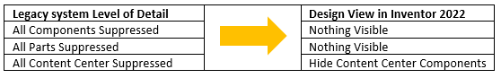
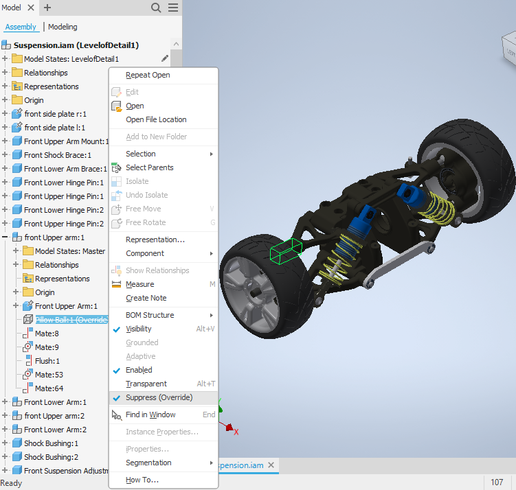

# Model States

### Introduction to Model State

Model state is introduced to both Part and Assembly
documents since Inventor 2022,  and the LOD(Level of Detail) in assembly
will be removed from UI, the LOD related APIs will be hidden, so all the LOD
related funcitons need to be migrated to Model State. In assembly, most of the
functions that can work in legacy LOD can also work in model state, only some
functions in legacy LOD are changed, and in model state there are some
enhancements against legacy LOD(e.g. the file properties can be overriden for
each model state). Because of this big change, API developers may need to know
how this will impact the API behaviors.

### The behavior changes from Level of Detail to Model State

1. The legacy LevelOfDetailRepresentation objects are migrated to
ModelState objects. So the FullDocumentName will represent the “FullFileName<ModelState>”
instead of legacy “FullFileName<LevelofDetail>”.

* Legacy master LevelOfDetailRepresentation object is migrated to primary ModelState
* Legacy custom LevelOfDetailRepresentation objects are migrated to custom ModelState objects.
* Legacy system LevelOfDetailRepresentation objects are removed. When call the Documents.Open/OpenWithOptions with specifying the legacy system LevelOfDetailRepresentation, the document will be opened with primary ModelState active and a proper system design view for it to make use of the visibility indicating the occurrences' suppression status.

2. In legacy assembly data the iAssembly and LOD can exist in the same assembly
file, while since Inventor 2022 the iAssembly and model states are mutually
exclusive.It means ModelState is not supported in iAssembly document, and vice
versa. Like ComponentOccurrences.AddiAssemblyMember doesn't support the
ModelState in Options argument.

3. Suppress ComponentOccurrenceProxy is not allowed. If a legacy data has a
suppressed ComponentOccurrenceProxy then you can only unsuppress it in Inventor
2022 to remove the Suppress(Override) status:

4. Document for Primary and custom ModelState shares the same Document but each substitute has its own Document pointer. That means in legacy Inventor when open assembly document with different LOD specified the returned AssemblyDocument pointers are different, while in Inventor 2022:

* When open document with specifying different primary/custom ModelState, only one AssemblyDocument pointer is returned.
* A substitute’s Document pointer is different from any other ModelState’s Document’s pointer(the same as legacy behavior).

5. OnActivateModelState won't be triggered when activate or deactivate a substitute model state but the OnActivateDocument should be used to monitor this action instead.