# Sketches

## Introduction

Sketches are an extremely important component of Inventor. All 2D work in Autodesk Inventor is performed using sketches. Sketches are used to draw geometry that will define the profile of a feature. Sketches are also used within drawings to design borders and title blocks, and when drawing on a sheet or within a view. All 2D geometry in Autodesk Inventor is created using sketches.

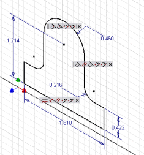

A sketch can be thought of as a 2D plane that contains any number of 2D entities. In a 3D environment like the part environment, the 2D sketch plane is positioned within 3D space. Because a sketch is 2D, the sketch entities it contains are true 2D objects. That is, any coordinates defined for 2D sketch entities need only their X and Y coordinates defined. Because a sketch exists within 3D space, it has its own 2D coordinate system and all creation and query of entities within a sketch are with respect to the sketch coordinate system.

Sketches can contain several different kinds of 2D entities, depending on the type of document they are used in. In Part documents, you can create sketches that contain arcs, circles, elliptical arcs, ellipses, lines, splines, geometric constraints, and dimension constraints. Methods for accessing and creating sketches in Part documents (called PlanarSketches) are discussed in [Sketches in Part Documents](Sketch_Overview.md). Sketches in drawings support the same entities as part sketches, but in addition also help provide access to text and have some special requirements with regard to editing. Methods for accessing and creating sketches in drawing documents are discussed in [Sketches in Drawing Documents](Sketch4.md).

A sketch can be thought of as a container for 2D entities. The sketch itself does not add any information to the 2D entities. For example, look at the sketch shown below. It contains several different types of sketch entities: lines, circles, splines, and dimension and geometric constraints. The sketch defines only the 2D coordinate system for these entities. The fact that there are multiple outlines and some are connected and some aren't isn't information that the sketch is concerned with. That type of information is defined by profiles, which are discussed in more detail later.

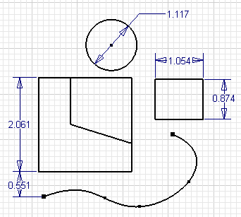

Some sketch concepts are slightly different when using the API than when using sketches interactively. The API exposes the sketches at a lower level than is exposed through the user interface. Most of the sketch concepts learned when using Autodesk Inventor interactively carry over to the API, but there are some differences that need to be understood to make using the sketch portion of the API more intuitive.

One difference between the API and interactive use of sketches is in their creation. When interactively defining a sketch, you are able to gain a significant amount of control of the placement because of the automatic inference Autodesk Inventor does as you sketch. As an example, let's look at the simple sketch shown below. To create the sketch the only inputs required from you are a click to start line 1, a click to create line 1, a click to create line 2, a drag to create arc 3, a click to create line 4, and finally a click to create line 5. All that was required were four clicks and a drag to define the entire profile. Let's look in a little more detail at what actually happened during this process.

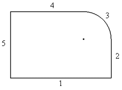

* To create line 1, you click the mouse to define the starting point. As you move the mouse, Autodesk Inventor displays a glyph to indicate when the line will be inferred to be horizontal or vertical. After clicking the mouse to define the second point, a horizontal constraint is automatically applied.* Since you're still in the same sequence within the Line command, ending line 1 has started line 2. A coincidence between them has been inferred. As you move the mouse Autodesk Inventor will indicate when line 2 is begin inferred to be perpendicular to line 1. When the mouse is clicked to define line 2, the coincident and perpendicular constraints are automatically applied.* Arc 3 is created by dragging the mouse off the end of line 2. A coincidence and tangency to line 2 is inferred. After line 3 is created the coincident and tangent constraints are automatically placed.* Line 4 is started by finishing arc 3. Using the glyphs, Autodesk Inventor notifies you when the line is tangent to the arc and parallel to line 1. After clicking to define line 4, the coincident, tangent, and parallel constraints are automatically placed.* Line 5 is started by finishing line 4. As you move over the end of line 1, a glyph is displayed telling you you're over the end. Clicking over the end indicates that you want the lines connected. A glyph is also displayed showing that a parallel constraint to line 2 is being inferred. After clicking, the coincident constraints to lines 1 and 4 are automatically placed and the parallel constraint to line 2 is automatically placed.

Four clicks and a mouse drag resulted in the creation of 5 sketch entities and 11 constraints.

Now let's look at the same construction from the point of view of the API. There are several differences between interactively creating sketches and creating them through the API. First, there is no inference of constraints when using the API. Everything must be explicitly defined when using the API. Inference is entirely based on the context of the command and how the user moves the mouse during the command. The API methods do not have this type of context information.

Another significant difference between the API view and the user interface view is that the API exposes some of the underlying details of the sketch that are hidden in the user interface. The primary feature being hidden is that all sketch geometry is actually dependent on sketch points. For example, when sketching two lines interactively, you click the mouse twice to define the two points for the first line and click again to define the second line.

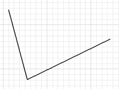

The result to the end-user is two lines that have a coincident constraint holding them together. The actual result is that you have created three sketch points, two lines, and four coincident constraints. Sketch points are the only sketch entities that can exist on their own. All other types of sketch entities are dependent on points to define their position. The sketch entities are tied to the points by coincident constraints. The picture below illustrates the true situation.

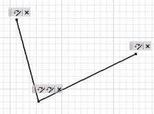

To simplify working with sketches, the user interface hides most of these sketch points. Attempting to hide these points in the API would have resulted in many inconsistencies, and as you'll see having access to these points simplifies many API functions.

Let's look at creating the original example using the API to see the differences.


If you look at the online help for the AddByTwoPoints method of the SketchLines object you'll see the method takes two points to define the line.

|  |
| --- |
| ``` 
 AddByTwoPoints(StartPoint As Object, EndPoint As Object) As SketchLine
 ``` |

Notice that the type of object expected as input for the points is defined as "Object." This allows you to input either a Point2d object or an existing SketchPoint object. A Point2d object describes a location on the sketch. When you provide a Point2d object as input a SketchPoint is created at that location and the line is attached to the sketch point with a coincident constraint. In the case where a SketchPoint is input, the line is attached directly to the input sketch point using a coincident constraint.

Because sketch entities are always dependent on sketch points, the API provides direct access to the driving sketch points. To see how this works, let's look at the code that will create the previous sketch. This sample assumes that a sketch has somehow already been obtained. (This will be discussed in more detail in the next section.)

When you define the location of sketch entities using coordinates on the sketch, they are defined using Point2d objects. These objects don't define a graphical point but only a coordinate in 2D space. These lines set a reference to the TransientGeometry object to facilitate its use later in the program.

|  |
| --- |
| ``` 
 Dim oTransGeom As TransientGeometry
 Set oTransGeom = ThisApplication.TransientGeometry
 ``` |

This defines two Point2d objects that will be used to define the ends of the line.

|  |
| --- |
| ``` 
 Dim oCoord1 As Point2d
 Set oCoord1 = oTransGeom.CreatePoint2d(0, 0)
 Dim oCoord2 As Point2d
 Set oCoord2 = oTransGeom.CreatePoint2d(5, 0)
 ``` |

This creates the actual SketchLine object. The two inputs are the two Point2d objects. Automatically, two sketch points are created at those locations and the line is attached to them with coincident constraints.

|  |
| --- |
| ``` 
 Dim oLines(1 To 4) As SketchLine
 Set oLines(1) = oSketch.SketchLines.AddByTwoPoints(oCoord1, oCoord2) ``` |

This creates the second sketch line. In this case a SketchPoint and a Point2d object are input as the start and end points of the line. The SketchPoint is obtained by asking the first line for its end sketch point.

|  |
| --- |
| ``` 
 Set oCoord1 = oTransGeom.CreatePoint2d(5, 3)
 Set oLines(2) = oSketch.SketchLines.AddByTwoPoints(oLines(1).EndSketchPoint, _
                                                    oCoord1)
 ``` |

This creates the arc. The center and end point are defined using Point2d objects and the start point is defined using the end sketch point from the previous line.

|  |
| --- |
| ``` 
 Set oCoord1 = oTransGeom.CreatePoint2d(4, 3)
 Set oCoord2 = oTransGeom.CreatePoint2d(4, 4)
 Dim oArc As SketchArc
 Set oArc = oSketch.SketchArcs.AddByCenterStartEndPoint(oCoord1, _
                                             oLines(2).EndSketchPoint, oCoord2)
 											 ``` |

This creates the third line and connects it to the arc by inputting the arcs end sketch point.

|  |
| --- |
| ``` 
 Set oCoord1 = oTransGeom.CreatePoint2d(0, 4)
 Set oLines(3) = oSketch.SketchLines.AddByTwoPoints(oArc.EndSketchPoint, _
                                                    oCoord1)
 ``` |

This creates the final line using sketch points from the first and last line as inputs.

|  |
| --- |
| ``` 
 Set oLines(4) = oSketch.SketchLines.AddByTwoPoints( _
                                            oLines(1).StartSketchPoint, _
                                            oLines(3).EndSketchPoint)
 ``` |

At this point you will have a sketch that looks similar to that shown in the previous figure, but if you attempt to manipulate the sketch at all you will notice that the only constraints are the coincident constraints tying everything together. Because of this, the lines will not stay horizontal and vertical, and the lines will not remain tangent to the arc. The following code will add the same constraints that were placed automatically when interactively creating the sketch.

|  |
| --- |
| ``` 
 Call oSketch.GeometricConstraints.AddHorizontal(oLines(1))
 Call oSketch.GeometricConstraints.AddPerpendicular(oLines(1), oLines(2))
 Call oSketch.GeometricConstraints.AddTangent(oLines(2), oArc)
 Call oSketch.GeometricConstraints.AddTangent(oLines(3), oArc)
 Call oSketch.GeometricConstraints.AddParallel(oLines(1), oLines(3))
 Call oSketch.GeometricConstraints.AddParallel(oLines(4), oLines(2))
 ``` |

If you edit the sketch now it will have the behavior you expect.

All other types of sketch entities are placed in a similar way. From this you can see that sketch entities are dependent on sketch points. When creating sketch entities you can define coordinate points, but sketch points will automatically be created for the entity to be tied to. When modifying sketch entities, most modifications must be performed on the sketch points they're tied to. For example, to move a line you need to move the two sketch points it is tied to.

You can also see that when creating sketch entities through the API there is no constraint inference (except for the coincident constraint placement when you use a sketch point as input). When creating sketches using the API you'll need to explicitly create the geometric constraints.

The API also exposes additional constraint types that don't have corresponding commands. You implicitly create these constraints as the result of using some commands. For example, the offset constraint is created as a result of using the Offset command. Here's a complete list of all of the geometric constraints exposed through the API. (More information can be found in the API reference guide.)

CoincidentConstraint: Ties a sketch point to any other sketch entity. CollinearConstraint: Makes a line or the specified axis of an ellipse collinear to another line or ellipse axis. ConcentricConstraint: Makes a circle, arc, ellipse, or elliptical arc concentric to another circle, arc, ellipse, or elliptical arc. EqualLengthConstraint: Makes two lines equal in length. EqualRadiusConstraint: Makes the radius of a circle or arc equal to another circle or arc. GroundConstraint: Causes any sketch entity to be fully constrained. HorizontalAlignConstraint: Makes two sketch points align along the same horizontal axis. In other words, the two sketch points will have the same Y coordinate value. HorizontalConstraint: Causes a lines or the specified axis of an ellipse to be horizontal. MidpointConstraint: Causes a sketch point to be positioned at the midpoint of a line. OffsetConstraint: Makes four entities behave in a way where two are the result of offsetting from the other two. ParallelConstraint: Makes a line or the specified axis of an ellipse parallel to another line or ellipse axis. PatternConstraint: Defines the relationship between entities that were the result of creating a pattern. PerpendicularConstraint: Makes a line or the specified axis of an ellipse perpendicular to another line or ellipse axis. SplineFitPointConstraint: Defines the connection between a spline and the sketch points it is tied to. SymmetryConstraint: Causes two sketch entities of the same type to be symmetric about a line. TangentSketchConstraint: Causes two sketch entities to be tangent to each other. VerticalAlignConstraint: Makes two sketch points align along the same vertical axis. In other words, the two sketch points will have the same X coordinate value. VerticalConstraint: Causes a lines or the specified axis of an ellipse to be vertical.

The list below illustrates the entire set of dimension constraints exposed by the API.

**DiameterDimConstraint**

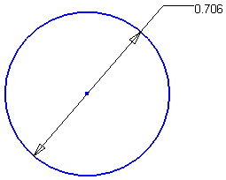

**EllipseRadiusDimConstraint**

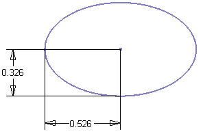

**OffsetDimConstraint**

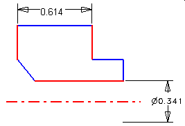
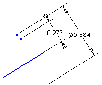

**RadiusDimConstraint**

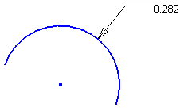

**TangentDistanceDimConstraint**

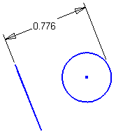
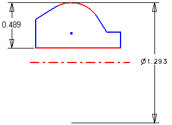
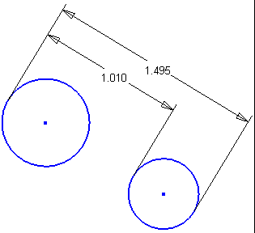

**ThreePointAngleDimConstraint**

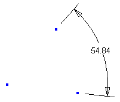

**TwoLineAngleDimConstraint**

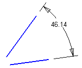

**TwoPointDistanceDimConstraint**

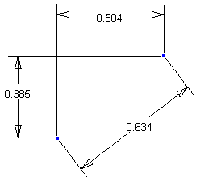

## Sketches in Part Documents

Sketches can contain several different kinds of entities, depending on the type of document they are used in. In Part documents, you can create sketches that contain arcs, circles, elliptical arcs, ellipses, lines, splines, geometric constraints, and dimension constraints. The previous example began by assuming you had obtained a sketch somehow. This section will discuss some methods of obtaining existing sketches and creating new sketches.

Many programs that deal exclusively with sketches will not want to create a sketch but instead will want to access the currently active sketch. In the case where a sketch is not active you will need to know this so you can handle it gracefully. Determining if a sketch is active can be accomplished using the ActiveEditObject property of the Application. This property returns the object that is currently active for edit. Currently this can be any of the various document types or a sketch. The sample code below illustrates checking to see if a sketch is active and if one is active, setting a reference to it. If a sketch isn't active, it displays a message telling the user a sketch must be active.

|  |
| --- |
| ``` 
 ' Determine if a sketch is active.
 If Not TypeOf ThisApplication.ActiveEditObject Is Sketch Then
     MsgBox "A sketch must be active."
     Exit Sub
 End If
 
 ' Set a reference to the active sketch.
 Dim oSketch As Sketch
 Set oSketch = ThisApplication.ActiveEditObject
 ``` |

The Sketches collection object also provides access to all of the existing sketches in a document. Through this you can obtain any existing sketch, and if you know its name you can access it directly using the Item method of the Sketches collection object. The code below iterates through all of the sketches in the document and prints their names.

|  |
| --- |
| ``` 
 Dim oSketch As Sketch
 For Each oSketch in oPartDoc.ComponentDefinition.Sketches
     Debug.Print "Sketch: " & oSketch.Name
 Next
 ``` |

This code sets a reference to the sketch named "Sketch2." If a sketch named "Sketch2" does not exist in the part the call of the Item property will fail. The On Error statement allows you to check for and handle this error.

|  |
| --- |
| ``` 
 ' Enable error trapping
 On Error Resume Next
 
 Dim oSketch As Sketch
 Set oSketch in oPartDoc.ComponentDefinition.Sketches.Item("Sketch2")
 If Err Then
     Err.Clear
     MsgBox "A sketch named ""Sketch2"" does not exist."
 End If
 
 ' Turn off error trapping
 On Error Goto 0
 ``` |

When creating models you'll usually need to create sketches. The Sketches collection supports two methods for creating a sketch. The Add method works identically as the 2D Sketch command. That is, you provide a planar entity, (a work plane or planar face) as input and the sketch is created. It uses built-in logic to determine the orientation of the sketch on the selected entity. Sometimes this is acceptable, but unlike the end-user who is working visually with the system and can easily see and react to the default orientation, you usually need explicit control of the orientation of the sketch. The AddWithOrientation method provides this control.

Let's look at an example to see why controlling the orientation can be important. This will also help to explain the concept of drawing on a 2D plane that is positioned within 3D space. In this case, we want to create the part shown below.

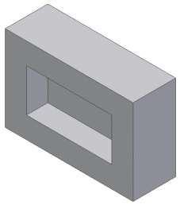

The part consists of two extrusion features: one to create the base block and another to create the pocket.

The code below creates the first extrusion. (The profile creation step is discussed in detail in a subsequent section.)

|  |
| --- |
| ``` 
 ' Set a reference to the component definition.
 Dim oPartCompDef As PartComponentDefinition
 Set oPartCompDef = ThisApplication.ActiveDocument.ComponentDefinition
 
 ' Create a new sketch.
 Dim oSketch As Sketch
 Set oSketch = oPartCompDef.Sketches.Add(oPartCompDef.WorkPlanes.Item(3))
 
 ' Draw a rectangle.
 With ThisApplication.TransientGeometry
     Call oSketch.SketchLines.AddAsTwoPointRectangle( _
                                         .CreatePoint2d(0, 0), _
                                         .CreatePoint2d(5, 3))
 End With
 
 ' Create a profile.
 Dim oProfile As Profile
 Set oProfile = oSketch.Profiles.AddForSolid
 
 ' Create the extrusion feature.
 Dim oExtrude As ExtrudeFeature
 Set oExtrude = oPartCompDef.Features.ExtrudeFeatures.AddByDistanceExtent( _
                     oProfile, 2, kPositiveExtentDirection, kJoinOperation)
 ``` |

To create the sketch for this feature, the Sketches.Add method is used. This is the method that doesn't provide control over the orientation. You'll notice that the input plane provided is an existing work plane. The first three work planes in the WorkPlanes collection are the three that exist in every part. The first represents the YZ plane, the second the XZ plane, and the third the XY plane. (This is the same order as they appear in the Browser.) When a sketch is created with the Add method and a work plane is used as input, the sketch inherits the orientation and origin from the work plane. In this case, since it's the XY base work plane the origin will be at (0,0,0) and the X and Y directions of the sketch will be in the same directions as the X and Y axes of the model. The result after the creation of this feature is shown below, and the sketch used is highlighted.

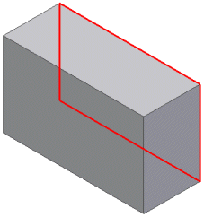

The creation of the next sketch becomes more interesting. It's important to control its orientation and origin so the coordinates used to define the position of the rectangle will be in the correct position. In this case, we want to create a sketch that will be positioned as shown below.

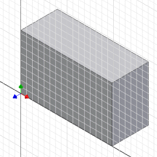

The following code creates a sketch in the desired position and uses the sketch to create the extrusion for the pocket.

|  |
| --- |
| ``` 
 ' Create a sketch on the end face using an existing work axis 
 ' and the origin work point.
 Set oSketch = oPartCompDef.Sketches.AddWithOrientation( _
                           oExtrude.EndFaces.Item(1), _
                           oPartCompDef.WorkAxes.Item(1), True, True, _
                           oPartCompDef.WorkPoints.Item(1), False)
 
 ' Draw a rectangle.
 With ThisApplication.TransientGeometry
     Call oSketch.SketchLines.AddAsTwoPointRectangle( .CreatePoint2d(1, 1),
                                                     .CreatePoint2d(4, 2))
 End With
 
 ' Create a profile.
 Set oProfile = oSketch.Profiles.AddForSolid
 
 ' Create the extrusion feature.
 Set oExtrude = oPartCompDef.Features.ExtrudeFeatures.AddByDistanceExtent( _
                    oProfile, 0.75, kNegativeExtentDirection, kCutOperation)
 ``` |

The interesting portion of this code sample is the AddWithOrientation method call. This allows you to create a sketch and fully define its orientation. The first argument is the face, which is obtained directly from the previous feature. The second argument is used to the define the X axis. In this case the system X work axis is provided as input. The third argument specifies if the direction of the sketch X axis should be in the same direction as the entity provided as the second argument. The fourth argument specifies if the axis being defined is the X or Y axis. The fifth argument defines the origin of the sketch. In this sample the system origin work point is input. The final argument defines whether the edges of the input face should be copied onto the sketch, (as is done when creating a sketch interactively).

By explicitly defining the sketch you now know the correct coordinates to input to create the rectangle so it is oriented correctly, as is shown below.

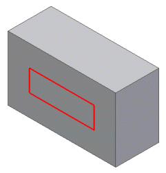

To help in diagnosing problems where sketch entities are not being drawn where expected, you can view the origin and orientation of an existing sketch by editing the sketch interactively. If the display setting for the "Coordinate System Indicator" is enabled on the Sketch tab of the "Application Options" dialog, a triad will be displayed when the sketch is being edited. The triad is positioned at the sketch's origin and is oriented to show the X and Y axes of the sketch.

## Profiles in Part Documents

Another important concept that's not explicitly exposed through the user interface is the concept of profiles. A sketch is essentially just a container for 2D entities and their associated constraints. The sketch itself does not define connected sets of entities that can be used by a feature to define its shape. This information is defined by profiles. You can create the following sketch in Autodesk Inventor.

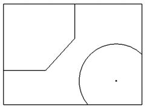

When creating an extrude feature, the first step is to define the profile. This is done interactively by moving the mouse within the different closed areas and clicking. Any combination of the following three shapes can be used to define the profile of the feature.

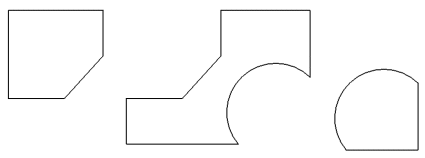

In the API, the profile is an explicit object that you can create to provide input to features and can also obtain from existing features. A profile is always associated with a particular sketch and essentially adds topological information to the sketch. Coincident constraints between sketch geometry controls which shapes can be defined from a given sketch. For example, if you create a sketch containing the two circles shown in the following figure and use this sketch for an extrusion, you can only select the inside of the circles.

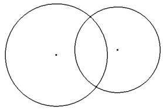

However, if you place sketch points at the intersections of the circles and tie the points to the circles using coincident constraints, you can now achieve any combination of the following three shapes.

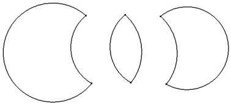

The API supports two methods for creating profiles. These are AddForSolid, which was used in the previous sample code, and AddForSurface. These two methods simplify the creation of the profiles for the developer. Generally, when creating profiles programmatically, it is easiest to define the final result. An end user may find it more convenient to extract existing geometry, perform trimming, edit dimension values, and other similar operations to arrive at the desired result. Also, when creating sketches interactively, the edges of a selected face are automatically projected onto the profile. This results in extra geometry that you may not end up using. In a workflow where additional geometry is created, designers need more control over how profiles are created so they can define which geometry to use in the creation of the profile. Developers typically doesn't require any intermediate geometry, but create the correct geometry to begin with.

The two profile creation methods provided by the API have optional arguments. Called with no arguments, they examine all of the geometry in the sketch and create the profile. The AddForSolid method checks for closed profiles that can be used in creating solid features. The AddForSurface allows open profiles that can be used for creating surfaces.

### Optional Arguments

The AddForSolid method supports a Curves argument. This argument is an ObjectCollection of sketch curves. If supplied, this method creates a profile consisting of only those paths that contain all the sketch curves contained in the object collection. If not specified, all the possible profile paths are included.

The AddForSurface method supports a Curve argument. This argument is a sketch curve. If supplied, this method creates a profile consisting of a path that contains all sketch curves that are connected to the input curve. If no other curve is connected to the input curve, the path contains just the input curve. If not supplied, the method creates a profile by examining the contents of the sketch and creating a single connected path. The result can be either open or closed.

The AddForSolid method supports a Combine argument. This specifies whether to combine the profile paths obtained when this method is used to create a new profile. For instance, take the example of a sketch containing two concentric circles. If this argument is specified to be true, the resulting profile will contain two profile paths, and the profile path corresponding to the inner circle will have its AddsMaterial flag set to false. Hence, the resulting profile is a circular disc with a circular cut-out. If the Combine flag is specified to be false, the resulting profile will contain 2 profile paths with the AddsMaterial flag set to true for both paths.

The AddsMaterial flag indicates whether the profile path causes material to be added or subtracted from the area defined by the profile. If specified to be true, the profile path adds material. A feature such as an extrusion would use the profile path.

### Profiles versus sketches

Profiles are used as input when creating features and are also important when querying existing features. From sketch-based features you can obtain the profile that defines its shape. Just having a sketch isn't enough because it's the profile that adds topology information to a sketch. Let's look at the following example to see what information a profile provides. The sketch shown on the left was used to create the single extrusion feature shown on the right.

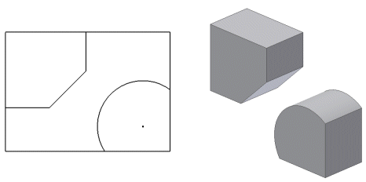

The profile obtained from the feature contains two ProfilePath objects, which are highlighted in the following figure. Each ProfilePath object returns a list of ProfileEntity objects. The ProfilePath returns the ProfileEntity objects in the order of how they are connected to each another. The ProfilePath also tells you if the path is open or closed and if it adds or removes material from the profile.

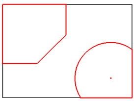

The ProfileEntity objects provide information about each piece of a ProfilePath. The ProfileEntity objects are oriented so they are connected head-to-tail to one another. ProfileEntity objects don't exist graphically within Autodesk Inventor but are simply an intermediate step between the sketch and the feature. A ProfileEntity returns the underlying sketch entity and the two sketch points that define its start and end. The underlying sketch entity will in many cases be different from the profile entity.

Let's look in detail at the previous example. The sketch that was used contains seven lines and one arc, plus all of the sketch points and various constraints tying it all together. From this sketch a single profile was created and used as input for the extrude feature. The profile consists of two ProfilePath objects, which when used for the extrusion resulted in a single solid with two enclosed volumes, as shown in the following image.


The preceding profiles are straightforward, but others are less so. Take the following sketch as an example - calling AddForSolid with no arguments would not necessarily create the desired profile paths. Using the combine argument and/or the delete method of the ProfilePath object allows a greater degree of control over what constitutes the profile.

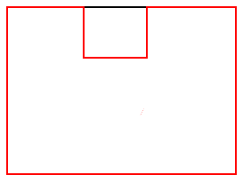

|  |
| --- |
| **Note:** When editing sketches through the user interface, the user enters sketch edit mode. Leaving this mode automatically causes model features to be recomputed. Through the API, sketches can be modified at any time. Therefore the PlanarSketch object has a method, UpdateProfiles, that causes model features to be recomputed. |

A ProfilePath consists of a set of ProfileEntity objects. For example, the profile path highlighted in the following figure consists of three ProfileEntity objects. A ProfileEntity object provides access to its underlying sketch entity and also a transient geometry object that represents the actual geometry of the ProfileEntity. This is frequently different from the geometry of the underlying sketch entity for two reasons. First, the profile entity may consist of just a portion of the sketch entity. The following figure illustrates one of the profile's paths (red) and the underlying sketch entities (green). The two profile entities that represent the lines are shorter than the sketch lines they're based on. The ProfileEntity also returns the two sketch points that define its extent along the sketch entity.

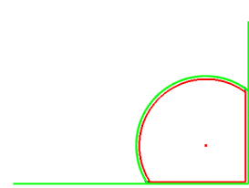

The second reason the geometry of the profile entity might be different from the geometry of the sketch entity is that the profile entities are returned such that they're connected head to tail. There is no implied direction to sketch entities. Because of this the profile entity might go in the opposite direction from the underlying sketch entity.

## Sketches in Drawing Documents

There are two principal uses for sketches in drawing documents. The first are overlay sketches that are placed on the sheet or attached to a drawing view. The second are sketches used in the definition of drawing aid objects, such as border definitions, title block definitions, and sketched symbol definitions. There are subtle behavioral differences between these two sketch uses, and between sketches in drawing documents versus those in part documents.

An important difference between sketches in drawing documents versus those in part documents is that drawing sketches must be placed into an edit mode before changes are allowed to the sketch contents. This edit mode is equivalent to the sketch environment being activated in the user interface.

For sheet overlay and drawing view sketches, this is done by calling the Edit method on the DrawingSketch object. To leave edit mode, call the ExitEdit method. The code below places the first sheet overlay sketch on the active sheet in edit mode.

|  |
| --- |
| ``` 
 ' Determine if there are any sheet overlay sketches.
 Dim oSketches As DrawingSketches
 Set oSketches = ThisDocument.ActiveSheet.Sketches
 If oSketches.Count = 0 Then
     MsgBox "Active sheet does not contain any overlay sketches."
     Exit Sub
 End If
 
 ' Set a reference to the first sketch.
 Dim oSketch As DrawingSketch
 Set oSketch = oSketches.Item(1)
 
 ' Place the sketch in edit mode.
 oSketch.Edit
 
 ' Make changes to the sketch contents here.
 
 ' Return from edit mode.
 oSketch.ExitEdit
 ``` |

To edit the sketch of a drawing aid definition, the definition object must be placed into edit mode which is done by calling the Edit method on the definition object (BorderDefinition, TitleBlockDefinition, or SketchedSymbolDefinition), not the DrawingSketch. Calling the Edit or ExitEdit method on the DrawingSketch owned by a drawing aid definition (obtained from the Sketch property on, for example, the BorderDefinition object) will always fail. The Edit method and drawing aid definitions has a single out argument which is the DrawingSketch that is in edit mode. Note that this is not a reference to the same sketch obtained from the drawing aid's Sketch property, but is a temporary copy of the definition's sketch on a temporary sheet that is activated for the edit operation. The code below places a border in edit mode.

|  |
| --- |
| ``` 
 ' Get the desired border.
 Dim oBorder As BorderDefinition
 On Error Resume Next
 Set oBorder = ThisDocument.BorderDefinitions.Item("MyBorder")
 If Err Then
     Err.Clear
     MsgBox "A border named ""MyBorder"" does not exist."
     Exit Sub
 End If
 On Error GoTo 0
 
 ' Place the border in edit mode.
 Dim oSketch As DrawingSketch
 oBorder.Edit oSketch
 
 ' Make changes to the sketch contents here.
 
 ' Return from edit mode.
 oBorder.ExitEdit
 ``` |

Because only one drawing sketch can be actively editing at a time, calling the Edit method on an overlay sketch or a drawing aid definition will fail if there already is a drawing sketch in edit mode. To determine if a sketch is in edit mode, or to obtain the currently editing sketch, use the ActiveEditObject property on the Application object, or the ActivatedObject property on the DrawingDocument object. Note that if you attempt to transparently change the actively editing sketch when the active editing sketch is for a drawing aid definition, the changes must be aborted, saved, or saved to a new definition. In order to exit sketch mode for a drawing aid, you have to decide whether to abort, save or save changes to a new definition, which makes it impossible to return the user to the previous state.

In order to create a new overlay sketch or drawing aid definition, the new sketch needs to be temporarily placed into sketch edit mode. This means that an attempt to create a new overlay sketch or drawing aid definition will fail if there is a sketch active in edit mode.

When a new overlay sketch is created through the user interface, the sketch being constructed is not yet added to the sheet. There is no browser entry for the new sketch and the sketch will not show up in the sheet or drawing view's sketches collection until the sketch is returned from edit mode, at which point it is added to the sheet. Overlay sketches in this user interface construction state are accessible through the ActiveEditObject property of the Application object or the ActivatedObject property of the DrawingDocument object.

When a new drawing aid definition object is created through the user interface, the definition object is not yet added to the appropriate drawing aid definition object collection. There is no browser entry for the definition and it will not show up in the appropriate drawing aid definition object collection until the sketch edit mode is exited and the changes saved, at which point it is added to the definition object collection. Note that in the new creation mode from the user interface, the temporary drawing sketch is placed on the active sheet, not a temporary sheet such as when the definition is being edited. The definition object in this user interface construction state are accessible through the Parent property of the DrawingSketch object available from the ActiveEditObject property of the Application object or the ActivatedObject property of the DrawingDocument object.

When a drawing aid definition is edited, the definition's sketch is copied into a temporary sheet. If the changes are aborted, the temporary sketch is discarded. If the changes are saved, then the original sketch held by the definition is destroyed and the temporary copy replaces the original. If the change is saved to a copy, a new definition is created and the temporary sketch is assigned to it. Because of this, care must be taken when holding references to drawing aid definition sketch geometry and constraints across Edit and ExitEdit boundaries of the definition object. A reference to any sketch geometry or constraint from the original definition object's sketch will become invalid when an edit operation on the definition is performed and the changes saved. A reference to any sketch geometry or constraint from the edit mode sketch or a drawing aid definition will become invalid when the edit operation is ended and the changes are not saved.