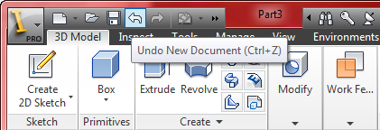
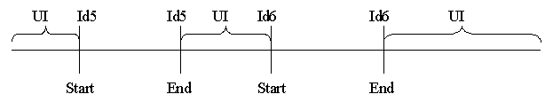
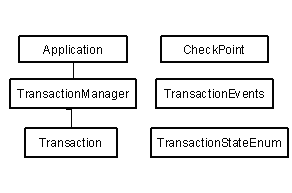
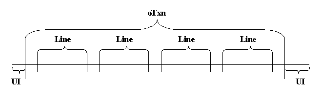
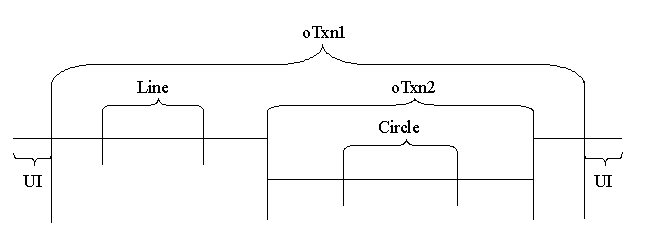
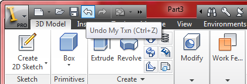
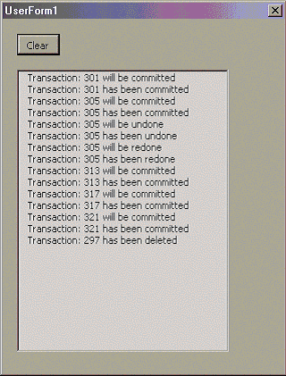

# Transactions

## Introduction to Transactions

The transaction functionality is the means by which Inventor keeps track of the timeline of changes made during the course of an Inventor session. Transactions allow the user to perform Undo and Redo operations in Inventor. The menu below shows the user interface command to undo the creation of a new document.



## What Are Transactions?

All commands that modify data in Inventor are transactable. This means that Inventor model data created or modified during the course of a command can be undone and redone. When a command changes data in the database, it gathers some information from the user and begins a transaction. Only then does the command attempt to change the data in the database; if all the changes succeed, it asks the transaction manager to commit the changes. If the command fails to change the database successfully, it asks the transaction manager to abort the transaction and displays an error message to the user.

Inventor maintains two lists of transactions to manage undo and redo operations. The lists are called the committed transaction list and the undone transaction list. While a transaction is being recorded it is said to be in the "uncommitted" state. When the recording of the transaction is complete it is said to be in the "committed" state. If the user cancels the recording of the transaction, the transaction is "aborted." As soon as the transaction is committed, it is added to the committed list.

A successful transaction can be undone; an undone transaction can be redone. If the user undoes a committed transaction, the transaction is moved from the committed list to the undone list. If the user redoes an undone transaction it is once again moved from the undone list to the committed list. Inventor limits the number of transactions allowed in the committed list by a registry entry called "UndoLevels." The default value for "UndoLevels" is 10. Once the number of transactions exceeds the undo level, Inventor deletes the earliest transaction in the committed transaction list. When a transaction is committed, any undone transactions are no longer available to be redone (the undone list is emptied). Another important thing to note is that transactions are not persisted and are valid only for one Inventor session. This means that when a document closes, all the transactions in both the committed and the undone lists will be deleted.

Transactions within Inventor are quite different from transactions in some other systems (such as AutoCAD), so it is important to understand these differences before designing your application so you can take them into account. A critical thing to understand about Inventor's transactions is that the transaction stack has an application scope. In other words, all of the transactable actions performed within Inventor are saved in a single transaction list, regardless of which document the action was performed within. The API itself can be misleading in this regard in that it requires you to supply a document when starting a transaction, though the document name is not actually used internally.

There are two things to be aware of that result from Inventor's transactions having an application scope. The first is that transactions cannot be undone or redone with respect to a particular document. For example, suppose you have Part1 open and you draw two lines, then open Part2 and draw a circle. You now activate Part1 and perform an undo operation, expecting the last line you drew in Part1 to be undone. Instead the circle in Part2 will be undone since it was the last transaction in the transaction list.

The second issue of having a single transaction list for the entire application is that the entire list is sometimes deleted. This happens whenever a document is closed (it doesn't matter if the document is visible or not). This results in the user losing the ability to undo any previous actions.

## What is Transacted?

The basic principle is to transact changes to data, but not UI changes or view changes. Thus undoing a command that added a feature will remove the added feature. Operations such as adding or removing a toolbar, changing the viewing position, changing the zoom factor or shading the model are not transacted. Changing these things does not create a transaction, so the change cannot be undone. This can sometimes lead to unexpected results. For example, you could extrude a long part, pan to view the end of the part, do an undo and find yourself looking at nothing.

Document Opens are transacting events. This means if you open a document and then do an undo, the document is undone from existence. An immediate redo would bring back the document. Document closes do not transact. When a document is closed, all of its memory is 'blown away' and is completely removed from the transaction chain.

Note that whether something is transacted is strictly dictated by whether it uses Inventor's transactable memory or not. This does not determine whether the object is persisted; persisted information can be allocated inside or outside of Inventor's transactable memory.

## Identified and Unidentified Transactions



All changes to transacting memory transact. However, many of the changes to this data fall outside commands that start transactions. For example, after a command has completed, views of parts need to be repainted on the computer screen. Windows puts a paint request in a queue, and the repainting happens later, when the transaction has been committed.

Although logically painting a part on the screen does not update the part, graphics information is recalculated and stored in the Scene Graph. These memory changes need to be transacted (so they can be undone). These changes are stored as part of an unidentified transaction.

An unidentified transaction is, for all intents and purposes, a normal transaction that the user isn't aware exists. Undoing or redoing a command always undoes an 'identified' transaction, but it may also undo or redo unidentified transactions. It is important to note that as far as Inventor is concerned, there is always a transaction in progress. If the user does not start an "identified" transaction, Inventor will create an "unidentified" transaction. As the figure above shows, the transaction timeline for Inventor is a continuum, beginning with the start of the Inventor session and ending when the session ends. The timeline shows the identified transactions interspersed with unidentified transactions (labeled "UI" in the figure). The figure may seem to imply that identified and unidentified transactions always occur in pairs, but this is not always the case. If an identified transaction aborts, it will revert the timeline back to the end of the last unidentified transaction. Consequently another unidentified transaction will ensue.

Unidentified transactions are hidden from the API. The API for transactions presents only the identified transaction view. The only way to observe an unidentified trisection via the API would be to watch the CurrentTransaction property of the TransactionManager, when no command is in progress. For example, start a new sketch and observe TransactionManager::CurrentTransaction. It would report that the DisplayName of the transaction is "Unidentified transaction."

## Transactions in the API



The transaction API gives you the ability to leverage Inventor's transaction scheme to create custom commands or operations that work like Inventor's commands. The following topics describe the various facilities offered by the transaction API and how they should be used.

### Using Transactions

The most basic use of the transaction API is to wrap a set of transactable operations in a transaction. An example would be a client who wishes to publish a command that creates a sketch rectangle by connecting four sketch lines. Such a command would take two input points from the user and create four sketch lines. From Inventor's perspective this command should behave like the creation of a rectangle and not the creation of four lines; i.e. an Undo operation after the command has been executed should undo the creation of the entire rectangle rather than one of its lines. The sample program below demonstrates the use of transaction API to create such a command:

|  |
| --- |
| ``` 
 ' Get a reference to the active document.
 ' This can be an Assembly or Part document.
 Dim oDoc As Document
 Set oDoc = ThisApplication.ActiveDocument
     
 Dim oCmpDef As PartComponentDefinition
 Set oCmpDef = oDoc.ComponentDefinition
 
 Dim oSketch As PlanarSketch
 Set oSketch = oCmpDef.Sketches(1)
 
 Dim oTG As TransientGeometry
 Set oTG = ThisApplication.TransientGeometry
 
 ' Get the transaction manager from the application
 Dim oTxnMgr as TransactionManager
 Set oTxnMgr = ThisApplication.TransactionManager
 
 ' Start a regular transaction
 Dim oTxn1 As Transaction
 Set oTxn = oTxnMgr.StartTransaction(oDoc, "My Rectangle Command")
 
 ' Draw four sketch lines
 Dim oLine As SketchLine
 Set oLine = oSketch.SketchLines.AddByTwoPoints(oTG.CreatePoint2d(0, 0), oTG.CreatePoint2d(1, 0))
 Set oLine = oSketch.SketchLines.AddByTwoPoints(oLine.EndSketchPoint, oTG.CreatePoint2d(1, 2))
 Set oLine = oSketch.SketchLines.AddByTwoPoints(oLine.EndSketchPoint, oTG.CreatePoint2d(0, 2))
 Set oLine = oSketch.SketchLines.AddByTwoPoints(oLine.EndSketchPoint, oTG.CreatePoint2d(0, 0))
 
 oTxn.End
 ``` |

Creating the "My Rectangle Command" transaction wraps the four sketch lines in a transaction. The transaction timeline for this command is illustrated by the figure below:



Each AddByTwoPoints method creates a Line transaction in the scope of oTxn. Abort of oTxn (calling Abort before End) at any point will revert oTxn back to the beginning. If any of the Line transactions abort due to an error condition, the transaction timeline will revert to the beginning of the Line.

## Parent and Child Transactions

A transaction that is started using the TransactionManager::StartTransaction method can either be a parent or a child transaction. A transaction that is started within the scope of another transaction becomes the child of that transaction. Consider the sample program below:

|  |
| --- |
| ``` 
 ' Get a reference to the active document.
 ' This can be an Assembly or Part document.
 Dim oDoc As Document
 Set oDoc = ThisApplication.ActiveDocument
     
 Dim oCmpDef As PartComponentDefinition
 Set oCmpDef = oDoc.ComponentDefinition
 
 Dim oSketch As PlanarSketch
 Set oSketch = oCmpDef.Sketches(1)
 
 Dim oTG As TransientGeometry
 Set oTG = ThisApplication.TransientGeometry
 
 ' Get the transaction manager from the application
 Dim oTxnMgr as TransactionManager
 Set oTxnMgr = ThisApplication.TransactionManager
 
 ' Nesting regular transactions
 ' Start a regular transaction
 Dim oTxn1 As Transaction
 Set oTxn1 = oTxnMgr.StartTransaction(oDoc, "My Txn")
 
     ' Draw a sketch line
     Dim oLine As SketchLine
     Set oLine = oSketch.SketchLines.AddByTwoPoints(oTG.CreatePoint2d(0, 0), oTG.CreatePoint2d(1, 0))
 
     ' Start a nested transaction
     Dim oTxn2 As Transaction
     Set oTxn2 = oTxnMgr.StartTransaction(oDoc, "My child Txn")
 
     ' Draw a circle
     Dim oCircle As SketchCircle
     Set oCircle = oSketch.SketchCircles.AddByCenterRadius(oLine.EndSketchPoint, 3)
 
     oTxn2.End
 
 oTxn1.End
 ``` |

The above code starts an identified transaction (oTxn1), creates a sketch line (a transaction), starts another transaction (oTxn2), creates a sketch circle (a transaction) and commits oTxn1 and oTxn2. The transaction timeline looks like this:



What this indicates is that oTxn has three child transactions: Line, oTxn2 and Circle. Transaction oTxn2 has one child: Circle. The fact that oTxn2 wraps the Circle transaction means that an abort of Circle will revert the timeline to the beginning of oTxn2. Abort of Line will revert the timeline to the beginning of oTxn. The child transactions, however, do not affect the Undo operation. In the example above, the only transaction visible to Inventor is the top-level transaction oTxn. In this example, Inventor's Undo user interface will look like the figure below.



## Start, End, and Abort Transactions

Each start transaction should be paired with an end or abort transaction. Inventor becomes unstable if the StartTransaction is not paired with a corresponding End or Abort. If any of the API calls fail, i.e. return a bad error code, then the command should handle the error and take care to call EndTransaction. Applying this rule consistently is particularly critical, since even a simple API call can fail rather unexpectedly. In the event that the error is not recoverable, the command should abort the transaction. Aborting the transaction means that the transaction was cancelled prior to completion. The sample below indicates how an error condition should be handled within the scope of a transaction.

|  |
| --- |
| ``` 
 ' Get a reference to the active document.
 ' This can be an Assembly or Part document.
 Dim oDoc As Document
 Set oDoc = ThisApplication.ActiveDocument
     
 ' Get the transaction manager from the application
 Dim oTxnMgr as TransactionManager
 Set oTxnMgr = ThisApplication.TransactionManager
 
 ' Start a transaction
 Dim oTxn As Transaction
 Set oTxn = oTxnMgr.StartTransaction(oDoc, "My Txn")
 
 ' Perform an operation that you wish to transact
 
 ' If the error from the operation is not recoverable, abort the Txn
 If Err Then
     MsgBox "Unrecoverable error occurred during the operation"
     oTxn.Abort
     Exit Sub
 End If
 
 ' End the transaction
 oTxn.End
 ``` |

## Checkpoints

Checkpoints are bookmarks for rollback operations within a transaction. Consider the sample program below. A transaction is initiated and this transaction performs two operations; create a complex profile and extrude the profile. A checkpoint has been placed before the extrude operation. What this means is that if the extrude command fails, the transaction can be rolled back to the checkpoint. By enabling such a rollback, the user is given an opportunity to recover from an error. In this case if the extrude operation failed due to a bad profile, an option can be presented to the user to modify the profile and try the extrude operation again.

A side note: Inventor implements checkpoints as child transactions. The GoToCheckpoint operation essentially aborts the checkpoint transaction.

|  |
| --- |
| ``` 
 ' Get a reference to the active document.
 ' This can be an Assembly or Part document.
 Dim oDoc As Document
 Set oDoc = ThisApplication.ActiveDocument
     
 ' Get the transaction manager from the application
 Dim oTxnMgr as TransactionManager
 Set oTxnMgr = ThisApplication.TransactionManager
 
 ' Start a regular transaction
 Dim oTxn1 As Transaction
 Set oTxn1 = oTxnMgr.StartTransaction(oDoc, "Checkpoint Txn")
 
 ' *****************************************
 ' Perform the creation of extrude profile
 ' *****************************************
 
 ' Create a checkpoint before the extrude operation
 Dim oChkPt as CheckPoint
 Set oChkPt = oTxnMgr.SetCheckPoint
 
 ' *****************************************
 ' Extrude the newly created profile
 ' *****************************************
 
 ' Handle any error condition from the extrude command 
 If Err Then
     MsgBox "Extrude operation failed. Modify profile ?"
     oTxnMgr.GoToCheckPoint oChkPt
 End If 
 ``` |

## Transaction Events

The Transaction API allows the client to receive notifications for transaction-related events. The TransactionEvents object sends notifications for commit, undo, redo, abort and delete of a transaction. All of the notifications with the exception of the delete are sent before and after the actual event takes place in Inventor. Notification for the deletion of a transaction is sent only after the transaction has been deleted.

The following sample program demonstrates the use of transaction events:

|  |
| --- |
| ``` 
 Private WithEvents oTxnEvents As TransactionEvents
 
 Private Sub clear_Click()
     List.Clear
 End Sub
 
 Private Sub UserForm_Initialize()
     Dim oTxnMgr As TransactionManager
     Set oTxnMgr = ThisApplication.TransactionManager
     
     Set oTxnEvents = oTxnMgr.TransactionEvents
 End Sub
 
 Private Sub oTxnEvents_OnAbort(ByVal TransactionObject As Transaction, ByVal Context As NameValueMap, ByVal BeforeOrAfter As EventTimingEnum)
     
     If BeforeOrAfter = kBefore Then
         List.AddItem "Transaction: " & TransactionObject.Id & " will be aborted"
     ElseIf BeforeOrAfter = kAfter Then
         List.AddItem "Transaction: " & TransactionObject.Id & " has been aborted"
     End If
     
 End Sub
 
 Private Sub oTxnEvents_OnCommit(ByVal TransactionObject As Transaction, ByVal Context As NameValueMap, ByVal BeforeOrAfter As EventTimingEnum, HandlingCode As HandlingCodeEnum)
 
     If BeforeOrAfter = kBefore Then
         List.AddItem "Transaction: " & TransactionObject.Id & " will be committed"
     ElseIf BeforeOrAfter = kAfter Then
         List.AddItem "Transaction: " & TransactionObject.Id & " has been committed"
     End If
     
 End Sub
 
 Private Sub oTxnEvents_OnRedo(ByVal TransactionObject As Transaction, ByVal Context As NameValueMap, ByVal BeforeOrAfter As EventTimingEnum, HandlingCode As HandlingCodeEnum)
     
     If BeforeOrAfter = kBefore Then
         List.AddItem "Transaction: " & TransactionObject.Id & " will be redone"
     ElseIf BeforeOrAfter = kAfter Then
         List.AddItem "Transaction: " & TransactionObject.Id & " has been redone"
     End If
     
 End Sub
 
 Private Sub oTxnEvents_OnUndo(ByVal TransactionObject As Transaction, ByVal Context As NameValueMap, ByVal BeforeOrAfter As EventTimingEnum, HandlingCode As HandlingCodeEnum)
     
     If BeforeOrAfter = kBefore Then
         List.AddItem "Transaction: " & TransactionObject.Id & " will be undone"
     ElseIf BeforeOrAfter = kAfter Then
         List.AddItem "Transaction: " & TransactionObject.Id & " has been undone"
     End If
     
 End Sub
 
 Private Sub oTxnEvents_OnDelete(ByVal TransactionObject As Transaction, ByVal Context As NameValueMap, ByVal BeforeOrAfter As EventTimingEnum)
 
     If BeforeOrAfter = kAfter Then
         List.AddItem "Transaction: " & TransactionObject.Id & " has been deleted"
     End If
     
 End Sub
 ``` |

This program creates a form, shown below, to monitor the transaction activity in Inventor. The transaction activity is reported using the transaction ID. The output was generated by creating several sketch lines and doing undo and redo on the sketch lines.



## Dos and Don'ts

* An Undo or Redo should be performed only when there is no transaction in progress (during an unidentified transaction).* Do not wrap any Inventor commands within transactions. Do not wrap any user interaction events within transactions. A good rule would be that it is OK to create modal dialogs within a transaction but not modeless dialogs.* The transaction event handling code should not perform any operation that uses transactable memory. For example, it is illegal to create a sketch line in the event handling code for the commit of a transaction.* Do not close any document inside a transaction, even the active one. The exception to this rule is that it is legal to close a document in a transaction when the document was opened in that exact same transaction.

|  |
| --- |
| ``` 
 Dim oTxnMgr As TransactionManager
 Set oTxnMgr = ThisApplication.TransactionManager
     
 Dim oDoc As Document
 Set oDoc = ThisApplication.ActiveDocument
     
 Dim oTxn As Transaction
 Set oTxn = oTxnMgr.StartTransaction(oDoc, "Txn1")
 
 ' ***************************************
 ' Invalid operation
 ' ***************************************
 oDoc.Close
 
 oTxn.End
 ``` |