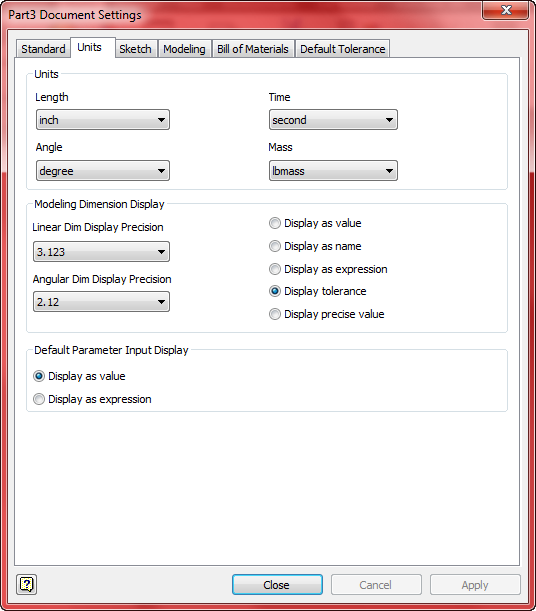
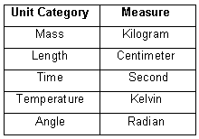
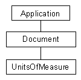

# Unit of Measure

The units of measure portion of the API is a set of utility functions that allow you to perform several types of tasks related to units within Autodesk Inventor. The first of these tasks is getting and setting the current display units and their precision. The display units and their precision are attributes of the document and are saved with the particular document they are set for. The API access to the units and precision is equivalent to the functionality provided in the user interface through the Units tab of the Document Settings dialog, as shown below.



By setting the default units and precision you control how Autodesk Inventor displays all values. For example, if you set the length units to be inches and three decimal place precision, all display of lengths will be in inches and have three decimal place precision. Whenever you need to provide a value for a length, like when specifying the length of an extrusion, and you enter a value without specifying any units, it is assumed to be the default unit. For example if you enter "5" as the length of an extrusion it's assumed to be five inches since that is the default length unit for the document.

The user can change the default units and precision at any time, without impacting the model in any way. A peek within the internals of Autodesk Inventor will provide a better understanding of how the units work. Internally, Autodesk Inventor uses a consistent set of units regardless of what the user has specified as the document default. The precision is always double-precision floating point, regardless of the precision specified by the user. The internal units used by Inventor for the various types of units are listed below:



When the user uses the Units tab to specify display units, this does not affect the internal database units in any way. The data is always saved and utilized using the database units listed above. Autodesk Inventor uses the display units whenever it needs to interact with the user and display unit information or when it needs to interpret unit information the user has entered. For example, let's look at the extrusion depth in more detail. When the user specifies "5" as the depth of the extrusion, the document length unit is used to interpret this as five inches. This value is converted to the internal length unit of centimeters and stored as a double precision value. All internal calculations use this value. When the length of the extrusion needs to be shown to the user, the internal centimeter value is converted to the current document unit with the specified precision and displayed. The internal value for the length, however, remains in centimeters with the full double precision accuracy.

The API works the same way as Autodesk Inventor does internally. All API functions use the database units listed above as input and output. When you need to display unit information to the user you can use the Units of Measure portion of the API to create the correct string to display. When the user enters unit information you can use the API to convert the input string to the correct database unit value. This isolates the majority of your code from any unit conversion since you can assume it will always be in database units. The only time you need to worry about units is when you interact with the user.

The object hierarchy for UnitsOfMeasure is shown below. It consists of the Document object supporting the UnitsOfMeasure property, which returns the UnitsOfMeasure object. This object supports various methods and properties to allow getting and setting the current document default units and performing conversions between the document units and the database units.



Let's look at some examples of the use of the UnitsOfMeasure object. The AngleUnits, AngleDisplayPrecision, LengthUnits, LengthDisplayPrecision, MassUnits and TimeUnits properties allow you to get and set the document default angle, length, mass and time units and set the precision for angles and lengths. They provide an exact equivalent to the functionality of the Units tab of the Document Settings dialog. (The LengthDisplayPrecision is used for the precision of mass and time.)
The GetValueFromExpression, GetStringFromValue, GetStringFromType and GetTypeFromString methods provide functionality in the API that is not exposed to the end user. Let's look in detail at the GetValueFromExpression method to understand units as they apply to the API. If you look at this function in the object browser you'll see the following prototype.

```
GetValueFromExpression(Expression As String, UnitsSpecifier) As Double
```

This method has two input arguments and returns a Double value. The first argument, Expression, is a string that contains the value entered by the user. For example, let's say the user entered "3.2" in a dialog where a length is expected. The second argument, UnitsSpecifier, doesn't have a type specified, which means it is a Variant. Valid input for this argument is either a value from the UnitsTypeEnum enum list or a string. Most common unit types are defined as an enum in the enum list. For example, if you want the input string to be evaluated as an inch you use the enum value kInchLengthUnits. A more common use is that you don't know the specific unit, only that the value is a length, and want it evaluated using the current document default for length. In this case you use the enum value kDefaultDisplayLengthUnits. Corresponding values exist for the other unit categories of angle, mass, and time.

Like the GetValueFromExpression method just discussed, many of the methods supported by the UnitsOfMeasure object require to you to specify the type of unit you are working with. For example, let's say you have a dialog where the user needs to enter a length and they've entered "3.2". Using the GetValueFromExpression method you can pass in the string and the expected unit type and get back the value in the appropriate database value. The code below takes a string from a text box and evaluates it as a length string. Error checking is performed around the GetValueFromExpression call because if the input string does not define a valid length an error will occur. If successful, dLength will contain the resulting length in database length units (centimeters).

|  |
| --- |
| ``` 
 ' Set a reference to the UnitsOfMeasure object of the active document.
 Dim oUOM As UnitsOfMeasure
 Set oUOM = ThisApplication.ActiveDocument.UnitsOfMeasure
     
 ' Get the length defined by the contents of a text box.
 Dim dLength As Double
 On Error Resume Next
 dLength = oUOM.GetValueFromExpression(txtLength.Text, kDefaultDisplayLengthUnits)
 If Err Then
     MsgBox "Invalid length specified."
 End If
 On Error GoTo 0
 ``` |

As seen above, when using an enum as the input for the UnitsSpecifier argument of the UnitsOfMeasure, you can specify a particular unit or whatever the current document default is for a unit category. This argument can also be a string to allow you to specify units that are not defined in the UnitsTypeEnum enum list. For example, all of the volume measurements are those used primarily for liquids: cup, gallon, liter, ounce, pint, and quart. If you want to use a different volume measurement, i.e. cubic inches, you'll need to define the unit using a string. The following example creates a string that defines volume units using the current default document length unit.

|  |
| --- |
| ``` 
 ' Get the enum value that defines the current default length units.
 Dim eLengthUnit As UnitsTypeEnum
 eLengthUnit = oUOM.LengthUnits
 
 ' Get the equivalent string of the enum value.
 Dim sLengthUnit As String
 sLengthUnit = oUOM.GetStringFromType(eLengthUnit)
 
 ' Create a string that defines a volume using the current length unit.
 Dim sVolumeUnit As String
 sVolumeUnit = sLengthUnit & "^3"
 
 ' Create a string showing the volume in the current units.
 Dim sVolume As String
 sVolume = oUOM.GetStringFromValue(36.567, sVolumeUnit)
 MsgBox "Parts volume: " & sVolume
 ``` |

The first section gets the enum value that specifies the current length unit. To define a custom unit we need a string, so the next step calls the GetStringFromType to get the string that is equivalent to the enum value. Let's assume the document default length unit has been set to inches. The call to the LengthUnits property will return kInchLengthUnits. Passing this value into the GetStringFromType method will return "inch". The next step uses this string to create a string that defines a volume. In this case, the result is "inch^3", for cubic inches. This string is used as the UnitsSpecifier argument in the call of the GetStringFromValue method to convert the value 36.567 to cubic inches and return a correctly formatted string. The result is "2.231 in in in". The input value is assumed to be in database units or in this case cubic centimeters.

The ability to use a string to define units is also important in the cases where you need complex composite units. For example, density is not defined in the constant list but defining the correct string can create a unit type for density. For example, the string "gm / cm^3" will define grams per cubic centimeter as the unit type.
The UnitsOfMeasure sample program, delivered with Autodesk Inventor, demonstrates much of the functionality of the UnitsOfMeasure object.