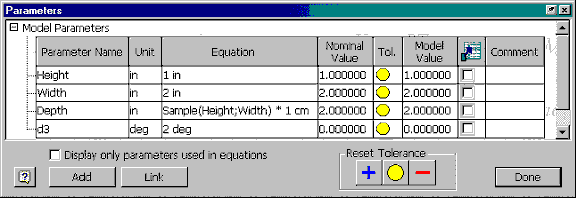
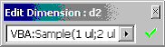

# User-Defined Functions in Parameter Expressions

Since Inventor 2022.4, 2023.1 and 2024 versions you need to add below Environment Variable to enable the user defined functions for parameters:

**InventorEnableParameterMacros = 1**

## Introduction

In Autodesk Inventor's Parameters command, you can specify an expression for a parameter. Expressions can be a specific value or an equation that references other parameters and uses functions. Earlier releases of Inventor limited the use of functions in expressions to a small set of built-in functions such as sine, cosine, minimum and maximum. Now, you can write your own functions using VBA in parametric expressions. These user-defined functions can be used in the expressions just like any of the built-in functions.

While you can make your functions powerful using all the capabilities of VBA, you must be aware of the requirements and rules specific to these functions, which are described in the rest of this section.

## Writing User-Defined Functions

You must write the functions in the code module called "Functions." This code module is automatically created by Inventor for all document projects. It will initially be empty. Any parameters in the document will be able to use functions contained within this module. The parameters in a document cannot, however, use functions created in a documented project associated with another document. Because of the parameter's dependency on the function used in an expression, the function must exist in the document project in the document containing the parameter. Also, the function must be a public function. You can use all capabilities of VBA and the VBA development environment while writing these functions.

The user-defined function must take at least one argument, but it can have any number of additional arguments. All arguments are treated as input and their data type as Double. The return type of the function must be Double.

The Parameter command converts the return value of the user-defined function to a unit-less number.

The function below demonstrates a correctly defined function.

|  |
| --- |
| ``` 
 Public Function Sample(Arg1 As Double, Arg2 As Double) As Double
     'Use the input arguments to compute a value.
     If Arg1 < 5 Then
         Sample = Arg2 
     ElseIf Arg1 < 10 Then
         Sample = Arg2 * 2
     Else
         Sample = Arg2 * 3
     End If
 End Function
 ``` |

This function takes two arguments as input, uses these values to compute a new value, and returns it as the result.

### Handling Units in the Function

One thing to pay particular attention to when writing VBA functions that will be used in parameter equations is the units. All of the Inventor API deals exclusively with internal database units. For example, if you use the API to obtain the length of an edge, the result is returned in centimeters. Centimeters are the internal database units for length. Internally all lengths are computed and saved as centimeters. Using the Document Settings command, the user can choose which units they want to use for that document. For example, let's say that inches are chosen as the length unit. When the user enters a length in a dialog, Autodesk Inventor will assume it is inches and when displaying results it will be in inches. In both cases a conversion is being done to and from centimeters during the reading of the input and the display of the output. The advantage of this behavior is that the units the user chooses for a document can be changed at any time without any impact on the data in the document. It also allows the mixture of parts using different units within assemblies. For a more complete discussion of units, see [Units of Measure](UOM_Overview.md).

The VBA functions for parameter equations need to take this behavior into consideration because all values passed into the function will be in database units. This may make writing functions a little more confusing until you understand the way units are used in Autodesk Inventor, but soon you will discover the advantage of them working correctly regardless of the document unit settings. Let's look at the previous sample to better understand this behavior and how to correctly write a function.

This function has two input arguments. If we look at the use of this function in the Parameters dialog, you can see that two parameters are passed in as input values for these arguments. These two parameters happen to define length units and in this case have the values 1 in and 2 in. When Inventor calls the VBA function these values will be converted to length database units (centimeters). So the values the function receives will be 2.54 and 5.08. If one of the input arguments happened to be the parameter d3, the value received by the function would be 0.03490658, which is 2 deg converted to radians. Radians are the internal database unit for angles.

Understanding that these values are input as centimeters is important in this particular function because it is comparing these values in some logic statements. The If statement checks to see if Arg1 is less than 5. It would be a common mistake to assume you are checking to see if Arg1 is less than 5 inches. Instead it is checking to see if Arg1 is less than 5 centimeters. If the comparison needed to be for 5 inches the If statement could use 5 \* 2.54 instead. The important thing to remember is that within the VBA function, you should always work in the world of Autodesk Inventor's database units: centimeters and radians.

### Debugging

Debugging user-defined functions can easily be performed by placing break points within the function. If you set a break point, performing an operation within Autodesk Inventor that causes the function to be called will place you in debugging mode within the VBA environment.

In addition to setting break points, if for some reason the function should fail, you will be allowed to enter debug mode at that point and correct the function and continue processing.

### Limitations

One limitation that has been deliberately imposed on user-defined functions in parameter expressions is that they cannot use any of the Autodesk Inventor API within the function. For example, you cannot have a function that will directly edit another parameter or change the suppressed state of a feature. Any calls to the Autodesk Inventor API will fail within the context of the function.

The reason for this limitation is that the function is called during the compute process of Autodesk Inventor. Calls to the API while Autodesk Inventor is in this state can cause problems and the results can be unreliable. For example, let's say you have a part made up from 10 features. When this part is entirely recomputed each feature is computed in sequence. Based on dependencies, Autodesk Inventor determines when to compute the value of a parameter. Let's say in this case the parameter that uses the user-defined function is computed after the fifth feature is computed. The model is only partially computed and is not in an editable state. Even query operations of the model will be unreliable in this state since they would only provide a snapshot at the point of what the model looks like, not the final result. And since you don't know when the parameter will be computed, you don't know what the point of that snapshot would be.

Although you cannot use the Autodesk Inventor API within the function, there are no other limitations. For example, the function could perform queries and obtain values from an Access database, or look up information from Excel.

## Using User-Defined Functions

The VBA function is used the same way as the built-in functions are used in Autodesk Inventor. One requirement that is easily overlooked is that the separator between arguments is a semi-colon, not a comma.

The figure below illustrates using the user-defined function in the Parameters dialog.



You can also use the user-defined functions with the Edit Dimensions command. The following figure shows the Edit Dimension dialog box using a function:



While using the function in Parameters and Edit Dimensions dialog boxes, you need not enter "VBA:" before the function. Autodesk Inventor automatically prefixes the function with "VBA:".