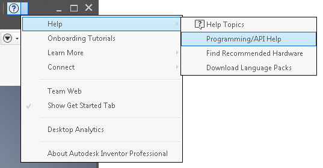

# Introduction to Using Inventor's Programming Interface

There are several resources provided to help you use Inventor's Application Programming Interface (API). These resources are all part of Inventor's Software Development Kit (SDK). The various elements of the SDK and some additional external resources are described below.

Currently Inventor API help is provided in English language only.

## API Help

The API Help is installed with Inventor and is accessed from the Help menu as shown below.

The help content consists of several parts:

* Introduction to the API, which is what you're reading now.
* What's new in this release of Inventor. This lists the changes that have been made in Inventor that may require some changes to any existing programs and lists the new objects, method, properties, and events that have been added for this release.
* User's manual which provides overview topics of much of the API.
* Reference manual. The reference manual provides detailed information about every object, method, property, and event. If that topic is demonstrated in a sample, there is a link to the sample in that topic.
* Sample programs. This is a categorized list of the sample programs. These are the same samples that are also accessed through links in the reference manual topics. They are primarily VBA programs, with a few C# programs. The API is the same regardless of what language is used. It's the syntax that changes, so a program in any language can serve as an example of how to use the API.

## SDK Folder

By default, when installing Inventor, you'll get an SDK folder. On Win 10/11 it's created at:

`C:\Users\Public\Documents\Autodesk\Inventor <version>\SDK`

When installed the SDK folder contains three files; DeveloperTools.msi, UserTools.msi, and SDK\_Readme.htm. To access the SDK information you need to install one or both of the .msi files, which can be installed by double-clicking the .msi file in Explorer.

### DeveloperTools.msi

The DeveloperTools.msi installs additional sample programs and some tools intended to help developers write applications using the Inventor API. When this component is installed, it creates the directories that contain the DeveloperTools sub folder which contains the following subfolders.

#### Docs

This contains an object model diagram chart that can be useful in understanding the relationships between various objects. This folder also contains some guidelines to use when creating the user-interface for your Inventor programs.

#### Include

This folder contains several header (.h) files that are primarily intended to be used by programmers using VC++. Occasionally information in these files is also useful in other circumstances.

#### References

This folder contains a utility that is currently only used internally and is now obsolete with registry-free add-ins.

#### Samples

This folder contains many larger programs written in several different language that demonstrate various ways to access and use Inventor's API.

#### Tools

This folder contains two programs that are useful utilities when working with Inventor's API.

The first, called EventWatcher, allows you to specify and watch certain events as they occur within Inventor. This tool is very useful when you're writing a program that will be using events within Inventor. You can use this tool to better understand the event behavior so you can know how to take advantage of it within your programs.

The second, called ThumbnailView, is a small component that lets you extract thumbnail images from Inventor documents without having to go through Inventor. There's a readme and some samples that describe and show its use.

#### Wizards

This directory no longer contains the wizards installer but now only contains a readme describing the use of the wizards. For those familiar with the previous additional step to install the add-in wizards, the seperate wizards installer is no longer needed because the wizards are installed as part of the SDK installer.

The wizards are used from within Visual Studio to create skeleton Inventor add-in projects.

### UserTools.msi

The UserTools.msi file contains several add-ins and standalone executables that help automate certain tasks for Inventor users that are not available in the Inventor product itself. When this component is installed, it creates the directories for the tools that include AddIns and standalone executables. The dll and exe files are installed so you can immiediately use the tools without having to compile any source code. The source code for the tools is also installed which you can use as a sample and also can modify to change and extend the behavior of these tools.

The user tools installer includes the following add-ins: AttributeHelper, DrawingTools, GeneralTools, DerivedPart\_SP and AutoCustomize. It also includes the following standalone executables: CopyDesign, PartNumberModifier. A UserTools subdirectory is created in the SDK folder and the programs areinstalled there. For more details regarding these tools, please refer to the individual "ReadMe.txt" file associated with each tool.

## Additional Resources

Some other resources are available on the web that contain additional information about Inventor's API.

[Develop Inventor Site](http://www.autodesk.com/developinventor) - A general introduction to the API including presentations describing the API features added in recent releases.

[**Mod the Machine** Blog](https://modthemachine.typepad.com) - A blog dedicated to the Autodesk Inventor API

[Autodesk Discussion Groups](http://forums.autodesk.com) - Autodesk discussion groups where there are open discussions about all of Autodesk's products. The **Autodesk Inventor Customization** group is specifically for Inventor API questions.

---

|  |  |
| --- | --- |
| © Copyright 2025 Autodesk, Inc. | Comment on this page. |