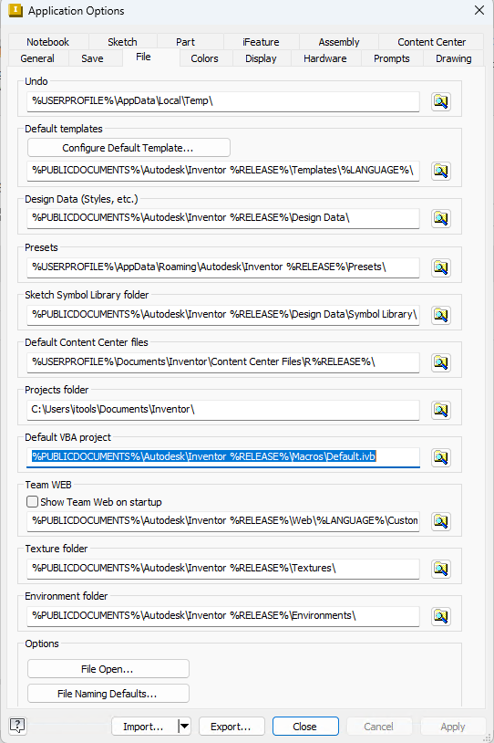
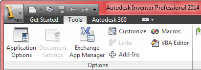
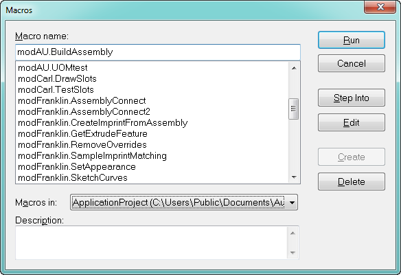
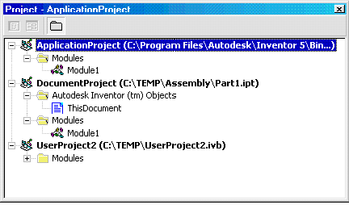

# VBA in Autodesk Inventor

**Note: Since Inventor 2021 the VBA installer has been moved out of Inventor installation, to enable the VBA Editor in Inventor the VBA installer should be installed seperately. The VBA installer can be found from below page:**

[Download the Microsoft VBA module for Inventor](https://www.autodesk.com/support/technical/article/caas/tsarticles/ts/580m5V9igpBgk3WNek5Ydf.html)

Microsoft's Visual Basic for Applications (VBA) is working within Inventor. VBA is a powerful development tool for customizing Inventor and integrating Inventor with other applications and data.
Visual Basic is one of the more popular development tools in the world today. There are several different versions of Visual Basic. Visual Basic 6 was the last version of the older development environment and has been replaced with VB.Net for creating add-ins and executables. VBA provides similar functionality as VB 6 but integrates the development environment into the host applciation. In this case the VBA development environment is integrated into Inventor. VBA is delivered as part of Inventor at not additional cost so anyone that has Inventor has the ability to write and use VBA macros. VBA does not create standalone applications, but always runs from within Inventor. VBA is the programming language used for Microsoft Word and Excel and many other popular applications. If you've used VBA to write programs for other applications you already know the VBA language and programming environment. To use it in Inventor you'll only need to learn the Inventor API. If you haven't used VBA in other applications, learning it within Inventor gives you a head start on customizing other VBA-enabled applications.

## Autodesk Inventor's VBA

VBA is provided by Microsoft and integrated into Inventor. Although VBA is generic, it can be customized somewhat to meet the needs of the specific application it is integrated with. This section will discuss the things that are unique to the Inventor integration of VBA. Information about the general functionality of VBA can be found in the VBA help provided by Microsoft.

VBA allows you to create forms, class modules, and code modules. These modules are contained within projects. In most development environments, a project contains all of the source code that is used to create a single standalone component. Because VBA doesn't create standalone components, projects are used a bit differently. A VBA project is just a container for the various modules. Because of this, a single VBA project can contain a lot of unrelated functionality. Any number of functions can be written within a single project and executed independently.

Inventor's VBA supports three types of projects: document, application, and user. The primary difference between these types of projects is the location in which the VBA project is stored. Document projects are stored within Inventor documents. Application and user projects are stored in external files. Because Inventor supports saving VBA projects within Inventor documents or in external files, you can decide which approach is better for your particular situation. Below are some of the factors to consider when making this decision.

### Document Projects (Saving in the Document)

Document projects allow you to easily deliver code that is specific to a document with that document. For example, if you have a standard part that is used to create members of a family of parts, you can write a program that sets the parameters of the part to create the various family members. It's convenient to embed this program in the Inventor document so that the program will always be available along with the part document.

### Application and User Projects (Saving in an external .ivb file)

* Allows programs to be more easily shared between documents. Frequently programs are written to automate repetitive tasks. The usefulness of these programs is not isolated to a single document. With an application or user project, these programs become available to all documents.
* Allows code to be easily shared with other users. One person can write a program, which might consist of several functions and forms, and then send the project to anyone else, who can load the project and access the functionality. No additional work is required. By contrast, if you want to share a document project with other users, you need to send them the Inventor document that contains the embedded program and they must copy and paste the code into the desired Inventor document. Or you can export each of the modules as .frm, .bas, and .cls files and send them. These can then be imported into the VBA environment of the Inventor document where they're needed. As you can see, application and user projects provide a much simpler mechanism for code sharing and reuse.
* Allows easier management of source code. All of the code is contained within a single file, which makes updates much easier. In the case of document projects, every document that needs the functionality has the program embedded within it. As the program is updated and bugs are fixed it can be very difficult to keep track of which documents contain the program and which version of the program they contain.

So far, all of the behavior we have discussed makes it appear that application and user projects are the same. This is largely true, but the key difference between them is how they get loaded into the VBA environment. Inventor loads the application project automatically whenever the user starts Inventor. This makes macros within an application project always available. Only one project can be defined to be the application project. The project file that serves as the application project is defined using Inventor's Application Options dialog, as shown below. The "Default VBA Project" field on the File tab defines which user project to use as the application project.



User projects are not automatically loaded but must be loaded manually using the "Load Project" command in the Inventor VBA File menu (In Inventor, choose the Tools tab, then VBA Editor, then File | Load Project...). New user projects can also be created using the "New Project" command in the VBA Files menu. There is no limit to the number of user projects that can be loaded.

Inventor's VBA interface is accessed within Inventor by through the **VBA Editor** command in the Tools tab of the ribbon. The **Macros** command lets you run existing macros and open the editor to a specific macro. The two commands are also available using the Alt+F8 and Alt+F11 keyboard shortcuts.



Before going any further let's define some terms. A *Sub* is essentially a function without a return values. The code is enclosed within the Sub and End Sub statements.. A Sub can have arguments that can be input and output but it doesn't have a return value. A *macro* is a special case of a Sub that doesn't have any arguments. Any Subs without arguments will be considered macros. For example, the following code will be treated by VBA as a macro.

``` 
 Public Sub SampleMacro()
     MsgBox "This is a sample."
 End Sub
 ``` |

Running the **Macros"** command in Inventor displays the dialog shown below. This dialog displays a list of all of the macros currently available. This list can be filtered using the "Macros in" combo box. This allows you to list the macros contained in a particular project (document, user or application project), or to list all of the macros in all of the loaded projects.



When a macro is selected from the list, all of the buttons on the right, except one, are enabled. The following describes the behavior of each of the buttons.

**Run** - The selected macro is executed without displaying the VBA programming environment.

**Cancel** - Dismisses the dialog.

**Step Into** - Opens the VBA programming environment and begins running the selected macro by stepping into the function. This is useful when debugging a macro.

**Edit** - Opens the VBA programming environment with the cursor positioned at the top line of the selected macro.

**Create** - If an existing macro is selected, this button is disabled. If a new name is entered into the "Macro name" field, this button becomes enabled and when clicked will cause a macro of the specified name to be created.

**Delete** - Deletes the selected macro. This will remove the sub from the project.

Running the **VBA Editor** command in Inventor opens the VBA programming environment. This is commonly known as the "Integrated Development Environment" or IDE. Within the VBA IDE is the "Project Explorer" which provides a browser-like view of the currently open projects, as shown below.



Several important concepts of Inventor's VBA integration are illustrated in the Project Explorer. The first of these is the "Application" project. As discussed earlier, this is a project file that is stored in an external file and is loaded automatically whenever Inventor is run. The name of the project file is shown in parentheses next to the project's name.

The second project in the list is a document project. The name of the document in which the project is embedded is shown in parentheses next to the project's name. Document projects are shown for the documents currently open in Inventor. One difference between user and document projects that's apparent when looking at the Project Explorer is that the document project exposes the "ThisDocument" object. This represents the document that contains the macro. Writing code within the ThisDocument module give you direct access to the Inventor document. For example, the following code is valid within the ThisDocument module.

``` Public Sub DocDisplayName()
     Dim sDocDisplayName As String
     sDocDisplayName = DisplayName
 End Sub
 ``` |

DisplayName is a property of the Document object. When writing code within the ThisDocument module, the methods and properties of the document are directly available. The document is also available within other modules of the project by using the ThisDocument global variable. For example, the code below can be used in other modules of a Document project.

``` Public Sub DocDisplayName ()
     Dim sDocDisplayName As String
     sDocDisplayName = ThisDocument.DisplayName
 End Sub
 ``` |

The ThisDocument global variable is not available in application and user projects. In these projects, and in document projects, you can use the "ThisApplication" global variable. This provides direct access to the Inventor Application object. This sample can be used in both user and application projects to get the display name of the currently active document.

``` 
 Public Sub DocDisplayName ()
     Dim sDocDisplayName As String
     sDocDisplayName = ThisApplication.ActiveDocument.DisplayName
 End Sub
 ``` |

---

|  |  |
| --- | --- |
| © Copyright 2025 Autodesk, Inc. | Comment on this page. |