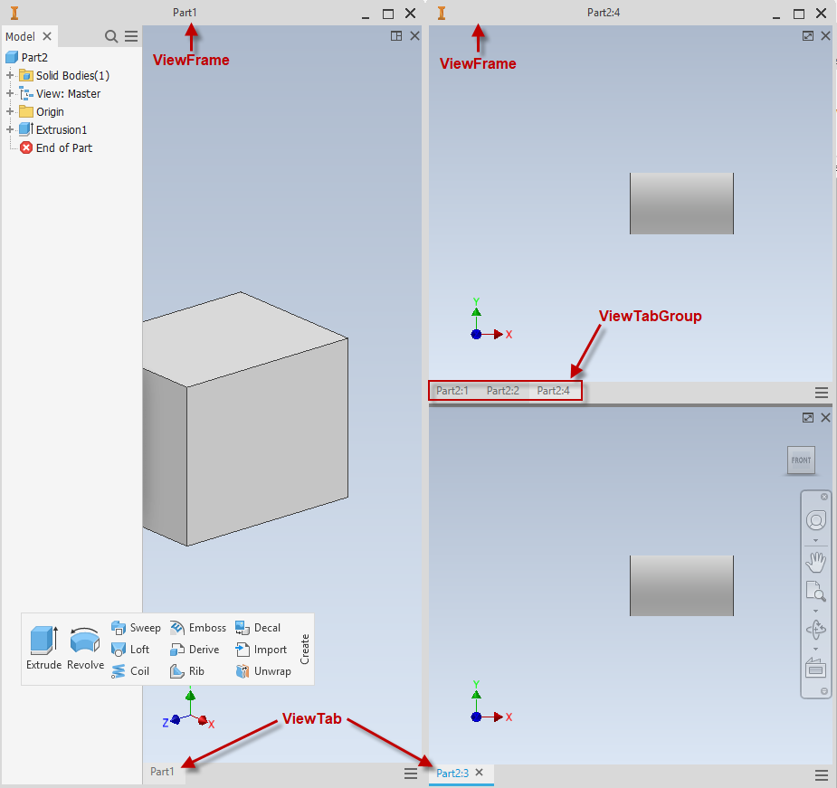

# ViewFrames - multiple monitor support

### Introduction to ViewFrame

A ViewFrame is a window that can dock views and browser panes in it. Inventor has a built-in view frame which can be determined by ViewFrame.IsDefault, all other view frames can be generated by moving a view tab out of the view frame it docks to. Support multiple view frames allows users to deal with Inventor data in multiple monitors more easily. To dock or undock a view in a view frame is to move its tab(ViewTab), a ViewTab will always be in a ViewTabGroup, below snapshot demonstrates the view frames and view tabs:



When open or create a document, its graphical view will be displayed in the active ViewFrame, the Application.ActiveViewFrame tells which view frame is active. Activate a ViewFrame can be achieved by activating a view in it or dock a view into it. Below is a sample to change the active ViewFrame:

|  |
| --- |
| ``` 
 Sub ActivateViewFrameSample()
     ' This sample demonstrates how to activate a ViewFrame, close all custom ViewFrame windows before running it.
     ' When you open or new a document, the document's View will be located in the active ViewFrame.
     
     Dim oDefaultViewFrame As ViewFrame
     Set oDefaultViewFrame = ThisApplication.ViewFrames(1)
     
     Dim oDoc As PartDocument
     Set oDoc = ThisApplication.Documents.Add(kPartDocumentObject)
     
     ' This View of the new document is located in the default ViewFrame.
     Dim oView1 As View
     Set oView1 = oDoc.Views(1)
     
     Dim oViewTab1 As ViewTab
     Set oViewTab1 = oView1.ViewTab
         
     ' Create a new View for the same document.
     Dim oView2 As View
     Set oView2 = oDoc.Views.Add
     
     Dim oViewTab2 As ViewTab
     Set oViewTab2 = oView2.ViewTab
     
     ' Move the second View to generate a new custom ViewFrame, this will also activate the new ViewFrame.
     Dim oViewFrame1 As ViewFrame
     Set oViewFrame1 = oViewTab2.MoveToNewViewFrame(500, 600, 200, 100)
     Debug.Print ThisApplication.ActiveViewFrame Is oViewFrame1
     
     ' Add a new document, now it will be opened in the active custom ViewFrame.
     Dim oDoc1 As PartDocument
     Set oDoc1 = ThisApplication.Documents.Add(kPartDocumentObject)
     
     ' Activate the default ViewFrame through activating a View in it.
     oView1.Activate
     Debug.Print ThisApplication.ActiveViewFrame Is oDefaultViewFrame
     
     ' Now create a new document will be located in the active default ViewFrame.
     Dim oDoc2 As PartDocument
     Set oDoc2 = ThisApplication.Documents.Add(kPartDocumentObject)
 End Sub
 ``` |

ViewFrame can be resized by changing its Width or Height directly, or using ViewFrame.Move function. The ViewFrame.Move can also change the ViewFrame's position on screen(can be in different monitors that connect with the same computer). The ViewFrame.Arrange can arrange views in it as tiles.