# What's New For the Release

## New Features of Inventor 2026

1. Updated the step #11 for Port to .Net 8 process (C# and VB.net projects)
   in article [Port .Net Framework-based project to .Net](PortToNetCore_Overview.md) to embed manifest with a simpler way.
2. New DrawingViewAnnotation object that allows to access the drawing view annotation information for detail and section drawing view.

   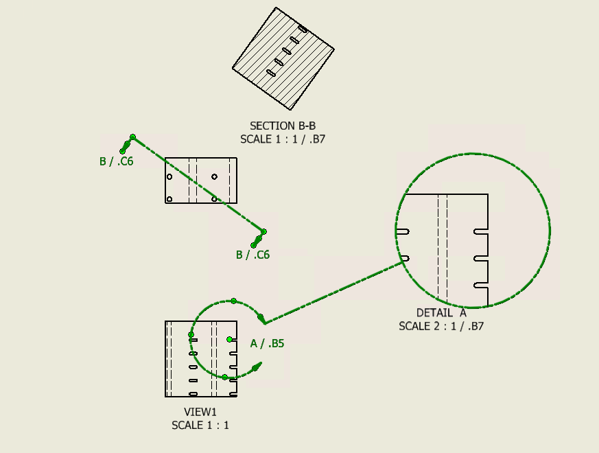
3. Hide Sketch3dOptions object, move the Sketch3dOptions.AutoBendWithLineCreation to SketchOptions, and exposed SketchOptions.SketchOpacity property.

   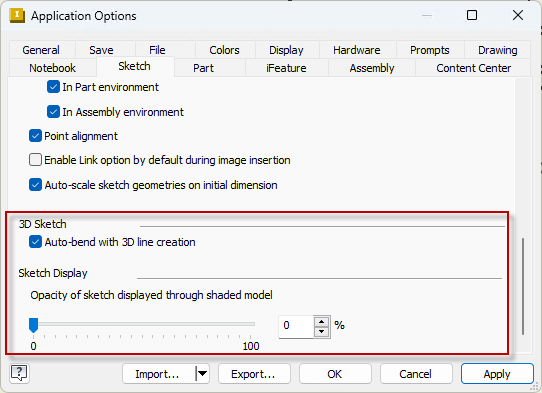
4. New SimplifyFeature object allows to create, edit and delete the simplify features in part documents.

   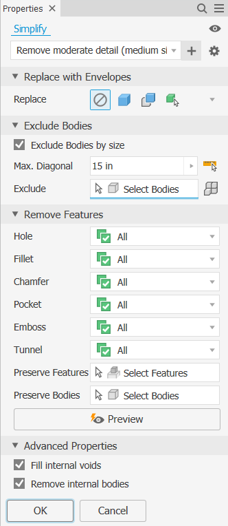
5. ContourFlangeDefinition is enhanced to make use of edge sets to set the extent, some functions are hidden to keep legacy behavior and new functions are exposed for the enhancement.

   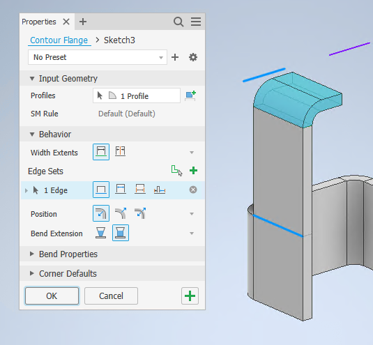
6. New ShellFeatures.CreateDefinition method to replace ShellFeatures.CreateShellDefinition method to enhance the ShellDefinition with AffectedBodies and Method functions.

   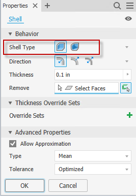
7. New BreakOperation.AddBySketch function allows to create a break operation using an existing drawing sketch. And new BreakOperation.BreakLineSketch property can be used to return the drawing sketch that is used to create the break operation.

   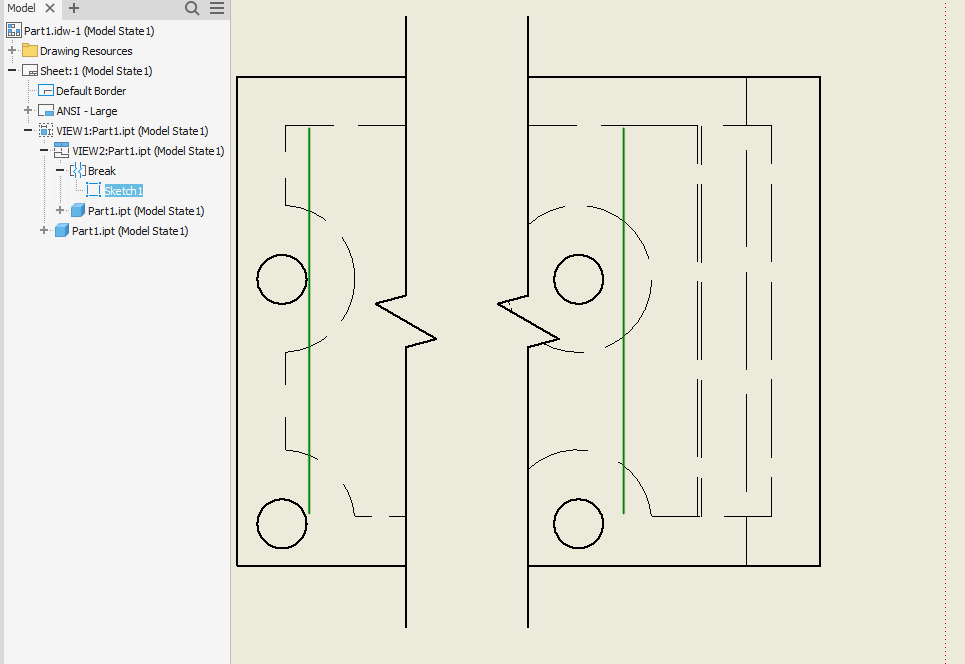
8. New ClientFeature.ClientGraphicsVisible property allows to get and set the visibility of client graphics in a client feature.
9. Public the ComponentOccurrence.ActiveDesignViewRepresentation property.
10. Public the CosmeticWelds.Add and CreateDefinition methods.
11. New DrawingView.ShowTrails property allows to show or hide the trails for a drawing view of a presentation.

    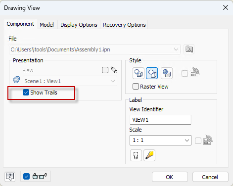
12. New DimensionStyle.ExtendBeyondTicks property allows to set the extend distance beyond ticks. New DimensionStyle.ExtensionLine property allows to set the extention line distance. New DimensionStyle.UseCapitalXForEquallySpacedFeatures property allows to set whether to use captical X in equally spaced features or not.

    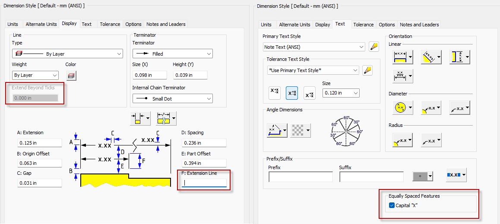
13. New DrawingStandardStyle.GetAvailableStyles and SetAvailableStyles allow to get and set the available styles.

    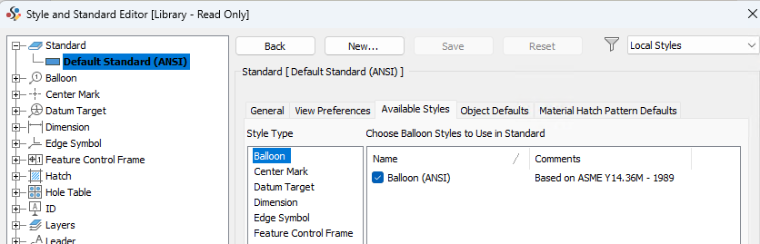
14. New DrawingStandardStyle.GetViewAnnotationDefaults and SetViewAnnotationDefaults functions allow to get and set the view annotation defaults for detail and section view.

    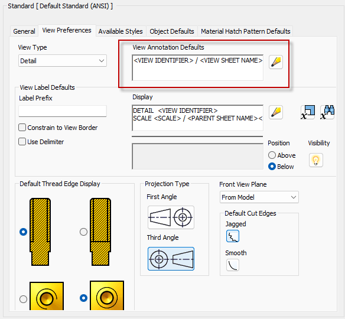
15. New FileDialogEvents.OnOptionsReset event allows to notify you when the options requires to be reset(e.g. when change the file types).
16. New FileManager.GetRevitFileVersionCreated method returns the Revit file version when it was created.
17. New ModelStates.ModelStatesInEdit property allows to get and set the model states that are in edit mode, and the MemberEditScope will return kEditMultipleMembers in this case.

    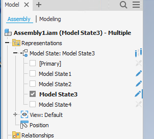
18. New Parameters.ExportToXML and ImportFromXML methods allow to import and export parameters.

    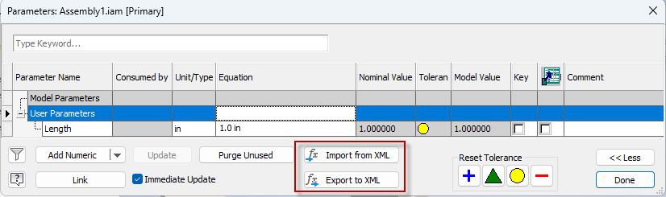
19. New RevitExportDefinition.RevitTemplate property allows to set the template when export to Revit.

    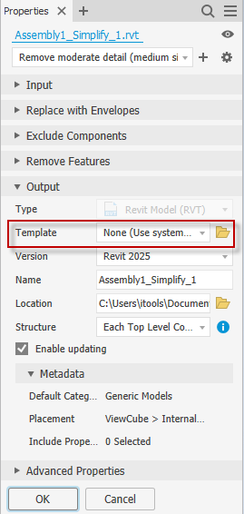
20. Change ContourFlangeFeature.Definition and PunchToolFeature.iFeatureDefinition properties as read-write properties so a definition object can be assigned to them to make multple changes with one recomputation.
21. Support new version type(IFC4x3) when export to IFC file using BIMComponet.ExportBuildingComponentWithOptions.

    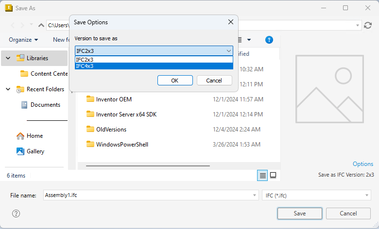
22. Hide BIMComponentDescription.ComponentType as the OmniClass is not supported. New BIMComponentDescription.RevitFamilyCategory property allows to get and set the Revit family category.

    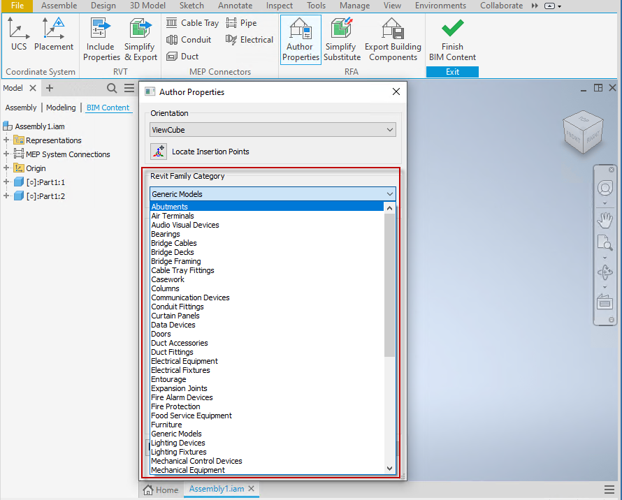

## New Objects

|  |  |
| --- | --- |
| Name | Description |
| [DrawingViewAnnotation](../api-doc/DrawingViewAnnotation/DrawingViewAnnotation.md) | DrawingViewAnnotation Object. |
| [SimplifyDefinition](../api-doc/SimplifyDefinition/SimplifyDefinition.md) | The SimplifyDefinition object represents all of the information that defines a part simplify feature. |
| [SimplifyFeature](../api-doc/SimplifyFeature/SimplifyFeature.md) | Part Simplify Feature Object. |
| [SimplifyFeatureProxy](../api-doc/SimplifyFeatureProxy/SimplifyFeatureProxy.md) | Part Simplify Feature Proxy Object. |
| [SimplifyFeatures](../api-doc/SimplifyFeatures/SimplifyFeatures.md) | Part Simplify Features Collection Object. |

## New Methods, Properties and Events

|  |  |
| --- | --- |
| Name | Description |
| [BIMComponentDescription.RevitFamilyCategory](../api-doc/BIMComponentDescription/BIMComponentDescription_RevitFamilyCategory.md) | Read-write property that gets and sets the Revit family category Id. |
| [BreakOperation.BreakLineSketch](../api-doc/BreakOperation/BreakOperation_BreakLineSketch.md) | Read-only property that returns the DrawingSketch object containing the break lines. |
| [BreakOperations.AddBySketch](../api-doc/BreakOperations/BreakOperations_AddBySketch.md) | Method that adds a break to a drawing view. The newly created BreakOperation object is returned. |
| [ClientFeature.ClientGraphicsVisible](../api-doc/ClientFeature/ClientFeature_ClientGraphicsVisible.md) | Property that gets and sets whether all the client graphics in this client featureare visible or not.When getting this property valid values are kAllGraphicsVisible,kNoGraphicsVisible, and kSomeGraphicsVisible. When setting this propertykAllGraphicsVisible and. |
| [ClientFeatureProxy.ClientGraphicsVisible](../api-doc/ClientFeatureProxy/ClientFeatureProxy_ClientGraphicsVisible.md) | Property that gets and sets whether all the client graphics in this client featureare visible or not.When getting this property valid values are kAllGraphicsVisible,kNoGraphicsVisible, and kSomeGraphicsVisible. When setting this propertykAllGraphicsVisible and. |
| [ComponentOccurrence.ActiveDesignViewRepresentation](../api-doc/ComponentOccurrence/ComponentOccurrence_ActiveDesignViewRepresentation.md) | Gets the active Design View Representation for an assembly occurrence. This property returns Nothing in the case where a design view representation was set for the occurrence non-associatively (i.e. with the 'Associative' flag turned off). |
| [ComponentOccurrenceProxy.ActiveDesignViewRepresentation](../api-doc/ComponentOccurrenceProxy/ComponentOccurrenceProxy_ActiveDesignViewRepresentation.md) | Gets the active Design View Representation for an assembly occurrence. This property returns Nothing in the case where a design view representation was set for the occurrence non-associatively (i.e. with the 'Associative' flag turned off). |
| [ContourFlangeDefinition.AddContourFlangeEdgeSet](../api-doc/ContourFlangeDefinition/ContourFlangeDefinition_AddContourFlangeEdgeSet.md) | Method that adds a new contour flange edge set. The new FlangeEdgeSet is returned. This is applicable when the WidthExtentsFromSketchPlane is set to False. |
| [ContourFlangeDefinition.BendEdges](../api-doc/ContourFlangeDefinition/ContourFlangeDefinition_BendEdges.md) | Read-write property that gets and sets the EdgeCollection object that contains the edges that are used to define the adjoining edges for new face. This is applicable when the WidthExtentsFromSketchPlane property is True. |
| [ContourFlangeDefinition.BendExtensionType](../api-doc/ContourFlangeDefinition/ContourFlangeDefinition_BendExtensionType.md) | Read-write property that gets and sets the bend extension type. This is applicable when the BendEdges is configured. |
| [ContourFlangeDefinition.ContourFlangeEdgeSetCount](../api-doc/ContourFlangeDefinition/ContourFlangeDefinition_ContourFlangeEdgeSetCount.md) | Read-only property that returns the contour flange edge set count currently defined in this contour flange definition. |
| [ContourFlangeDefinition.ContourFlangeEdgeSetItem](../api-doc/ContourFlangeDefinition/ContourFlangeDefinition_ContourFlangeEdgeSetItem.md) | Method that returns the specified FlangeEdgeSet object from the collection. |
| [ContourFlangeDefinition.SetFromToExtent](../api-doc/ContourFlangeDefinition/ContourFlangeDefinition_SetFromToExtent.md) | Method that sets the width extent to define a contour flange whose width is defined as being between two entities. Calling this method will set WidthExtentsFromSketchPlane to True when the Operation is kJoinOperation. |
| [ContourFlangeDefinition.SetToExtent](../api-doc/ContourFlangeDefinition/ContourFlangeDefinition_SetToExtent.md) | Method that sets the width extent to define a contour flange whose width is defined as being between original sketch plane and another entity. This is applicable when the WidthExtentsFromSketchPlane is True or when Operation is kJoinOperation. |
| [ContourFlangeDefinition.WidthExtent](../api-doc/ContourFlangeDefinition/ContourFlangeDefinition_WidthExtent.md) | Read-only property that returns the PartFeatureExtent object that defines how the width extent of the contour flange feature is defined. This is applicable when the WidthExtentsFromSketchPlane is True. |
| [ContourFlangeDefinition.WidthExtentsFromSketchPlane](../api-doc/ContourFlangeDefinition/ContourFlangeDefinition_WidthExtentsFromSketchPlane.md) | Read-only property that get and sets the width extents type is from sketch plane or along selected edge. This is applicable when the Operation is kJoinOperation. |
| [ContourFlangeDefinition.WidthExtentType](../api-doc/ContourFlangeDefinition/ContourFlangeDefinition_WidthExtentType.md) | Read-only property that returns the width extent type. The valid values for this property are kDistanceExten, kFromToExtent, and kToExtent. This is applicable when the WidthExtentsFromSketchPlane property is True. |
| [ContourFlangeFeatures.CreateDefinition](../api-doc/ContourFlangeFeatures/ContourFlangeFeatures_CreateDefinition.md) | Creates a new ContourFlangeDefinition object. |
| [CosmeticWelds.Add](../api-doc/CosmeticWelds/CosmeticWelds_Add.md) | Method that creates a CosmeticWeld and returns the newly created CosmeticWeld object. |
| [CosmeticWelds.CreateDefinition](../api-doc/CosmeticWelds/CosmeticWelds_CreateDefinition.md) | Method that creates a CosmeticWeldDefinition object. |
| [DetailDrawingView.ShowTrails](../api-doc/DetailDrawingView/DetailDrawingView_ShowTrails.md) | Gets and set whether to show the trails or not for a drawing view of a presentation. |
| [DetailDrawingView.ViewAnnotation](../api-doc/DetailDrawingView/DetailDrawingView_ViewAnnotation.md) | Read-only property that returns the drawing view annotation object. |
| [DimensionStyle.ExtendBeyondTicks](../api-doc/DimensionStyle/DimensionStyle_ExtendBeyondTicks.md) | Gets and sets the distance extend the dimension line past the extension line in centimeters when the arrowheads is specified as oblique or no marks. |
| [DimensionStyle.ExtensionLine](../api-doc/DimensionStyle/DimensionStyle_ExtensionLine.md) | Gets and sets the length of the extension line in centimeters. |
| [DimensionStyle.UseCapitalXForEquallySpacedFeatures](../api-doc/DimensionStyle/DimensionStyle_UseCapitalXForEquallySpacedFeatures.md) | Gets and sets whether to use capital X for equally spaced features or not. |
| [DrawingStandardStyle.GetAvailableStyles](../api-doc/DrawingStandardStyle/DrawingStandardStyle_GetAvailableStyles.md) | Method that returns the ObjectCollection containing the styles which are available for the standard style. |
| [DrawingStandardStyle.GetViewAnnotationDefaults](../api-doc/DrawingStandardStyle/DrawingStandardStyle_GetViewAnnotationDefaults.md) | Method that gets the drawing view annotation defaults for the specified view type. |
| [DrawingStandardStyle.SetAvailableStyles](../api-doc/DrawingStandardStyle/DrawingStandardStyle_SetAvailableStyles.md) | Method that sets the styles which are available for the standard style. |
| [DrawingStandardStyle.SetViewAnnotationDefaults](../api-doc/DrawingStandardStyle/DrawingStandardStyle_SetViewAnnotationDefaults.md) | Method that sets the drawing view annotation defaults for the specified view type. |
| [DrawingView.ShowTrails](../api-doc/DrawingView/DrawingView_ShowTrails.md) | Gets and set whether to show the trails or not for a drawing view of a presentation. |
| [DrawingView.ViewAnnotation](../api-doc/DrawingView/DrawingView_ViewAnnotation.md) | Read-only property that returns the drawing view annotation object. |
| [FileDialogEvents.OnOptionsReset](../api-doc/FileDialogEvents/FileDialogEvents_OnOptionsReset.md) | Fires when the action to reset options on the file dialog occurs, e.g. file filter type changes, etc. |
| [FileManager.GetRevitFileVersionCreated](../api-doc/FileManager/FileManager_GetRevitFileVersionCreated.md) | Method that returns the Revit version that the Revit file was created with. |
| [ModelStates.ModelStatesInEdit](../api-doc/ModelStates/ModelStates_ModelStatesInEdit.md) | Read-write property that gets and sets the model states in edit. |
| [Parameters.ExportToXML](../api-doc/Parameters/Parameters_ExportToXML.md) | Exports parameters to XML file. |
| [Parameters.ImportFromXML](../api-doc/Parameters/Parameters_ImportFromXML.md) | Imports parameters from XML file. |
| [PartFeatures.SimplifyFeatures](../api-doc/PartFeatures/PartFeatures_SimplifyFeatures.md) | Read-only property that returns the SimplifyFeatures collection object. |
| [RevitExportDefinition.RevitTemplate](../api-doc/RevitExportDefinition/RevitExportDefinition_RevitTemplate.md) | Read-write property that gets and sets the Revit template file used to create the RevitExport. |
| [SectionDrawingView.ShowTrails](../api-doc/SectionDrawingView/SectionDrawingView_ShowTrails.md) | Gets and set whether to show the trails or not for a drawing view of a presentation. |
| [SectionDrawingView.ViewAnnotation](../api-doc/SectionDrawingView/SectionDrawingView_ViewAnnotation.md) | Read-only property that returns the drawing view annotation object. |
| [SheetMetalFeatures.SimplifyFeatures](../api-doc/SheetMetalFeatures/SheetMetalFeatures_SimplifyFeatures.md) | Read-only property that returns the SimplifyFeatures collection object. |
| [ShellDefinition.AffectedBodies](../api-doc/ShellDefinition/ShellDefinition_AffectedBodies.md) | Read-write property that specifies the solid bodies to be hollowed out. |
| [ShellDefinition.Method](../api-doc/ShellDefinition/ShellDefinition_Method.md) | Read-write property that gets and sets the shell method. This defaults to kSharpShellMethod when the definition is just created. |
| [ShellFeatures.CreateDefinition](../api-doc/ShellFeatures/ShellFeatures_CreateDefinition.md) | Method that creates a new ShellDefinition object. The object returned by this method isused to define the inputs for a shell feature and is provided as the argument to the Add method of the ShellFeatures collection. |
| [SketchOptions.AutoBendWithLineCreation](../api-doc/SketchOptions/SketchOptions_AutoBendWithLineCreation.md) | Enables/disables automatically creating corner bends on 3D lines. |
| [SketchOptions.SketchOpacity](../api-doc/SketchOptions/SketchOptions_SketchOpacity.md) | Gets/sets the opacity of the sketch displayed through shaded model, valid value is from 0 to 100 indicating the opacity percentage. |

Help created: Thursday, December 19, 2024 2:28 PM

---

|  |  |
| --- | --- |
| © Copyright 2025 Autodesk, Inc. | Comment on this page. |