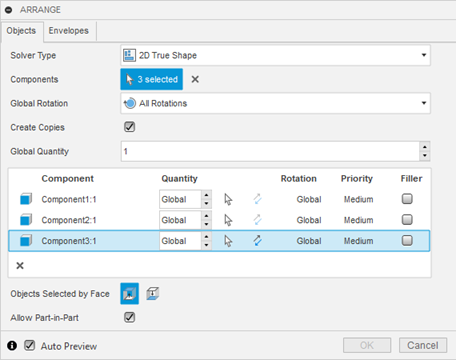
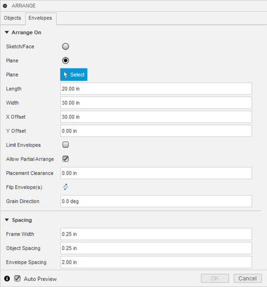
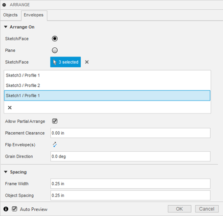
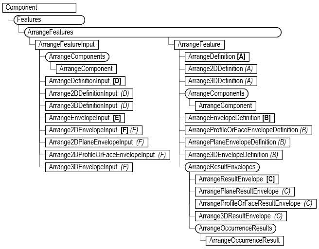
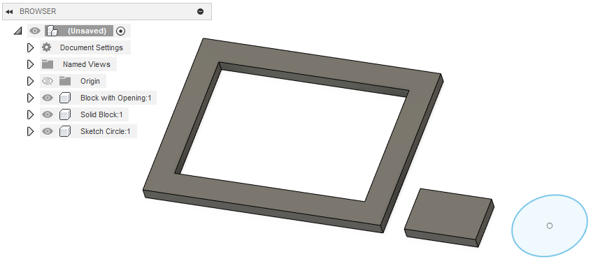
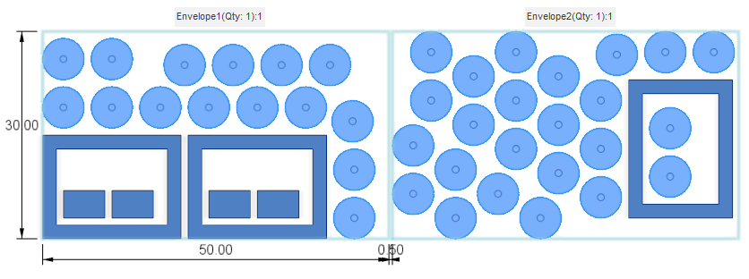
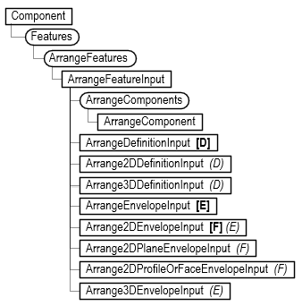
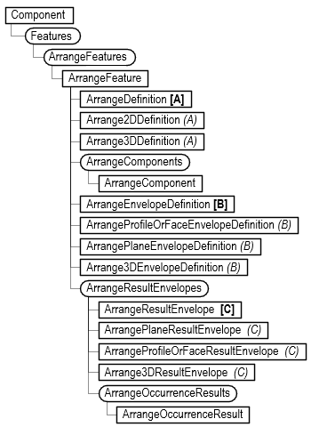

The API for the Arrange feature is currently released as a preview. We would appreciate any feedback about bugs and usability. We've discovered some problems where it was too late in the release cycle to fix them for this release. To help avoid multiple reports of know issues. Here's the current list. We expect these to be addressed soon.

#### Known Issues

1. When specifying a length or angle, it is using the document units. The API always uses internal units, so length should always be centimeters and angles should always be radians.
2. It’s not returning the correct occurrences when getting the ArrangeOccurrences from an envelope.
3. EnvelopeDefinition.isPartialArrangeAllowed fails if the return is False.
4. Setting the ArrangeComponent.quantity to -1 to indicate it should use the global value fails.
5. Setting the ArrangeComponent.isFiller doesn’t have the expected result.

### Overview of the Arrange Feature

The Arrange command is a complex command with many options to control the arrangement. The resulting geometry is also interesting, and as a result, the API is complex. To better understand the API, it’s best to start with a brief overview of the command as you see it in the user interface.

Below is the command dialog with its “Objects” tab displayed. You define what will be arranged using this tab. It starts by defining the type of arrangement: 2D True Shape, 2D Rectangular, or 3D, which changes the available settings.



One thing that is not obvious is what geometry is being arranged. The dialog refers to selecting and arranging “Components”, which is true, but there’s more to it than that. A component is arranged, but the geometry used to calculate the arrangement is not always obvious. When choosing a component to arrange, you can select a body, face, profile, or a component. To select a component, you need to select it in the browser. If you select a body, that body's geometry will be used for the arrangement. If you select a face, the body that owns the face will be used. Selecting a face is a way to define the body's orientation in the arrangement and define the “up” face. You can also select a sketch in the browser, resulting in a profile from the sketch used for the arrangement. The shape of the selected geometry is used for the arrangement computation, but the entire component is positioned so you’ll see any other geometry that exists in the component, even though it wasn’t considered in the computation.

The ”Envelopes” tab of the dialog is shown below. Using this tab, you define where the arrangement will take place. Settings that control how the arrangement is calculated are on both tabs. The Envelope tab has two options for defining the area where the result will be created: a defined rectangular area or previously created sketches or faces. The picture below shows where the “Plane” option has been selected. The dialog now provides the fields to define the rectangle's size, and the selection of a construction plane where the rectangle will be created.



The picture below shows the “Envelope” tab with the “Sketch/Face” option selected. In this mode, the dialog allows you to select profiles or planar faces that will define the shape of the envelope where the arrangement will be created. Both options support additional settings that control how the components are arranged.



As you can see, the command is quite complex, with many settings and options. Before attempting to use the API, it’s highly recommended that you experiment with the command interactively using the user interface to understand better how it works and what the various settings do. It’s best first to create the result interactively to ensure it’s possible and then use the API to create the same result.

Below is the API Object Model for the Arrange feature. Like all other features, it’s accessed through the Features collection object and follows the same pattern as the other feature collections, where it supports creating an input object that you then use to create a new feature. Through the collection object, you also access existing features to query or edit them.



### Creating an Arrange Feature

Here’s an example of using the API to create an Arrange feature using the design shown below. The design consists of three components. The first is a rectangular solid with a large cutout, the second is a small rectangular solid, and the third is a component that only contains a sketch of a circle. The Python code that creates this design is at the bottom of this article.



Here’s the expected result where there are 3 of the large block, 4 of the smaller block and the circle fills the remaining area. It uses a rectangular plane envelope where multiple envelopes are allowed.



Before looking at the code, a few basic concepts need to be understood. Creating an Arrange feature uses the same basic process as other features: you create an input object, define all the settings, and then call the add method and provide the input object. The portion of the object model that’s used to create an Arrange feature is shown below. Three main objects are associated with the input object: ArrangeComponent, ArrangeDefinitionInput, and ArrangeEnvelopeInput. The ArrangeComponent defines the model geometry you want to arrange and provides access to the various arrange settings associated with each component. The ArrangeDefinitionInput object provides access to the other settings on the “Objects” tab of the Arrange dialog. There are two types of ArrangeDefinitionInput objects: Arrange2DDefinitionInput and Arrange3DDefinitionInput. When you create the input object, you define the type of arrangement you want to create, and it will have either a 2D or 3D ArrangeDefinitionInput associated with it. The rest of the object model provides the functionality to define the envelope for the arrangement. There are several objects for envelopes to support the various types of envelopes that the feature supports.



Below, is the code that creates the arrange feature above, along with a description of the important lines.

Lines 15-16 create the ArrangeFeatureInput object for a 2D True Shape arrangement.

Line 19 gets the definition associated with the input. Because the input was created for 2D True Shape arrangement, this will return an ArrangeDefinition2DInput object. This object is also returned if a 2D Rectangular solver type is specified. However, an ArrangeDefinition3DInput object will be returned if the input was created for a 3D arrangement. The ArrangeDefinitionInput object is the logical equivalent to the “Object” tab of the Arrange command dialog.

Lines 22-24 modify some of the settings associated with the definition.

Line 27 gets the ArrangeComponents collection object associated with the ArrangeDefinition2DInput object. You use this collection to specify which components to arrange.

Lines 30-32 get the Occurrence objects that contain the geometry to be nested.

Line 35 creates an ArrangeComponent using the first occurrence. When a Component object is provided, the Arrange functionality uses logic to determine what geometry to use within the component. If there are any bodies, it will choose the first body, which is what is happening in this case.

Line 36 creates an ArrangeComponent by providing a body. This allows you to be explicit about which body to use. A BRepFace can also be used to define the “up” face of the body. Otherwise, it determines the orientation automatically.

Line 37 creates an ArrangeComponent by providing the profile in the component to use for the arrangement.

Lines 40-44 change some settings associated with each ArrangeComponent object.

Line 47 defines a 2D plane envelope that is 50x30 cm in size.

Lines 52-56 change some settings associated with the envelope.

Line 59 creates the arrange feature.

```
import traceback
import adsk.core
import adsk.fusion

app = adsk.core.Application.get()
ui  = app.userInterface

def run(context):
     try:
         des: adsk.fusion.Design = app.activeProduct
         comp = des.rootComponent
         arrangeFeats = comp.features.arrangeFeatures

         # Create the input.
         arrangeInput: adsk.fusion.ArrangeFeatureInput = arrangeFeats.createInput(
                         adsk.fusion.ArrangeSolverTypes.Arrange2DTrueShapeSolverType)

         # Get the definition object from the input.
         arrangeDefInput: adsk.fusion.ArrangeDefinition2DInput = arrangeInput.definition

         # Modify some of the arrange settings.
         arrangeDefInput.globalRotation = adsk.fusion.ArrangeRotationTypes.AllRotationsArrangeRotationType
         arrangeDefInput.isGlobalDirectionFaceUp = True
         arrangeDefInput.isPartInPartAllowed = True

         # Get the ArrangeComponents collection from the input objects.
         arrComponents = arrangeInput.arrangeComponents

         # Get the occurrences to arrange.
         occ1 = comp.allOccurrences.itemByName('Block with Opening:1')
         occ2 = comp.allOccurrences.itemByName('Solid Block:1')
         occ3 = comp.allOccurrences.itemByName('Sketch Circle:1')

         # Add each occurence as an arrange component.
         arrComp1 = arrComponents.add(occ1)
         arrComp2 = arrComponents.add(occ2.bRepBodies[0])
         arrComp3 = arrComponents.add(occ3.component.sketches[0].profiles[0])

         # Set some properties of each arrange component.
         arrComp1.quantity = 3
         arrComp1.priority = adsk.fusion.ArrangePriorities.VeryHighArrangePriority
         arrComp2.quantity = 4
         arrComp3.isFiller = True
         arrComp3.quantity = 99

         # Define a plane envelope.
         planeEnv = arrangeInput.setPlaneEnvelope(comp.xYConstructionPlane,
                                                 adsk.core.ValueInput.createByString('50 cm'),
                                                 adsk.core.ValueInput.createByString('30 cm'))

         # Modify some additional properties of the envelope.
         planeEnv.originXOffset = adsk.core.ValueInput.createByString('40 cm')
         planeEnv.originYOffset = adsk.core.ValueInput.createByString('0 cm')
         planeEnv.quantity = adsk.core.ValueInput.createByReal(4)
         planeEnv.objectSpacing = adsk.core.ValueInput.createByString('1 cm')
         planeEnv.envelopeSpacing = adsk.core.ValueInput.createByString('0.5 cm')

         # Create the arrange feature.
         arrange = arrangeFeats.add(arrangeInput)
     except:
         ui.messageBox('Failed:\n{}'.format(traceback.format_exc()))
```

The above may seem like quite a bit of code, but it’s going through the same process that you go through if you interactively create an Arrange feature using the Arrange command.

### Querying and Editing an Arrange Feature

Querying and editing an Arrange feature use the same portion of the API. The difference is that when you query, you read the values of various settings, and when you edit, you change the settings' values. The diagram below shows the portion of the object model you use for this. When creating an Arrange feature, you use the ArrangeFeatureInput object and all of the functionality it provides. When querying and editing, you use the ArrangeFeature object. A big difference in the settings between the two is that for an ArrangeFeature, the setting often returns a Parameter object, which was created when the Arrange feature was created and is what controls that setting. The API returns the parameter, which you can use to query the current value and set the parameter's value, which will cause the Arrange feature to recompute.



Because the computation of an Arrange feature can be relatively expensive, if you need to modify multiple settings, it’s best to reposition the timeline marker immediately before the feature, make the desired changes, and then move it back to where it was. This will result in a single compute for all of the changes instead of a compute for each change. The code below demonstrates how this can be done.

```
# Get the current position of the timeline marker.
currentPstn = design.timeline.markerPosition

# Reposition the timeline marker to just before the Arrange feature.
arrangeFeature.timelineObject.rollTo(True)

# Make the desired changes to the Arrange feature.
arrangeFeature.definition.grainDirection.value = math.radians(10)
arrangeFeature.envelopeDefinition.frameWidth.value = 0.5
arrangeFeature.envelopeDefinition.isPartialArrangeAllowed = True

# Reposition the timeline marker to its original position.
design.timeline.markerPosition = currentPstn
```

Below is a script that queries everything about an Arrange feature and writes out the results to the TEXT COMMAND window.

```
import traceback
import adsk.core
import adsk.fusion

app = adsk.core.Application.get()
ui  = app.userInterface

def run(context):
    try:
        savePstn = des.timeline.markerPosition
        app.log('========== Arrange Features ============')
        for arrange in des.rootComponent.features.arrangeFeatures:
            arrange.timelineObject.rollTo(True)

            app.log(f'   Arrange Feature: {arrange.name}')
            arrangeDef = arrange.definition

            if arrangeDef.solverType == adsk.fusion.ArrangeSolverTypes.Arrange2DTrueShapeSolverType:
                app.log('      Solver Type: 2D True Shape')
            elif arrangeDef.solverType == adsk.fusion.ArrangeSolverTypes.Arrange2DRectangularSolverType:
                app.log('      Solver Type: 2D Rectangular')
            if arrangeDef.solverType == adsk.fusion.ArrangeSolverTypes.Arrange3DSolverType:
                app.log('      Solver Type: 3D')

            app.log(f'      Create Copies: {arrangeDef.isCreateCopies}')
            app.log(f'      Global Direction is Face Up: {arrangeDef.isGlobalDirectionFaceUp}')
            app.log(f'      Global Quantity: {arrangeDef.globalQuantity.value}')
            app.log(f'      Grain Direction: {arrangeDef.grainDirection.value}')

            if arrangeDef.solverType == adsk.fusion.ArrangeSolverTypes.Arrange2DTrueShapeSolverType:
                app.log(f'      Parts in Parts Allowed: {arrangeDef.isPartInPartAllowed}')

            if (arrangeDef.solverType == adsk.fusion.ArrangeSolverTypes.Arrange2DTrueShapeSolverType or
                arrangeDef.solverType == adsk.fusion.ArrangeSolverTypes.Arrange2DRectangularSolverType):
                app.log(f'      Global Rotation Type: {GetEnumName(adsk.fusion.ArrangeRotationTypes, arrangeDef.globalRotation)}')

            comps = arrange.arrangeComponents
            app.log(f'      Components ({comps.count})')
            for comp in comps:
                app.log(f'         Occurrence ({comp.occurrence.name})')

                if comp.occurrenceOrFace.objectType == adsk.fusion.Occurrence.classType():
                    app.log('            SelectionType: Occurrence')
                elif comp.occurrenceOrFace.objectType == adsk.fusion.BRepFace.classType():
                    app.log('            SelectionType: Face')

                if (arrangeDef.solverType == adsk.fusion.ArrangeSolverTypes.Arrange2DTrueShapeSolverType or
                    arrangeDef.solverType == adsk.fusion.ArrangeSolverTypes.Arrange2DRectangularSolverType):
                    app.log(f'            Quantity: {comp.quantity}')
                    app.log(f'            Is Direction Flipped: {comp.isDirectionFlipped}')
                    app.log(f'            Rotation Type: {GetEnumName(adsk.fusion.ArrangeRotationTypes, comp.rotationType)}')
                    app.log(f'            Zero Direction: {comp.zeroDirection.x}, {comp.zeroDirection.y}, {comp.zeroDirection.z}')
                    app.log(f'            Up Direction: {comp.upDirection.x}, {comp.upDirection.y}, {comp.upDirection.z}')
                    app.log(f'            Priority: {GetEnumName(adsk.fusion.ArrangePriorities, comp.priority)}')

                if arrangeDef.solverType == adsk.fusion.ArrangeSolverTypes.Arrange2DTrueShapeSolverType:
                    app.log(f'            Rotation: {comp.rotation}')
                    app.log(f'            Is Filler: {comp.isFiller}')

            app.log('      Envelope Definition')
            envDef = arrange.envelopeDefinition
            app.log(f'         Envelope Type: {envDef.objectType}')
            app.log(f'         Frame Width: {envDef.frameWidth.value}')
            app.log(f'         Frame Width: {envDef.objectSpacing.value}')
            app.log(f'         Frame Width: {envDef.placementClearance.value}')
            # app.log(f'         Is Partial Arrange Allowed: {envDef.isPartialArrangeAllowed}') # This fails if it if False.

            if envDef.objectType == adsk.fusion.ArrangeProfileOrFaceEnvelopeDefinition.classType():
                app.log(f'         == Profile or Face Envelope Definition ==')
                cnt = 0
                for profileOrFace in envDef.profilesAndFaces:
                    cnt += 1
                    app.log(f'            {cnt}. {profileOrFace.objectType}')
                # app.log(f'            Grain Direction: {envDef.grainDirection.value}')
            elif envDef.objectType == adsk.fusion.ArrangePlaneEnvelopeDefinition.classType():
                app.log(f'         == Plane Envelope Definition ==')
                app.log(f'            Construction Plane: {envDef.plane.name}')
                app.log(f'            Length: {envDef.length.value}')
                app.log(f'            Width: {envDef.width.value}')
                app.log(f'            Origin X Offset: {envDef.originXOffset.value}')
                app.log(f'            Origin Y Offset: {envDef.originYOffset.value}')
                app.log(f'            Envelope Spacing: {envDef.envelopeSpacing.value}')
                app.log(f'            Quantity: {envDef.quantity.value}')
            elif arrange.envelopeDefinition.objectType == adsk.fusion.Arrange3DEnvelopeDefinition.classType():
                app.log(f'         == 3D Envelope Definition ==')
                app.log(f'            Construction Plane: {envDef.plane.name}')
                app.log(f'            Length: {envDef.length.value}')
                app.log(f'            Width: {envDef.width.value}')
                app.log(f'            Height: {envDef.height.value}')
                app.log(f'            Origin X Offset: {envDef.originXOffset.value}')
                app.log(f'            Origin Y Offset: {envDef.originYOffset.value}')
                app.log(f'            Ceiling Clearance: {envDef.value}')

            app.log(f'      Result Envelopes ({arrange.resultEnvelopes.count})')
            for resultEnvelope in arrange.resultEnvelopes:
                app.log(f'         Name: {resultEnvelope.name}')
                app.log(f'         Envelope Type: {resultEnvelope.objectType}')

                app.log(f'         Occurrences ({resultEnvelope.occurrences.count})')
                resultOcc: adsk.fusion.ArrangeOccurrenceResult = None
                for resultOcc in resultEnvelope.occurrences:
                    trans: adsk.core.Vector3D = resultOcc.occurrence.transform2.translation
                    app.log(f'            Occurrence: {resultOcc.occurrence.name} ({trans.x}, {trans.y}, {trans.z})')

                if resultEnvelope.objectType == adsk.fusion.ArrangePlaneResultEnvelope.classType():
                    resPlaneEnv: adsk.fusion.ArrangePlaneResultEnvelope = resultEnvelope
                    app.log(f'         Min Bound Point: ({resPlaneEnv.boundingBox.minPoint.x}, {resPlaneEnv.boundingBox.minPoint.y})')
                    app.log(f'         Max Bound Point: ({resPlaneEnv.boundingBox.maxPoint.x}, {resPlaneEnv.boundingBox.maxPoint.y})')
                elif resultEnvelope.objectType == adsk.fusion.Arrange3DResultEnvelope.classType():
                    res3DEnv: adsk.fusion.Arrange3DResultEnvelope = resultEnvelope
                    app.log(f'         Min Bound Point: ({res3DEnv.boundingBox.minPoint.x}, {res3DEnv.boundingBox.minPoint.y}, {res3DEnv.boundingBox.minPoint.z})')
                    app.log(f'         Max Bound Point: ({res3DEnv.boundingBox.maxPoint.x}, {res3DEnv.boundingBox.maxPoint.y}, {res3DEnv.boundingBox.maxPoint.z})')
                elif resultEnvelope.objectType == adsk.fusion.ArrangeProfileOrFaceResultEnvelope.classType():
                    resProfEnv: adsk.fusion.ArrangeProfileOrFaceResultEnvelope = resultEnvelope
                    app.log(f'         Entity Type: {resProfEnv.profileOrFace.objectType}')

                    if resProfEnv.profileOrFace.objectType == adsk.fusion.Profile.classType():
                        prof: adsk.fusion.Profile = resProfEnv.profileOrFace
                        area = prof.areaProperties().area
                    if resultEnvelope.profileOrFace.objectType == adsk.fusion.BRepFace.classType():
                        face: adsk.fusion.BRepFace = resProfEnv.profileOrFace
                        area = face.area

                    app.log(f'         Envelope Area: ({area} cm^2)')

        #des.timeline.markerPosition = savePstn
    except:
        ui.messageBox('Failed:\n{}'.format(traceback.format_exc()))
```

Here's the code that was mentioned earlier that creates the design the code above expects when creating a new Arrange feature.

```
import traceback
import adsk.core
import adsk.fusion

app = adsk.core.Application.get()
ui  = app.userInterface

def run(context):
    try:
        # Create a new document and get the Design object.
        doc = app.documents.add(adsk.core.DocumentTypes.FusionDesignDocumentType)
        des: adsk.fusion.Design = doc.products.itemByProductType('DesignProductType')
        root = des.rootComponent

        ## Part 1, A rectangle with a large interior opening.

        # Create a new component.
        trans = adsk.core.Matrix3D.create()
        occ1 = root.occurrences.addNewComponent(trans)
        comp = occ1.component
        comp.name = "Block with Opening"

        sk = comp.sketches.add(comp.xYConstructionPlane)
        sk.sketchCurves.sketchLines.addTwoPointRectangle(adsk.core.Point3D.create(0, 0, 0),
                                                        adsk.core.Point3D.create(20, 15, 0))

        sk.sketchCurves.sketchLines.addTwoPointRectangle(adsk.core.Point3D.create(2, 2, 0),
                                                        adsk.core.Point3D.create(18, 13, 0))

        # Find the profile that has two loops.
        goodProf = None
        for prof in sk.profiles:
            if prof.profileLoops.count == 2:
                goodProf = prof
                break

        if goodProf:
            ext = comp.features.extrudeFeatures.addSimple(goodProf, adsk.core.ValueInput.createByReal(1), adsk.fusion.FeatureOperations.NewBodyFeatureOperation)

        ## Part 2, A solid rectangular block.

        # Create a new component.
        trans = adsk.core.Matrix3D.create()
        trans.translation = adsk.core.Vector3D.create(22, 0, 0)
        occ2 = root.occurrences.addNewComponent(trans)
        comp = occ2.component
        comp.name = "Solid Block"

        sk = comp.sketches.add(comp.xYConstructionPlane)
        sk.sketchCurves.sketchLines.addTwoPointRectangle(adsk.core.Point3D.create(0, 0, 0),
                                                        adsk.core.Point3D.create(6, 4, 0))

        ext = comp.features.extrudeFeatures.addSimple(sk.profiles[0], adsk.core.ValueInput.createByReal(1), adsk.fusion.FeatureOperations.NewBodyFeatureOperation)

        ## Part 3, A round sketch.

        # Create a new component.
        trans = adsk.core.Matrix3D.create()
        trans.translation = adsk.core.Vector3D.create(30, 0, 0)
        occ3 = root.occurrences.addNewComponent(trans)
        comp = occ3.component
        comp.name = "Sketch Circle"

        sk = comp.sketches.add(comp.xYConstructionPlane)
        sk.sketchCurves.sketchCircles.addByCenterRadius(adsk.core.Point3D.create(3, 3, 0), 3)

        return (occ1, occ2, occ3)
    except:
        ui.messageBox('Failed:\n{}'.format(traceback.format_exc()))
```