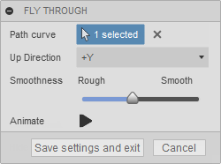

## Fusion Attributes

Attributes are something that are technically very simple, but they enable the ability to create very sophisticated scripts and add-ins. An attribute is simply the ability to associated named values with a Fusion entity. The named value is saved by Fusion and can be retrieved later, either from the entity it is on or by querying the design. This doesn't seem like much, but it provides that ability to do some interesting things.

There are two basic low-level capabilities this provides. The first is the ability to name an entity and find it later. The second is adding information to an entity. Here is a simple example that demonstrates both uses. It's an add-in that provides fly-through capabilities. When first executed, the user is prompted to select a curve that the camera will follow along. They can also specify a couple of other settings. When they click the "Animate" button, the view is animated with the camera following along the selected curve. Without attributes, the add-in requires the user to re-select the path curve and change the other settings every time they run the command. With attributes, the selected curve can be "named" so when the command is run again it first looks to see if there is a previously selected path and uses it as the default path. Attributes are also used to save the value of the settings so they will become the default settings the next time the command is run.



Let us look in a little more detail at exactly what an attribute is and how you create, query, edit, and delete them.

### Creating Attributes

All objects that support attributes have an "attributes" property that returns the Attributes collection associated with that entity. Initially this collection is empty, because by default entities do not have any attributes. To create a new attribute on that entity you use the add method of the Attributes object. Below is an example of adding an attribute where the user selects a face in the model and an attribute is added to the face and assigns the current area of the face as the value.

|  |
| --- |
| Copy Code |

```
# Have a face selected.
selectedFace = ui.selectEntity('Select a face', 'Faces').entity

# Add an attribute to the face.
selectedFace.attributes.add('ADSK-AttribSample', 'FaceArea', str(selectedFace.area))
```

There are three arguments needed when creating an attribute:

1. **groupName** - The first argument is the *group name*. This is a string that serves to group all of the attributes you'll create. The group name serves two purposes. First, it avoids duplicate name problems. All attributes on a specific entity must have a unique name. For example, the name of the attribute above is 'FaceArea'. If attribute groups did not exist, when another add-in tries to create an attribute called 'FaceArea' on the same face, it will fail because there already is one with that name. Groups eliminate this problem because attribute names are only required to be unique within a group on that entity. Each add-in should use a different group name to allow different add-ins to create attributes with the same name on an entity. The most common use if for you to use the same group name for all attributes that your add-in creates. To ensure uniqueness, it's recommended you use some combination of your company and add-in name as your group name, i.e. "ADSK-FlyThrough".

   The second purpose that an attribute group serves is it provides an easy way to query and find the attributes associated with your add-in, regardless of what entity they're associated with. Querying for attributes is discussed in more detail below, but you can query based on group name which allows you to quickly access all the attributes your add-in has created.
2. **name** - The second argument is the *name* of the attribute. This can be any string and is typically a name that makes sense to you and describes the data the attribute represents. It is a similar thought process as to how you name variables in a program.
3. **value** - The third argument is the value of the attribute. An important thing to notice in the example above is that the value is being converted to a string. Attribute values are always a string. There are various libraries available in the different programming languages that let you convert from binary data to text and back again so it's possible to store any kind of data in an attribute. By using JSON or XML formatting you can also store more complex data into a single attribute.

### Getting Existing Attributes

There are two ways to access existing attributes; from an entity and querying.

#### Attributes from an Entity

You can get any of the attributes that are associated with a specific entity. Getting attributes from an entity is demonstrated in the example below, where a face is selected and then the attribute that was added in the previous example is read and the value is displayed. If the selected face does not have the specified attribute, a message is displayed to notify the user.

|  |
| --- |
| Copy Code |

```
# Have a face selected.
selectedFace = ui.selectEntity('Select a face', 'Faces').entity

# Get the area attribute from the selected face.
areaAttrib = selectedFace.attributes.itemByName('ADSK-AttribSample', 'FaceArea')

# Check to see if an attribute was returned and display the value.
if areaAttrib:
    ui.messageBox('Original area: ' + areaAttrib.value + ' cm^2')
else:
    ui.messageBox('The selected face does not have the attribute.')
```

Besides the itemByName property, the Attributes collection also supports the *item* method that lets you iterate through all the attributes regardless of their group or name. The Attributes collection also supports the *itemsByGroup* method that returns an array of all of the attributes on the entity that belongs to a specific group. And finally, it supports the groupNames property that returns an array of the names of the groups that exist on that entity.

#### Querying for Attributes

The above technique of getting an attribute from an entity works well when you know which entity contains the attributes you are interested in. However, that is often not the case. Even with this simple example, the model could have hundreds or even thousands of faces and the attribute could have been applied to any number of them. You do not want to have to look to through every face in the design to see if any of them have a particular attribute. A much more efficient way is to use the findAttributes method of the Design object. This lets you query the entire design to quickly find any existing attributes. This is demonstrated in the example below.

|  |
| --- |
| Copy Code |

```
# Find all attributes with a certain name in the design.
attribs = des.findAttributes('attributeSample', 'FaceArea')

# Check the length of the returned array to see if any attributes were found.
if len(attribs) > 0:
    ui.messageBox(str(len(attribs)) + ' FaceArea attributes were found.')
else:
    ui.messageBox('No attributes were found.')
```

The findAttributes method has two arguments, just like the itemByName method discussed earlier. However, their use is more flexible with the findAttributes method. They can be used like above to specify the exact name of the group and attribute to find anything that exactly matches, but you can also just specify one or the other and use an empty string to get all. For example, if you call findAttributes using the code below, it will return all attributes that have the group name "attributeSample".

|  |
| --- |
| Copy Code |

```
attribs = des.findAttributes('attributeSample', '')
```

And the following will return all attributes named "FaceArea" regardless of their group name.

|  |
| --- |
| Copy Code |

```
attribs = des.findAttributes('', 'FaceArea')
```

In addition to exact matches, you can also use regular expressions to perform a search. To use a regular expression, you prefix the expression string with "re:". If you're unfamiliar with regular expressions they can be a bit intimidating at first, but you can think of them as somewhat equivalent to a wild card search, but it's different in how you define the search string. Regular expressions are more complicated than simple wild card searches but are also much more powerful. There are several good introductions to regular expressions on the web. Here is one site entirely devoted to regular expressions, <http://regexone.com>. When using a regular expression, the regular expression much match the full group or attribute name.

Here are a few examples of some common types of searches:

Below is a simple example of how a regular expression search is done. The assumption is that I have written several add-ins that create attributes and they all follow the recommended group naming described above. I have groups "ADSK-FlyThrough", "ADSK-MeshCut", "ADSK-AttribSample", "ADSK-SpurGear", etc. and now I want to find all of the attributes that any of my add-ins have created and delete all of them. The obvious similarity between all of the attributes is the company portion of the group name. The code below uses a regular expression to find all of my attributes and deletes them. It uses an empty string as the attribute name to match all names.

|  |
| --- |
| Copy Code |

```
# Find all attributes whose group name begins with "ADSK".
attribs = des.findAttributes('re:ADSK.*', '')

# Delete all of the found attributes.
for attrib in attribs:
    attrib.deleteMe()
```

#### Getting the Associated Entity

The findAttributes method returns an array of Attribute objects. Frequently what you really want is the entity that the attribute is attached to. This is where attributes serve as a mechanism of naming an entity so you can find it later. If you have an Attribute object, you can get the entity it is attached to by using its "parent" property.

Something that might seem a little odd at first is that it is possible to get an attribute whose parent entity no longer exists. In that case, calling the parent property will return null. One example of where you can get an unattached attribute is in the case of B-Rep entities (faces, edges, and vertices of a model). When an attribute is created on a B-Rep entity it is never automatically deleted because the lifetime of that entity is unknown. For example, if you add an attribute to an edge and then the edge is filleted, that edge is consumed and no longer exists in the model and the parent property of the attribute will return null. However, it's possible that the edge can come back in the future; the fillet can be deleted or suppressed and then the parent property of the attribute will return the edge. Because attributes can exist without an owner, it's important to always check the return value of the parent property to verify that you did get back an entity.

### Attribute Usage Examples

How you apply the use of attributes is almost as varied as there are programs that use them. To better understand their potential, let us look closer at the previous fly through example add-in.


This add-in uses attributes for two purposes, attaching an ID to an entity to find it later (naming), and saving custom data. The entity it wants to remember is the path curve that the user selected. It does this by adding using the code below to add an attribute to the selected curve. The group name is "ADSK-FlyThrough", the attribute name is "pathCurve", and the value is an empty string because it's not needed in this case. When the command is invoked, it used the findAttributes method to get the attribute, if it exists. If it exists it pre-populates the selection in the command dialog when the command is executed.

```
pathCurve.attributes.add('ADSK-FlyThrough', 'pathCurve', '')
```