## Fusion Solids and Surfaces

Solid models in Fusion are represented by a group of surfaces that form a tightly closed volume. This is commonly known as Boundary-Representation, or B-Rep modeling. A B-Rep model provides a complete geometric description of a solid or surface model. For a solid, the defining surfaces are tightly connected along all edges, forming a closed ('water tight') volume. With this volume, Fusion is able to compute things like mass properties and perform operations on the surfaces as though they were actual 'real world' solid objects. When a new feature is defined, Fusion creates the surfaces necessary to represent the feature, intersects them with the existing body, and then trims the affected surfaces back such that all of the seams are tight.

A B-Rep model is defined by two things; topology and geometry. The sections below describe the concepts of topology and geometry, as well as the API functionality that provides access to the topological and geometrical definition of a solid. Editing a Fusion model is done through features in a parametric model, or through direct modification in a direct edit (non-parametric) model.

### Topology Defined

The Topology of a model is defined by a hierarchical structure of objects. The full API object hierarchy for B-Rep topology is shown in the following illustration. The discussion that follows describes each of the objects in the hierarchy. You may have noticed in the chart that several of the objects can be obtained in different ways. For example, you can get BRepFaces from a BRepBody, BRepLump, or BrepShell object. You decide which object to get the faces from depending on which set of faces you want. Getting the faces from the body will return all of the faces in the body. Getting the faces from a shell will return only the faces that belong to that shell, which will be a subset of the faces in the body. It would be similar to getting a list of all of the people in an entire building, versus a list of the people within a single room in that building. The room list is a subset of the building list.

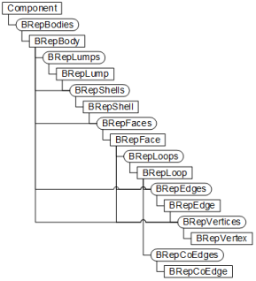

### BRepBody

The B-Rep model is accessed through the Component object. A component can contain zero to any number of bodies. The top-level object is the BRepBody object (or “Body”). The image below is an illustration of the API hierarchy to get to a body. BRepBody objects are accessed from the BRepBodies collection object. The BRepBodies collection object is obtained from the Component.

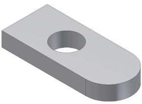 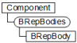

### BRepLump

A BRepLump (or “Lump”) object represents a single set of connected faces and any hollowed out volumes within that set of faces. In theory it is possible for a body to have multiple lumps however Fusion enforces that a body will always only contain a single lump. In the example below, a hole in a part has been enlarged enough to cut the part into two pieces. If multiple lumps were supported the result will be a single body, that has two lumps. However, Fusion will create a new body in this case so the result will be two bodies, each containing a single lump. If either of the pieces were to be hollowed out using a Shell feature with no open faces there is still a single body and lump and the new surfaces defining the internal void will also be part of the lump.

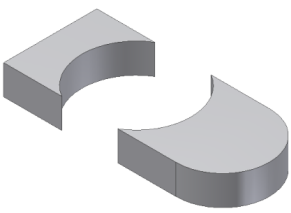

The BRepLump objects in a body are accessed through the BRepLumps collection, which is obtained from the parent BRepBody object.

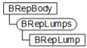

### BRepShell

A BRepShell (or “Shell”) object represents a single set of connected faces. For most bodies there is a single BRepLump that consists of a single BRepShell. However, it is possible for a body to have multiple shells. This is illustrated in the example below where a sphere has been hollowed out using a Shell feature. The result is a single body containing a single lump, that has two shells; the outer and inner set of faces. Creating a hole in this model would reduce it to a single shell because the face representing the hole would join the inner and outer faces resulting in a single set of connected faces.

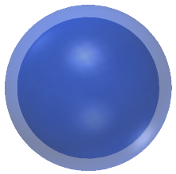

To determine whether a shell represents the outside of a part or a void within a part, use the isVoid property on the BRepShell object.

BRepShell objects in a body are accessed through the BRepShells collection, which can be obtained from the parent BRepBody, or from the BRepLump object. The collection from the BRepBody contains all of the shells that exist within the body and collection from a BRepLump, contains only the shells within that Lump.

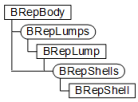

### BRepFace

A BRepFace object represents a specific surface within a body. The illustration below shows an exploded version of a body where the individual faces that make up the model can be seen more clearly. Faces are accessed through the BRepFaces collection, which can be obtained from a BRepBody, BRepLump, or BRepShell object.

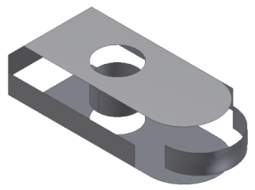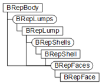

### BRepLoop

A BRepLoop (or “Loop”) object defines a boundary of a specific face. All faces have one outer loop and can have zero or more inner loops. In the illustration below, the two loops of the face are highlighted in red. There is one outer loop consisting of four edges, and one inner loop that consists of a single circular edge. Loops are accessed through the BRepLoops collection which is obtained from teh parent BRepFace object.

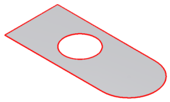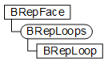

### BRepEdge

A BRepEdge object represents an individual curve within an edge loop. An important purpose of an Edge is that it defines the connection between two faces. The illustration below shows a single edge highlighted in red. This single edge is shared by two adjacent faces.

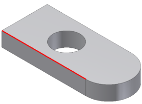

There are several ways to access edges through the API. You can query a BRepFace for all of its edges, either all at once or loop by loop by using the BRepLoops property of the BRepFace object. You can also query for all edges within a BRepBody, BRepLump, or BRepShell. From an edge, it is possible to get the two faces that it connects. An edge along the open boundary of a surface is connected to only a single face.

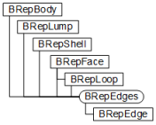

### BRepVertex

BRepVertex objects represent the end points of an edge. The image below shows a single vertex highlighted in red. This vertex is shared by three edges. Vertices can be accessed from the BRepVertices collection available on the BRepBody, BRepLump, BRepShell and BRepFace objects. The vertices at the start and end of an edge can be accessed using the StartVertex and EndVertex properties of the BRepEdge object. The vertex itself provides access to the edges and faces that it connects.

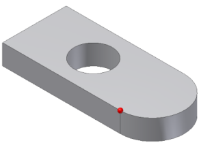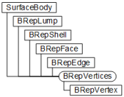

### BRepCoEdge

A BRepCoEdge object is similar to a BRepEdge object in that they both define the boundaries of a face. There are two differences between a BRepEdge and a BRepCoEdge object: The first being that BRepCoEdge objects are unique for a particular face, whereas edges are shared between faces. BRepCoEdge objects are in an ordered head-to-tail orientation around the boundary of the face. BRepCoEdge objects flow in a counter-clockwise direction around the outer boundary, and they flow in a clockwise direction (the material is always to the left) around the inner boundary, as shown in the illustration below. This is not possible with BRepEdge objects because there can be conflicts in direction since edges are shared.

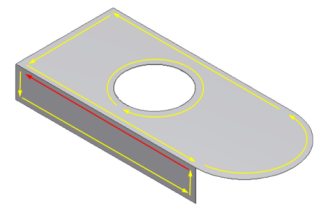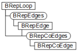

The second difference between BRepCoEdge objects and BRepEdge objects is that the BRepCoEdge object is not a 3D object (all other B-Rep objects are 3D objects). A BRepCoEdge object is defined in the 2D parametric space of its parent face. The concept of parametric space is discussed in more detail below in the section on evaluators.

## Accessing Topology Objects

There are other methods to access B-Rep objects, besides traversing the object hierarchy, that are more convenient to use in some cases. These methods are as follows.

### From Features

The Faces property of the Feature object can be used to get the faces that were created by that feature. Some features also provide categorized access to the faces they create. For example, the extrude feature provides the EndFaces, StartFaces, and SideFaces properties that return the end caps and the sides of an extrusion.

### By Selection

In cases where it is not possible to determine the entities needed automatically, the user can be prompted to select them. User selections from solid models return BRepBody, BRepFace, BRepEdge, or BRepVertex objects.

### By Association

A specific B-Rep entity can also be accessed through its association with some other object. For example, in an assembly you can obtain the two entities that a joint is defining a relationship between.

### By Geometry

Aquiring B-Rep geometry that meets certain criteria is also possible through the use of 'evaluator objects'. For example, one could query for all planar faces, parallel to the X-Y plane and are facing “up”. This can be done using the B-Rep hierarchy, explained above, to access all of the faces, and then the geometry evaluators, explained below, to search for the faces that meet the criteria.

## Evaluating Topology Objects

Topology defines only the structure of a model; it is the geometry that defines its shape. Topology can describe a model as having 6 faces and 12 edges, but this description is insufficient to convey the actual shape of such a model. The simple block shown below is only one of an infinite number of shapes a model with 6 faces and 12 edges could have.

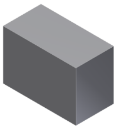

Shown below are three more models that are also made up of 6 faces and 12 edges.

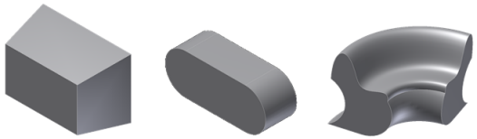

A face represents a surface, but does not imply or convey anything about the shape of that surface. The same is true of an edge; it represents a curve, but does not imply or convey anything about the shape of the curve. Faces and edges define how the various geometries are connected but to understand the shape of the model the associated geometry is required.

There are some general queries that can be performed on B-Rep objects that provide generic shape related information. These queries are performed using the API evaluator objects, as shown below.

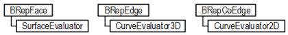

Evaluators perform many of their 'evaluations' relative to the parametric space of the surface or curve. Coordinates define a location in model space by specifying x, y, and z values within three dimensional design space. In Parameter space, coordinates define a location by specifying u and v values within the parametric space of a specific surface. Every surface has its own unique 2-dimensional parameter space. The image below shows a planar face with a grid drawn on it that represents its parametric space. Any location on the surface can be precisely specified using two values. For parametric space, instead of x and y, the letters u and v are used to designate the values of the coordinate. The range or size of the parametric space can vary depending on the geometry of the surface and how the face has been trimmed by its boundaries. An untrimmed NURBS surfaces has minimum values of (0, 0) and the maximum is (1, 1) as indicated in the image below. However, a cylinder goes from -π to π in the direction around the cylinder and is infinite along the axis of the cylinder. A plane is unbounded and is infinite in both directions, although when a surface is associated with a face, the boundaries of the face are used to limit the surface. You also can't assume that the parameterization is uniform across the surface. This means that for a NURBS surfaces (0.5,0.5) is not necessarily at the geometric center of the surface.

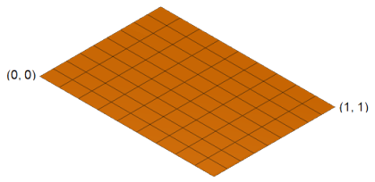

The image below shows some examples of other surface shapes with their parameter space grid. The left-most surface looks as though it could be a variation of the planar surface; imagine the planar above above is made of rubber and is stretched and flexed into the shape below. Any point on the surface can still be specified by a u-v coordinate. The surface in the middle could be formed by rolling the planar face into a cylinder, where two values can still define any point on the surface. To create the surface on the right, two of the edges of the planar face have been reduced to zero length but a u-v value still defines any point on this surface as well.

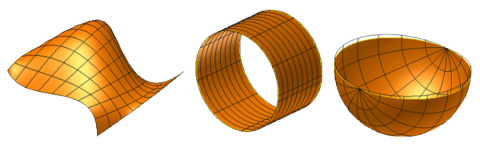

As stated earlier, the BRepCoEdge object is a 2D object. It defines the boundary of a face in the parametric space of the surface associated with the face. A BRepEdge can return up to two BRepCoEdge objects; one for each face connected to the edge. The geometry associated with a BRepCoEdge object is two dimensional and the coordinates for the geometry are in the parametric space of the surface.

Curves also have a parametric space, which a one dimensional. This means that any point on a curve can be identified with a single parameter value. The start and end parameter values are the extents of the curve, and any value in between represents a specific point along the edge, as shown in the illustration below.

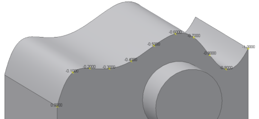

The following are some of the most commonly used evaluator functions:

#### SurfaceEvaluator

**getNormalAtParameter** – Calculates the normal vector of the face at a specified parameter point. The normal always points out of the solid.

**getNormalAtPoint** – Calculates the normal vector of the face at a specified model space point. The normal always points out of the solid.

**getParameterAtPoint**  – Given a 3D model point this returns the equivalent 2D parametric point.

**getPointAtParameter**  – Given a 2D parametric point, this returns the equivalent 3D point.

**isParamOnFace**  – Given a 2D parametric point, this indicates if the point lies on the face or not. This takes into account the boundaries of the face and is useful for determining if a given point lies on the visible portion of a face or in a void.

**parametricRange**  – Returns the maximum and minimum parameter space coordinates of the face.

#### CurveEvaluator3D and CurveEvaluator2D

**getEndPoints** – Gets the start and end points of the edge.

**getLengthAtParameter** – Returns the actual length of the edge between two input parameters.

**getParameterAtLength** – Returns the parameter value at a specified distance along the curve from a specified parameter point.

**getParameterAtPoint** – Given a 3D model point, this returns the equivalent parametric value along the edge.

**getPointAtParameter** – Given a parametric value, this returns the equivalent 3D point.

**getParameterExtents** – Returns the minimum and maximum parameter values of the edge.

The SurfaceEvaluator object provides useful functions for getting the normals from a surface; such as the getNormalAtPoint and getNormalAtParameter functions. A *normal* is a vector that is perpendicular to a face at a specific point. The normals on a given planar face are all identical, regardless of their location on that face. The normals on a spherical face are different at every location on that face. The direction of the normal for a solid is always outward (i.e. points away from the volume of the solid). The illustration below shows a series of normals displayed on a spline face. The normals are all perpendicular to the face and point in an outward direction from the solid.

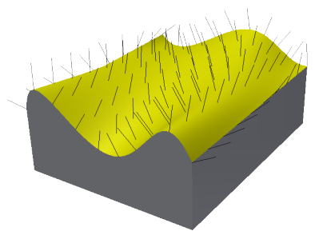

The Python sample code below demonstrates how to find the parametric center of a face and then return the surface normal at that location. For tasks that involve getting multiple normals, there is also a getNormalsAtParameters function that takes in an array of Point2D objects and returns and array of Vector3D objects.

```
def run(context):
    ui = None
    try:
        app = adsk.core.Application.get()
        ui  = app.userInterface

        # Have a face selected.
        fc = ui.selectEntity('Select a face', 'Faces').entity

		# Get the normal.
        (normal, position) = getNormalAtParametricCenter(fc)

        # Draw the normal using a sketch line.
        des = adsk.fusion.Design.cast(app.activeProduct)
        sk = des.rootComponent.sketches.add(des.rootComponent.xYConstructionPlane)
        normPoint = position.copy()
        normPoint.translateBy(normal)
        sk.sketchCurves.sketchLines.addByTwoPoints(position, normPoint)
    except:
        if ui:
            ui.messageBox('Failed:\n{}'.format(traceback.format_exc()))

def getNormalAtParametricCenter(face):
    try:
        # Get the evaluator from the input face.
        surfEval = adsk.core.SurfaceEvaluator.cast(face.evaluator)

        # Get the min and max parameter values for the surface.
        range = surfEval.parametricRange()

        # Compute the center point of the parametric range.
        midUParam = (range.minPoint.x + range.maxPoint.x)/2
        midVParam = (range.minPoint.y + range.maxPoint.y)/2
        paramPoint = adsk.core.Point2D.create(midUParam, midVParam)

        # Get the normal at the location defined by the parameter space point.
        (retVal, normal) = surfEval.getNormalAtParameter(paramPoint)

        (retVal, positionPoint) = surfEval.getPointAtParameter(paramPoint)

        # Return the normal and the point where the normal was calculated.
        return (normal, positionPoint)
    except:
        return (None, None)
```

## Geometry

As previously stated, topology does not describe the shape of a model, but rather, defines its structure and how the various elements of the model are connected. It is geometry that describes the shape of a model. The geometry for each face and edge can be accessed by using the geometry property of the BRepFace, BrepEdge, or BRepCoEdge object. This property returns one of several different object types, depending on the actual shape of the face, edge, or co-edge object. The illustration below shows the objects returned for each B-Rep type.

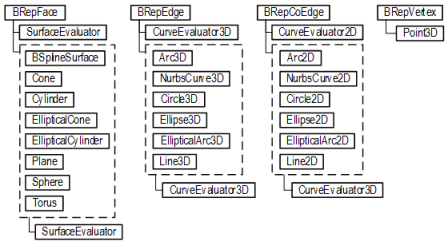

The illustration above also reveals that evaluators are not only available on B-Rep objects, but on the various geometry object types as well. In general, it is best to use the evaluators on the B-Rep objects, rather than the geometry objects because the BRep object evaluators take into account the rest of the body. For example, getting a normal using the evaluator from a geometry object cannot guarantee that the normal direction will point out of the solid. This is because the geometry evaluator knows nothing about the structure of the solid.

Each of the Geometry objects provide properties that describe the shape of the geometry. For example, the Cylinder object provides the axisVector, basePoint, and radius properties; all necessary to define a cylinder. The Plane object provides the rootPoint and normal properties; both of which fully define a plane. In both of these examples the geometry is not bounded. The cylinder is infinite in both directions along its length, and the plane is infinite in all directions. The boundaries of a face are defined by its B-Rep loops.

Geometry objects can be thought of as a “tear off” from their parent B-Rep object. This means that there is no relationship back to the B-Rep object that the geometry object was obtained from. For example, a Cylinder object obtained from a Face describes the current shape of the face, but subsequent changes made to the model that affect the face will not be reflected in the previously obtained cylinder object. The Cylinder and the Face object are completely independent. The updated version of the Cylinder object can be obtained by calling the geometry property again after any changes are made to the face. Modifications made in turn to the Cylinder object (such as its radius), will likewise, not be reflected in the Face object.

## Alternate Representations

Model information can also be retrieved in forms other than the B-Rep model. For example, Fusion currently supports returning a 'triangular mesh representation' of a model, as shown in the image below. Fusion maintains a triangular mesh that it uses for the graphical display of the model. This existing display mesh can be retrieved, or a new one can be created at any degree of accuracy desired. This capability is exposed through the MeshManager object which is obtained the BRepBody and BRepFace objects.

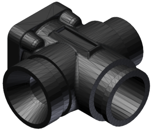

The CurveEvaluator3D and CurveEvaluator2D objects both provide a getStrokes method, which is used for getting the points along a curve that define an approximation of that curve within a specified tolerance.