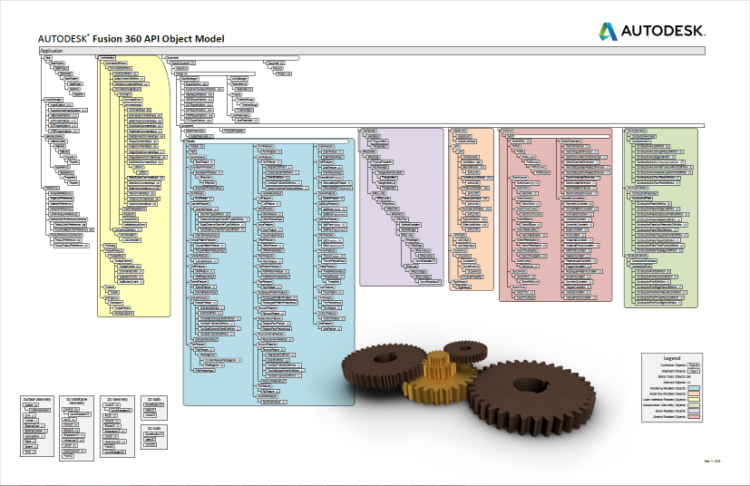
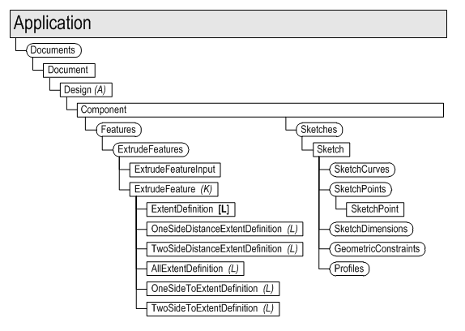
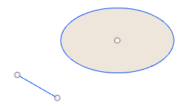
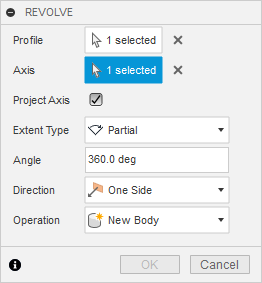
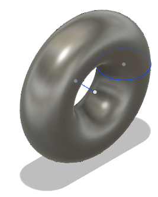

## Basic API Concepts

There are some basic concepts that are used throughout the Fusion API and understanding these concepts will make the API much easier to understand and use.

### Objects

The Fusion API is an object oriented API exposed through a set of objects. Many of these objects have a one-to-one correspondence with the things you are already familiar with as a Fusion user. For example, an extrusion in a Fusion model is represented in the API by the ExtrudeFeature object. Through functionality provided by the ExtrudeFeature object you can do the same things you can do through the user-interface. For example, you can create a new extrusion, get and set its name in the timeline, suppress it, delete it, or even access and edit the associated sketch.

In addition to the API objects that represent things in the Fusion UI that you're already familiar with, there are also "API only" objects that provide functionality that is unique to working with the API. For example, using the API, it is possible to query a model and extract all of its geometry. Another example of an API only capability is the ability to create new commands and add them to the Fusion user interface.

### Object Model

One of the basic differences between using the Fusion user interface and the API is how specific objects are accessed. With the user interface, you select (click on) things graphically in the browser,the timeline, and in the graphics window. New objects are created using dedicated commands such as 'Extrude' to create an extrusion or 'Box' to create a new box. With the API, objects are accessed through what is called an "Object Model". The Fusion object model is a hierarchical structure of objects that is represented in the chart shown below. This chart is a useful tool when working with the API. You can download a printable pdf version of the chart [here](Fusion_API_Object_Model.md).



Shown below, is the portion of the object model used when creating extrusions. The Application object, at the top level, represents all of Fusion. The Application object provides access to application wide properties as well as to its direct children (Documents being the most important). Documents can contain different types of data such as modeling or CAM data. The Design object represents all of the modeling data within the document. The Design object includes a single, top-level component known as the *root component*. All of the sketches, features, construction geometry, components, etc. contained within the Design are accessed from the *root component*.

All of the objects are organized in this parent-child structure in the object model. In most cases it should be fairly logical what the structure to get to a particular object is. For example, if you want to access a specific sketch line, think about what would own a sketch line. All of the various types of sketch entities are owned by a sketch and a sketch is owned by a component. In many cases the same structure is represented in the browser.



### Common Object Functionality

All objects in Fusion support the following functions:

* objectType – Returns a string indicating the type of object.
* classType - A static function that returns the name associated with a particular class. This can be used in combination with the objectType property to check to see if an object reference is a particular type.
* IsValid – Returns a Boolean indicating if the object reference is still valid (i.e. has not been deleted or invalidated by some other action).

### Static Functions

Not all functions need to called by first getting a reference to an object through the object model. There are many objects that are "transient", meaning they're temporary and don't have an owner. They're typically used by the API to pass certain types of data. These are "static" functions and can be called directly on a class without having to get a reference to an object. For example, to create an ObjectCollection object, which is used to pass a group of objects into a function, you can use the code below.

#### Python

```
# Create a new ObjectCollection.
objColl = adsk.core.ObjectCollection.create()
```

#### C++

```
// Create a new ObjectCollection.
Ptr<ObjectCollection> objColl = adsk::core::ObjectCollection::create();
```

### Collections

Collections provide access to a set of common objects. For example, the ExtrudeFeatures collection object provides access to all of the extrude features within a component. All collections support the count property and the item method. The count property returns the number of items in the collection and the item method returns a specific object in the collection.

All collections support an item method that takes an index as input and returns the object at that index. The first item in the collection has an index of 0. The last item has an index equal to the count-1. Many collections also support other types of item methods, the most common being itemByName. When an item in a collection has a unique name or ID, itemByName or itemById can be used to get the item from the collection by specifying its name or ID.

Collections also provide support for the creation of new objects by means of various add methods. For example, the SketchArcs object provides access to all of the existing arcs within a sketch along with multiple add methods (addByCenterStartSweep, addByThreePoints, and addFillet) for creating new arcs in a sketch.

Below is an example of starting with a Sketch object, getting the SketchCircles and SketchLines collections, and creating a new circle and line.



#### Python

```
# Get the SketchCircles collection from an existing sketch.
circles = sketch.sketchCurves.sketchCircles

# Call an add method on the collection to create a new circle.
circle1 = circles.addByCenterRadius(adsk.core.Point3D.create(0,0,0), 2)

# Get the SketchLines collection from an existing sketch.
lines = sketch.sketchCurves.sketchLines

# Call an add method on the collection to create a new line.
axis = lines.addByTwoPoints(adsk.core.Point3D.create(-1,-4,0), adsk.core.Point3D.create(1,-4,0))
```

#### C++

```
// Get the SketchCircles collection from an existing sketch.
Ptr<SketchCircles> circles = sketch->sketchCurves()->sketchCircles();

// Call an add method on the collection to create a new circle.
Ptr<SketchCircle> circle1 = circles->addByCenterRadius(adsk::core::Point3D::create(0.0, 0.0, 0.0), 2.0);

// Get the SketchLines collection from an existing sketch.
Ptr<SketchLines> lines = sketch->sketchCurves()->sketchLines();

// Call an add method on the collection to create a new line.
Ptr<SketchLine> axis = lines->addByTwoPoints(adsk::core::Point3D::create(-1,-4,0), adsk::core::Point3D::create(1,-4,0));
```

### Lists

A List is a special type of collection that is also used to return a set of similarly typed objects. Lists also support the count property and item method but do not provide any add methods. One example of where a list is used is when creating rectangles in a sketch. Creating a rectangle using one of the add methods from the Sketchlines object results in the creation of four new lines. The add method returns a SketchLineList object that contains the four new lines.

### Input Objects

Input objects are used to define all of the input required to create more complex objects. An input object can be thought of as the API equivalent of a command dialog. To illustrate this, consider the Revolve command and its associated dialog. To create an revolve feature with the user interface, the Revolve command is executed which pops a dialog where you specify the various required input values and options, and then click “OK” to create the feature.

The creation of a revolve feature requires multiple inputs and options, as shown in the dialog below. Choosing different options sometimes enables and/or disables other fields in the dialog. The dialog collects the input required to create an revolve feature. In the API, the input object for a revolve feature does the same thing as the dialog. It has methods and properties for specifying all of the various inputs and options that define a revolve feature.

Once the required settings have been defined using the input object, the Add method is called, passing in the input object. The Add method is the equivalent of clicking the “OK” button in the dialog.



The code below demonstrates the workflow for creating an revolve where the sketch created above is being used.



#### Python

```
# Get the first profile from the sketch, which will be the profile defined by the circle in this case.
prof = sketch.profiles.item(0)

# Get the RevolveFeatures collection.
revolves = rootComp.features.revolveFeatures

# Create a revolve input object that defines the input for a revolve feature.
# When creating the input object, required settings are provided as arguments.
revInput = revolves.createInput(prof, axis, adsk.fusion.FeatureOperations.NewBodyFeatureOperation)

# Define a full revolve by specifying 2 pi as the revolve angle.
angle = adsk.core.ValueInput.createByReal(math.pi * 2)
revInput.setAngleExtent(False, angle)

# Create the revolve by calling the add method on the RevolveFeatures collection and passing it the RevolveInput object.
rev = revolves.add(revInput)
```


### ValueInput Objects

Notice, in the code above, that the distance of the extrusion is defined by providing a ValueInput object. The ValueInput object is used to define any values that will result in the creation of a parameter. A ValueInput object can be defined using a real or a string value. Real values are always interpreted as Fusion’s database units; lengths are always centimeters and angles are always radians. By default, strings are interpreted using the current document units. For example, specifying “5” for a length is interpreted as 5 inches in a document where the default units for length set to inches. Strings can also specify units directly. For example, the string “15 mm” is interpreted as 15 millimeters, regardless of the default document units. A string can also be an equation that can include existing parameters together with numbers such as “d0 / 2”. Any valid equation that could otherwise be entered as a value in a Fusion dialog can be used in a ValueInput object. ValueInput objects are created statically using the createByString and createByReal methods on the adsk.core.ValueInput class.

### Definition Objects

Definition objects are similar to input objects but instead of being used to create new features, definition objects are used to edit existing features. Another notable difference between an input object and a definition object is that the properties (of the input object) that took a ValueInput object during creation, are now read-only and return a Parameter object.