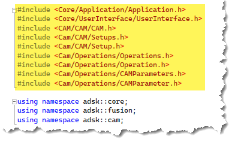

[Introduction to the CAM API](#IntroCAMAPI)
[Introduction to the CAM API](#AccessingCAMAPI)
[CAM Object Model Basics](#CAMObjectModelBasics)
[Understanding Setups](#UnderstandingSetups)
[Understanding Operations](#UnderstandingOperations)

## Introduction to the CAM API

The Fusion CAM API has been designed and developed to provide a high level of automation within the manufacture space. The CAM API functionality is provided through CAM-specific libraries. If you’ve used the API to automate the Design portion of Fusion, you’ve used the asdk.core and asdk.fusion libraries. The CAM functionality is defined in the adsk.cam library and is referenced into your program using the techniques shown below.

### Python

Import adsk.cam into your script or add-in. If you use the “Create” command in the “Scripts and Addins” dialog to create a new Python script or add-in, you’ll see the line below where adsk.cam is already imported.

```
import adsk.core, adsk.fusion, adsk.cam, traceback
```

### C++

If you use the “Create” command from the Scripts and Addins Manager in Fusion to create a new C++ script or add-in, the resulting cpp file contains the #include and using statements referencing the cam namespace and header file.


Using CAMAll.h references all the header files in the CAM library and makes programming easier because everything is available to Intellisense; however, it’s not as efficient as specifying only the header files you need. For example, a program that accesses an operation and makes some edits to its parameters would include only the headers shown below.



## Accessing the CAM Product within a Fusion Document

A Fusion document acts as a container of different types of data. The top-level containers are referred to as products. There are different types of products depending on the type of data they contain. For example, a Design product contains all the design-related data. All documents always contain a Design product and may include other types of products depending on what has been created in the document. For example, when you enter the CAM workspace in the user interface, a CAM product is added to the document, and all CAM-related data is contained within it. When you need to access data using the API, you first need to access the product that contains that data.

The example below demonstrates getting the CAM product, if it exists, from the active document.

```
# Get the application.
app = adsk.core.Application.get()

# Get the active document.
doc = app.activeDocument

# From the Products collection on the active document, get the CAM Product.
cam: adsk.cam.CAM = doc.products.itemByProductType('CAMProductType')

# Check if anything was returned.
if cam == None:
     ui.messageBox('There is no CAM data in the active document')
     return
```