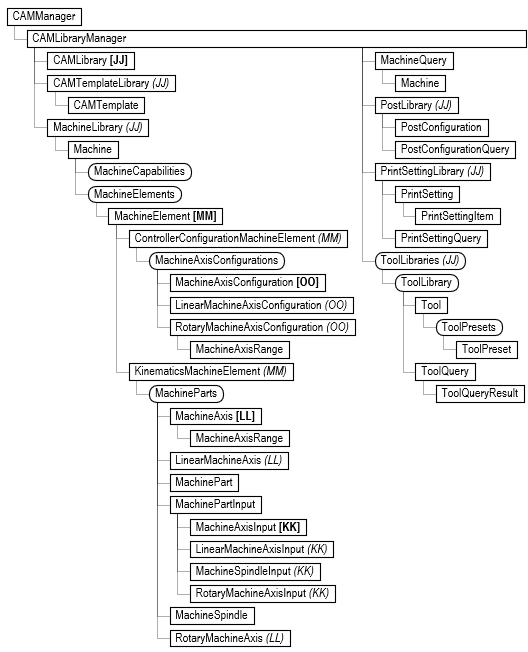
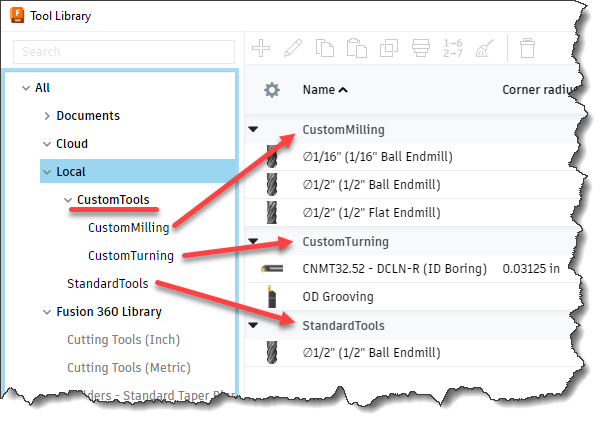

## Introduction to CAM Libraries

Manufacturing and the CAM API use libraries of various type extensively. The include tool, machine, template, post, and print setting libraries. They all share the same basic concepts. There's a big difference between the API objects in a library and other API objects. Most API objects represent a reference to something that exists in Fusion. For example, an Operation object is a live reference to an existing operation in a document and modifying that API object changes the operation. Items in a library don't have a distinct identity and as a result the API object isn't a reference but is instead a temporary copy of the data that defines that library object.

For example, a tool library can be a text file, and there can be any number of tools defined within the library. For the API Tool object there's nothing distinct to reference. A single tool is a section of data within the text file. When you use the API to get a specific tool, the API Tool object holds a copy of all the data that defines the tool. All operations require the tool they use to exist in the document tool library. When a tool is assigned to an operation, that tool is copied to the document by creating a new tool and populating it with the tool data. Fusion is smart about this because if you assign the same tool to another operation, Fusion checks to see if an existing tool has the same values and instead of creating a new one, will use the existing tool from the document library.

Another big difference between the library objects and the other CAM objects is they exist outside of Fusion documents. The CAM object is associated with a specific document and provides access to the CAM data that exists in that document. To provide access to library information outside the context of a document, the CAM API provides the CAMManager object which can be accessed directly at any time by using the static `adsk.cam.CAMManager.get()` method. The object model for the CAMManager object and the objects it provides access to are shown in the picture below.



## Finding Items in a Library

There are several locations where Fusion looks for libraries; Fusion Library, Vendor Libraries, Personal Libraries (both local and in the cloud), and the document library that exists within each document. Folders, and libraries are specified using a URL object. The URL is essentially a path to a folder or file that can exist locally or on the cloud. Let's look at a simple example to see what's available and what it does. Below shows the local location for tool libraries. It contains one library called "StandardTools" and a folder called "CustomTools" which contains two libraries; "CustomMilling" and "CustomTurning".



Below is some example code that accesses the library using the knowledge about where it's located and then gets a specific tool from the library.

```
# Get a reference to the CAMManager object.
camMgr = adsk.cam.CAMManager.get()

# Get the ToolLibraries object.
toolLibs = camMgr.libraryManager.toolLibraries

# Get the URL for the local libraries.
localLibLocationURL = toolLibs.urlByLocation(adsk.cam.LibraryLocations.LocalLibraryLocation)

# Get the URL of the folder, which will be for the "CustomTools" folder.
f360FolderURLs = toolLibs.childFolderURLs(localLibLocationURL)
customToolsFolderURL = f360FolderURLs[0]

# Get the "CustomMilling" library.
f360LibraryURLs = toolLibs.childAssetURLs(customToolsFolderURL)
toolLib = None
for libURL in f360LibraryURLs:
    if 'CustomMilling' in libURL.leafName:
        toolLib = toolLibs.toolLibraryAtURL(libURL)

# Find a specific tool.
for tool in toolLib:
    if tool.parameters.itemByName('tool_description').value.value == '1/16" Ball Endmill':
        return tool
```

Another way to find an item in a library is to use the query object supported by each of the different type of library. For example, for tools there is a ToolQuery object. You can query at different levels to have a larger or smaller scope of the query. For example, you can create a query object from the ToolLibraries object, which will search all tool libraries. You can also query within a specific tool library. The code below gets the same tool as before by querying the local library.

```
# Get a reference to the CAMManager object.
camMgr = adsk.cam.CAMManager.get()

# Get the ToolLibraries object.
toolLibs = camMgr.libraryManager.toolLibraries

# Create a query object to query the local library.
query = toolLibs.createQuery(adsk.cam.LibraryLocations.LocalLibraryLocation)

# Add a query criteria to search for a specific description.
query.criteria.add('tool_description', adsk.core.ValueInput.createByString('1/16" Ball Endmill'))

# Do the query.
queryResults = query.query()

# Get the tool from the results. There can be multiple tools returned. This used the first one.
tool = None
if len(queryResults) > 0:
    tool = queryResults[0].tool

return tool
```