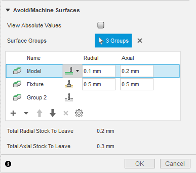

## Machine/Avoid Functionality

Currently, there are two types of groups in the table that the CAM API supports: direct selection groups, which is equivalent to what the user would do from the UI, as shown below, and default selection groups which are created automatically by the API to match the parameter driven groups in the operation. These default selection groups can be accessed from the API in order to change their properties, but their geometry cannot be directly modified.



The machining mode that is currently set will determine which value the radial and axial offset functions refer to. When set to Machine, the radial and axial offset functions will read/set the stock to leave parameter for the current group. When set to Avoid, the radial and axial offset methods will read/set the clearance value, and the Fixture mode will map to the fixture clearance value. This is supported in the API through the [MachineAvoidDefaultSelection](MachineAvoidDefaultSelection.htm), [MachineAvoidDirectSelection](MachineAvoidDirectSelection.htm), and [MachineAvoidGroups](MachineAvoidGroups.htm) objects.

The sync function is used to synchronize the selections and properties of the default groups from the current operation. This is needed when there are changes made to parameters that drive the default groups (e.g. Setup model or fixture selection changes to be reflected in the MachineAvoidGroups object on the API side). This function must not be called before applyMachineAvoidGroups, because temporary group settings and selections will not have been stored in the operation object and will be overwritten.

Below, is a script that demonstrates the new way of setting up the machine/avoid groups and their properties. The script assumes that the user has a document opened that has at least two different bodies.

```
import random
import adsk.core, adsk.fusion, adsk.cam, traceback

tool_json = '{ "BMC": "hss", "GRADE": "Mill Generic", "description": "10mm END MILL_ALLY", "geometry": { "CSP": false, "DC": 10,
"HAND": true, "LB": 50, "LCF": 35, "NOF": 3, "OAL": 53, "SFDM": 10, "shoulder-length": 35 }, "guid": "d26c8a29-7782-4a5a-9c6d-3f21d9a66e9e",
"holder": { "description": "Maritool CAT40-ER32-2.35", "guid": "", "product-id": "CAT40-ER32-2.35", "product-link": "",
"segments": [ { "height": 3.7592, "lower-diameter": 38.1, "upper-diameter": 50.038 }, { "height": 21.2344, "lower-diameter": 50.038,
"upper-diameter": 50.038 }, { "height": 4.470400000000001, "lower-diameter": 39.878, "upper-diameter": 39.878 }, { "height": 2.286,
"lower-diameter": 39.878, "upper-diameter": 44.45 }, { "height": 10.795000000000003, "lower-diameter": 44.45, "upper-diameter": 44.45 },
{ "height": 1.27, "lower-diameter": 44.45, "upper-diameter": 46.99 }, { "height": 0.762, "lower-diameter": 62.0268, "upper-diameter": 63.5508 },
{ "height": 3.683, "lower-diameter": 63.5508, "upper-diameter": 63.5508 }, { "height": 2.0066, "lower-diameter": 63.5508, "upper-diameter": 56.261 },
{ "height": 2.9972, "lower-diameter": 56.261, "upper-diameter": 56.261 }, { "height": 2.0066, "lower-diameter": 56.261, "upper-diameter": 63.5508 },
{ "height": 3.6322, "lower-diameter": 63.5508, "upper-diameter": 63.5508 }, { "height": 0.762, "lower-diameter": 63.5508, "upper-diameter": 62.0268 },
 { "height": 3.175, "lower-diameter": 44.45, "upper-diameter": 44.45 } ], "type": "holder", "unit": "millimeters", "vendor": "Maritool" },
 "post-process": { "break-control": false, "comment": "", "diameter-offset": 2, "length-offset": 2, "live": true, "manual-tool-change": false,
 "number": 2, "turret": 0 }, "product-id": "", "product-link": "", "start-values": { "presets": [ { "description": "", "f_n": 0.016666666666667,
 "f_z": 0.1, "guid": "10f47137-ad2c-4aa2-9da0-2781c27e84ab", "n": 12000, "n_ramp": 12000, "name": "Preset 1", "tool-coolant": "flood",
 "use-stepdown": false, "use-stepover": false, "v_c": 376.9911184307752, "v_f": 3600, "v_f_leadIn": 1000, "v_f_leadOut": 1000,
 "v_f_plunge": 200, "v_f_ramp": 300 }, { "description": "", "f_n": 0.022222222222222, "f_z": 0.088888888888889, "guid": "add69606-20d4-4144-976c-878e648fd80a",
 "n": 9000, "n_ramp": 9000, "name": "SecondPreset", "tool-coolant": "flood", "use-stepdown": false, "use-stepover": false, "v_c": 282.7433388230814,
 "v_f": 2400, "v_f_leadIn": 1000, "v_f_leadOut": 1000, "v_f_plunge": 200, "v_f_ramp": 300 } ] }, "type": "flat end mill", "unit": "millimeters", "vendor": "" }'

def run(context):
    ui = None
    try:
        app = adsk.core.Application.get()

        doc = app.activeDocument

        ui  = app.userInterface

        # Make
        camWS = app.userInterface.workspaces.itemById('CAMEnvironment')
        camWS.activate()
        cam = adsk.cam.CAM.cast(doc.products.itemByProductType("CAMProductType"))

        models = [cam.manufacturingModels.item(0).occurrence.childOccurrences.item(0).childOccurrences.item(0)]

        if cam == None:
            ui.messageBox('There is no CAM data in the active document')

        setups = cam.setups

        # Create setup and set parameters.
        setupInput = setups.createInput(adsk.cam.OperationTypes.MillingOperation)

        # Set the first body in the model to be the setup model.
        setupInput.models = models

        setup = setups.add(setupInput)

        # create new face operation in the newly created setup.
        operationInput = setup.operations.createInput('parallel')
        tool = adsk.cam.Tool.createFromJson(tool_json)
        operationInput.tool = tool
        operationInput.toolPreset = tool.presets.item(1)
        parallelMilling = setup.operations.add(operationInput)

        # Get all the faces in the model and randomly select 4
        body = models[0]

        # Get the "checkSurfaceSelectionSets" parameter from the operation, which
        # is a CadFaceGroups cad object.
        surfaceGroupsParam: adsk.cam.CadMachineAvoidGroupsParameterValue = parallelMilling.parameters.itemByName('checkSurfaceSelectionSets').value

        # Get the MachineAvoidGroups object from the CadFaceGroups cad object. This
        # object manages the list of mutually exclusive groups.
        machineAvoidGroups = surfaceGroupsParam.getMachineAvoidGroups()

        # -----------------------------------------------------------
        # Create a new user group - Machine.
        machineAvoidGroup: adsk.cam.MachineAvoidDirectSelection = machineAvoidGroups.createNewMachineAvoidDirectSelectionGroup()

        # Set properties on the newly created exclusiveGroup
        machineAvoidGroup.machineMode = adsk.cam.MachiningMode.Machine_MachiningMode
        machineAvoidGroup.radialOffset = 0.1
        machineAvoidGroup.axialOffset = 0.2

        # Add the face/body/component to the exclusiveGroup selection.
        machineAvoidGroup.inputGeometry = [cam.manufacturingModels.item(0).occurrence.childOccurrences.item(0).childOccurrences.item(0).bRepBodies.item(0).faces.item(0)]

        # Change properties of the model group.
        modelGroup = machineAvoidGroups.defaultGroup(adsk.cam.DefaultGroupType.Model_GroupType)
        modelGroup.machineMode = adsk.cam.MachiningMode.Machine_MachiningMode

        # These set the radial and axial stock to leave.
        modelGroup.radialOffset = 0.7
        modelGroup.axialOffset = 0.7
        modelGroup.machineMode = adsk.cam.MachiningMode.Avoid_MachiningMode

        # These set the radial and axial clearances.
        modelGroup.radialOffset = 0.2
        modelGroup.axialOffset = 0.3
        surfaceGroupsParam.applyMachineAvoidGroups(machineAvoidGroups)

        # Gen the op.
        cam.generateToolpath(parallelMilling)

    except:
        if ui:
            ui.messageBox('Failed:\n{}'.format(traceback.format_exc()))
```