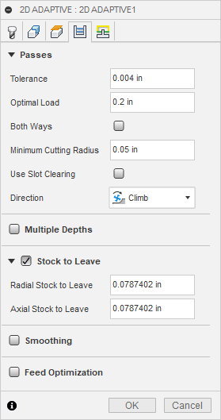
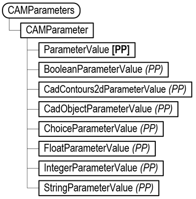
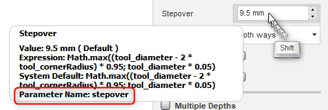

## Table of Contents

[Introduction to CAM Parameters](#IntroCAMParameters)
[BooleanParameterValue](#BooleanParameterValue)
[IntegerParameterValue](#IntegerParameterValue)
[StringParameterValue](#StringParameterValue)
[FloatParameterValue](#FloatParameterValue)
[ChoiceParameterValue](#ChoiceParameterValue)
**[CAM Geometry Selections](#CAMGeometrySelections)**
     [CadObjectParameterValue](#CadObjectParameterValue)
     [CadContours2dParameterValue](#CadContours2dParameterValue)
          [ChainSelection](#ChainSelection)
          [FaceContourSelection](#FaceContourSelection)
          [PocketSelection](#PocketSelection)
          [PocketRecognitionSelection](#PocketRecognitionSelection)
          [SilhouetteSelection](#SilhouetteSelection)
     [Machine/Avoid Selections](#MachineAvoidSelections)
     [CAMArrangeParameterValue](#CAMArrangeParameterValue)

## Introduction to CAM Parameters

When working with the CAM API, it is critical to understand the concept of CAM parameters. Like the Design API, the CAM API is a thin layer over the internal implementation. Because of that there are some significant conceptual differences in how they work and the most significant difference is CAM parameters. Instead of having an object with defined methods and properties, many of the CAM objects have relatively few methods and properties. For example, an Operation object has about 25 methods and properties, but as you can see from the picture below, there are far more settings available for an operation. All of the settings you see in the Setup and Operation dialogs are provided as CAM Parameters. Instead of specifically defined methods and properties, the Operation object returns a collection of parameters. You query and edit the operation by accessing the associated parameters.



As you can see in the dialog above, there are several parameter types; numeric values, Booleans, lists of choices, strings, and geometric selections. Below is the object model for CAM parameters. A CAMParameters collection object is returned by the Setup, Operation, CAMFolder, and CAMPattern objects. The CAMParameters collection provides access to all the parameters associated with the object you got the collection from.



You can access a specific parameter in the collection by using its name. To find the name of a parameter, manually edit the operation you want to modify. With the dialog displayed, hold down the SHIFT key and hover the mouse over the input area of the setting in the dialog. With the Shift key pressed, it will display programming-related information about the parameter instead of showing a general description. An example is shown below, with the parameter name “stepover”, highlighted.



Knowing the name of a parameter, you can get the CAMParameter object using the itemByName method, as shown below.

```
# Get the application.
app = adsk.core.Application.get()

# Get the active document.
doc = app.activeDocument

# Get the products collection on the active document.
products = doc.products

# Get the Design product.
product = products.itemByProductType('DesignProductType')
design = adsk.fusion.Design.cast(product)
# Get the Parameters collection object from an operation.
params = operation.parameters

# Get the CAMParameter named "finishingStepover".
stockParam = params.itemByName('finishingStepover')
```