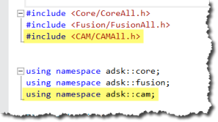

## Introduction to CAM Templates

# More to come...

The Fusion CAM API has been designed and developed to provide a high level of automation within the manufacture space. The CAM API functionality is provided through CAM-specific libraries. If you’ve used the API to automate the Design portion of Fusion, you’ve used the asdk.core and asdk.fusion libraries. The CAM functionality is defined in the adsk.cam library and is referenced into your program using the techniques shown below.



```
# Get the application.
app = adsk.core.Application.get()

# Get the active document.
doc = app.activeDocument

# From the Products collection on the active document, get the CAM Product.
cam: adsk.cam.CAM = doc.products.itemByProductType('CAMProductType')

# Check if anything was returned.
if cam == None:
     ui.messageBox('There is no CAM data in the active document')
     return
```