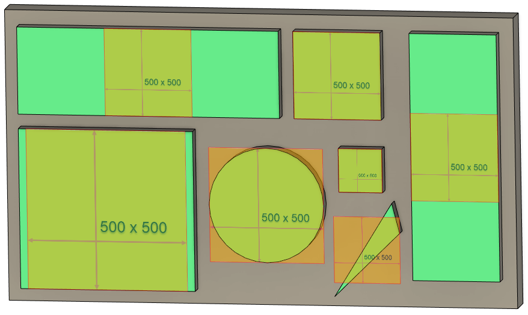
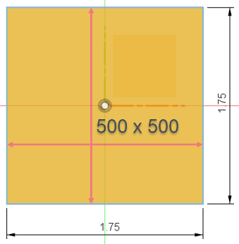
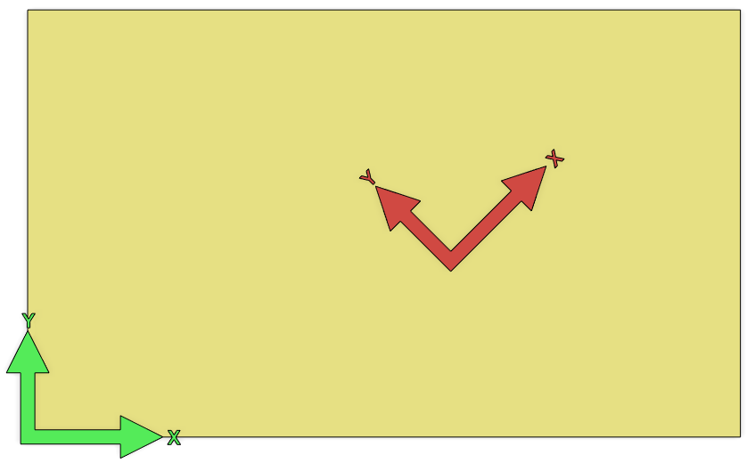
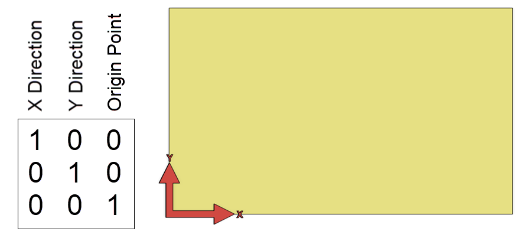
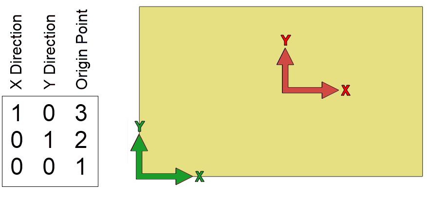
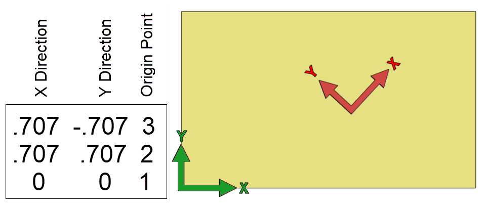
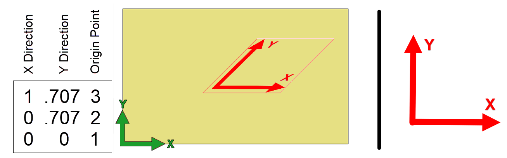
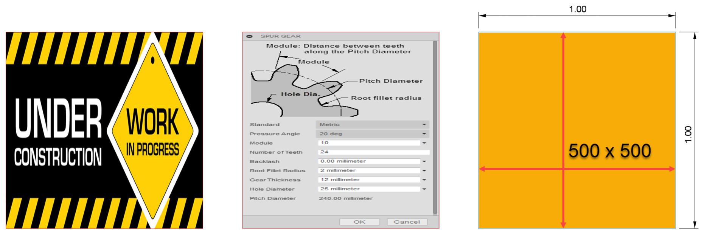
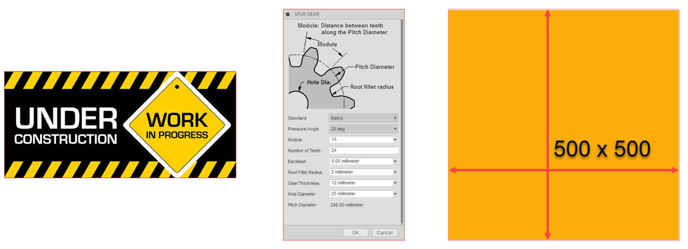
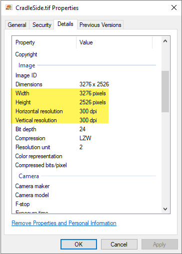

## Understanding Canvases in Fusion

The API fully supports the canvas functionality in Fusion, but there are some basic concepts you need to understand to take advantage of these capabilities.

### Images and Resolution

The first thing you need to understand is what an image is. When we talk about an image, we're referring to pixel-based images, not a vector format like SVG. For pixel-based images, the primary two concepts that impact their use in a canvas are size and resolution. The size of an image is defined as the number of pixels along the width and height of the image. Resolution is a more complex idea to fully understand because most images don't have an inherent resolution and aren't based on real-world measurement.

For example, you might have an image that is 1000x500 pixels. An image of this size has a total of 500,000 pixels or half a Megapixel, where a Megapixel measures the total number of pixels in an image, and one Megapixel is one million pixels. If you used a camera to capture this image, it won't have a defined resolution. However, if you insert this image into a Word document to print it, you're implicitly defining the resolution by how big you make the image on the page. For example, if you size it to be 4 inches wide and 2 inches tall on the page, it will print with a resolution of 250 pixels per inch.

An image can have a resolution specified within the image file, and that resolution can be used later by the page layout application to keep the image the correct size. For example, if the image above has a defined resolution of 200 pixels per inch, it will be 5 inches wide and 2 1/2 inches tall when you insert it into Word. Of course, you can still resize it once it has been inserted, which will change the resolution it's printed at, so the resolution defined in the image can be considered the default resolution. Images created using a scanner typically have the resolution specified in the image file, but not all formats support a resolution. For example, GIF does not, but PNG files do, even though it's generally not used. TIFF files support having a resolution and are the format most commonly used for printing. We'll see an example later where we can use the resolution to create an accurately sized Canvas.

### Interactively Adding a Canvas

When you use the Canvas command to add a canvas to a design, even if the image file has a resolution defined, it is ignored, and instead, the image is scaled to fit on the selected plane. This results in an arbitrary resolution, depending on the selected face's physical size. You can see the result of inserting the same 500x500 pixel image on various shaped faces below. Notice how the canvases, which are of various shapes and sizes, fit within each face.

.



The same is true when adding a canvas to a construction plane. The display size of the construction plane is used to determine the size of the canvas. The exception is when a canvas is placed on one of the three base construction planes, which is common when creating a canvas. The base construction planes don't have a physical size. You can see this as you zoom in and out of the view, and the planes stay the same size relative to the view. In this case, Fusion will always create the canvas so it is 1.75 cm on its longest side. The canvas is also centered on the model origin, as shown below.



If you right-click on an existing canvas, there is a "Calibrate" command in the context menu. When you run this command, you pick two points on the canvas and enter a distance. Fusion scales the canvas so those two points are the specified distance apart, effectively setting the resolution of the canvas. You can also use the Edit Canvas command dialog to resize, move, rotate, and flip the canvas.

### Using the API to Add a Canvas

When using the API to add a canvas, you have the same control as when you use the command but can use your logic to have more control over the placement. For example, you can create a canvas using a specific resolution so it's precise, and the user doesn't need to use the "Calibrate" command. The code below creates a canvas on the base X-Y construction plane, taking all the default settings. This results in the same canvas as if you created the canvas using the Canvas command and didn't change any settings in the dialog. However, just like when using the command, you can also move, resize, rotate, and flip the canvas, as discussed below.

|  |
| --- |
| Copy Code |

```
import adsk.core, adsk.fusion, traceback

app = adsk.core.Application.get()
ui  = app.userInterface

def run(context):
    try:
        des: adsk.fusion.Design = app.activeProduct
        root = des.rootComponent

        # Create a canvas on the base X-Y construction plane using the defaults.
        imageFilename = 'C:/Temp/500x500.png'
        canvasInput = root.canvases.createInput(imageFilename, root.xYConstructionPlane)
        canvas = root.canvases.add(canvasInput)
    except:
        if ui:
            ui.messageBox('Failed:\n{}'.format(traceback.format_exc()))
```

### How a Matrix Controls a Canvas

When creating or modifying a canvas using the API, you work with Fusion at a much lower level than when using the command. You use a transformation matrix to control a canvas's size, position, angle, and flipping. Here's an introduction to a matrix and how it fully defines a canvas.

Before we look at the details of a matrix, it's best to look at what it represents. Like that shown below, you can think of a matrix as representing a 2D coordinate system positioned within another 2D coordinate system. Green arrows represent the coordinate system defined by the plane the canvas is placed on. The red arrows represent the canvas's coordinate system, which is positioned and oriented relative to the plane's coordinate system.



#### Position and Orientation

Let's look at the details of a matrix and how it defines a coordinate system. The plane's coordinate system is 2-dimensional, so a 2D matrix defines the placement of a canvas. As shown below, a 2D matrix is defined by nine numbers arranged in rows and columns to create a 3x3 matrix. Even though a 2D matrix comprises nine numbers, we only need six to define the coordinate system. The bottom row is not used.

The matrix shown below is a unique matrix called an identity matrix because it defines a coordinate system that is identical to the base coordinate system. If we read the numbers in each column from the top down, the first column is (1, 0), the second is (0, 1), and the third is (0, 0). The first column defines a vector that specifies the coordinate system's X-axis direction, and the second column defines the Y-axis. The third column is (0, 0) and defines the location of the coordinate system's origin.



The code below is similar to the example above, except that instead of using the default transformation, it replaces it with an identity matrix, resulting in the image above.

|  |
| --- |
| Copy Code |

```
import adsk.core, adsk.fusion, traceback

app = adsk.core.Application.get()
ui  = app.userInterface

def run(context):
    try:
        des: adsk.fusion.Design = app.activeProduct
        root = des.rootComponent

        # Create a canvas on the base X-Y construction plane using the defaults.
        imageFilename = 'C:/Temp/500x500.png'
        canvasInput = root.canvases.createInput(imageFilename, root.xYConstructionPlane)
        canvas = root.canvases.add(canvasInput)
    except:
        if ui:
            ui.messageBox('Failed:\n{}'.format(traceback.format_exc()))
```

A vector defines a direction and magnitude in space. In this case, the X vector is (1, 0), which specifies going one unit in the X direction and zero units in the Y direction. The second column defines a vector going zero units in the X direction and one unit in the Y direction. The third column defines the position of the coordinate system. In this case, it is zero units in the X and zero units in the Y, so the coordinate system is at the origin of the base coordinate system. A coordinate system sitting at the origin whose X-axis is in the X direction and its Y-axis is in the Y direction is the same as the base coordinate system, making this an *identity* matrix. That's why only the red arrows are shown because they lie directly on the green arrows.

Below is an example using other values for the matrix and the resulting coordinate system. In this example, the third column has been modified to change the position of the coordinate system. It specifies that the origin of the coordinate system should now be at (3,2).



Here's a more complicated matrix that defines a rotated coordinate system. The position is still the same as above at (3, 2), but it's rotated 45 deg. The X direction vector is (0.707, 0.707), and the Y direction vector is (-0.707, 0.707). The valid values are calculated using cos(45) and sin(45). The length of both the X and Y vectors is 1.0, but we'll look at this in more detail below when we discuss scaling.



Notice that the X and Y axes vectors have always been at right angles (perpendicular) to each other. When calculating these vectors, you should ensure they are perpendicular; otherwise, the image can become skewed. Below is an example of a matrix and the resulting skewed coordinate system where the original image used is also shown. Remember, this is all on a single 2D plane.



The code below was used to create the skewed canvas. This code also demonstrates some other capabilities of the API when working with points, vectors, and matrices. It creates a point and two vectors that define the desired origin and directions of the X and Y axes. It then used the point and vectors to modify the matrix, defining a coordinate system with the desired position and orientation. Notice that the X direction is defined as (1, 0), but the Y direction is defined as (0.707, 0.707). The X vector is one unit long in the X direction, and the Y vector is one unit long, going 45 deg in the positive X and Y directions. You can see this in the image above, where the X arrow is in the X direction, and the Y direction is angled up and to the right.

|  |
| --- |
| Copy Code |

```
import adsk.core, adsk.fusion, traceback

app = adsk.core.Application.get()
ui  = app.userInterface

def run(context):
    try:
        # Have face or construction plane selected.
        planeSel = ui.selectEntity('Select a planar face or construction plane',
                                   'PlanarFaces,ConstructionPlanes')

        des: adsk.fusion.Design = app.activeProduct
        root = des.rootComponent

        # Define the origin and X and Y direction vectors and
        # use Matrix2D.setWithCoordinateSystem to set the matrix.
        origin = adsk.core.Point2D.create(5, 3)
        xDir = adsk.core.Vector2D.create(1, 0)
        yDir = adsk.core.Vector2D.create(0.707, 0.707)
        matrix = adsk.core.Matrix2D.create()
        matrix.setWithCoordinateSystem(origin, xDir, yDir)

        # Create the canvas
        canvasInput = root.canvases.createInput('C:/Temp/SquareCoords.png', planeSel.entity)
        canvasInput.transform = matrix
        canvas = root.canvases.add(canvasInput)
    except:
        if ui:
            ui.messageBox('Failed:\n{}'.format(traceback.format_exc()))
```

#### Flipping

When placing a Canvas interactively, the dialog supports an option to flip the image vertically or horizontally. The API also supports flipping using the flipHorizontal and flipVertical methods on the CanvasInput and Canvas objects. However, these methods exist for convenience and are optional. They flip the direction of the matrix's X (Horizontal) or Y (Vertical) axis. The code below illustrates modifying the matrix to flip horizontally. Remember that the first column of the matrix defines the X-axis.

|  |
| --- |
| Copy Code |

```
canvasInput = root.canvases.createInput('C:/Temp/Sample.png', planeSel.entity)
# Get the matrix from the CanvasInput
matrix = canvasInput.transform

# Negate the components of the X vector.
matrix.setCell(0, 0, -matrix.getCell(0, 0))
matrix.setCell(1, 0, -matrix.getCell(1, 0))

# Assign the modified matrix back to the CanvasInput.
canvasInput.transform = matrix
```

#### Scaling

Below is an example of three canvases placed on the same size faces using the API and an identity matrix. Notice how they're all square, even though the only square image is the 500x500 image. They're also all 1 cm in size.



Below is the result of creating canvases using the same images as above, but this time, the transformation matrix of the CanvasInput object is not changed. It is left to the default value, which maintains the original image's aspect ratio. The canvas size is dependent on the size of the planar entity it was placed on.



Why are the first set of images all square and 1 cm square? It's because that's what the matrix we're using defines. It uses an identity matrix that specifies that the X axis of the coordinate system is in the X direction and has a length of 1 unit, and the Y axis is in the Y direction and has a length of 1 unit. The length of the vectors defines the size of the created canvas. Unless the image is square, the lengths of the X and Y axes should be different to account for the difference in the width and height of the image. This difference is referred to as the aspect ratio. It is commonly expressed using two numbers separated by a colon, such as 16:9, and can be expressed as a single number by dividing the height by the width, so 16:9 will be 1.7777.

You need to know the aspect ratio if you want to provide the matrix to specify the size and positioning of the canvas and maintain the correct width-to-height ratio. The image size can be read from the file either interactively by looking at the properties of the image, or programming components can be used in a program to read this information. However, there is a more straightforward way to take advantage of Fusion to get the aspect ratio. In the second example above illustrating scaling, the canvases maintain the correct aspect ratio. When you create a CanvasInput, the default matrix considers the aspect ratio, and you can use this to get the aspect ratio. The code below creates a canvas with an arbitrary image that is 20 cm wide, and the height is whatever is needed to maintain the correct aspect ratio.

|  |
| --- |
| Copy Code |

```
app = adsk.core.Application.get()
ui  = app.userInterface

def run(context):
    try:
        # Have face or construction plane selected.
        planeSel = ui.selectEntity('Select a planar face or construction plane', 'PlanarFaces,ConstructionPlanes')

        des: adsk.fusion.Design = app.activeProduct
        root = des.rootComponent

        # Create the canvas input.
        canvasInput = root.canvases.createInput('C:/temp/SpurGear.png', planeSel.entity)

        # Get the coordinate system defined by the default matrix of the CanvasInput.
        defMatrix = canvasInput.transform
        (origin, xDir, yDir) = defMatrix.getAsCoordinateSystem()
        aspectRatio = xDir.length / yDir.length

        # Define the width as 20 cm..
        canvasWidth = 20

        # Define a matrix to create a canvas using the specified
		# size and maintain the images aspect ratio.
        xDir = adsk.core.Vector2D.create(canvasWidth, 0)
        yDir = adsk.core.Vector2D.create(0,canvasWidth / aspectRatio)
        matrix = adsk.core.Matrix2D.create()
        matrix.setWithCoordinateSystem(origin, xDir, yDir)

		# Set the matrix of the CanvasInput and create the canvas.
        canvasInput.transform = matrix
        canvas = root.canvases.add(canvasInput)
    except:
        if ui:
            ui.messageBox('Failed:\n{}'.format(traceback.format_exc()))
```

#### Resolution

The concept of image resolution was discussed earlier, but now we can look at how to use the resolution information to create a canvas that is the correct size in Fusion. If you've used a scanner to scan a full scale drawing you want to sketch over, you can use the resolution to create a full-scale canvas. You typically specify the desired resolution when using the scanner, for example, 300 dpi. Depending on the scanning software, that information is usually written into the created image file, and you can view it by looking at the properties of the image file, as shown below, where we see both the size in pixels and the resolution.



The code below uses this information to create a correctly scaled canvas.

|  |
| --- |
| Copy Code |

```
import adsk.core, adsk.fusion, traceback

app = adsk.core.Application.get()
ui  = app.userInterface

def run(context):
    try:
        des: adsk.fusion.Design = app.activeProduct
        root = des.rootComponent

        # Define the image information.
        pixelWidth = 3276
        pixelHeight = 2526
        resolution = 300
        imageFilename = 'C:/Temp/CradleSide.tif'

        # Compute the width and height in centimeters.
        width = (pixelWidth / resolution) * 2.54
        height = (pixelHeight / resolution) * 2.54

        # Define the components of the coordinate system and create a matrix.
        xVec = adsk.core.Vector2D.create(width, 0)
        #xVec.scaleBy(-1)
        yVec = adsk.core.Vector2D.create(0, height)
        origin = adsk.core.Point2D.create(0, 0)
        matrix = adsk.core.Matrix2D.create()
        matrix.setWithCoordinateSystem(origin, xVec, yVec)

        # Create the canvas.
        canvasInput = root.canvases.createInput(imageFilename, root.xYConstructionPlane)
        canvasInput.transform = matrix
        canvas = root.canvases.add(canvasInput)
    except:
        if ui:
            ui.messageBox('Failed:\n{}'.format(traceback.format_exc()))
```

We saw earlier how we could compute the aspect ratio using information from the CanvasInput object. However, the width, height, and resolution are not available. The sample above uses the data retrieved from the properties dialog and hard-codes it into the program. That's not practical for a general-purpose program; you need a programming component to read this information from the image file. For Python, there is a component called Pillow, which is a wrapper over PIL (Python Image Library). The example below illustrates using it to get the width, height, and resolution from a selected image file and then uses that to create a canvas of the correct size.

|  |
| --- |
| Copy Code |

```
import adsk.core, adsk.fusion, adsk.cam, traceback
from .library.PIL import Image

app = adsk.core.Application.get()
ui  = app.userInterface

def run(context):
    try:
        des: adsk.fusion.Design = app.activeProduct
        root = des.rootComponent

        # Have an image file selected.
        fileDlg = ui.createFileDialog()
        fileDlg.title = 'Choose Image File'
        fileDlg.filter = '*.png;*.tiff;*.tif;*.jpg;*.jpeg;*.bmp'
        dlgResult = fileDlg.showOpen()
        if dlgResult != adsk.core.DialogResults.DialogOK:
            return
        imgFilename = fileDlg.filename

        # Use Pillow to read the width, height, and resolution.
        img: Image.Image
        with Image.open(imgFilename, mode='r') as img:
            widthPixels = img.width
            heightPixels = img.height
            imgInfo: dict = img.info

        # Get the resolution from the info information.
        if 'dpi' in imgInfo:
            resolution = round(img.info['dpi'][0])
        else:
            # The resolution isn't defined, so ask the user.
            (val, isOk) = ui.inputBox('Specify the image resolution', 'Resolution Not Defined', 100)
            if not isOk:
                return
            else:
                resolution = int(val)

        # Compute the width and height in centimeters.
        widthCm = (widthPixels / resolution) * 2.54
        heightCm = (heightPixels / resolution) * 2.54

        # Define the components of the coordinate system and create a matrix.
        xVec = adsk.core.Vector2D.create(widthCm, 0)
        yVec = adsk.core.Vector2D.create(0, heightCm)
        origin = adsk.core.Point2D.create(0, 0)
        matrix = adsk.core.Matrix2D.create()
        matrix.setWithCoordinateSystem(origin, xVec, yVec)

        # Create the canvas.
        canvasInput = root.canvases.createInput(imgFilename, root.xYConstructionPlane)
        canvasInput.transform = matrix
        canvas = root.canvases.add(canvasInput)
    except:
        if ui:
            ui.messageBox('Failed:\n{}'.format(traceback.format_exc()))
```

Pillow is an independent Python component that can be installed into your script or add-in folder and used from there. Installing it in the system folder is unnecessary, as it can cause conflicts with other installed components. Here are the steps to use it.

1. Install a standalone version of Python on your computer. Fusion has its own copy of Python but doesn't include all the utilities that come with a standard installation, including PIP, which we need. It's best to install the same version that Fusion uses to ensure compatibility with Fusion. You can determine this by entering the following in the TEXT COMMAND window with the "Py" option enabled on the right-hand side of the window.

   ```
   sys.version
   ```

   Python can be installed from the [Python Downloads page.](https://www.python.org/downloads/)
2. Using a Command or Terminal window, change your active directory to your script or add-in folder.
3. In the command or terminal window, run the following command line. This installs Pillow into the "library" folder of the current working directory.

   ```
   pip install --target=.\library Pillow
   ```

4. You can now reference and use the Pillow library, as shown in the sample above.

### Understanding the Plane's Coordinate System

Canvases are always placed on a plane, either a construction plane or a planar face. The plane defines the base coordinate system the canvas will be positioned relative to. To position a canvas precisely, you need to know about the coordinate system you're placing it relative to. Getting information about the plane's coordinate system is possible using the API. There are two different cases you need to be able to handle to get the correct coordinate system: construction planes and planar faces.

The coordinate system of a construction plane can be determined by using its geometry property to get a Plane object. The returned Plane object has a parametric space, and the origin is at (0, 0), the X (or U) direction is always (1, 0), and the Y (or V) direction is always (0, 1) relative to the 2D space of the Plane. Depending on how the construction plane is created, sometimes the origin is at the lower-left corner and sometimes at the center of the graphics drawn to represent the construction plane. The returned Plane object provides the correct information regardless of what's displayed.

For a BRepFace, how the plane's coordinate system is determined is more complex. Like a construction plane, a face also has a 2D parametric space. When a canvas is placed, the center of the face's parametric space is used as the origin, the U direction as X, and the V direction as Y. The Python function below illustrates how the coordinate systems are calculated. The function takes either a planar BRepFace or a ConstructionPlane object as input and returns the plane's coordinate system origin and X and Y directions.

|  |
| --- |
| Copy Code |

```
# Given either a planar face or a construction plane, this returns the coordinate
# system used when creating a canvas. The values returned are 2D coordinates within
# the 2D coordinate system of the parametric space of the face or construction plane.
# The matrix that defines the placement of the canvas is also based on the same 2D space.
def GetPlaneCoordinateSystem(planarEnt) -> tuple[adsk.core.Point2D, adsk.core.Vector2D, adsk.core.Vector2D]:
    if isinstance(planarEnt, adsk.fusion.BRepFace):
        # Process the face.
        face: adsk.fusion.BRepFace = planarEnt
        eval = face.evaluator

        # Get the center of the parametric bounds.
        bounds = eval.parametricRange()
        uvCenter = adsk.core.Point2D.create((bounds.minPoint.x + bounds.maxPoint.x)/2, (bounds.minPoint.y + bounds.maxPoint.y)/2)

        # Create points in the X and Y directions and use them to create vectors to return.
        # It may need to be flipped if the face's plane has reversed parameterization.
        uvX = uvCenter.copy()
        if face.isParamReversed:
            uvX.x -= 1
        else:
            uvX.x += 1
        xDir = uvCenter.vectorTo(uvX)

        uvY = uvCenter.copy()
        uvY.y += 1
        yDir = uvCenter.vectorTo(uvY)
        return((uvCenter, xDir, yDir))
    elif isinstance(planarEnt, adsk.fusion.ConstructionPlane):
        # Process the construction plane.
        constPlane: adsk.fusion.ConstructionPlane = planarEnt

        # This hard-codes the origin and X and Y directions because
        # they're always the same, which is at the origin and in the
        # U and V directions of the plane.
        uvCenter = adsk.core.Point2D.create(0, 0)
        xDir = adsk.core.Vector2D.create(1, 0)
        yDir = adsk.core.Vector2D.create(0, 1)
        return((uvCenter, xDir, yDir))
    else:
        return None
```