## Command Inputs

* [AngleValueCommandInput](#AngleValueCommandInput)
* [BoolValueCommandInput](#BoolValueCommandInput)
* [BrowserCommandInput](#BrowserCommandInput)
* [ButtonRowCommandInput](#ButtonRowCommandInput)
* [DirectionCommandInput](#DirectionCommandInput)
* [DistanceValueCommandInput](#DistanceValueCommandInput)
* [DropDownCommandInput](#DropDownCommandInput)
* [FloatSliderCommandInput and FloatSliderListCommandInput](#FloatSlider)
* [FloatSpinnerCommandInput](#FloatSpinnerCommandInput)
* [GroupCommandInput](#GroupCommandInput)
* [ImageCommandInput](#ImageCommandInput)
* [IntegerSliderCommandInput and IntegerSliderListCommandInput](#IntegerSlider)
* [IntegerSpinnerCommandInput](#IntegerSpinnerCommandInput)
* [RadioButtonGroupCommandInput](#RadioButtonGroupCommandInput)
* [SelectionCommandInput](#SelectionCommandInput)
* [StringValueCommandInput](#StringValueCommandInput)
* [TabCommandInput](#TabCommandInput)
* [TableCommandInput](#TableCommandInput)
* [TextBoxCommandInput](#TextBoxCommandInput)
* [TriadCommandInput](#TriadCommandInput)
* [ValueCommandInput](#ValueCommandInput)

Command inputs are used in command dialogs to get input from the user. Simple commands don't always need a command dialog, and if they do require some input, you can gather the input in other ways. For example, a message box can get a yes/no answer to a question, but most commands need to get several user inputs before performing whatever actions they do. An important part of Fusion's command machinery is support for getting various types of input from the user. Examples of this can be seen in almost all of Fusion's commands. For example, when the Loft command is run, the dialog below is displayed to gather the required input.

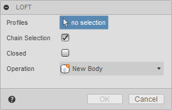

A command dialog consists of a list of command inputs. In the loft command, there is a selection input to select the profiles, two Boolean inputs, one for chain selection and one to specify if the result will be closed, and a drop-down input to get the operation type. Fusion supports many different types of command inputs, and the API currently supports a subset that you can use in your commands. Support for additional input types will continue to be added in future releases.

Below are descriptions of the different command inputs the API currently supports.

### AngleValueCommandInput

A [AngleValueCommandInput](AngleValueCommandInput.htm) displays as a value input on the command dialog and displays as a widget in the graphics window that the user can drag to set the value. Fusion's commands commonly use this specific command input. For example, it is used to specify the taper angle of an extrusion or the sweep angle of a revolve feature.

Command inputs that also have associated graphical widgets are usually first set to be invisible or disabled. Then once enough information has been gathered to define their position and orientation in space, their isVisible or isEnabled properties are toggled to make them visible. Making them invisible or disabled also hides the associated graphical widget.

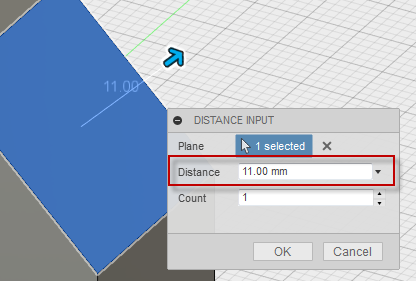

### BoolValueCommandInput

A [BoolValueCommandInput](BoolValueCommandInput.htm) is used to get a True or False response from the user. You can create four different visual styles depending on the arguments specified when the command input is created. The four styles are shown below; a check box, a button with an icon that changes states between pressed and unpressed, a button with an icon that doesn't change states but can be clicked, and a button with text that doesn't change states but can be clicked. The fifth example below is the same as the fourth except the isFullWidth property has been set to True, which turns off the text to the left and only leaves the button, centered on the dialog.

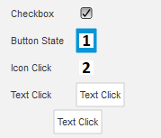

Here are the values of the arguments in the addBoolValueInput method to achieve the different results shown above.

Type | isCheckBox | resourceFolder |
 Checkbox | True | Empty String |
 Button with icon and states | True | folder containing the icon images |
 Click button with icon | False | folder containing the icon images |
 Click button with text | False | Empty String |

### BrowserCommandInput

A [BrowsersCommandInput](BrowserCommandInput.htm) is used to render HTML as one of the inputs in a dialog. You can think of this like any other command input, but instead of a pre-defined widget, it is a placeholder for a browser that displays the contents of a specified HTML file. Because the content is defined using HTML, you're open to displaying anything you want.

The picture below is a simple example where two BrowserCommandInputs have been added to the command dialog. BrowserCommandInputs behave like other command inputs in that they are displayed in the same sequence they were created, and they have a name displayed on the left with the browser on the right. The first BrowserCommandInput looks very similar to a textbox command input but adds a button beside the text field.

The second BrowserCommandInput demonstrates creating a table that is difficult with standard command inputs. It is possible to use a TableCommandInput to display tabular data, but the TabCommandInput is used to arrange other command inputs, not to display data. With a BrowserCommandInput, a table is easily defined in HTML. Notice that in this case, it doesn't have a name to the left. All command input types can expand to the entire width of the dialog by setting their isFullWidth property to True.


Displaying HTML is useful, but it's more helpful if your add-in and the HTML can interact. For example, it is possible for your add-in to send data to the HTML and for the HTML to send data to your add-in. For more details about the BrowserCommandInput see the user manual topic on [Palletes and Browser Inputs](Palettes_UM.htm).

### ButtonRowCommandInput

A [ButtonRowCommandInput](ButtonRowCommandInput.htm) displays a row of buttons, where the user can choose one or more. In the first example below, the isMultiSelectEnabled property is true, allowing the user to select more than one button. In the second example it is false so only one button can be selected. In the second case, selecting another button deselects the currently selected button.

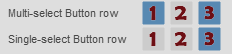

### DirectionCommandInput

A [DirectionCommandInput](DirectionCommandInput.htm) displays as a button on the command dialog and also displays an arrow in the graphics window that the user can change the direction of. This is used to let the user choose a positive or negative direction.

Command inputs that also have associated graphical widgets are usually initially set to be invisible and then their isVisible property is toggled once the user has specified other required input and you have enough information to define the location and direction of the graphical widget.

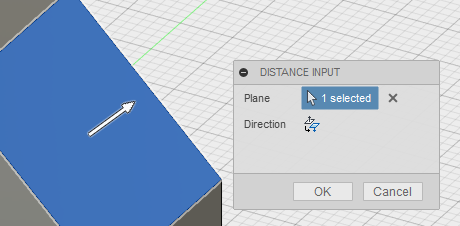

### DistanceValueCommandInput

A [DistanceValueCommandInput](DistanceValueCommandInput.htm) displays as a value input on the command dialog and also displays an arrow in the graphics window that the user can drag to set the value. This specific command input is very commonly used by Fusion's commands. For example, to specify the depth of an extrusion or the offset distance of a construction plane.

Command inputs that also have associated graphical widgets are usually initially set to be invisible or disabled and then their isVisible or isEnabled property is toggled once the user has specified other required input and you have enough information to define the location and direction of the graphical widget. Making the input invisible or disabled will also hide the associated graphical widget.


### DropDownCommandInput

A [DrowDownCommandInput](DropDownCommandInput.htm) is used to get a choice of zero or more selections from a user. Depending on settings and the style of drop-down, the user can select multiple items or may be restricted to selecting a single item from the list. There are four styles of drop down inputs, which are each shown below.

1. The first drop down style displays a list with check boxes where the user can check and uncheck any combination of items in the list. This is defined by setting the drop down style to DropDownStyles.CheckBoxDropDownStyle. No icons are used for this style.

   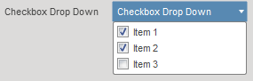

2. The second drop down style displays a list of items with an icon where the user can select one item from the list and the selected item is shown. This is defined by setting the drop down style to DropDownStyles.LabeledIconDropDownStyle and specifying an icon for each item in the list.

   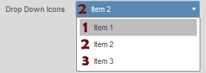

   Fusion uses this type of control in many of its commands as can be seen here in the Extrude command dialog where the Direction, Operation, and Extents are all inputs of this type.

   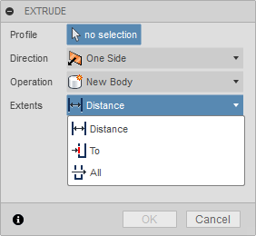

   There is also a variation of this type of drop down where radio button is displayed instead of an icon. This happens if you don't define an icon for an item in the list.

   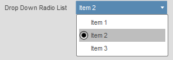

3. The third drop down style displays a list of items as text only. This is defined by setting the drop down style to DropDownStyles.TextListDropDownStyle. No icons are used for this style. This style of drop down is useful when displaying a dynamic list where the contents can change. For example, Fusion uses this to get the font selection in the Text command when placing text in a sketch.

   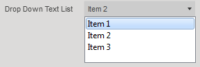

### FloatSliderCommandInput and FloatSliderListCommandInput

The [FloatSliderCommandInput](FloatSliderCommandInput.htm) and the [FloatSliderListCommandInput](FloatSliderListCommandInput.htm) are used to get one or two floating point numbers within a defined range from the user. There are several options that change how it is displayed and how it behaves. The various options are illustrated in the picture below; a single slider with a value spin control, text instead of the spin control, and two sliders to define a value range. The FloatSliderListCommandInput defines a list of valid values so that the slider can only select one of the pre-defined values.

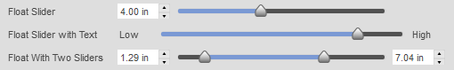

### FloatSpinnerCommandInput

The [FloatSpinnerCommandInput](FloatSpinnerCommandInput.htm) is similar to a value input except it has a "spinner" to the right of the edit field where the user can enter a value using the keyboard or they can click the up or down arrows to increment or decrement the value by a predefined amount.

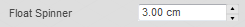

### GroupCommandInput

The [GroupCommandInput](GroupCommandInput.htm) allows you to group a set of command inputs. The group can be expanded and collapsed by clicking the triangle to the left of the group label. The picture below contains two groups. The first group, "Expanded Group", is expanded and contains two command inputs. The second group, "Collapsed Group", is collapsed so it's command inputs are not visible. This input can be useful in more complex dialogs to allow better organization where you have a lot of inputs. It is also particularly useful when you have inputs that are not commonly changed so you can put them into a collapsed group so that they're still available but don't complicate typical usage of your command.

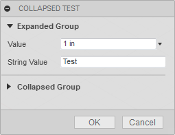

### ImageCommandInput

The [ImageCommandInput](ImageCommandInput.htm) allows you to display an image in the command dialog. Images are in the png format and support transparent backgrouns. They are displayed full size. In the example below, no name has been defined so the label is not displayed. The isFullWidth property can also be used so that the image will be centered within the width of the dialog.

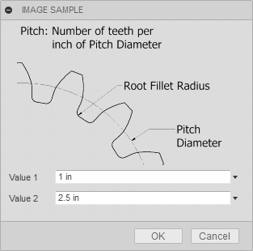

### IntegerSliderCommandInput and IntegerSliderListCommandInput

The [IntegerSliderCommandInput](IntegerSliderCommandInput.htm) and the [IntegerSliderListCommandInput](IntegerSliderListCommandInput.htm) are used to get one or two whole numbers within a defined range from the user. There are several options that change how it is displayed and how it behaves. The various options are illustrated in the picture below; a single slider with a value spin control, text instead of the spin control, and two sliders to define a value range. The IntegerSliderListCommandInput defines a list of valid values so that the slider can only select one of the pre-defined values.

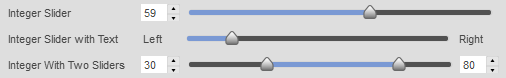

### IntegerSpinnerCommandInput

The [IntegerSpinnerCommandInput](IntegerSpinnerCommandInput.htm) is similar to a value input except it has a "spinner" to the right of the edit field where the user can enter a value using the keyboard or they can click the up or down arrows to increment or decrement the value by a predefined amount.

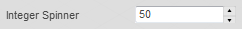

### RadioButtonGroupCommandInput

The [RadioButtonGroupCommandInput](RadioButtonGroupCommandInput.htm) allows you to display a list of radio buttons that are all visible and grouped together.

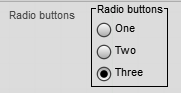

### SelectionCommandInput

A [SelectionCommandInput](SelectionCommandInput.htm) is used to get geometric selections from the user. You can use filtering to define which types of entities are selectable and set limits on the number of entities that can be selected.

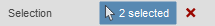

### StringValueCommandInput

A [StringValueCommandInput](StringValueCommandInput.htm) is used to get any string input from the user. Any text can be entered and no validation is performed.

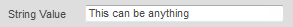

### TabCommandInput

A [TabCommandInput](TabCommandInput.htm) is used to provide additional grouping beyone what a group command input can provide. With tabs the entire dialog is available on different tabs. This allows you to provide many inputs without the dialog exceeding the height of the window and provides the opportunity to logically group your command inputs. Each tab can contain all of the command inputs, including groups, as shown below.

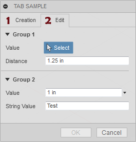

### TableCommandInput

A [TableCommandInput](TableCommandInput.htm) is used to organize other command inputs within a row-column structure. A table command input is not a generic table like you might be used to where it typically contains text and occasionally other types of data. A table command input is a table, but only contains other command inputs. It's best to think of it as just a way to structure command inputs on the dialog. Most of the other command inputs can be used in a table. However, selection and button row command inputs are not supported in a table. Below are some examples of where Fusion commands use a table command input.

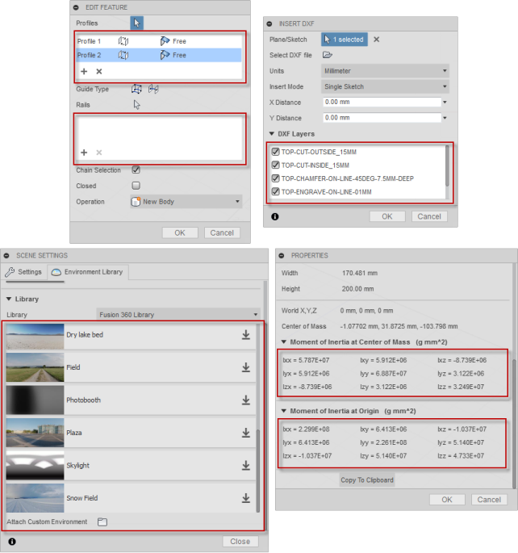

Looking in more detail at the Loft command dialog you can see there are two tables used. Looking more closely at the top table where profiles are specified we can see that there are currently two rows and three columns. the cells in the first column ("Profile 1" and "Profile 2") each contain a StringValueInput object that is set to be read-only. Using a read-only StringValueInput is the way to display simple text in a table. The second and third colums of each row contain DropDownCommandInput objects so the user can re-order the profiles and define direction conditions. You can't assign a command input to more than one location in the table, so each command input much be unique.

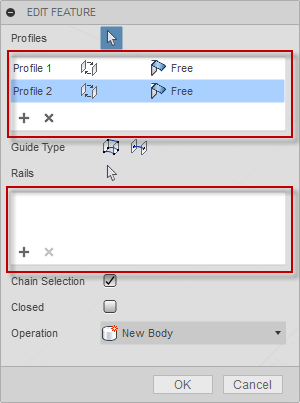

Besides the cells within the table, the TableCommandInput also has it's own toolbar which is displayed at the bottom of the table. The toolbar is also a host for command inputs. The Loft command has two BoolValueCommandInput objects in the toolbar to allow for adding and removing profiles from the list.

The workflow when working with a table command input is to create the table using the CommandInputs object you get from the command, just like you would any other command input. The table will be positioned in the order it was created relative to the other inputs on the dialog. At any time, during the create or in reaction to the event when inputs are changed you can create the command input you want to place in the table. You also create this using the CommandInputs object you get from the command. Then you use the addCommandInput method of the TableCommandInput object to add the command input to the table. As a result of adding it to the table it won't be shown outside of the table in the dialog. You can also use the addToolbarCommandInput to add the input to the table's toolbar.

Below is some example Python code that illustrates creating a table, adding a button to the table's toolbar and adding a StringValueInput and a DropDownCommandInput to the table. Similar code would exist in the inputChanged event of the command where additional rows could be added to the table.

```
# Create the table, defining the number of columns and their relative widths.
table = inputs.addTableCommandInput('sampleTable', 'Table', 2, '1:1')

# Define some of the table properties.
table.minimumVisibleRows = 3
table.maximumVisibleRows = 6
table.columnSpacing = 1
table.rowSpacing = 1
table.tablePresentationStyle = adsk.core.TablePresentationStyles.itemBorderTablePresentationStyle
table.hasGrid = False

# Create a button and add it to the toolbar of the table.
button = inputs.addBoolValueInput('tbButton', 'Add Row', False, 'Resources/Add', False)
table.addToolbarCommandInput(button)

# Create a string value input and add it to the first row and column.
stringInput = inputs.addStringValueInput('string1', '', 'Sample Text')
stringInput.isReadOnly = True
table.addCommandInput(stringInput, 0, 0, 0, 0)

# Create a drop-down input and add it to the first row and second column.
dropDown = inputs.addDropDownCommandInput('dropList1', '', adsk.core.DropDownStyles.TextListDropDownStyle)
dropDown.listItems.add('Item 1', True, '')
dropDown.listItems.add('Item 2', False, '')
dropDown.listItems.add('Item 3', False, '')
table.addCommandInput(dropDown, 0, 1, 0, 0)
```