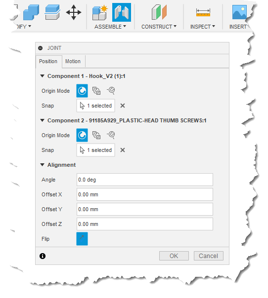
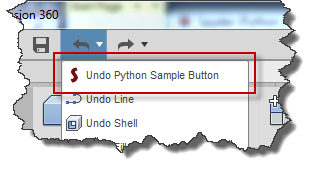

## Creating Custom Fusion Commands

[Command Overview](#CommandOverview)
[Command Features](#CommandFeatures)
   [Transactions](#Transactions)
   [Scripts and Commands](#ScriptsAndCommands)
   [Command Dialogs](#CommandDialogs)
   [Command Inputs](#CommandInputs)
   [Execute Event](#ExecuteEvent)
   [InputChanged Event](#InputChangedEvent)
   [ValidateInputs Event](#ValidateInputsEvent)
   [ExecutePreview Event](#ExecutePreviewEvent)
   [Activate, Deactivate, and Destroy Events](#ActivateDectivateAndDestroyEvents)
   [SelectionEvent Event](#SelectionEventEvent)
   [Mouse and Keyboard Events](#MouseAndKeyboardEvents)

### Command Overview

Fusion has a well-defined concept of what a command is. At a high level, a command is exactly what you would expect; a user clicks a command button to execute it, a dialog guides them through the process of collecting the required input, it often provides a preview of the expected result, and then it creates the final result, which can be undone.



Both scripts and add-ins can create commands but most commonly they are created by add-ins. There are cases where you might want to take advantage of some of the command functionality within a script too, which is discussed later. The reason that commands are used more with add-ins is because an add-in can be automatically loaded when Fusion is started and as part of the loading process they can add buttons for their commands into the Fusion user-interface, making the commands much easier for the user to access. The user can now execute the custom command by clicking the button, just as they do for any other Fusion command. A user executes a script through the **Scripts and Add-Ins** command, so it's not as convenient to execute a command implemented by a script.

An add-in is typically run automatically by Fusion at start-up where in the run function of the add-in you create a command definition. This is exactly what the name implies; it's the definition of a command. A command definition primarily defines how the command will look in the user-interface. For example, the most common type of command definition is a button and it defines all of the information needed to display a button in the user-interface; the icon, tool tip, enabled state, visibility, etc.). In addition to a button, there are also other types of command definitions that are used to create other types of controls you see in the user interface; a single check box, list of radio buttons, check boxes, and text. These are all described in more detail in the [User Interface Customization](UserInterface_UM.htm) topic.

Once the command definition has been created, you then use it to create a button in the user interface by defining a location in the user interface and providing the command definition. The new button references the command definition to get the information it needs to displays itself, (icon, tool tip, etc.). This is also discussed in the [User Interface Customization](UserInterface_UM.htm) topic. The add-in now runs passively in the background waiting for the button to be clicked and then responds appropriately.

Any command (standard Fusion or API created commands) can be run by the user clicking a button or by a program calling the command definitions execute method. In either case, Fusion creates a new Command object and fires the commandCreated event where it passes the Command object to your add-in. Your add-in reacts to this event by connecting to other command related events and defining the contents of the command dialog, if it has one.

Below is the full Python code for a basic add-in that does the bare minimum for a command that doesn't have a dialog. The result of this command is very simple in that it just displays a message box but it could do anything in the execute event. There are a few important things to notice in the program:

* In the run function it creates a command definition. (See the topic on [User Interface Customization](UserInterface_UM.htm) for more information on defining the icon, which is specified in the fourth argument to the addButtonDefinition method.)
* In the run function it adds a button into the main toolbar to allow the user to run the command.
* It implements a handler for the CommandCreated event, (the SampleCommandCreatedEventHandler class in this example).
* In the run function it connects the handler to the CommandCreated event.
* It implements a handler for the execute event, (the SampleCommandExecuteHandler class).* In the handler for the CommandCreated event it connects the execute event handler to the execute event.
  * The add-in performs whatever the final action of the command is within the execute event handler.
  * In the stop function it cleans up the user interface by deleting the control from the user-interface and deleting the command definition.

#### Basic Add-In Command (Python)

```
import adsk.core, adsk.fusion, adsk.cam, traceback

# Global list to keep all event handlers in scope.
# This is only needed with Python.
handlers = []

def run(context):
    ui = None
    try:
        app = adsk.core.Application.get()
        ui  = app.userInterface

        # Get the CommandDefinitions collection.
        cmdDefs = ui.commandDefinitions

        # Create a button command definition.
        buttonSample = cmdDefs.addButtonDefinition('MyButtonDefIdPython',
                                                   'Python Sample Button',
                                                   'Sample button tooltip',
                                                   './Resources/Sample')

        # Connect to the command created event.
        sampleCommandCreated = SampleCommandCreatedEventHandler()
        buttonSample.commandCreated.add(sampleCommandCreated)
        handlers.append(sampleCommandCreated)

        # Get the ADD-INS panel in the model workspace.
        addInsPanel = ui.allToolbarPanels.itemById('SolidScriptsAddinsPanel')

        # Add the button to the bottom of the panel.
        buttonControl = addInsPanel.controls.addCommand(buttonSample)
    except:
        if ui:
            ui.messageBox('Failed:\n{}'.format(traceback.format_exc()))

# Event handler for the commandCreated event.
class SampleCommandCreatedEventHandler(adsk.core.CommandCreatedEventHandler):
    def __init__(self):
        super().__init__()
    def notify(self, args):
        eventArgs = adsk.core.CommandCreatedEventArgs.cast(args)
        cmd = eventArgs.command

        # Connect to the execute event.
        onExecute = SampleCommandExecuteHandler()
        cmd.execute.add(onExecute)
        handlers.append(onExecute)

# Event handler for the execute event.
class SampleCommandExecuteHandler(adsk.core.CommandEventHandler):
    def __init__(self):
        super().__init__()
    def notify(self, args):
        eventArgs = adsk.core.CommandEventArgs.cast(args)

        # Code to react to the event.
        app = adsk.core.Application.get()
        ui  = app.userInterface
        ui.messageBox('In command execute event handler.')

def stop(context):
    try:
        app = adsk.core.Application.get()
        ui  = app.userInterface

        # Clean up the UI.
        cmdDef = ui.commandDefinitions.itemById('MyButtonDefIdPython')
        if cmdDef:
            cmdDef.deleteMe()

        addinsPanel = ui.allToolbarPanels.itemById('SolidScriptsAddinsPanel')
        cntrl = addinsPanel.controls.itemById('MyButtonDefIdPython')
        if cntrl:
            cntrl.deleteMe()
    except:
        if ui:
            ui.messageBox('Failed:\n{}'.format(traceback.format_exc()))
```

## Command Features

There are several features of a command that your add-in or script can take advantage of. The simple example above takes advantage of the ability to add a button to the user-interface and have the user execute the associated command. This capability is typically used by add-ins. A capability that is very useful for both add-ins and scripts, and that's not shown in the code above, is that any creation or edits that are done within the execute event handler are automatically grouped into a single transaction. This means that you can perform multiple creation and edit operations within the execute handler but the user will be able to undo all of it with a single undo operation. Also, the undo list will show the name of the command as the operation to be undone, as shown below.



### Transactions

As described above, everything you do in the execute event handler is bundled within a single transaction and can be undone with one undo. This capability is a big reason to use a command within a script. Without this, every API call that causes a change within Fusion will show up as a separate operation in the undo list. For example, if you write a simple script that draws three lines to create a triangle in a sketch, there will be three operations listed in the undo list and the user will need to run the Undo command three times to revert the process. However, if you call that same code that draws the three lines from the execute event handler, there will be a single operation in the undo list and a single undo will revert all of the changes.

### Scripts and Commands

As mentioned before, it's possible for a script to create a command but because a script is run from the **Scripts and Add-Ins** command, it doesn't create a button in the user-interface so the command definition can't be executed by the user clicking a button. For a script to use a command, it still creates a command definition like an add-in but it executes the command itself by calling the command definition's execute method, which starts the command process.

Below is a simple **script** example that demonstrates how this is done. Most of the code is similar to the add-in code above except it's missing the user interface code and it does two additional things, which are highlighted in yellow in the code below. First, it calls the execute method of the command definition it just created. Second, it sets a property to stop the script from automatically terminating. By default, a Python script will automatically terminate after the run function is finished. This is unique to Python scripts. When running a command from a script, the script needs to continue running so that it can handle the command related events. In the handler for the execute event it calls the terminate method to finally terminate the script.

#### Basic Script Command (Python)

```
import adsk.core, adsk.fusion, adsk.cam, traceback

# Global list to keep all event handlers in scope.
# This is only needed with Python.
handlers = []

def run(context):
    ui = None
    try:
        app = adsk.core.Application.get()
        ui  = app.userInterface

        # Get the CommandDefinitions collection.
        cmdDefs = ui.commandDefinitions

        # Create a button command definition.
        buttonSample = cmdDefs.addButtonDefinition('SampleScriptButtonId',
                                                   'Python Sample Button',
                                                   'Sample button tooltip')

        # Connect to the command created event.
        sampleCommandCreated = SampleCommandCreatedEventHandler()
        buttonSample.commandCreated.add(sampleCommandCreated)
        handlers.append(sampleCommandCreated)

        # Execute the command.
        buttonSample.execute()

        # Keep the script running.
        adsk.autoTerminate(False)
    except:
        if ui:
            ui.messageBox('Failed:\n{}'.format(traceback.format_exc()))

# Event handler for the commandCreated event.
class SampleCommandCreatedEventHandler(adsk.core.CommandCreatedEventHandler):
    def __init__(self):
        super().__init__()
    def notify(self, args):
        eventArgs = adsk.core.CommandCreatedEventArgs.cast(args)
        cmd = eventArgs.command

        # Connect to the execute event.
        onExecute = SampleCommandExecuteHandler()
        cmd.execute.add(onExecute)
        handlers.append(onExecute)

# Event handler for the execute event.
class SampleCommandExecuteHandler(adsk.core.CommandEventHandler):
    def __init__(self):
        super().__init__()
    def notify(self, args):
        eventArgs = adsk.core.CommandEventArgs.cast(args)

        # Code to react to the event.
        app = adsk.core.Application.get()
        des = adsk.fusion.Design.cast(app.activeProduct)

        if des:
            root = des.rootComponent
            sk = root.sketches.add(root.xYConstructionPlane)
            lines = sk.sketchCurves.sketchLines
            l1 = lines.addByTwoPoints(adsk.core.Point3D.create(0,0,0),
                                      adsk.core.Point3D.create(5,0,0))
            l2 = lines.addByTwoPoints(l1.endSketchPoint,
                                      adsk.core.Point3D.create(2.5,4,0))
            l3 = lines.addByTwoPoints(l2.endSketchPoint, l1.startSketchPoint)

        # Force the termination of the command.
        adsk.terminate()

def stop(context):
    try:
        app = adsk.core.Application.get()
        ui  = app.userInterface

        # Delete the command definition.
        cmdDef = ui.commandDefinitions.itemById('SampleScriptButtonId')
        if cmdDef:
            cmdDef.deleteMe()
    except:
        if ui:
            ui.messageBox('Failed:\n{}'.format(traceback.format_exc()))
```