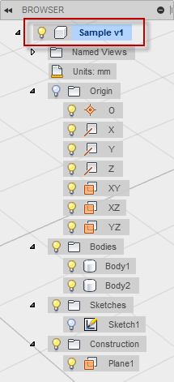

## Documents, Products, Components, Occurrences, and Proxies

The structure and access to Fusion data is done through the Document, Product, Component, Occurrence, and proxy objects. Successful use of the API requires an understanding of each of these object types, how to work with them, and how they are interrelated.

### Documents

A Document object represents an item in the Fusion data panel. An item gets added to the data panel each time a new Fusion document (file) is created. When a new design is created or an existing design is opened, that file is represented in the API as a *Document* object.

### Products

Groups of related data are stored within a document as a *Product*. For example, a single Fusion document can contain design data as well as toolpath data. The different types of data are stored separately within the document. Though stored separately, the relationships between data (i.e. toolpath references to design geometry) are maintained and stored within the document.

The Product object is the base class that represents the different product types. For the design data, there is a Design object that derives from Product. A document can only contain a single Design object. The Python code below demonstrates how to get the active product from the application and then cast it to a Design object. Casting will return null if the active product is not a design.

```
app = adsk.core.Application.get()
ui = app.userInterface

design = adsk.fusion.Design.cast(app.activeProduct)
if not design:
    ui.messageBox('No active Fusion design', 'No Design')
    return
```

### Components

A Fusion design can contain one or more components. Components contain the various types of Fusion geometry (i.e. solids, sketches, construction geometry, sculpt forms, etc.). Every Fusion document contains a single, default component that is referred to as the root component. In the user interface, the root component is represented by the top node in the browser. In the example shown below, the root component is the "Sample v1" node and it contains the base construction geometry, two bodies, one sketch, and one construction plane.



The Python code below demonstrates how to get the root component from the design and then create a new sketch within it using the root component's X-Y construction plane.

```
# Get the root component of the active design.
rootComp = design.rootComponent

# Create a new sketch on the xy plane.
sketches = rootComp.sketches
xyPlane = rootComp.xYConstructionPlane
sketch = sketches.add(xyPlane)
```