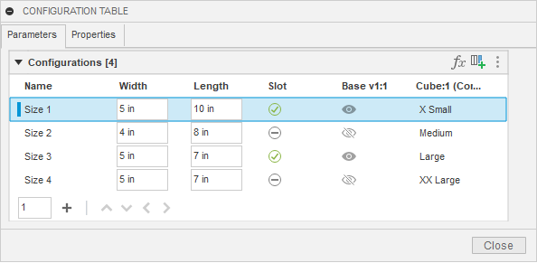
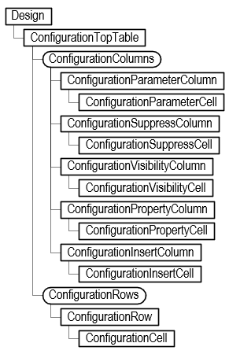

## Configurations

* [Overview](#Overview)
* [Creating/Editing a Configured Design](#CreatingEditingConfiguredDesign)
* [Configuration Theme Tables](#ConfigurationThemeTables)
* [Feature Aspects](#FeatureAspects)
* [Activating Rows in the Configured Design](#ActivatingRows)
* [Inserting a Configuration into an Assembly](#InsertingConfiguration)

## Overview

This topic discusses the API functionality for the configuration capabilities in Fusion. Before using the API, you should use the configuration functionality through Fusion's user interface and become familiar with its various capabilities. This discussion will illustrate functionality in the user interface, describe the equivalent functionality in the API, and illustrate its use with some example code.

Below is a picture of a simple configuration table that controls two parameters, the suppression of a feature, the visibility of an occurrence, and the insertion of another configuration into this design. A configuration table is like any other table and consists of rows and columns. Each column defines a specific item that the configuration will control. In this case, the parameter values, the feature suppression, the occurrence visibility, and which row to use for the inserted configured part. Each row represents a specific configuration and defines its values.



Below is a portion of the Fusion API object model that provides access to this configuration table. This main configuration table is known as the “Top” table. It is represented in the API by the ConfigurationTopTable object, obtained using the configurationTopTable property of the Design object. You can use the Design.isConfiguredDesign property to determine if the current Design is a configuration.



You can access the columns and rows from the top table. The object model shows several types of columns: parameter, suppression, visibility, property, insert, and theme columns. Each of these is described in more detail below.

A **ConfigurationParameterColumn** object defines which parameter is being controlled by the column, and it provides access to the cells that define the parameter value for each row. Like with standard Fusion parameters, the parameter's value can be obtained or set using either a string representing an expression or a Double value, the evaluated value in database units.

For example, for a parameter that is controlling a distance value, some valid expressions are “3”, “3 in”, “5 in / 2”, and “Length \* 0.75”. The first one that just has a value uses the default design units, so if they’ve specified “mm” as the current design unit, it will be 3 mm, and if they’ve chosen inches, it will be 3 inches. The next one specifies units as part of the expression, so it will always be 3 inches regardless of the design units. The other two examples show that an expression can be an equation and include references to other parameters.

When getting the value, it is the evaluated result of the expression in database units. For example, for the expression “5 in / 2”, the value property will return 6.35. The internal length unit is centimeters, which is 2.5 inches converted to centimeters. Setting the parameter using the value property will automatically create an expression resulting in the specified value.

A **ConfigurationSuppressColumn** object defines which feature the column controls the suppression state for and provides access to the cells that define whether the feature should be suppressed for that row. The term “feature” is used loosely here and refers to anything that can be suppressed in the timeline, including features, sketches, construction geometry, joints, etc. The value of suppression cells is a Boolean, indicating if that feature should be suppressed when that row is active.

A **ConfigurationVisibilityColumn** object defines which entity the column controls the visibility for and provides access to the cells that define whether the entity should be visible for that row. The value of visibility cells is a Boolean, indicating if the entity should be visible when that row is active.

A **ConfigurationInsertColumn** object defines which row is used for a configuration inserted into the current Design and provides access to the cells that define which row to use. Each cell in the column specifies a specific row from the top table of the referenced configuration.

A **ConfigurationPropertyColumn** defines which property’s value is being controlled by the column, and it provides access to the cells that define the value to assign to the property when that row is active. Each cell contains the text that will be assigned to the property when that row is active.

A difference between the table shown in the user interface and the top table provided by the API is that properties are accessed from the top along with everything else. For the user interface, it was chosen to show the property columns in a separate tab. Having properties in a separate tab is an artificial separation, which the API doesn’t do. When iterating over the columns of the top table, the property columns will be the first columns returned. The remaining columns will be returned in the same order as in the CONFIGURATION TABLE dialog.

Below is a script that dumps out the contents of an existing table for the parameter, suppress, visibility, and property columns. It lists each column, showing its name and what it controls. It then lists the values for each row of the column. It writes this information to the TEXT COMMANDS window.

|  |
| --- |
| Copy Code |

```
import adsk.core, adsk.fusion, traceback

def run(context):
    ui = None
    try:
        app = adsk.core.Application.get()
        ui  = app.userInterface

        # Get the top configuration table from the design.
        des: adsk.fusion.Design = app.activeProduct
        topTable = des.configurationTopTable

        # Iterate through the columns, writing out info for each one.
        column: adsk.fusion.ConfigurationColumn = None
        columnCount = 0
        for column in topTable.columns:
            columnCount += 1
            if isinstance(column, adsk.fusion.ConfigurationParameterColumn):
                paramColumn: adsk.fusion.ConfigurationParameterColumn = column
                app.log(f'Column {columnCount} ({paramColumn.title}) is a Parameter column controlling "{paramColumn.parameter.name}"')

                for i in range(topTable.rows.count):
                    paramCell = paramColumn.getCell(i)
                    app.log(f'   Expression from row {i+1} is "{paramCell.expression}"')
            elif isinstance(column, adsk.fusion.ConfigurationPropertyColumn):
                propColumn: adsk.fusion.ConfigurationPropertyColumn = column
                app.log(f'Column {columnCount} ({propColumn.title}) is a Property column controlling "{propColumn.parentProperty.name}"')

                for i in range(topTable.rows.count):
                    propCell = propColumn.getCell(i)
                    app.log(f'   Value from row {i+1} is "{propCell.value}"')
            elif isinstance(column, adsk.fusion.ConfigurationSuppressColumn):
                suppressColumn: adsk.fusion.ConfigurationSuppressColumn = column
                app.log(f'Column {columnCount} ({suppressColumn.title}) is a Suppress column controlling "{suppressColumn.feature.name}"')

                for i in range(topTable.rows.count):
                    supressCell = suppressColumn.getCell(i)
                    app.log(f'   Value from row {i+1} is {supressCell.isSuppressed}')
            elif isinstance(column, adsk.fusion.ConfigurationVisibilityColumn):
                visibilityColumn: adsk.fusion.ConfigurationVisibilityColumn = column
                app.log(f'Column {columnCount} ({visibilityColumn.title}) is a Visibility column controlling "{visibilityColumn.entity.name}"')

                for i in range(topTable.rows.count):
                    visibleCell = visibilityColumn.getCell(i)
                    app.log(f'   Value from row {i+1} is {visibleCell.isVisible}')
            elif isinstance(column, adsk.fusion.ConfigurationInsertColumn):
                insertColumn: adsk.fusion.ConfigurationInsertColumn = column
                app.log(f'Column {columnCount} ({insertColumn.title}) is an Insert column controlling "{insertColumn.occurrence.name}"')

                for i in range(topTable.rows.count):
                    insertCell = insertColumn.getCell(i)
                    app.log(f'   Value from row {i+1} is "{insertCell.row.name}"')
            else:
                app.log( f'Other type of column found: {column.objectType}')
    except:
        if ui:
            ui.messageBox('Failed:\n{}'.format(traceback.format_exc()))
```

For the configuration table shown above, the following results are displayed in the TEXT COMMANDS window.

```
Column 1 (Part Number) is a Property column controlling "Part Number"
    Value from row 1 is "5x10S"
    Value from row 2 is "4x8"
    Value from row 3 is "5x5S"
    Value from row 4 is "5x5"
 Column 2 (Description) is a Property column controlling "Description"
    Value from row 1 is "5 x 10 Box with Slot"
    Value from row 2 is "4 x 8 Box"
    Value from row 3 is "5 x 5 Box with Slot"
    Value from row 4 is "5 x 5 Box"
 Column 3 (Width) is a Parameter column controlling "Width"
    Expression from row 1 is "5 in"
    Expression from row 2 is "4 in"
    Expression from row 3 is "5 in"
    Expression from row 4 is "5 in"
 Column 4 (Length) is a Parameter column controlling "Length"
    Expression from row 1 is "10 in"
    Expression from row 2 is "8 in"
    Expression from row 3 is "5 in"
    Expression from row 4 is "5 in"
 Column 5 (Slot) is a Suppress column controlling "Slot"
    Value from row 1 is False
    Value from row 2 is True
    Value from row 3 is False
    Value from row 4 is True
 Column 6 (Base v1:1) is a Visibility column controlling "Base v1:1"
    Value from row 1 is True
    Value from row 2 is False
    Value from row 3 is True
    Value from row 4 is False
 Column 7 (Cube:1 (Configured Component Insert)) is an Insert column controlling "X Small v1:1"
    Value from row 1 is "X Small"
    Value from row 2 is "Medium"
    Value from row 3 is "Large"
    Value from row 4 is "XX Large"
```