## Using Custom Graphics

[Custom Graphics Overview](#CustomGraphicsOverview)
[Object Model](#ObjectModel)
[Triangle Meshes](#TriangleMeshes)
[Line Graphics](#LineGraphics)
[Point Graphics](#PointGraphics)
[Text Graphics](#TextGraphics)
[B-Rep Body Graphics](#BRepBodyGraphics)
[CurveGraphics](#CurveGraphics)
[Graphics Colors](#GraphicsColors)
   [Solid Color Effect](#SolidColorEffect)
   [Basic Material Color Effect](#BasicMaterialColorEffect)
   [Appearance Color Effect](#AppearanceColorEffect)
   [Vertex Color Effect](#VertexColorEffect)
   [Show Through Color Effect](#ShowThroughColorEffect)
[Additional Graphics Behaviors](#AdditionalGraphicsBehaviors)
   [Orientation](#Orientation)
   [Size](#Size)
   [Combining Orientation and Size](#CombiningOrientationAndSize)
   [Position](#Position)

### Custom Graphics Overview

A key part of the Fusion user interface is the graphics window where you see and interact with the model and other graphical information. When using Fusion interactively or through the API, you create things like features and sketch entities and a side effect of their creation is that they’re displayed in the graphics window. The creation and display of the graphics that represent the geometry are automatically handled by Fusion. However, there are cases when you want to show something in the graphics window that is not a standard Fusion entity. This is typically used in more advanced applications but can also be useful in smaller, simple applications too.

For example, if you are integrating an electromagnetic field simulator application into Fusion, there are symbols and analysis results you’ll want to display to the user that are different from any of the standard Fusion geometry. Or maybe you have an interesting manufacturing process that requires that you label each face. The Fusion API supports the ability to draw custom graphics in the graphics window. These custom graphics display along with the other Fusion graphics but to Fusion they’re just “graphics” without any meaning. It’s your add-in that understands what those graphics represent and provides the expected behavior. Below is a detailed description of the custom graphics functionality supported by the Fusion API.

When working with most of the Fusion API you can draw parallels between using the API and how you would use the user interface to do the same thing interactively. For example, creating an extrusion has very many similarities between the UI and the API. The custom graphics portion of the Fusion API is a completely new concept that doesn’t have any parallels in the user interface. With custom graphics, you’re defining graphics primitives in the same way that the Fusion core does to draw the high-level objects. For example, when you draw a solid box using Fusion you see a solid cube in the graphics window and can interact with the faces and edges. Internally, Fusion draws the graphics that represent the box using 12 triangles (2 for each face) and 12 lines (1 for each edge). Fusion then maps these low-level graphics to the higher-level object that the user understands. When using custom graphics, you’ll also be drawing low-level graphics to represent objects in your application that you want the user to see and interact with.

If you’ve not worked with any low-level graphics before there is a somewhat steep learning curve. If you’ve programmed graphics before using something like DirectX, OpenGL, or WebGL many of these concepts will already be familiar.

There are several types of custom graphics objects that can be drawn. These are points, lines, triangles, B-Rep bodies, and curves. Triangles, lines, and points are the low-level graphics and the other types are a higher level, more intelligent graphics that make some workflows much easier. We’ll begin with a discussion of the primitive types first.

### Custom Graphics Object Model

Before getting into the details of creating and using custom graphics, here’s an overview of the object model that supports them. The first thing to notice is that you access the custom graphics related objects through the Component object. In most cases, this will be the root component but it can be any component.

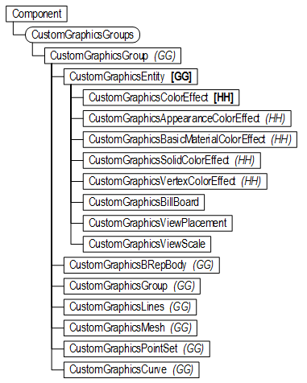

From the Component object, you access the CustomGraphicsGroups object. This collection is initially empty because by default a component doesn’t contain any custom graphics. You can create a new CustomGraphicsGroup object using the add method of the CustomGraphicsGroups collection object. From the CustomGraphicsGroup object, you can now create custom graphics of various types and they will all be contained within this group. A CustomGraphicsGroup object can also contain other CustomGroupsGroup objects so it’s possible to build up a hierarchical structure of graphics.

All of the graphics types are derived from CustomGraphicsEntity which supports all of the general capabilities that all custom graphics support like color, visibility, depth priority, selectability, etc. In fact, a CustomGraphicsGroup is also derived from the CustomGraphicsEntity object and supports the same capabilities.

The various types of graphics and the capabilities they support are described in more detail below.

### Triangle Meshes

Most of the graphics you typically see when looking at a Fusion design are made up of triangles. Internally, when doing solid, surface, and T-Spline modeling, the model is mathematically exactly represented using smooth surfaces. For example, a solid cylinder is defined using a cylinder and two planes but this can’t directly be displayed by the graphics card so Fusion automatically calculates a triangle mesh representation of the model and uses that for the display. The underlying mathematically exact model is unchanged and that’s what you continue to use for modeling but you’re looking at the triangle mesh version of the model. It doesn’t look like a triangle mesh because there are enough triangles that it looks smooth and the graphics system applies lighting in a way so you don’t see flat triangles but instead it appears smooth. Fusion will also create more or fewer triangles depending on how closely you’re zoomed into the model. This is referred to as “Level of Detail” or “LOD”. When zoomed out, cylinders that represent holes might be displayed using a few triangles so the opening of the hole could actually be an octagon but because it’s so small you can’t tell and it looks circular. If you zoom in, Fusion will create a new triangle mesh from the model with more triangles so the edge of the hole continues to look circular.

Let’s look at some of the basic concepts of custom graphics using triangles as an example. You access the custom graphics functionality using the CustomGraphicsGroups collection object which you can get from a Component object. The code below creates a new CustomGraphicsGroup object on the root component. You won’t see any changes in the graphics window because the new group is empty until graphics entities are defined.

```
# Create a graphics group on the root component.
graphics = root.customGraphicsGroups.add()
```

#### Triangle Mesh Coordinates

To fully define a triangle mesh you need to provide several pieces of data. The first and most obvious is the set of points that define the corners of the triangle. In this example, we’ll create a mesh made up of two triangles that will end up looking like a 10cm x 6cm rectangular plane.

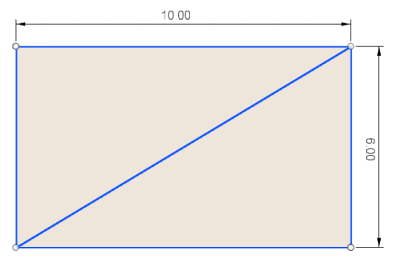

A triangle is defined by three points and because there are two triangles the above mesh requires the definition of 6 points. Below is a slightly more complex mesh that contains 5 triangles and as a result needs 15 points. But as you can see in both cases, this seems somewhat wasteful because some of the points are used by more than one triangle. In the first example, there are just four unique points to define the two triangles. In the second there are just seven unique points to define the 5 triangles.

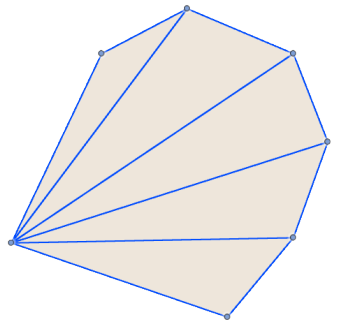

Graphics systems allow for the re-use of the points by using an index into the list of coordinate points. It might appear complex at first but let’s look at the rectangle example to see how it’s used. Below on the left, is a picture showing the points and the resulting triangles. The table on the left is a list of the coordinates. The points are defined as a list of X,Y,Z coordinates and each coordinate has an index number based on its position within the list. The table on the right is a list of index values which is a list of integers where each set of three sequential numbers indicates which points in the point list to use to draw the triangle. The first three numbers are 0, 1, and 2 which indicates that coordinates 0, 1, and 2 are used to draw triangle A. The next three numbers are 0, 2, and 3 which draws triangle B.

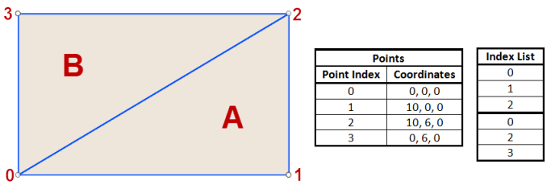

Now let’s look at this with the more complex mesh. The list of points contains 6 coordinates and the list of indices contains 15 values, three for each triangle. You can see how in this case the point as index 0 is used by all the triangles and points 2, 3, 4, and 5 are each used by two triangles.

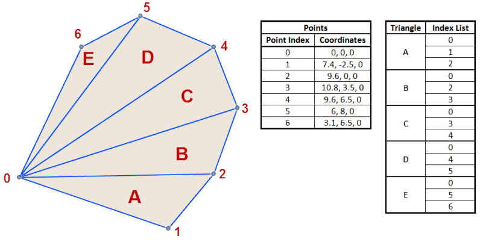

Even though creating a mesh by specifying an index list is the most efficient way to define a mesh, it's not required. If you pass in an empty array for the index list, the API will assume that you want to use each of the coordinates in the order they exist in the coordinate list.

#### Triangle Mesh Normals

There’s also another piece of information that’s needed to correctly render a triangle mesh; the mesh normal vectors. The normals define how light is reflected off the mesh. Without any lighting, a model would be all the same color without any shading, as shown below. As you can see, without lighting and shading it’s not possible to understand the internal shape of the model because all you can see is the filled silhouette of the part.

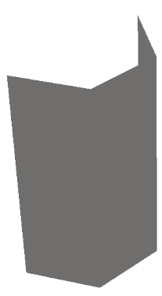

When creating a triangle mesh you specify a normal vector for every triangle point. Typically, the normal vectors represent the true surface normal at that point on the smooth surface the mesh is representing. Below on the left is a partial cylinder. The next picture is a coarse mesh of the surface with the normals defined so each triangle facet is shaded as a plane. And the third picture uses the same mesh as the middle mesh but with the normals oriented using the cylinder normals. All three have the same appearance assigned to them. Notice that even though the last one is a very coarse mesh, that the lighting and the chrome appearance is still very close to the original smooth cylinder because the angle that the light reflects off the triangle changes across the face of the triangle. However, in the middle picture the triangle has a solid color because the lighting is the same across the entire triangle.

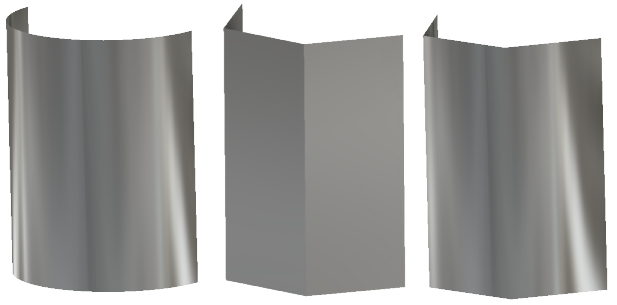

Below is a picture that illustrates the top view of the middle and right pictures above. The black lines are the triangles, the green lines are the vectors used, and the red is the original cylinder. On the picture on the left, you can see that the normal vectors are perpendicular to the face of each triangle. However, on the picture on the right, the normals are not perpendicular to the triangles but are instead perpendicular to the cylinder at the point where the triangle vertex touches the cylinder. The normals for a specific triangle are not all the same like they are on the left. This results in the lighting changing how it reflects off the triangle as it moves across the triangle because it varies from one normal to the other across the triangle.

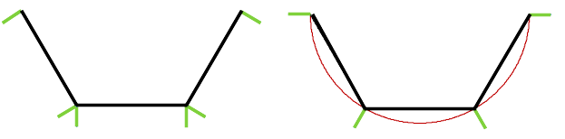

Defining normals is similar to how the triangle coordinates are defined, as described above, except instead of a list of points you have a list of vectors. You still use an index list to index into the list of normals. You define a normal for each triangle vertex. The normals are assigned in the same order as you assigned the vertex coordinates.

The example below puts this all together to draw a pyramid shape made up of four triangles. In this case, we want it to look like a pyramid with flat sides so the normals are drawn so they are perpendicular to each of the triangles. Below is a top view of the pyramid with each of the vertices and triangles labeled. You can also see that the model origin is at the lower-left corner and positive X is to the right, Y is up and Z is towards you.

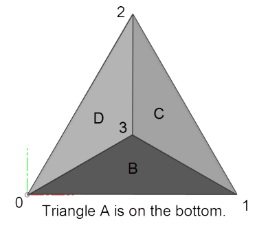

```
import adsk.core, adsk.fusion, traceback
import math

def run(context):
    try:
        des = adsk.fusion.Design.cast(_app.activeProduct)
        root = des.rootComponent

        # Check to see if a custom graphics groups already exists and delete it.
        if root.customGraphicsGroups.count > 0:
            root.customGraphicsGroups.item(0).deleteMe()
            _ui.messageBox('Deleted existing graphics.')
            _app.activeViewport.refresh()
            return

        # Define the size of the pyramid.
        pyramidSize = 10
        pyramidWidth = math.sqrt(pyramidSize**2 - (pyramidSize/2)**2)
        pyramidHeight = 6

        # Create a graphics group on the root component.
        graphics = root.customGraphicsGroups.add()

        # Create graphics coordinates for the four points used to define the triangles.
        # An array of the x,y,z components of the coordinates is first defined and then
        # that is passed into the CustomGraphicsCoordinates.create method to create
        # the graphics coordinates.
        coordArray = [0, 0, 0,
                      pyramidSize, 0, 0,
                      pyramidSize/2, pyramidWidth, 0,
                      pyramidSize/2, pyramidWidth*(1/3), pyramidHeight]
        coords = adsk.fusion.CustomGraphicsCoordinates.create(coordArray)

        # Create the index list to define how the coordinates are connected
        # into the four triangles.
        vertexIndices = [0,1,2, 0,1,3, 1,2,3, 2,0,3]

        # Create the triangle normal vectors. This creates vectors along two of the
        # edges of each triangle and then uses the vector crossproduct function to
        # calculate the normal vector.
        vec1 = coords.getCoordinate(0).vectorTo(coords.getCoordinate(1))
        vec2 = coords.getCoordinate(0).vectorTo(coords.getCoordinate(3))
        normal1 = vec1.crossProduct(vec2)

        vec1 = coords.getCoordinate(1).vectorTo(coords.getCoordinate(2))
        vec2 = coords.getCoordinate(1).vectorTo(coords.getCoordinate(3))
        normal2 = vec1.crossProduct(vec2)

        vec1 = coords.getCoordinate(2).vectorTo(coords.getCoordinate(0))
        vec2 = coords.getCoordinate(2).vectorTo(coords.getCoordinate(3))
        normal3 = vec1.crossProduct(vec2)

        normals = [0,0,-1,
                   normal1.x, normal1.y, normal1.z,
                   normal2.x, normal2.y, normal2.z,
                   normal3.x, normal3.y, normal3.z]

        # Create the index list to define how the normals are assigned to the vertices.
        normalIndices = [0,0,0, 1,1,1, 2,2,2, 3,3,3]

        # Create the mesh.
        mesh = graphics.addMesh(coords, vertexIndices, normals, normalIndices)

        # Refresh the graphics.
        _app.activeViewport.refresh()
    except:
        if _ui:
            _ui.messageBox('Failed:\n{}'.format(traceback.format_exc()))
```

Even though it's best for you to define the normals for a mesh it's not required. If you pass in empty arrays for the normals and the normal index list, the API will automatically create normals that are perpendicular to each triangle to create a result similar to that shown in the middle picture of the three partial cylinder meshes above.

### Line Graphics

Line graphics provide the ability to draw lines. At the low level, all wireframe graphics displayed on the screen is displayed as lines. Smooth curves, including circles, are also drawn using lines but the curves are approximated with enough lines that it looks like a smooth curve. Fusion also uses levels of detail with curves just as it does with surfaces. It might create multiple representations so that as you zoom in and out it can show the level of detail to make the curve look smooth.

Line graphics are defined in a very similar way to how triangles are defined, as described above. You have a list of points and a separate index list that indexes into the list of points. Each pair of index values defines a line. To draw a rectangle will require 8 indices, two for each of the four lines.

The code below can be added to the triangle sample above to draw lines along the edges of the triangles. In this case, it is using coordinates defined by the existing CustomGraphicsCoordinates object.

```
# Create the index list to define how the lines connect the coordinates.
lineIndices = [0,1, 1,2, 2,0, 0,3, 1,3, 2,3]
lines = graphics.addLines(coords, lineIndices, False)
lines.weight = 2
```

And this creates the graphics shown below where the original triangle is on the left and the one with lines is on the right. Notice in the code how you can control the width of the lines using the weight property. You also have control over the style, color, and scale of how the style is applied.

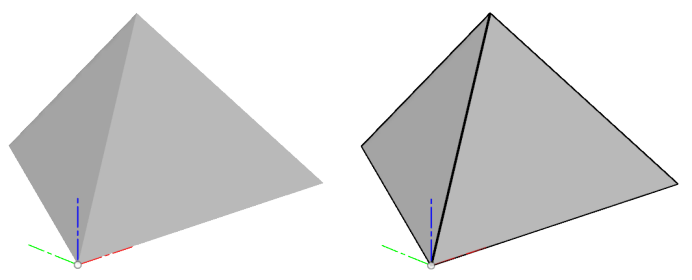

A common use of lines is to draw a series of connected lines, like when drawing a hexagon. When you have a set of connected lines you can use a special option when creating line graphics to create a “line strip”. With a line strip, the first point defines the start of the first line and then each single point after that defines a new line that connects to the previous point. To draw a hexagon in this case you only need 7 indices instead of 12 when drawing individual lines. The tables below illustrate the list of indices that are needed to draw a six-sided polygon using 6 individual lines or a line strip. The line strip is both simpler and more efficient, especially in cases with a lot of points.

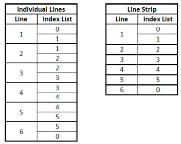

### Point Graphics

Another type of graphics is point graphics. This is used to display a small bitmap at a specific coordinate in space. These typically represent a point in space. The creation of point graphics also uses an index list to indicate which coordinates within a coordinate list you want to use. The API object that represents point graphics is a CustomGraphicsPointSet. It's called a "Set" because it defines a set or group of points that all use the same coordinate list and image. The code below can be added to the pyramid code above to draw points at the four vertices of the pyramid. It uses a file called "TestPoint.png", which can be any image in a png format and placed in the same folder as your py file.

```
# Create a point set to draw points at each vertex of the pyramid.
pointIndices = [0,1,2,3]
points = graphics.addPointSet(coords, pointIndices,
                   adsk.fusion.CustomGraphicsPointTypes.UserDefinedCustomGraphicsPointType,
                   'TestPoint.png')
```

In the above creation of the point set, it specifies that the user-defined point type is to be used, which requires you to specify a png image to use as the graphics of the point. You can also specify a point cloud point type which uses a simple pre-defined point and provides better performance, especially for very large point sets. The image below shows the result of the code above. The image used for the points is also shown scaled up 4 times. Any png image can be used with no limitations on size but it will typically be small images that would represent some type of point.

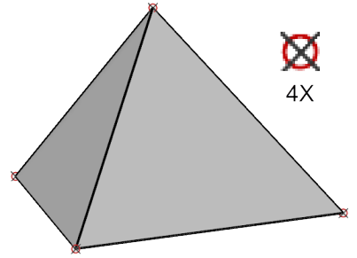

### Text Graphics

Fusion also supports the ability to draw text using custom graphics. There are two primary inputs when creating text. The string that defines the characters that will be displayed and a matrix that defines the position and orientation of the text within model space. In addition you also specify the font and size of the text.

Regarding the matrix to position the text, it's best to think of a matrix as a way to define a coordinate system. When you create a new matrix using the Matrix3D.create method it creates a special type of matrix called an *identity* matrix. This matrix defines a coordinate system whose position is at (0,0,0), the X axis is in the X direction, the Y axis is in the Y direction and the Z axis is in the Z direction. The Matrix3D object supports several methods and properties to extract and set information associated with the matrix. If you're new to working with a matrix, the simplest way to create one that defines and arbitrary position and rotation is to first use the create method to create a matrix and then use the setWithCoordinateSystem where you define the new origin and the directions for the X, Y, and Z axes. The text is placed so that it's lower-left corner is at the origin of the coordinate system and the text lies on the X-Y plane and runs in the positive X direction. The code below demonstrates creating some text graphics.

```
# Draw some text.
text = 'This is the text'
matrix = adsk.core.Matrix3D.create()
graphicsText = graphics.addText(text, 'Arial', 3, matrix)
```

This results in creating the text shown below. I've turned on the display of the base construction geometry so you can see the position and orientation of the text relative to the model coordinate system. The orientation of the text is defined entirely with respect to the model coordinate system. You can see in the picture on the right that as I rotate the view around that the text rotates and is backwards when I view it from the back. There is a section below that describes how to control the [orientation](#Orientation) of all graphics entities, but it's particularly useful when working with text graphics. You can define the text graphics so they're always facing the screen or you can have them so they still rotate with the view but it will automatically flip the text so you can never see the back.

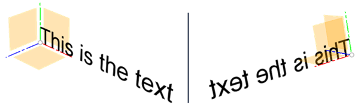

The string that's used to specify the content of the text is not limited to a simple string but can also contain some formatting codes to define some additional behavior. The codes supported are a subset of the codes used by AutoCAD's MTEXT.

**Underline** - \L defines the start of underlined text and \l defines the end. The "l" is a small "L".

**Height** - \Hn; defines the size of the text. \H2; sets the text to be 2 centimeters. \H3x; sets the text to be 3 times the current size.

**Overstrike** - \O defines the start of overstrike text and \o defines the end.

**Slanting** - \Qn; defines the angle to slant text where n is the angle in degrees.

**Width** - \Wn; defines the width of the text where n is a scale of the default width.

**Spacing** - \Tn; defines the spacing of the characters where is a scale of the default spacing and valid values are .75 to 4.

**Paragraphs** - \P defines a new paragraph

The code below demonstrates the various codes.

```
text = 'This is the text.'
matrix = adsk.core.Matrix3D.create()
graphicsText = graphics.addText(text, 'Arial', 3, matrix)

text = 'This is some \Lunderlined\l text.'
matrix.translation = adsk.core.Vector3D.create(0,-5,0)
graphicsText = graphics.addText(text, 'Arial', 3, matrix)

text = 'This is some \H5;larger\H3; text.'
matrix.translation = adsk.core.Vector3D.create(0,-15,0)
graphicsText = graphics.addText(text, 'Arial', 3, matrix)

text = 'This is some \Ooverstrike\o text.'
matrix.translation = adsk.core.Vector3D.create(0,-20,0)
graphicsText = graphics.addText(text, 'Arial', 3, matrix)

text = 'This is some \Q20;slanting\Q0; text.'
matrix.translation = adsk.core.Vector3D.create(0,-25,0)
graphicsText = graphics.addText(text, 'Arial', 3, matrix)

text = 'This is a \W0.5;different\W1; width.'
matrix.translation = adsk.core.Vector3D.create(0,-30,0)
graphicsText = graphics.addText(text, 'Arial', 3, matrix)

text = 'This has \T.75;different \T1.5; spacing \T2;between \T1;the characters.'
matrix.translation = adsk.core.Vector3D.create(0,-35,0)
graphicsText = graphics.addText(text, 'Arial', 3, matrix)

text = 'This is a single text graphics\P with \Pmultiple \Pparagraphs.'
matrix.translation = adsk.core.Vector3D.create(0,-58,0)
graphicsText = graphics.addText(text, 'Arial', 3, matrix)
```

The picture below shows the results.

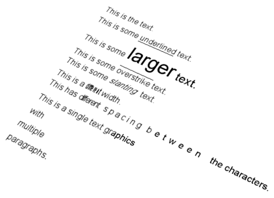

### High-Level Objects

Anything can be represented by drawing lines and triangles, but it can often be difficult to calculate the desired mesh or lines to represent the desired surface or curve. Another problem is that you’re guessing about the tolerance needed in the triangle and line approximation to make them appear smooth. And even if they initially appear smooth the user can zoom in and begin to see the faceting. You can avoid these problems by using higher-level geometry to create graphics.

### B-Rep Body Graphics

The B-Rep body graphics provide a higher level of abstraction when drawing graphics in Fusion. As described earlier, when Fusion displays a body, it is creating triangles and lines to display that body. If there is a sphere or any curved surface, Fusion must decide how many triangles to use to represent that surface. The more triangles used the smoother the surface will appear but it will also take longer to generate the triangles and display them. If the model is zoomed out, a few triangles can adequately represent it, however, as you zoom in more triangles are needed to make sure the smooth surfaces appear smooth. That is the “Level of Detail” functionality discussed earlier. If you use a BRepBody to create graphics, then you’ll automatically get this level of detail functionality and Fusion will automatically generate the triangles for the triangles and lines for the edges to accurately display the geometry.

Creating graphics using a B-Rep body is also simpler than working with triangles because the internal creation of the coordinates, normals, and index lists is all done automatically. Even though you are limited to bodies that already exist in Fusion, these bodies don’t have to be in the same design. If you can access the BRepBody object through the API you can use it to create custom graphics in any design. Currently, you're limited to using B-Rep bodies that have been created using either direct or parametric modeling in Fusion. In the future, the API will support other methods of creating B-Rep data outside of a document and that can also be used as input when creating graphics.

Below is some example code that illustrates the creation of custom graphics using the first body in the root component.

```
import adsk.core, adsk.fusion, traceback

def run(context):
    try:
        des = adsk.fusion.Design.cast(_app.activeProduct)
        root = des.rootComponent

        # Check to see if a custom graphics groups already exists and delete it.
        if root.customGraphicsGroups.count > 0:
            root.customGraphicsGroups.item(0).deleteMe()
            _ui.messageBox('Deleted existing graphics.')
            _app.activeViewport.refresh()
            return

        # Get the first body in the root component.
        body = root.bRepBodies.item(0)

        # Create a graphics group on the root component.
        graphics = root.customGraphicsGroups.add()

        # Create the graphics body.
        graphicBody = graphics.addBRepBody(body)

        # Move the graphics over the width of the body.
        matrix = graphicBody.transform
        matrix.setCell(0, 3, matrix.getCell(0,3) + body.boundingBox.maxPoint.x -
                       body.boundingBox.minPoint.x + 1)
        graphicBody.transform = matrix

        # Refresh the graphics.
        _app.activeViewport.refresh()
    except:
        if _ui:
            _ui.messageBox('Failed:\n{}'.format(traceback.format_exc()))
```

### Curve Graphics

Curve graphics is similar in concept to B-Rep body graphics in that it provides a higher-level of abstraction when drawing wireframe geometry and it lets Fusion take care of figuring out how best to draw it. The following 3D curve geometries can be used to create graphics: Arc3D, Circle3D, Ellipse3D, EllipticalArc3D, Line3D, and NurbsCurve3D. Below is an example that creates and draws each one of these.

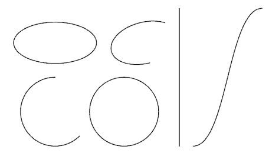

```
import adsk.core, adsk.fusion, traceback
import math

def run(context):
    try:
        des = adsk.fusion.Design.cast(_app.activeProduct)
        root = des.rootComponent

        # Check to see if a custom graphics groups already exists and delete it.
        if root.customGraphicsGroups.count > 0:
            root.customGraphicsGroups.item(0).deleteMe()
            _ui.messageBox('Deleted existing graphics.')
            _app.activeViewport.refresh()
            return

        # Create a graphics group on the root component.
        graphics = root.customGraphicsGroups.add()

        # Create an Arc3D object.
        arc = adsk.core.Arc3D.createByCenter(adsk.core.Point3D.create(0,0,0),
                                             adsk.core.Vector3D.create(0,0,1),
                                             adsk.core.Vector3D.create(1,0,0),
                                             5,
                                             math.pi * 0.5,
                                             math.pi * 1.75)

        # Create a Circle3D object.
        circle = adsk.core.Circle3D.createByCenter(adsk.core.Point3D.create(10,0,0),
                                                   adsk.core.Vector3D.create(0,0,1), 5)

        # Create an Ellipse3D.
        ellipse = adsk.core.Ellipse3D.create(adsk.core.Point3D.create(0,10,0),
                                             adsk.core.Vector3D.create(0,0,1),
                                             adsk.core.Vector3D.create(1,0,0),
                                             6, 3)

        # Create an EllipticalArc3D.
        ellipticalArc = adsk.core.EllipticalArc3D.create(adsk.core.Point3D.create(13,10,0),
                                                         adsk.core.Vector3D.create(0,0,1),
                                                         adsk.core.Vector3D.create(1,0.25,0),
                                                         5, 3, math.pi * 0.25, math.pi * 1.5)

        # Create a Line3D.
        line = adsk.core.Line3D.create(adsk.core.Point3D.create(18,-5,0),
                                       adsk.core.Point3D.create(18,15,0))

        # Create a NurbsCurve3D.
        points = [adsk.core.Point3D.create(20,-5,0), adsk.core.Point3D.create(25,-5,0),
                  adsk.core.Point3D.create(25,15,0), adsk.core.Point3D.create(30,15,0)]
        curve = adsk.core.NurbsCurve3D.createNonRational(points, 3, [0,0,0,0, 1,1,1,1], False)

        # Create the custom graphics using the curves.
        arcGraphics = graphics.addCurve(arc)
        arcGraphics.weight = 1.3
        circleGraphics = graphics.addCurve(circle)
        circleGraphics.weight = 1.3
        ellipseGraphics = graphics.addCurve(ellipse)
        ellipseGraphics.weight = 1.3
        arcGraphics = graphics.addCurve(ellipticalArc)
        arcGraphics.weight = 1.3
        lineGraphics = graphics.addCurve(line)
        lineGraphics.weight = 1.3
        curveGraphics = graphics.addCurve(curve)
        curveGraphics.weight = 1.3

        # Refresh the graphics.
        _app.activeViewport.refresh()
    except:
        if _ui:
            _ui.messageBox('Failed:\n{}'.format(traceback.format_exc()))
```

You may have noticed in the program above that I’m setting the weight of the graphics. This controls the thickness of the drawn curve. Curves support the same options as discussed previously when drawing line graphics. These include the weight, style, and settings to control how the style is applied. You can also control the color, which is described below.

### Graphics Colors

The color of custom graphics is defined by using the color property which is supported on the CustomGraphicsEntity object which means all objects derived from it allow you to set their color. By default, all meshes are drawn as a light gray and lines and curves are black. The CustomGraphicsGroup object is also derived from CustomGraphicsEntity and supports setting its color. As seen previously, all graphics entities are created within a group. If a group is assigned a color, all of the entities within that group will display using that color, as long as the entity has not had a color assigned directly to it. So, the group color applies to everything in the group, but entity colors override the group color.

The color property is a read-write property that is set by passing in one of five objects that are used to define graphics colors. All of the five color types derive from CustomGraphicsColorEffect and they are CustomGraphicsSolidColorEffect, CustomGraphicsBasicMaterialColorEffect, CustomGraphicsAppearanceColorEffect, CustomGraphicsVertexColorEffect, and CustomGraphicsShowThroughColorEffect. A description and example of each one of these are shown below. Each color effect is demonstrated using a spherical mesh and a line strip. The picture below shows the result with the default coloring. Colors can be removed by setting the color property to null in C++ or None in Python.

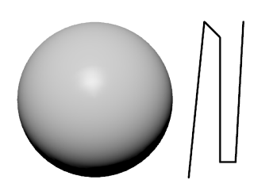

And here’s the code used to create the custom graphics shown above. It uses the first body in the root component, which in the example above is a 10-cm radius sphere centered at the model origin.

```
import adsk.core, adsk.fusion, traceback

def run(context):
    try:
        des = adsk.fusion.Design.cast(_app.activeProduct)
        root = des.rootComponent

        # Check to see if a custom graphics groups already exists and delete it.
        if root.customGraphicsGroups.count > 0:
            root.customGraphicsGroups.item(0).deleteMe()
            _app.activeViewport.refresh()
            return

        # Create a graphics group on the root component.
        graphics = root.customGraphicsGroups.add()

        # Get the first body in the root component.
        body = root.bRepBodies.item(0)

        # Get the display mesh from the body.
        bodyMesh = body.meshManager.displayMeshes.bestMesh

        # Draw the mesh using custom graphics triangles.
        coords = adsk.fusion.CustomGraphicsCoordinates.create(bodyMesh.nodeCoordinatesAsDouble)
        mesh = graphics.addMesh(coords, bodyMesh.nodeIndices,
                                bodyMesh.normalVectorsAsDouble, bodyMesh.nodeIndices)

        # Draw a series of lines.
        linePoints = [12,-10,0, 14,10,0, 16,8,0, 17,0,0, 16,-8,0, 18,-8,0, 19,10,0]
        lineCoords = adsk.fusion.CustomGraphicsCoordinates.create(linePoints)
        lines = graphics.addLines(lineCoords, [], True)
        lines.weight = 1.5

        # Refresh the graphics.
        _app.activeViewport.refresh()
    except:
        if _ui:
            _ui.messageBox('Failed:\n{}'.format(traceback.format_exc()))
```

#### Solid Color Effect

The solid color effect paints the entire object with a single color so you end up just seeing a filled silhouette of the object. This might be useful in some special cases for meshes and B-Rep bodies, (like a special kind of highlighting), but it is typically used to set the color of wireframe geometry. Below is an example of the sphere and line strip that uses the solid color effect. You can see that the sphere just looks like a solid circle now since there isn’t any shading to show the shape. However, this is the best type of coloring to use for wireframe geometry.

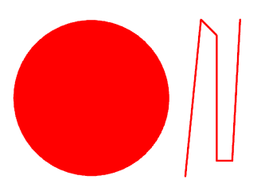

In the code below the variable ‘mesh’ references a CustomGraphicsMesh object and the variable ‘lines’ references a CustomGraphicsLines object and uses their color property to assign a red color to the objects. When creating a color, the first three values are the red, green, and blue components of the color and can be 0 to 255. 256 shades of each color results in the standard 16,777,216 possible colors. The last value is the opacity or it is sometimes also known as “alpha”. This can be used to control the transparency of the graphics where 0 is completely transparent and 255 is completely opaque.

```
# Create the color effect.
redColor = adsk.core.Color.create(255,0,0,255)
solidColor = adsk.fusion.CustomGraphicsSolidColorEffect.create(redColor)

# Assign the effect to the graphics entities.
mesh.color = solidColor
lines.color = solidColor
```

#### Basic Material Color Effect

The basic material color effect shades the model using [Phong](https://en.wikipedia.org/wiki/Blinn%E2%80%93Phong_shading_model) shading and lighting. This will create a much more realistic image because it does consider the shape of the mesh and applies lighting effects when rendering. This type of color effect is the most commonly used for meshes because it lets you color an object with a single color, it looks good, and it doesn’t rely on any appearance libraries. Curves can also use this type of color but it’s not as effective as the solid color effect. There are several parameters that you need to provide when creating a basic material color effect to define the colors and other settings.

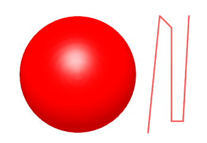

```
# Create the color effect.
diffuse = adsk.core.Color.create(255,0,0,255)
ambient = adsk.core.Color.create(255,0,0,255)
specular = adsk.core.Color.create(255,255,255,255)
emissive = adsk.core.Color.create(0,0,0,255)
glossy = 60
opacity = 1.0
redBasicMaterial = adsk.fusion.CustomGraphicsBasicMaterialColorEffect.create(diffuse,
                                                                             ambient,
                                                                             specular,
                                                                             emissive,
                                                                             glossy,
                                                                             opacity)
# Assign the effect to the graphics entities.
mesh.color = redBasicMaterial
lines.color = redBasicMaterial
```

#### Appearance Color Effect

The appearance color effect renders the object using an appearance from the Fusion appearance library. Just like when assigning an appearance to an occurrence, body, or face, the appearance must first exist within the document. You can see that even appearances with a texture can be applied and even the wireframe geometry is rendered using the appearance.

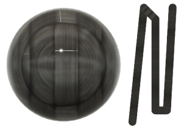

The code below checks to see if the appearance for carbon fiber is already in the document and if not it copies it in and then assigns it to the graphics objects.

```
# Check to see if the appearance already exists in the design.
myCarbon = des.appearances.itemByName('My Carbon')
if not myCarbon:
    # The appearance doesn't exist, so copy it in from the library.
    library = _app.materialLibraries.itemByName('Fusion Appearance Library')

    carbon = library.appearances.itemByName('Carbon Fiber - Plain')
    myCherry = des.appearances.addByCopy(carbon, 'My Carbon')

# Create an appearance color effect using the appearance.
carbonColor = adsk.fusion.CustomGraphicsAppearanceColorEffect.create(myCherry)

# Assign the color effect to the graphics entities.
mesh.color = carbonColor
lines.color = carbonColor
```

#### Vertex Color Effect

The vertex color effect allows you to specify a color for each vertex in the mesh and the triangles will be that color at the vertex. Vertex coloring is only supported for meshes and not lines. Because each vertex can be a different color, the colors will blend across the triangle so it smoothly transitions from one color to another. The most common use of this is to show analysis results where the stresses can be shown on the model and to also draw the legend showing which colors apply to which values.

Below is a picture where the mesh vertices are being colored based on their position in model space. The vertices at the highest Y position are pure red and those at the lowest are pure blue and everything in between is a mixture. To define a vertex color, you set a color for each coordinate in the CustomGraphicsCoordinates object. By default, a coordinate does not have a color assigned. Besides assigning a color to each vertex you also need to specify that the color effect assigned to the graphics object is a vertex color effect.

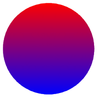

```
# Build up an array of colors for the coordinates based on their Y height for the mesh.
maxY = body.boundingBox.maxPoint.y
minY = body.boundingBox.minPoint.y
colorInfo = []
coord = adsk.core.Point3D.cast(None)
for coord in bodyMesh.nodeCoordinates:
    # Set the color information for the current vertex.  It's computed by
    # determining the percentage of the total Y range of the body this vertex
    # is within.  A color between red and blue is computed based on this percentage.
    # Blue is at the minimum Z and Red is at the maximum Y with blending between.
    red = ((coord.y - minY) / (maxY-minY)) * 255
    blue = ((maxY - coord.y) / (maxY-minY)) * 255

    colorInfo.extend([int(red), 0, int(blue), 255])

# Assign colors to the coordinates.
coords.colors = colorInfo

# Set the mesh to be colored using a vertex color effect.
vertexColor = adsk.fusion.CustomGraphicsVertexColorEffect.create()
mesh.color = vertexColor
```

#### Show Through Color Effect

The show through color effect allows you to specify a single color for the custom graphics entity and define how it interacts with other graphics in the scene. The color is defined using a simple R,G,B definition, which also includes an alpha component that let's you control the transparency of the object itself. The primary difference with this color effect is that it also controls the transparency of objects in front of it, whether they're other custom graphics objects or Fusion objects. The picture below show's an example where the block is a custom graphics object with show through color effect applied with the opaque value of 0.2 and the other objects are standard Fusion bodies. Notice how the block itself is not translucent but the custom graphics block can be seen through the other objects.

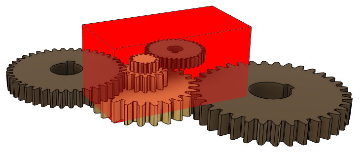

```
# Create the show through color effect.
showThrough = adsk.fusion.CustomGraphicsShowThroughColorEffect.create(adsk.core.Color.create(255, 0, 0, 255), 0.2)
graphicsBody.color = showThrough

# Set the mesh to be colored using the show through color effect.
mesh.color = showThrough
```

### Additional Graphics Behaviors

All the examples above draw the graphics in model space and they behave like you would expect in that when you rotate the view they rotate and when you zoom in and out they get larger and smaller. That is what’s typically used and is the easiest to understand, however, you can override these standard behaviors to get other effects. By default, all custom graphics are drawn using model space coordinates. For example, if you draw a triangle with the coordinates (0,0,0), (4,0,0), (0,2,0) it will result in creating a triangle that lies on the x-y plane whose corner is at the model origin and is 4 cm long in the x-direction and 2 cm tall in the y-direction, as shown below. Geometry drawn in this default manner is the most logical and easiest to understand because it behaves like all other geometry within Fusion; as you scroll, rotate, and zoom in and out, the graphics behave in an expected way, as you can see in the pictures below. The position, orientation, and size are all relative to model space.

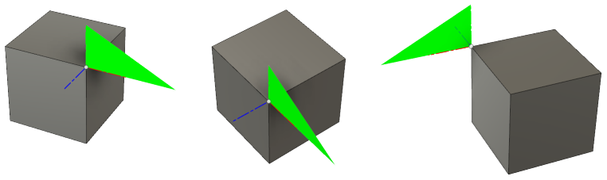

The code below was used to draw the green triangle shown above. The box is a 4x4x4 cm solid box created interactively in Fusion. Notice that when creating the mesh, only the coordinates are passed in and empty lists (arrays) are passed in for the index lists and normals. If each set of 3 coordinates in the coordinate object define the desired triangle there’s no need for an index list. Also, if you don’t specify normals, the API will generate them so the normals are perpendicular to each triangle.

```
import adsk.core, adsk.fusion, traceback

def run(context):
    try:
        des = adsk.fusion.Design.cast(_app.activeProduct)
        root = des.rootComponent

        # Check to see if a custom graphics groups already exists and delete it.
        if root.customGraphicsGroups.count > 0:
            root.customGraphicsGroups.item(0).deleteMe()
            _app.activeViewport.refresh()
            return

        # Create a graphics group on the root component.
        graphics = root.customGraphicsGroups.add()

        trianglePoints = [0,0,0, 4,0,0, 0,2,0]
        triangleCoords = adsk.fusion.CustomGraphicsCoordinates.create(trianglePoints)

        # Create the mesh.
        mesh = graphics.addMesh(triangleCoords, [], [], [])

        diffuse = adsk.core.Color.create(0,255,0,255)
        ambient = adsk.core.Color.create(0,255,0,255)
        specular = adsk.core.Color.create(255,255,255,255)
        emissive = adsk.core.Color.create(0,0,0,255)
        glossy = 60
        opacity = 1.0
        greenBasicMaterial = adsk.fusion.CustomGraphicsBasicMaterialColorEffect.create(diffuse,
                                                                                       ambient,
                                                                                       specular,
                                                                                       emissive,
                                                                                       glossy,
                                                                                       opacity)

        mesh.color = greenBasicMaterial

        # Refresh the graphics.
        _app.activeViewport.refresh()
    except:
        if _ui:
            _ui.messageBox('Failed:\n{}'.format(traceback.format_exc()))
```

#### Orientation

The default orientation of graphics is to orient them with respect to model space. However, it’s also possible to orient them with respect to the view so that as the camera moves around the model, the X-Y plane of the graphics always faces the camera. This is referred to as “front-facing” or “billboarding”. This is commonly used for text, labels, and legends so they can be easily read. When specifying that graphics should be billboarded you need to specify an “anchor” point. This is a position in model space that the graphics are rotated relative to as the view is rotated. In the pictures below, an anchor point of (0, 0, 0) has been specified. The picture on the left shows the front view of the model where the coordinates of the custom graphics and the model align. However, in the picture on the right, the view has been rotated and zoomed out. You can see that the triangle is still facing the view but is fixed at the model (0, 0, 0) coordinate. You can also see that the size of the triangle is still based on model space because it is smaller because of the view being zoomed out.

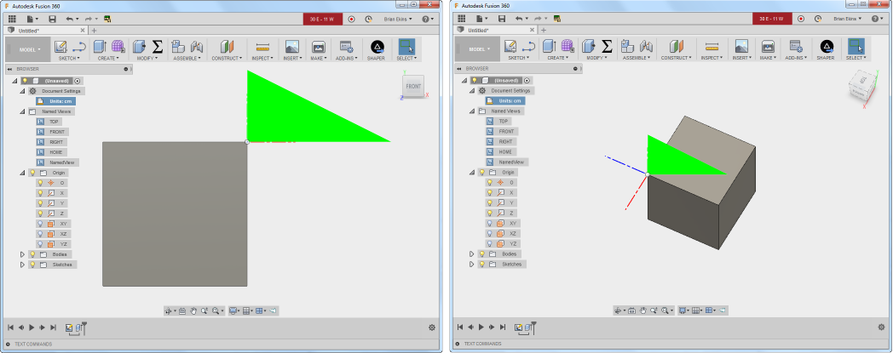

Here’s the code that was added to set the billboarding behavior for the mesh.

```
# Set the mesh to be front foacing and anchored at (0,0,0).
billBoard = adsk.fusion.CustomGraphicsBillBoard.create(adsk.core.Point3D.create(0,0,0))
billBoard.billBoardStyle = adsk.fusion.CustomGraphicsBillBoardStyles.ScreenBillBoardStyle
mesh.billBoarding = billBoard
```

Notice that the code above is setting the style of billboarding to use. In this example, it’s not actually needed because ScreenBillBoardStyle is the default style but there are also two other styles supported. One of them is “right reading”. With this type of billboarding the graphics behave more like non-billboarded graphics in that they rotate with the view, but if you rotate the view far enough that you would see the back of the graphics they automatically flip so you can never see the back. This type is useful for symbols or text that you don’t want to display backwards but should always be readable. The picture on the left shows the triangle positioned within model space but when the view is rotated to look at the back it automatically flips, maintaining the same anchor point. There’s also one other billboarding style that’s like right reading except that you can specify the axis that it will rotate around.

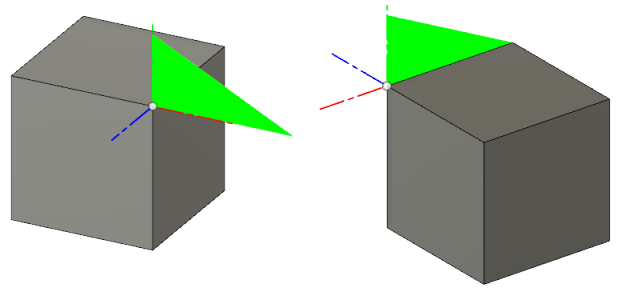

#### Size

Another option to control the display of custom graphics is to specify its size relative to the view instead of model space. The pictures below demonstrate this where the same triangle is drawn but this time its size is defined relative to view space. In this example, it’s not being billboarded so its orientation is still defined with respect to model space and it rotates as the camera is rotated but the size of the graphics is defined with respect to the view so its size is always the same regardless of how you zoom in or out.

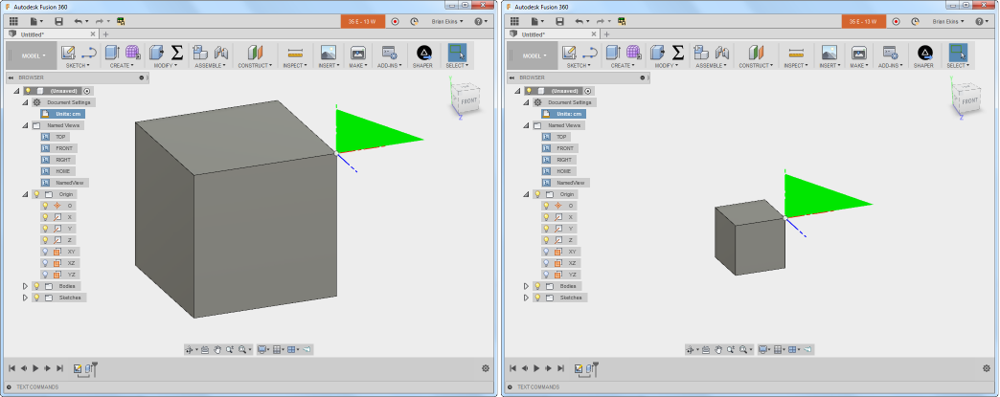

Here’s the code used to define view scaling for the mesh. A CustomGraphicsViewScale object is created and assigned to the viewScale property of the CustomGraphicsMesh object. When creating a CustomGraphicsViewScale object you specify a pixel scale and an anchor point. The anchor point is the same concept as it was for billboarding; it’s the point in model space that the scaling is done relative to. The anchor point of (0,0,0) was used in the example above and you can see that the triangle remains fixed at that location. When you set graphics to be view scaled, the size of the graphics is no longer defined in centimeters but is now in pixels. If I used a scale of 1, the triangle would be drawn 4 pixels long. In the code below I’ve set the scale to be 50 so its length is 200 pixels.

```
# Set the mesh to use view scaling.
viewScale = adsk.fusion.CustomGraphicsViewScale.create(50, adsk.core.Point3D.create(0,0,0))
mesh.viewScale = viewScale
```

#### Combining Orientation and Size

Billboarding and view scaling can also be combined so that the graphics will always face towards the camera and they will stay the same size. This is commonly used for graphics symbols that are placed on the model so they don’t become too large or too small through zooming and they always face the user so they can be easily seen and read. You can see in the pictures below that the triangle’s orientation and size remain the same as the view is rotated and zoomed.

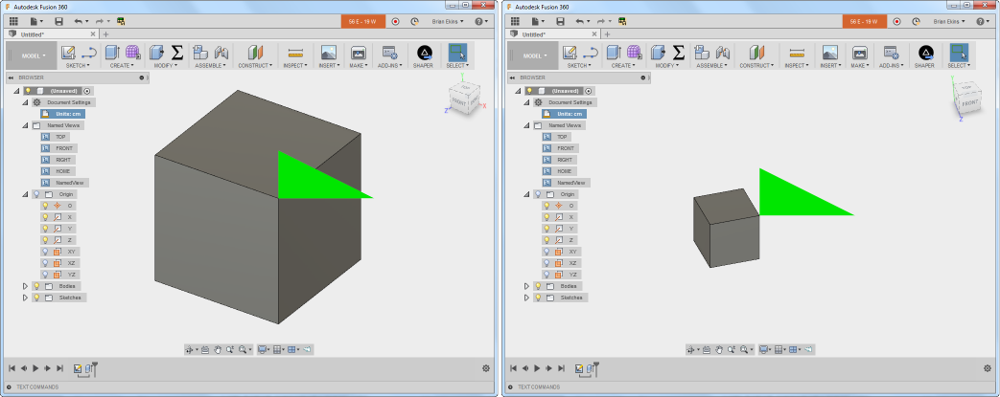

#### Position

In all the examples above, the triangle has been positioned with respect to model space but it’s also possible to define a position with respect to the view. In the example below, it is being positioned relative to the lower-right corner of the view. The scaling has been set to be view-dependent but the orientation is the default model orientation so as the model is rotated the triangle rotates but it stays the same size and stays in the lower-right corner. The view cube in Fusion that you can see in the upper-right corner is implemented this way.

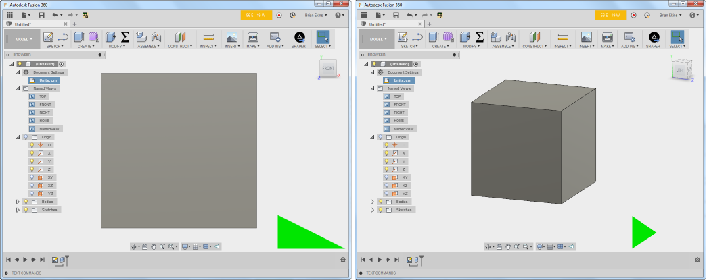

The most common use of this capability is for drawing legends like you would see for the stress legend from a simulation application. In that case, they specify that the graphics position, size, and orientation are all relative to the view so as you manipulate the model, the legend remains fixed in the corner of the view and remains the same size, as shown below.

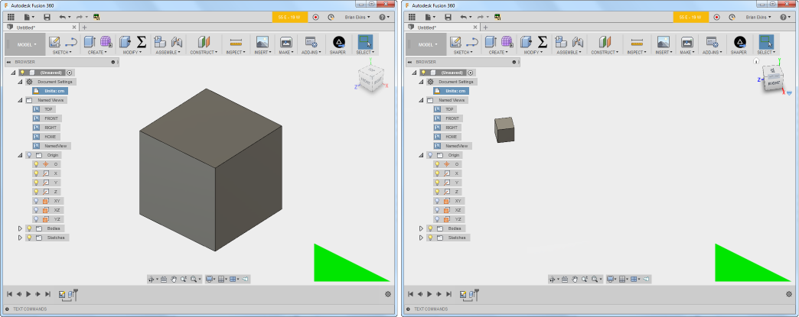

Here’s the code that creates the last example with the triangle.

```
# Set the mesh to be front foacing and anchored at (0,0,0).
billBoard = adsk.fusion.CustomGraphicsBillBoard.create(adsk.core.Point3D.create(0,0,0))
billBoard.billBoardStyle = adsk.fusion.CustomGraphicsBillBoardStyles.ScreenBillBoardStyle
mesh.billBoarding = billBoard

# Set the mesh to use view scaling.
viewScale = adsk.fusion.CustomGraphicsViewScale.create(50, adsk.core.Point3D.create(0,0,0))
mesh.viewScale = viewScale
viewPlace = adsk.fusion.CustomGraphicsViewPlacement.create(adsk.core.Point3D.create(0,0,0),
                                              adsk.fusion.ViewCorners.lowerRightViewCorner,
                                              adsk.core.Point2D.create(210, 10))
mesh.viewPlacement = viewPlace
```

---

|  |  |
| --- | --- |
| © Copyright 2025 Autodesk, Inc. | Comment on this page. |