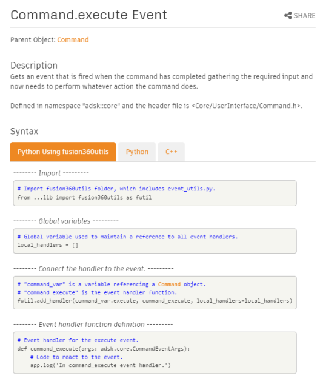

## Events in the Fusion API

Events allow you to receive notifications when specific actions occur within Fusion. Events are a crucial component when creating custom Fusion commands. Through events, your program can know that the user clicked the button associated with your command and interact with the user while your command is running (preview, input validation, selection, execute, etc.).

To implement an event, you need to add a "handler" function to your code and connect that handler to the event. Fusion will call your handler function whenever the related action occurs in Fusion that causes the event to fire. Even though the concept of implementing an event is the same, the actual practice differs from one language to another. Therefore, specifics for setting up events are provided in the topics covering each supported language; [Python](PythonSpecific_UM.htm) and [C++](CPPSpecific_UM.htm). In fact, for Python, there is a Fusion library provided to simplify using events. You can read more about it in the topic about the [Fusion Python Add-In Template.](PythonTemplate_UM.htm)

One thing to be aware of that can significantly simplify adding support for events is the "Syntax" portion of the help for every event shows example code for the event handler and connecting the handler to the event. You can copy and paste this code from the help, make minor edits to a couple of variable names, and you'll have the event implemented. There are two tabs for Python and one for C++. The reason for the two tabs with Python is that the tab labeled "Python Using fusion360utils" uses a library provided when you create a Python add-in. This library simplifies the implementation of events. The "Python" tab illustrates implementing an event handler without help from an external library.

Some basic concepts apply to all events, regardless of your programming language.

1. The initial access to an event is through a property on the object that supports the event. For example, the UserInterface object supports the activeSelectionChanged, commandCreated, commandStarting, and several other events. These are accessed through properties of the same name on the UserInterface object. Events are listed in an "Events" section within the help topic of the object, as shown below.