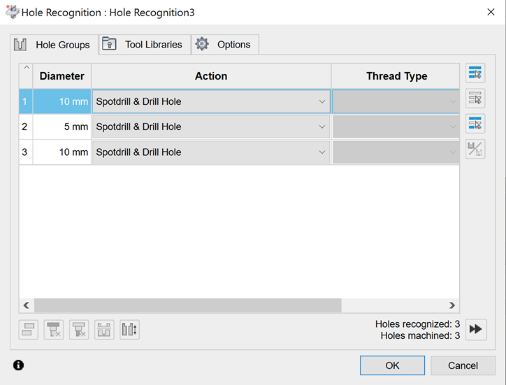
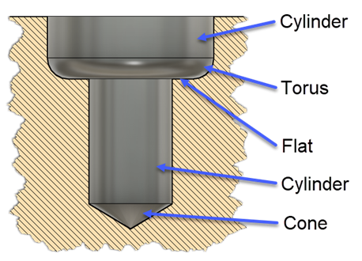
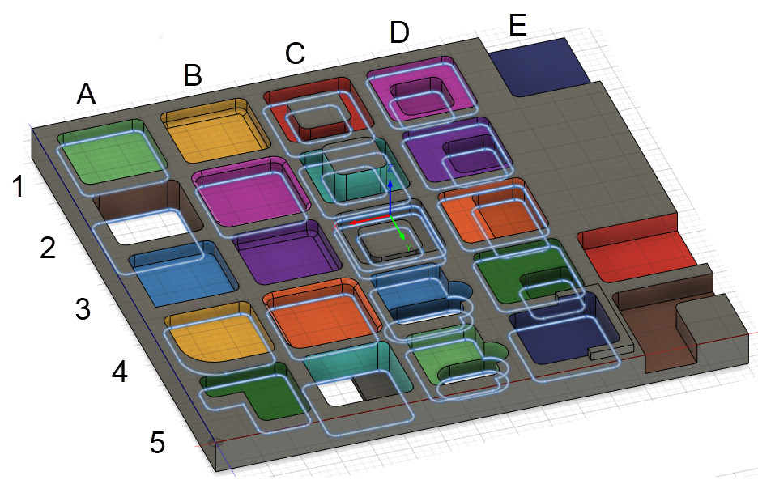

## Feature Recognition in CAM

The CAM library supports feature recognition for holes and pockets. This topic describes the concepts needed to understand and use this capability.

## Hole Recognition

The hole recognition option available via the UI lists all recognized holes and hole groups based on the diameter and segment types. You can then apply a given template to the recognized holes or hole groups.



Using the API, you can recognize holes and hole groups using the `adsk.cam.RecognizedHole.recognizeHoles(bodies)` and `adsk.cam.RecognizedHole.recognizeHoleGroups(bodies)` methods. They both accept an array of bodies for the input and will return all holes for the body regardless or their orientation. Below is an example of a hole containing all possible segment types. Each segment can be a cylinder, flat face, cone, or torus. A hole *signature* is the list of segments that define that hole. Two holes are considered the same when they have the same number of segments in the same direction, and each segment must match the geometry of the other segment and have the same dimensions. The segments are in order from the top of the hole to the bottom. The difference between using the recognizeHoles and recognizeHoleGroups is the recongizeHoles method returns a flat list of all the recognized holes. Whereas the recognizeHoleGroups looks at the signatures of the holes found and combines the holes with the same signature into the same RecognizedHoleGroup.



Below is some sample code that finds all the hole groups in the first body of the Design and writes out information to the TEXT COMMAND window about the hole groups and holes that were found. A [complete sample](HoleAndPocketRecognition_Sample.htm) illustrates using hole recognition to find holes and create operations using that information. One thing to notice about the sample below is that it doesn't activate the CAM workspace. The hole and pocket recognition capabilities can be used within the Design.

|  |
| --- |
| Copy Code |

```
import adsk.core, adsk.fusion, adsk.cam, traceback

_app = adsk.core.Application.get()
_ui = _app.userInterface

def run(context):
    try:
        # Get the first body in the root component.
        des: adsk.fusion.Design = _app.activeDocument.Products.products.itemByProductType('DesignProductType')
        body = des.rootComponent.bRepBodies[0]

        # Recognize the holes in the body.
        holeGroups = adsk.cam.RecognizedHoleGroup.recognizeHoleGroups([body])
        _app.log(f"Hole Group count: {holeGroups.count}")

        # Print out information about the found holes in the TEXT COMMAND window in Fusion.
        holeGroup: adsk.cam.RecognizedHoleGroup
        for holeGroup in holeGroups:
            # Process each hole within this group.
            _app.log(f"   Holes in Group count: {holeGroup.count}")
            hole: adsk.cam.RecognizedHole
            for hole in holeGroup:
                _app.log(f"      Segments in hole: {hole.segmentCount}")
                for i in range(hole.segmentCount):
                    # Display information about each segment of the current hole.
                    segment: adsk.cam.RecognizedHoleSegment = hole.segment(i)

                    _app.log(f'         Segment {i}')
                    if segment.holeSegmentType == adsk.cam.HoleSegmentType.HoleSegmentTypeCone:
                        _app.log(f'            Segment Type: Cone')
                    elif segment.holeSegmentType == adsk.cam.HoleSegmentType.HoleSegmentTypeFlat:
                        _app.log(f'            Segment Type: Flat')
                    elif segment.holeSegmentType == adsk.cam.HoleSegmentType.HoleSegmentTypeCylinder:
                        _app.log(f'            Segment Type: Cylinder')
                    elif segment.holeSegmentType == adsk.cam.HoleSegmentType.HoleSegmentTypeTorus:
                        _app.log(f'            Segment Type: Torus')

    except:
        _ui.messageBox('Failed:\n{}'.format(traceback.format_exc()))
```

## Pocket Recognition

The API for Fusion exposes the algorithm that makes up the "[Pocket Recognition](https://help.autodesk.com/view/fusion360/ENU/?guid=MFG-GEOMETRY-SELECTION-POCKETS)" option available in the Fusion UI as part of geometry selection for the 2D Pocket, 2D Contour, and 2D Chamfer strategies. The functionality is intended to streamline programming for parts that contain many pockets.

In the Fusion user interface, Pocket Recognition allows users to specify a minimum and maximum corner radius and a minimum and maximum depth. Together with the tool direction, this is used to find all the pockets that would be appropriate to machine with a particular tool of specific radius and cutting length, which is the context in which Pocket Recognition is used in the user interface. The API exposes this functionality via the [createNewPocketRecognitionSelection](CurveSelections_createNewPocketRecognitionSelection.htm) method and requires the same inputs as the user interface.

However, the API also exposes much more of the underlying algorithm used in the user interface via the RecognizedPockets object. The API provides a more general and customizable interface that is useful for specific applications. The remainder of this page will only be concerned with this more general functionality. Note that the results from the user interface are deliberately restricted to cases that are relatively certain to generate a toolpath that will be safe (non-gouging). Safety is not considered with what's available through the API, and much more care is required when using this functionality. The returned RecognizedPockets object holds a collection of all the pockets in a given solid model that can be reached from a particular tool direction.

In general, RecognizedPockets can be of these types:

* Pockets with vertical walls parallel to the specified (tool) direction.
* Pockets with closed island boundaries (not necessarily at the same height as the outer boundary).
* Through pockets (no bottom surface at all).
* Pockets with a bottom surface and a variety of corner handling at the corner including fillets, chamfers, sharp corners, and mixtures of these.
* Open contours: pockets with no continuous wall around the bottom of the pocket.
* Pockets with top fillets or chamfers are recognized.
* Nested pockets (with or without shared walls).

The API functions do not support recognizing the following:

* Bosses
* Pockets with draft/angled walls

All of the pockets shown in the image below are recognized:



Here are some comments on the pockets above:

* A1, light green, basic pocket with bottom
* A2, brown, basic through pocket
* A3, blue, basic pocket with interior concave sharp point (would not be machinable, but is recognized)
* A4, yellow, basic pocket with one much larger corner radius
* A5, green, basic pocket with interior convex sharp point (machinable)
* B1, yellow, bottom fillet
* B2, pink, top fillet, recognized
* B3, purple, bottom chamfer
* B4, orange, top chamfer, recognized
* B5, turquoise pocket with partial floor, is identified with a flat bottom
* C1, red, pocket with island
* C2, turquoise, pocket with higher island, reports the same as C1
* C3, gray, pocket with lower island, will be reported as two pockets: a shallow one on top with no island and another below with an island
* C4, blue, pocket with thru slot, will be reported as two pockets: a shallow one on top and another thru pocket below.
* C5, light green, pocket with thru slot, same as C4, but the slot is not tangent to the pocket wall
* D1, pink, nested pocket, will be reported as two pockets, breadth-first
* D2-D4, purple, orange, and green, and all are the same as D1 with different shared walls
* D5, dark blue, pocket with some higher boundaries, reported as one pocket
* E1, E2, E3, dark blue, orange, and brown, all open pockets with different missing walls