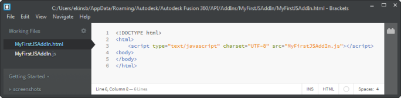
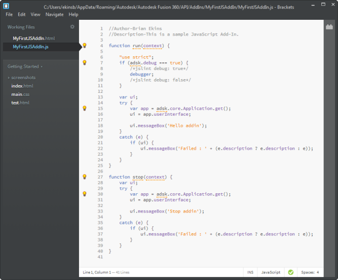
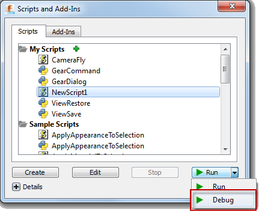
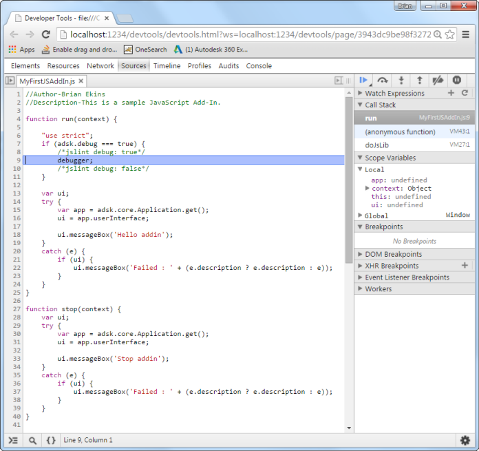
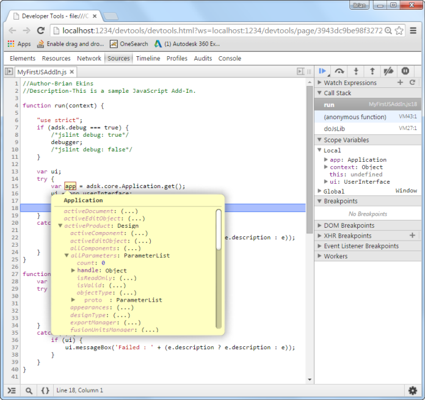

## JavaScript Specific Issues

Fusion has a single API that can be used from several different programming languages. In most cases, the API is used in a very similar way from each of the programming languages with just small language specific syntax changes. However, in some cases there are significant differences in how the API is used because of a particular language. This topic discusses the differences that are unique to JavaScript and covers the subjects listed below.

* [Editing and Debugging](#Editing)
* [Reference Arguments](#Reference Arguments)
* [Object Types](#Object Types)
* [Object Equality](#Object Equality)
* [Events](#Events)
* [OS Utilities](#OS Utilities)
* [Mac Issue when Writing Scripts and Add-Ins](#Mac Load Problem)

### Editing and Debugging a JavaScript Script or Add-In

When editing a JavaScript script, the **Brackets** editor will be displayed where you can view and edit the script. When creating a JavaScript script there are two files created, the JavaScript .js file and an accompanying .html file. The html file is used to specify which JavaScript files to load. The contents of the html file are shown below.



The .js file contains the JavaScript code. When you create a new script or add-in, it contains code with the "run" function that is called by Fusion when the script is loaded. It then gets the Fusion Application object, uses the Application object to get the UserInterface object, and then displays a message box. The Brackets editor and the JavaScript code for a new add-in can be seen below.



The Brackets editor is used solely for editing the JavaScript code and it does not support debugging. In fact you can use any text editor you want to edit the code and are not restricted to using only Brackets. To debug a JavaScript program, select the script in the Scripts Manager and then select the "Debug" option from the drop-down at the bottom of the dialog, as shown below.



A browser window will display in debug mode with the script displayed and running but with execution halted at the debugger statement. You can now add break points and step through the code as shown below.



A very powerful feature of the JavaScript debugger is that while debugging you can hover over any variable and see its value. Variables that reference Fusion objects will show all of the properties for that object. You can click on any property to view its current value. For properties that return objects, this will show all of the properties that the object supports. This provides a "live" view of the Fusion object model. This is shown below using the Application object by hovering over "app" the pop-up window appears. Clicking on the "activeDocument" property expands it and you can see that it returns a FusionDocument object. Clicking on the "design" property you can see that it returns a Design object. You can also see the other properties of the Design object listed.



While debugging you can edit code in the browser window but that that code is temporary and only exists while debugging so any changes you make will be lost once the debugging session ends. You always need to make any edits to the original .js source file.

### Reference Arguments

JavaScript does not support the notion of output or 'by reference' arguments. For example, the Point2D.getData method is documented as:

     boolean Point2D.**getData**( out double ***x***, out double ***y*** )

The ***x*** and ***y*** arguments are of type 'out double' where 'out' indicates a 'by reference' argument. The documentation indicates that this argument will be used as an output argument containing the result values.

The convention used to handle 'by reference' arguments in the JavaScript version of the API is to expect a variable that is set with an Object. The input and/or output value will be set in a value in this object with a key name of 'value'. For example, calling Point2D.getData would be done with the following code.

```
// Pass empty objects to receive the reference values in.
var xVal = {}, yVal = {};
if (point.getData(xVal, yVal)) {
    // xVal.value and yVal.value now contain the Number result values.
	var x = xVal.value;
	var y = yVal.value;
    console.log(x + ', ' + y);
}
```

### Object Types

JavaScript is not a rigid and strongly typed object language. Objects are more dynamic. The API objects do use the prototype inheritance model, so you can use the 'instanceof' operator to query for the type of an object. For example, the following code can be used to determine if the type of a selected entity is a BRepFace.

```
var entity = selection.object;
if (entity instanceof adsk.fusion.BRepFace) {
    // 'entity' is a BRepFace.  Call BRepFace members here.
    var surface = entity.geometry;
}
```

Because JavaScript variables are untyped, code hints in a source code editor such as Brackets have to make guesses based on the context that the variable was obtained from. In the example above, the 'entity' variable was obtained from the adsk.core.Selection.object property, which is defined to return an object of type adsk.core.Base. Because of this, the code hints on the 'entity' variable at design time will be very poor. When you type 'entity.' above, you will only get the code hints for the adsk.core.Base type, and not values from the adsk.fusion.BRepFace type. As an alternative to using 'instanceof' directly, the constructor functions for the various API types can be used as a 'casting' operator. For example, the sample code above could be rewritten as:

```
var face = adsk.fusion.BRepFace(selection.object);
if (face) {
    // Call BRepFace members here.
    var surface = face.geometry;
}
```

The adsk.fusion.BRepFace constructor function call in this case would be implemented with code roughly equivalent to 'return object instanceof adsk.core.BRepFace ? object : null;'. If the argument passed into the constructor function is an instanceof that constructor function, it simply returns that object, else it returns a 'null'. This does two things. First, it provides a way to do type checking. You can test the returned value for null (or 'false-ness') to determine if it is of that type. Second is that because these constructor functions are known to return an instance of that type, the code hints will be for this instance type. So in the example code above, when you type 'face.' you should get proper code hints for the adsk.fusion.BRepFace type as expected. While it is not necessary to use these casting functions, they may be convenient to use.

### Object Equality

It is common to need to compare whether two object variables are pointing to the same object. In JavaScript, two variables will compare as equal ('==' or '===') if both variables reference the exact same object instance.

```
var object1 = {};
var object2 = {};
var object3 = object1;
object1 === object2; // false
object1 === object3; // true
```

Every API function that returns an API object constructs a new JavaScript wrapper object instance and does not attempt to maintain a unique object reference. Therefore, a simple equality check on two API objects obtained from two different API calls will return false when using the '==' or '===' operators. An 'equals' function was added to all API JavaScript objects for use when comparing whether two API object instances reference the exact same object in Fusion.

```
var plane1 = component.constructionPlanes.item(0);
var plane2 = component.constructionPlanes.item(0);
plane1 === plane2; // false
plane1.equals(plane2); // true
```

### Events

The event pattern used by the API consists of an Event object that is the source of events. You would normally implement your own, derived from the EventHandler, and create an instance of your event handler that you would then add and remove from the Event source object. When the event is triggered, your event handler's 'notify' method would be invoked. In the JavaScript API, this pattern has been modified to remove the need for a custom EventHandler derived class. Instead, a function reference, to call when the event is triggered, can be passed directly to the Event's 'add' and 'remove' methods.

```
var onCommandExecuted = function(args) {
    // event handling code goes here
};
...
command.commandCreated.add(onCommandCreated);
```

### OS Utilities

JavaScript code is run in the context of a web browser. When running in a web browser context, access to local system resources (such as the file system, the system registry, etc.) are completely restricted. For JavaScript, the Fusion API provides some utility functions to provide access to these otherwise restricted system resources. These utility functions enable scripts to perform actions such as reading and writing files in the user's file system, which are commonly needed when writing CAD related programs. The following utility functions are provided.

* ### adsk.readFile

  #### Description

  Read and return the contents of a file.
  If `filename` is not found or could not be opened or read, `undefined` is returned.
  If `filename` is successfully read, an `ArrayBuffer` object is returned with the file's byte array.

  #### Syntax

  `adsk.readFile(filename)`

  #### Arguments

  `filename`
  :   The filename String with the full filename (path included) to the file to open and read.
* ### adsk.writeFile

  #### Description

  Write the contents of a file.
  If `data` is a `String` the contents are written to the file with UTF-8 encoding.
  If `data` is an `ArrayBuffer` the contents are written as binary bytes.
  Returns `true` if the data is successfully written to the file.

  #### Syntax

  `adsk.writeFile(filename, data, [mode])`

  #### Arguments

  `filename`
  :   The full filename `String` to the file to open and write to.

  `data`
  :   The `ArrayBuffer` or `String` containing the data to write to the file.

  `mode`
  :   The open mode `String` to use when opening the file.
      Valid values are 'append' and 'truncate'.
      'append' will append `data` to the end of the existing file (if any).
      'truncate', the default mode, will replace the existing contents of the file with `data`.
* ### adsk.copyFile

  #### Description

  Copies the specified file or folder to the destination location.
  Returns `true` if the file or folder was successfully copied.

  #### Syntax

  `adsk.copyFile(fromFilename, toFilename)`

  #### Arguments

  `fromFilename`
  :   The full filename `String` to the file or folder to copy.

  `toFilename`
  :   The full filename `String` to the destination file or folder of the copy.
* ### adsk.renameFile

  #### Description

  Renames the specified file or folder to the new target name.
  Returns `true` if the file or folder was successfully renamed.

  #### Syntax

  `adsk.renameFile(fromFilename, toFilename)`

  #### Arguments

  `fromFilename`
  :   The full filename `String` to the file or folder to rename.

  `toFilename`
  :   The full filename `String` to the new file or folder name.
* ### adsk.removeFile

  #### Description

  Removes the specified file or folder.
  Returns `true` if the file or folder was successfully removed.

  #### Syntax

  `adsk.removeFile(filename)`

  #### Arguments

  `filename`
  :   The full filename `String` to the file or folder to remove.
* ### adsk.createDirectory

  #### Description

  Creates a new folder at the specified location.
  Returns `true` if the folder was successfully created.

  #### Syntax

  `adsk.createDirectory(filename)`

  #### Arguments

  `filename`
  :   The full filename `String` to the new folder to create.
* ### adsk.listDirectoryFiles

  #### Description

  List the files contained in the specified folder.
  Returns a `String` array with the full filename for each file result from the search.
  Returns `undefined` if there was a failure of any kind.

  #### Syntax

  `adsk.listDirectoryFiles(filename, regularFilesOnly, recursive)`

  #### Arguments

  `filename`
  :   The full filename `String` to the folder to list the file contents from.

  `regularFilesOnly`
  :   A `Boolean` value indicating if only conventional disk files should be returned.
      If `true`, files such as symbolic links will not be included in the results.

  `recursive`
  :   A `Boolean` value indicating if subdirectories will be recursively searched.
* ### adsk.fileExists

  #### Description

  Tests if the specified file or folder exists in the filesystem.
  Returns `true` if the file or folder exists.

  #### Syntax

  `adsk.fileExists(filename)`

  #### Arguments

  `filename`
  :   The full filename `String` to the file or folder to look for.
* ### adsk.fileIsDirectory

  #### Description

  Tests if the specified filename is to a folder.
  Returns `true` if the filename was found and if it was a folder.

  #### Syntax

  `adsk.fileIsDirectory(filename)`

  #### Arguments

  `filename`
  :   The full filename `String` to the folder.
* ### adsk.fileSize

  #### Description

  Returns the `Number` size of the file in bytes.
  Returns `undefined` on failure.

  #### Syntax

  `adsk.fileSize(filename)`

  #### Arguments

  `filename`
  :   The full filename `String` to the file.
* ### adsk.tempDirectory

  #### Description

  Returns the full filename `String` to the system temp folder.
  Returns `undefined` on failure.

  #### Syntax

  `adsk.tempDirectory()`
* ### adsk.toBase64

  #### Description

  Encode the specified byte array into a Base64 `String`.
  Returns the Base64 `String`.

  #### Syntax

  `adsk.toBase64(buffer)`

  #### Arguments

  `buffer`
  :   An `ArrayBuffer` of bytes to encode as a Base64 `String`.
* ### adsk.fromBase64

  #### Description

  Decodes the specified Base64 `String` into an array of bytes.
  Returns an `ArrayBuffer` containing the decoded bytes.

  #### Syntax

  `adsk.fromBase64(encoded)`

  #### Arguments

  `encoded`
  :   A `String` containing valid Base64 encodings.
* ### adsk.utf8ToString

  #### Description

  Convert the specified Utf-8 encoded array of bytes to a JavaScript Utf-8 `String`.
  Returns the resulting `String`.

  #### Syntax

  `adsk.utf8ToString(buffer)`

  #### Arguments

  `buffer`
  :   The `Uint8Array` or `ArrayBuffer` containing the Utf-8 encoded byte array.

### Mac Issue when Writing Scripts and Add-Ins

When writing a script or add-in you'll typically make code changes, run the code to find problems, make changes, and then run the code again. To get the latest copy of code the invisible browser instance that Fusion created and that's running the JavaScript needs to refresh and load the latest version of the JavaScript code. With Mac OS X 10.10.2 there is a problem with the Web Toolkit that used to create the browser instance, where it is not re-loading the JavaScript code but continues to use what was initially loaded. This has been acknowledged by Apple as a problem but we don't know when it might be fixed. The current solution is to re-start Fusion to begin a fresh session.

It's important to understand that this problem only affects those writing new scripts or add-ins using JavaScript on Mac. It does not affect Mac users running JavaScript scripts or add-ins on a Mac because they're not changing the code.

Because we don't know when this will be fixed and because it makes writing JavaScript scripts or add-ins very inconvenient, we've developed a temporary workaround that developers can use. The workaround is to manually add a new property to the manifest file of your script or add-in and to comment out the <script> tag in the html file associated with your program. Below is an example of what needs to be added to the manifest.

```
{
	"autodeskProduct": "Fusion360",
	"type": "addin",
	"id": "54a85941-7b07-406a-aedb-e35096f0250c",
	"author": "",
	"description": {
		"": ""
	},
	"version": "",
	"runOnStartup": false,
	"supportedOS": "windows|mac",
	"autodeskLibraries": ["application","dashboard","geometry","materials",
                              "userInterface","utilities","bRep","components",
                              "construction","features","fusion","meshBody",
                              "meshData","sketch","tSpline","cam"],
	"editEnabled": true,
	"dynamicLoad": true
}
```

The code below illlustrates commenting out the <script> tag in the html file.

```
<!DOCTYPE html>
<html>
    <!--<script type="text/javascript" charset="UTF-8" src="MyAddIn.js"></script>-->
<body>
</body>
</html>
```

This results in Fusion dynamically adding the script at runtime along with some additional parameters to force the JavaScript to be loaded each time.

---

|  |  |
| --- | --- |
| © Copyright 2025 Autodesk, Inc. | Comment on this page. |