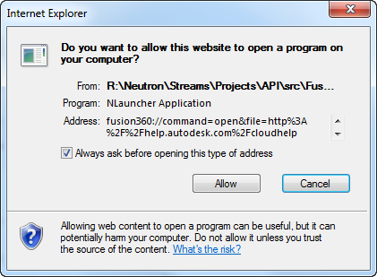

## Opening Files from a Web Page

It’s possible to initiate the opening of files in Fusion from an external web page. This is done by using a “protocol handler”. Protocol handlers are used by web pages to perform a local action. For example the mailto: link invokes a protocol handler that will open your email program. When Fusion is installed it registers a protocol handler, which when referenced by a link in a webpage will open a specified file in Fusion. The file can be either opened as a new design or inserted as a new component into the currently open design. The file can be either local or remote and if Fusion isn’t running it will be started.

To use this protocol you create a link in your html that references the “fusion360” protocol hander. The html code below is a simple example that creates a link that when clicked will open the specified local Fusion file.

```
<a href="fusion360://host/?command=open&file=c%3A%2Ftemp%2FSampleGear.f3d">Open a local file</a>
```

When the user first clicks the link, the browser will display a security dialog, similar to the one shown below, asking them if they want to procede. Depending on how the user answers, they may nor may not be presented with the dialog the next time the protocol handler is invoked. The specific dialog displayed will vary depending on which browser is being used.



To use the Fusion protocol handler you define a URI that begins with “fusion360://”, as highlighted in the example below.

```
<a href="fusion360://host/?command=open&file=c%3A%2Ftemp%2FSampleGear.f3d">Open a local file</a>
```