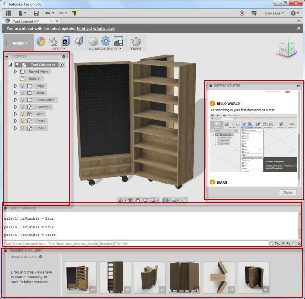
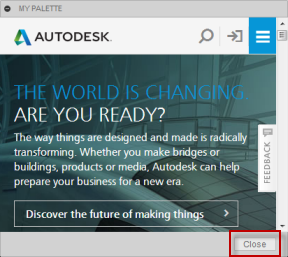
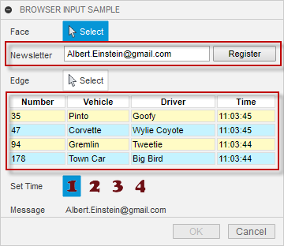

### Palette Introduction

Palettes provide a very different way of interaction than the typical script or command. However, you are already used to seeing and working with palettes because Fusion uses palettes for several built-in capabilities. The image below shows several built-in palettes displayed; the browser, Getting Started, Text Commands, and the Rendering Gallery.



Palettes are very distinct from command dialogs in several ways:

1. A palette is not associated with a command and does not have the same lifetime rules that a command has.
2. A palette remains displayed while the user runs commands and interacts with Fusion.
3. A palette is not associated with a particular document and will remain displayed while the user remains in the currently active workspace.
4. A palette is not defined in the same way as a command. Instead of specifying a list of command inputs like you do when creating a command, the content of a palette is defined by HTML. Using HTML allows you to display anything in a palette in any way that you want, assuming you can define it using HTML. One way to think of a palette is as a floating browser within Fusion.

Your add-in and the HTML/JavaScript code loaded in the palette communicate with each other via events. Your add-in can call a method that results in an event being fired that the JavaScript code associated with the HTML can handle and respond to. The JavaScript associated with the HTML can also call a method that results in an event being fired to your add-in so it can react to changes in the palette. The JavaScript associated with the HTML cannot call the Fusion API. It must pass data to your add-in through the event, and then your add-in can call the API.

Like a command dialog, palettes can be docked to the edges of the Fusion window and other palettes. However, unlike a command dialog, you have complete control over this with a palette.

### Creating Palettes

Palettes are created using the add method of the Palettes collection object, which you obtain from the UserInterface object using its palettes property. Like other collections, you can also get all the existing palettes through this collection, including the standard (built-in) Fusion palettes. For example, the code below creates a new custom palette.

```
palette = _ui.palettes.add('myPalette', 'My Palette', 'palette.html', False, True, True, 300, 200, True)
```

The first argument is the id of the palette, which must be unique with respect to all other palettes that exist in this session of Fusion. The second argument is the name as displayed at the top of the palette. The third argument references the HTML file to load into the palette. The HTML file can be defined using a full path to a file on disk or a relative path relative to the .py, .dll, .dylib file of the add-in. The example above assumes that "palette.html" is in the same location as the .py, .dll, or .dylib file. You can also reference an HTML file on the web using a URL, such as in the example below.

```
palette = _ui.palettes.add('myPalette', 'My Palette', 'http://www.autodesk.com', False, True, True, 300, 200, True)
palette.setPosition(800, 400)
palette.isVisible = True
```

The next three arguments are Boolean arguments that specify if the palette should be visible, if a "Close" button should be displayed, and if the palette should be resizable. By first creating a palette invisibly, you can set some other properties before making it visible, which the example above takes advantage of to set the position. For example, a palette displaying the Autodesk website with a "Close" button is shown below.



The next two arguments define the initial width and height of the palette. The final argument specifies if the palette should use the older CEF (Chromium Embedded Framework) browser or use the new Qt Web Browser within the palette. Fusion is switching from CEF to the Qt Web Browser to support embedded browsers in the product. While this transition occurs, Fusion is supporting both web browsers. This argument is optional and defaults to False, which means existing add-ins that don't specify this argument will behave as before and use the CEF browser. Setting the argument to True will cause the palette to use the new QT Web Browser.

When Fusion completes the transition to the QT Web Browser, support for the CEF browser will be removed from Fusion, and you will always get a QT Web Browser regardless of how the argument is set. Because of this, it is highly recommended you set this argument to true to use the new browser because when support for the CEF browser is removed, you will automatically be forced to use the QT Web Browser. The only known difference between the two is when using the `adsk.fusionSendData` function described below.

### BrowserCommandInput Introduction

BrowserCommandInputs are used as part of a command. They are created the same as all other types of command inputs. In the command created event associated with the command, you call the various add methods on the CommandInputs collection to create the desired command inputs. Once they are created they are similar to palettes with how you interact with them.

The picture below is a simple example where two BrowserCommandInputs have been added to the command dialog. BrowserCommandInputs behave like other command inputs in that they are displayed in the same sequence they were created, and they have a name displayed on the left with the browser on the right. The first BrowserCommandInput looks very similar to a textbox command input but adds a button beside the text field.



The second BrowserCommandInput demonstrates creating a table that is difficult with standard command inputs. It is possible to use a TableCommandInput to display tabular data, but the TabCommandInput is used to arrange other command inputs, not to display data. With a BrowserCommandInput, a table is easily defined in HTML. Notice that in this case, it doesn't have a name to the left. All command input types can expand to the entire width of the dialog by setting their isFullWidth property to True.

### Communication Between the Add-In and the Palette or BrowserCommandInput

Being able to have a floating browser window or a browser in your command dialog is useful but not very powerful by itself, especially when you want to use it for interaction with the user and the model. The referenced HTML can be very sophisticated, where you can use CSS and JavaScript code to make the content of the palette or command input dynamic. But where it can become much more powerful is when your add-in and the JavaScript associated with the HTML communicate. This two-way communication allows your add-in to send information to the HTML and for your HTML to send information to your add-in. This communication is done through events.

To pass information from your add-in to the JavaScript associated with the HTML, you call the sendInfoToHTML method of the Palette or BrowserCommandInput object that you created, as shown below. Two arguments let you pass two strings to the JavaScript code through the event. The first argument is the "action" argument and can be used as a qualifier to indicate what type of data is being passed. The second argument is the data itself which will often be a JSON string containing whatever information you need to pass. That's the regular use of the arguments, but Fusion doesn't validate the data being passed and makes no assumptions about what they contain so you can choose to use them in any way you want.

```
retVal = palette.sendInfoToHTML('send', 'This is the data.')
```