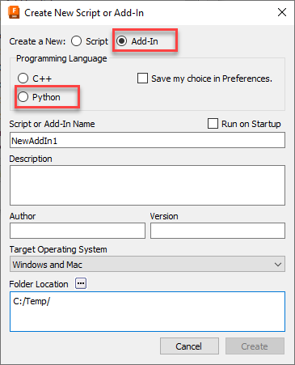
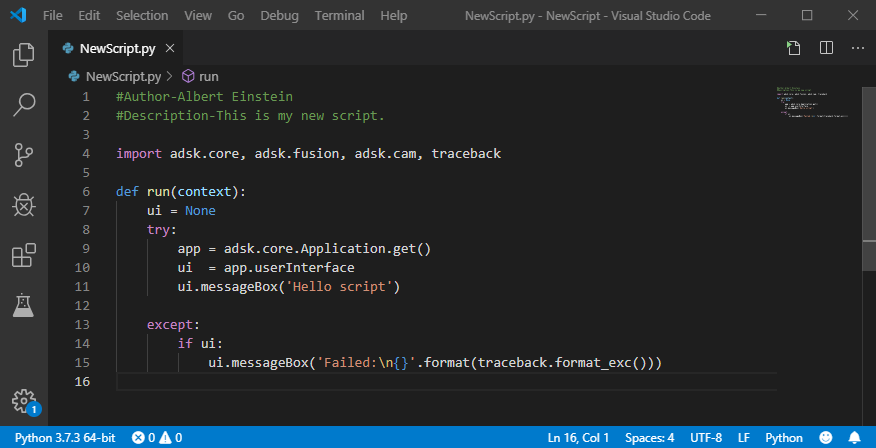
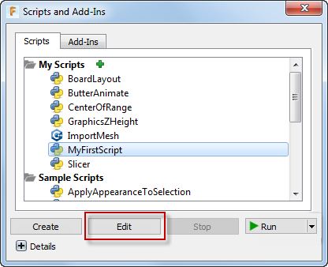
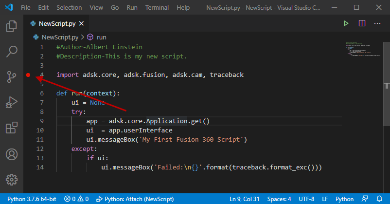
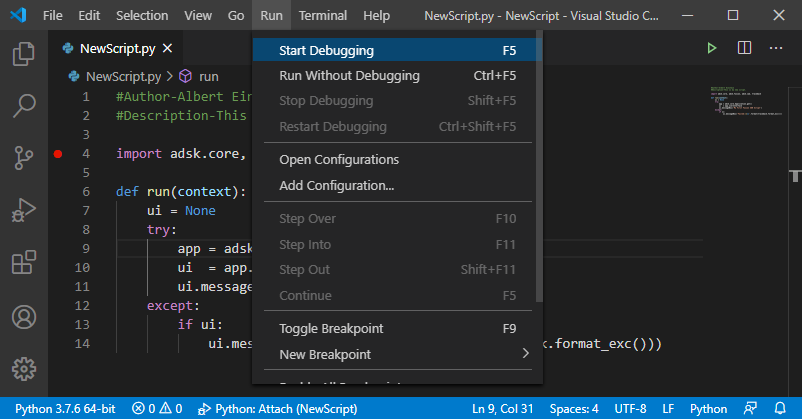
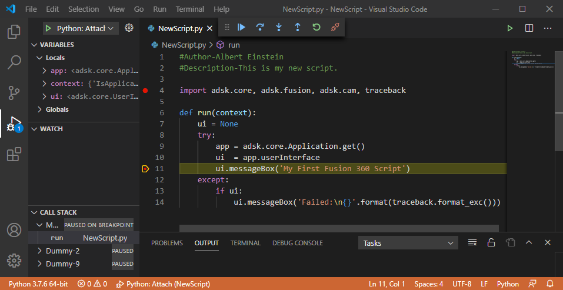
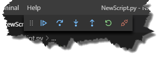
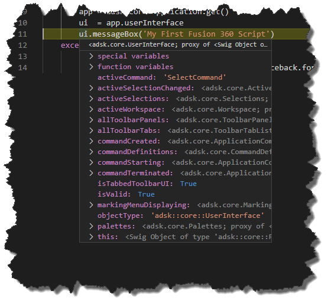
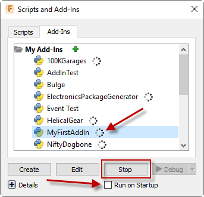

## Python Specific Issues

Fusion has a single API that can be used from either Python or C++. In most cases, the API is used in a very similar way regardless of the programming languages with just small language specific syntax changes. However, in some cases there are significant differences in how the API is used because of a particular language. This topic discusses the differences that are unique to Python and covers the subjects listed below.

* [Creating Add-Ins with Python](#CreatingAddIns)
* [Editing and Debugging](#Editing)
* [Reference Arguments](#Reference Arguments)
* [Working with Collections and Arrays](#Working with Collections)
* [Object Types](#Object Types)
* [Object Equality](#Object Equality)
* [Code Hints](#CodeHints)
* [Additional Python Modules](#Additional Python Modules)
* [Miscellaneous](#Miscellaneous)

### Creating Add-Ins with Python

To create a new Python add-in you use the "Create" button in the **Scripts and Add-Ins** dialog to display the "Create New Script or Add-In" dialog and choose "Python" as the programming language, as shown below.



Creating a new Python add-in will create a full add-in that you can immediately run. It provides a framework that you can edit to modify it to support the functionality your add-in requires. You can read more about the add-in template it creates and how to use it in the [Python Add-In Template](PythonTemplate_UM.htm) topic in the User Manual.

### Editing and Debugging a Python Script or Add-In

When editing or debugging a Python script or add-in, the VS Code IDE (Integrated Development Environment) will be displayed. The VS Code IDE and the Python code created for a new script can be seen below.



An important feature of any development environment is the ability to debug your program. To debug Python code, VS Code requires the optional “**ms-python.python**” extension. This extension is automatically installed the first time Fusion opens VS Code.

You can edit your script or add-in from within VS Code by running the **Scripts and Add-Ins** command, selecting the script or add-in, and clicking the "Edit" button, as shown below.



This will open the script in VS Code. Click on the left edge of the code window to add break points where you want execution to stop while debugging, as shown below.



To start debugging, run the "Start Debugging" command by running it from the "Run" menu, as shown below, or using F5. Fusion will start executing your script but will stop execution at the first break point it hits.



The picture below shows VS Code after we've started debugging the script. Execution has stopped at a breakpoint at the messageBox line and some other windows are now displayed with some additional information that can be useful when debugging.



Once you've started debugging you can use the debug commands in the toolbar that pops up, or keyboard shortcuts, to control stepping through your code. VS Code supports the typical options to step through your code where can:

* Continue running until the next breakpoint is hit.
* Step line-by-line stepping over any function calls.
* Step into a function.
* Step out of the current function.
* Restart debugging. This doesn't currently work with Fusion Scripts or Add-Ins.
* Disconnect the debugging session. When you've finished debugging you'll need to click this button to stop debugging. You can then further edit your program and start debugging again.



VS Code provides a rich debugging environment where you can see the current values of variables in the **VARIABLES** pane of the Debug Side Bar and add specific variables to the **WATCH** pane. You can also hover the mouse over variables and VS Code will display the value of the variable or the values of all of the properties associated with an object. Below is the result when I hover over the variable called ui that's referencing the UserInterface object. It shows all of the properties the UserInterface object supports and their current values.



When you've finished debugging click the "Disconnect" button to stop debugging. You can then further edit your program and start debugging again. When debugging a script you can stop and restart it over an over again from within VS Code. Debugging an add-in is slightly different.

When you run a script, Fusion loads the script, runs it, and unloads it. Add-ins are different in that they are typically automatically loaded and run by Fusion when Fusion starts. They continue to run in the background until Fusion is shutdown. Before debugging an add-in you need to make sure it isn't already running, and if it was you need to stop it. While initially writing your add-in it's good pracitve to uncheck the "Run on Startup" setting (as shown below) in the "Scripts and Add-Ins" dialog so Fusion doesn't automatically start it on start-up. Add-ins that are running will have the little wheel beside them. if it's running, click the "Stop" button. Now you can debug the add-in.



Start debugging the add-in from within VS Code the same way as you would debug a script. Fusion loads the add-in and calls the run method, just like it does for scripts. Typically an add-in will create it's user-interface and connect to events in the run method and then run in the background waiting for an event to fire. Starting to debug the add-in will execute the run method and then appear to be done but the add-in is still running but waiting to respond to an event which is typically the execution of one of its commands. Switch to Fusion and run the add-in command. Any break points in the command created event handler will now be hit and you can debug the command execution.

When an add-in is stopped using the "Stop" button in the "Script and Add-Ins Dialog", Fusion calls the add-in's stop method to allow it to clean up before it's unloaded. Typically, the stop function removes any user-interface items the add-in added when it was loaded. To stop an add-in in a controlled way, you can switch back to Fusion and from the "Scripts and Add-Ins" dialog, choose the add-in and click "Stop". This will cause the stop method to be called and any break points will be hit allowing you to debug the stop function.

If you intentionaly disconnect the debugging session or are forced to stop debugging because of a bug, you'll halt the execution of the add-in before it has a chance to stop. Even though you've disconnected the debugger, the add-in is still running in Fusion. You can stop it using the "Scripts and Add-Ins" dialog. However, if you start debugging the add-in from VS Code, Fusion will call the add-in's stop method before starting the new debug session.

### Reference Arguments

Python does not support output or 'by reference' arguments. For example, the Point3D.getData method is designed as:

     boolean Point3D.**getData**( out double ***x***, out double ***y***, out double ***z*** )

The ***x***, ***y*** and ***z*** arguments are of type 'out double' where 'out' indicates a 'by reference' argument. The documentation indicates that this argument will be used as an output argument containing the result.

In Python, all function outputs are returned as the function's single return value, which for Python will be a tuple if there are any out arguments. The first value in the tuple will always be the documented return value of the function. The other values will be the out arguments in the same order as they are listed in the argument list. The example below illustrates calling the Point3D.getData function and directly assigning the results into variables.

```
(retVal, x, y, z) = point.getData()
```

### Working with Collections and Arrays

Fusion collection objects are any object that supports the count property and item method, (and typically many other functions too). The wrappers that are generated for collections for the Fusion Python interface support the standard Python container iteration and length syntax so you can choose between using count and item or the more Python friendly iterator. For example, instead of:

```
for i in range(col.count):
    item = col.item(i)
    ...
```

You can use this instead:

```
for item in col:
    ...
```

You can also use the len function so instead of `col.count` you can use `len(col)`.

For accessing a specific item within a collection you can use the Fusion API provided item method or you can use the standard Python container accessor so instead of using `col.item(i)` you can use `col[i]`. In addition to this, because collections are using a standard Python container you can also use the container "slice" syntax to get a subset of items from a collection. For example:

```
* col[0]   # Get the first item in the container.
* col[-1]  # Get the last item in the container.
* col[:2]  # Get the first two items in the container as a list.
* col[-2:] # Get the last two items in the container as a list.
* col[1:4] # Get the second, third and fourth items in the container as a list.
```

The API also frequently uses what is referred to in the documentation as an "array". The term "array" is used generically in the API
documentation and describes different things depending on the language being used. When using C++, std::vector is used to input and output a list of items. When an array is specified as input, you can create a Python List or Tuple and use that. However, when an array is returned from a method or property, it's not returned as a standard Python List but is a special API-specific object called "vector". Typically, you won't notice this isn't a List because it supports Python iteration like a List does. However, there are other things that a list supports that a vector does not. For example, you can't use append to add items. You can easily convert the vector into a standard Python List, as shown in the example below.

```
# Explode the sketch text and get the resulting curves.
curves = skText.explode()

# Convert the returned vector into a Python List.
curvesList = list(curves)
```