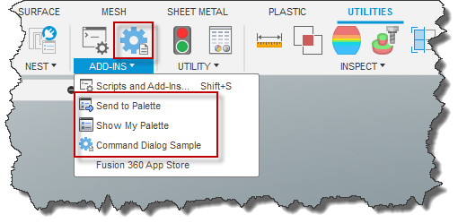
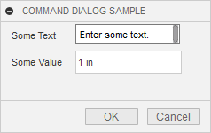
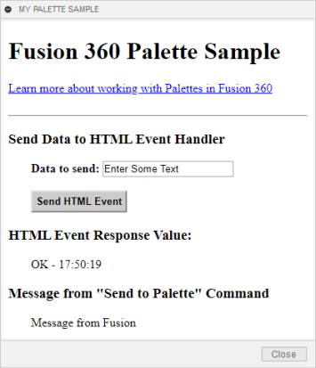
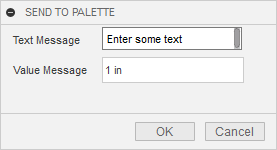
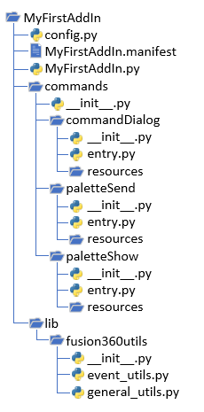
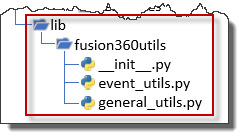
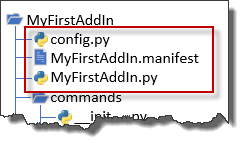

# Introduction to the Python Add-In Template

Since add-ins were first supported in Fusion, the code shown below was created when you created a new add-in.

```
import adsk.core, adsk.fusion, traceback

def run(context):
    ui = None
    try:
        app = adsk.core.Application.get()
        ui = app.userInterface
        ui.messageBox('Hello addin')
    except:
        if ui:
            ui.messageBox('Failed:\n{}'.format(traceback.format_exc()))

def stop(context):
    ui = None
    try:
        app = adsk.core.Application.get()
        ui = app.userInterface
        ui.messageBox('Stop addin')
    except:
        if ui:
            ui.messageBox('Failed:\n{}'.format(traceback.format_exc()))
```

This code is a valid add-in and demonstrates the bare minimum functionality of an add-in: automatically load at start-up, continue running the entire fusion session or until the user explicitly unloads it, and handle when the add-in is unloaded. This add-in has these capabilities but does nothing to illustrate how to take advantage of them and create a useful add-in.

When you create a new add-in now, a small add-in (referred to as the add-in template) is created that demonstrates the API capabilities typically used within an add-in and provides a framework to simplify development. If you run the add-in after creating it, you will see that it adds three new commands into the ADD-INS panel, as shown below.



Here's a quick summary of the functionality each of the three commands demonstrates.

**Command Dialog Sample** – This command illustrates what at least 95% of all commands do; add a button to the UI, display a command dialog to get information from the user, and do something when the OK button is clicked. When you run this command, the dialog shown below is displayed.



You can use this command to jump-start the creation of your commands that use a dialog. The things you'll change are the location of the command button in the UI, the icon, the name of the command, the inputs in the dialog you need the user to provide, and the action that occurs when the user clicks OK. How you'll make these changes is described in more detail below when we look at the add-in code.

**Show My Palette** – This command illustrates the basics of using the [palette](Palettes_UM.htm) functionality of the API, and when you click it, the dialog shown below is displayed. A palette is a dialog whose content is defined by rendering an HTML file. This sample command demonstrates how to display a palette and how your HTML and associated JavaScript can interact with your add-in.



**Send to Palette** – This command works with the palette created by the previous command and demonstrates how your add-in can interact with the HTML and JavaScript associated with the palette. Before running this command, you should run the **Show My Palette** command, so the palette is displayed. When you run this command, the dialog shown below is displayed. You can edit the values in the dialog and click OK; the information will be displayed in the palette.



# Modifying the New Add-In

In addition to demonstrating the add-in functionality, the newly created add-in also uses an architecture that makes extending the add-in to support additional commands much easier than it has been in the past. First, let's look at the details of what is created when you create a new Python add-in. Below is the complete folder structure of a new add-in.



## Add-In Library Files



## Basic Add-In Files



The **MyFirstAddIn.py** file contains the run and stop functions, which are called by Fusion when the add-in is loaded and unloaded. The code in this .py is very simple since all the run function does is call another function to load the commands. And all the stop function does is call two functions; one to clean up the UI and another to unload the commands, as shown below. Because this code is generic, you don't need to edit this .py file.

```
# Assuming you have not changed the general structure
# of the add-in no modification is needed in this file.
from . import commands
from .lib import fusion360utils as futil

def run(context):
    try:
        # This will run the start function in each of your
        # commands as defined in commands/__init__.py
        commands.start()
    except:
        futil.handle_error('run')

def stop(context):
    try:
        # Remove all of the event handlers your app has created.
        futil.clear_handlers()

        # This will run the stop function in each of your
        # commands as defined in commands/__init__.py
        commands.stop()
    except:
        futil.handle_error('stop')
```