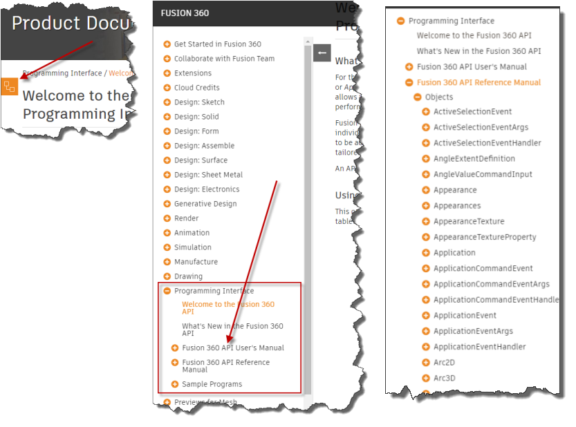
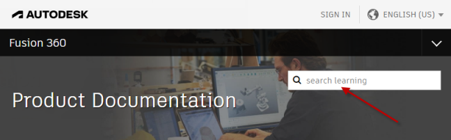

## Fusion API Reference Manual

The reference manual is the heart of the API documentation and provides detailed information about the full Fusion API. The reference manual content is only accessible through the table of contents. On a computer, the table of contents is typically visible to the left of the content you are reading now. If the browser size is narrow or you're reading this on a smaller device, the table of contents might be collapsed. Look for the table of contents icon, as shown below on the left. Clicking this will open the table of contents as shown in the center below and clicking the "+" beside "Fusion API Reference Manual" will expand the tree to give you access to the full content of the reference manual, as shown below on the right.

The reference manual is the part of the API documentation that you'll use continually as you write Fusion programs. The "Objects" topic provides access to an alphabetical list of all of the programming objects exposed by the API. Selecting an object will display a topic that provides the following information:

* A description of that object.
* A list of the methods the object supports.
* A list of the properties the object supports.
* A list of the events the object supports.
* A list of other objects derived from the object.
* A list of properties and methods that return the object. This is useful in understanding how you might access the object.
* A list of samples where the object is demonstrated.

Selecting a method, property, or event will display a topic that provides details for that specific method, property, or event. A description of the method, property, or event is shown and an example demonstrating how to call it in each of the supported languages is displayed along with a description of each of the arguments and the return value. A list of sample programs that use the method, property, or event is also displayed.

## Searching the API Documentation

The Fusion help system has built-in support for searching. There is a search field near the top of the page, as shown below. Using this help supports filters to restrict the results but still often ends up with a large list of results that can be difficult to refine and pick the most appropriate topic. Better search results can usually be achieved by using a Google search. The entire help system is indexed by Google.

