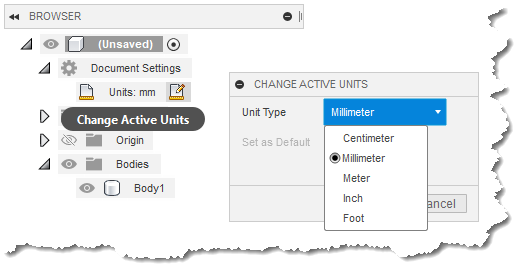

## Understanding Units in Fusion

Understanding how Fusion uses units is very important in successfully using the API. When using the API the units used by Fusion are always consistent. Getting and setting values always use the internal unit type for that category of units. These unit types are known as database units because these are the same units that Fusion uses internally and how data is saved in the file. There are some differences in the unit types used in Design and CAM. For Design, these units are:

     Lengths - Centimeters (cm)
     Angles - Radians (rad)
     Mass - Kilograms (kg)

For CAM, the units used by the API are:

     Length - centimeters (cm)
     Angle - degrees (deg)
     Linear velocity – millimeters per minute (mm/min)
     Rotational velocity - revolutions per minute (rpm)
     Time - seconds (s)
     Weight - kilograms (kg)
     Power - Watts (W)
     Flow rate - liters/minute (l/min)
     Area - square centimeters (cm²)
     Volume - cubic centimeters (cm³)
     Temperature - degrees Celsius (C)

The internal units always use these types without any exceptions. For example, if you call the SketchCurve.length property to get the length of an entity in a sketch, the value returned will always be in centimeters. If you use the Vector3D.angleTo method to measure the angle between two vectors, the resulting angle will always be returned in radians (remember that π radians equals 180 degrees). At first this might not seem ideal because you might want to work in other units. However, this actually makes most things easier because you can always count on the units being consistent and don't have to worry about the current active unit which the user can change. You just write your program to work in the units listed above and it will always work as expected regardless of the active units. The only time you need to worry about unit conversions is when you need to interact with the user by having them enter a value or to display a value.

### Units when Communicating with the User

Units become a bit more complicated when interacting with the user. This is because of several reasons. First, the user can choose one of several length units as the default as shown below. This has the side effect of also setting the default mass units. For example, if you choose inches the mass unit is pounds, but if you choose centimeters it is grams. Angles for the user are always in degrees.



A second reason working with the user is more difficult is because when the user enters a value the result is a string that needs to be evaluated to make sure what they entered is valid and then interpreted into a real value. A third reason is that what they enter doesn't necessarily have to be a simple value. Here are three examples of valid entries when specifying the depth of a hole:

* "3" - In this case the result depends on what the user has chosen as the active unit. For example, if they've chosen inches this is interpreted as 3 inches and if they've chosen millimeters this is interpreted as 3 millimeters.
* "3 in" - In this case this is always interpreted as 3 inches, regardless of what the active unit is.
* "3/2" - This results in 3 units of the active unit divided by 2.
* "hole\_depth" - This references an existing parameter. Of course they could also use this as part of an equation, i.e. "hole\_depth / 2".

Because the user has a lot of flexibility in the way they can specify values and because they can also change the active unit it would be difficult to write code to correctly interpret any string entered by the user. To help with this, the API supports some utilities that convert a user string into internal units. This allows you to take any of the strings in the example above and convert them to a distance value in database units (centimeters).

This is also how Fusion works internally. Any time a user enters any data, it is a string and Fusion has to parse the string and figure out if it's valid and what the real value is. It converts the string into the real value in database units and uses that for all operations within Fusion. If a value needs to be displayed to the user, a string is created that is based on the current active unit and other unit settings and displayed to the user.

### Using the UnitsManager Object

The UnitsManager object supports functions that make working with units much easier. The code below prompts the user to enter a length using the input box. The input box allows the user to enter any string without any expectation on what the string represents. The code then validates that the entry is a valid length expression and then displays the evaluated results in centimeters.

```
# Prompt the user for a string and validate it's valid.
isValid = False
input = '1 in'  # The initial default value.
while not isValid:
    # Get a string from the user.
    (input, isCancelled) = ui.inputBox('Enter a distance', 'Distance', input)

    # Exit the program if the dialog was cancelled.
    if isCancelled:
        adsk.terminate()
        return

    # Check that a valid length was entered.
    unitsMgr = design.unitsManager
    if unitsMgr.isValidExpression(input, unitsMgr.defaultLengthUnits):
        realValue = unitsMgr.evaluateExpression(input, unitsMgr.defaultLengthUnits)
        isValid = True
    else:
        # Invalid expression so display an error and set the flag to allow them
        # to enter a value again.
        ui.messageBox('"' + input + '" is not a valid length expression.', 'Invalid entry',
                    adsk.core.MessageBoxButtonTypes.OKButtonType,
                    adsk.core.MessageBoxIconTypes.CriticalIconType)
        isValid = False

# Use the value for something.
ui.messageBox('Input: ' + input + '\nResult: ' + str(realValue) + ' cm')
```