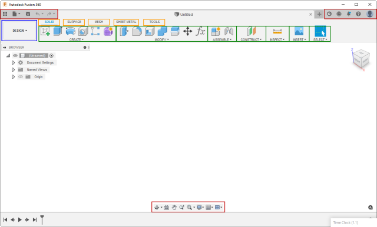

## Table of Contents

[User-Interface Customization with Fusion's API](#Introduction)
[Structure of the User Interface](#Structure)
     [Toolbars](#Toolbars)
     [Workspaces](#Workspaces)
     [Toolbar Tabs](#ToolbarTabs)
     [Toolbar Panels](#ToolbarPanels)
[Contents of the User Interface](#Contents)
     [Controls](#Controls)
     [CommandDefinitions](#CommandDefinitions)
[Cleaning up Your Commands](#CleaningUp)
[Command Icons](#IconsForCommands)
[Positioning Your Controls](#PositioningControls)

## User Interface Customization with Fusion's API

There are two concepts when customizing Fusion’s user interface: adding buttons to allow the user to run commands and creating custom dialogs for your commands. This topic discusses adding buttons to Fusion’s user interface. The creation and use of command dialogs are discussed separately as part of the discussion on [commands](Commands_UM.htm).

Whenever you add a button to Fusion’s user interface, you must carefully consider where it will go. There is a limited amount of room, and if every add-in writer puts their command in a permanently visible area, there won’t be room for all the commands. Consider what your command does and where the user would logically look for similar functionality. For example, if a command modifies an existing model, it should probably be added to the MODIFY panel in the Design workspace. If it helps control how the design is viewed, it should probably go in the Navigation toolbar at the bottom of the window. You should only consider adding new tabs or panels if your command does something unique from other Fusion functionality.

When dissecting Fusion’s user interface, it can be broken down into two main topics; structure and contents.

### Structure of the User Interface

As shown below, several elements structure how the commands are presented in the user interface. The workspace is shown in blue, the toolbars in red, the toolbar tabs in yellow, and the toolbar panels in green. The toolbar controls represent the buttons in toolbars and panels, which are discussed in the “Contents” section below.



#### Toolbars

A toolbar is a container for controls. A control can be a command button or a drop-down containing more controls, as described below. There are several available toolbars, but three are always displayed. The content of these three is context-independent, so it remains the same regardless of what’s happening in Fusion. Each toolbar and all other user interface elements have unique IDs that you can use to access a specific toolbar.

The toolbar in the upper left is the QAT or Quick Access Toolbar. Its ID is “QAT”. It provides access to all the file-related commands. The toolbar in the upper right provides access to the user account and help-related commands, and its ID is “QATRight”. Finally, the toolbar at the bottom center of the window is the navigation toolbar and has all the view-related commands, and its ID is “NavToolbar”.

All toolbars are accessible from the UserInterface object through its toolbars property, which returns a Toolbars object. When you know a specific toolbar's ID, you can use the itemById property on this object to get it. The sample Python code below gets the Toolbar object that represents the QAT.

```
app = adsk.core.Application.get()
ui = app.userInterface

qatToolbar = ui.toolbars.itemById('QAT')
```