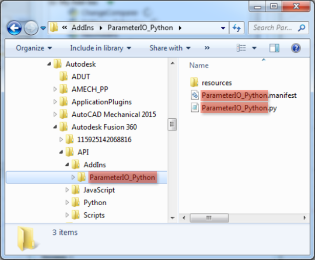
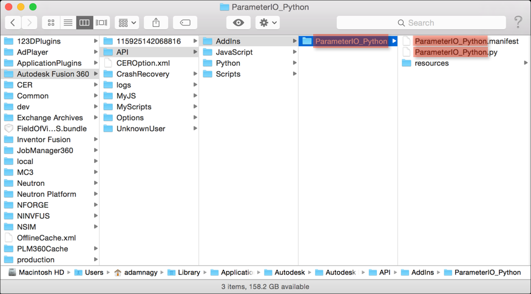
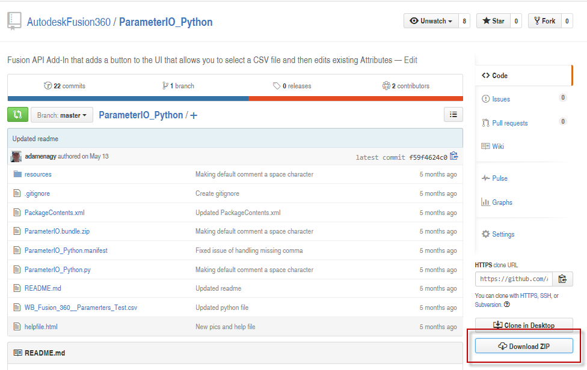
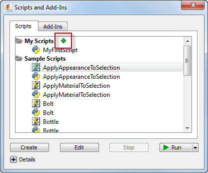

# Using Samples from GitHub

There are additional [sample programs available on GitHub](https://autodeskfusion360.github.io/). The following steps can be used to install the sample scripts and add-ins from GitHub. There are two general locations where scripts or add-ins can exist on your machine. The first is within a specific directory where Fusion looks for scripts and add-ins every time it is started. The second location can be anywhere on your computer, but then there is one additional step needed so that Fusion knows about the script or add-in.

### Known Locations

Each sample's readme mentions if it's a script or an add-in. Depending on whether the sample is a script or an add-in it needs to be placed in a different folder on your computer. These locations are different depending on if you're using Windows or Mac OS.

* **Windows**:
  + **Script**: %appdata%\Autodesk\Autodesk Fusion\API\**Scripts**
  + **Add-In**: %appdata%\Autodesk\Autodesk Fusion\API\**AddIns**
* **Mac OS**:
  + **Script**: ~/Library/Application Support/Autodesk/Autodesk Fusion/API/**Scripts**
  + **Add-In**: ~/Library/Application Support/Autodesk/Autodesk Fusion/API/**AddIns**

Inside the existing Scripts or AddIns folder you need to create a new folder whose name is the name as the .manifest file that will exist for each sample.

For example, in the case of the [**ParameterIO\_Python**](https://github.com/AutodeskFusion360/ParameterIO_Python) sample, which is an **Add-In**, the manifest file is named **ParameterIO\_Python**.manifest, therefore you should create a new **ParameterIO\_Python** folder under the appropriate **Fusion** folder:

**Windows**

**Mac OS**

You now need to copy all of the files of the script or add-in to this new folder. The easiest way to do that is to use the **Download Zip** option in GitHub, as shown below. This will package all of the files into a single zip and download it to your computer. You can then unpack the zip, maintaining any subdirectories, into the new directory you created. There will be a few extra GitHub specific files but they won't hurt anything and you can choose to delete them or not.

Once you restart **Fusion**, the **Add-In** or **Script** will be ready to use and shows up in the **Scripts and Add-Ins** dialog, as shown below.

### Any Location

To be able to put the sample at any location on your machine, create a new folder anywhere on your machine, using the same name as the .manifest file. Using the **Download Zip** GitHub option as described above, copy all of the samples, files into the newly created folder. To make the script or add-in known to Fusion, run the **Script and Add-Ins** command and click the green "+" icon beside the "My Scripts" or "My Add-Ins" folder in the dialog, as shown below. Use the dialog to browse to the location of the script or add-in and choose the .py, .js, .dll (for Windows), or .pylib (for Mac) file. The script or add-in will now be listed in the Scripts and Add-Ins dialog and you can run, edit, and debug it from there the same as any other script or add-in. You only need to do this once and Fusion will remember the script or add-in for all subsequent sessions.

---

|  |  |
| --- | --- |
| © Copyright 2025 Autodesk, Inc. | Comment on this page. |