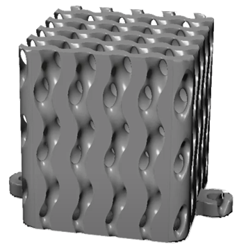
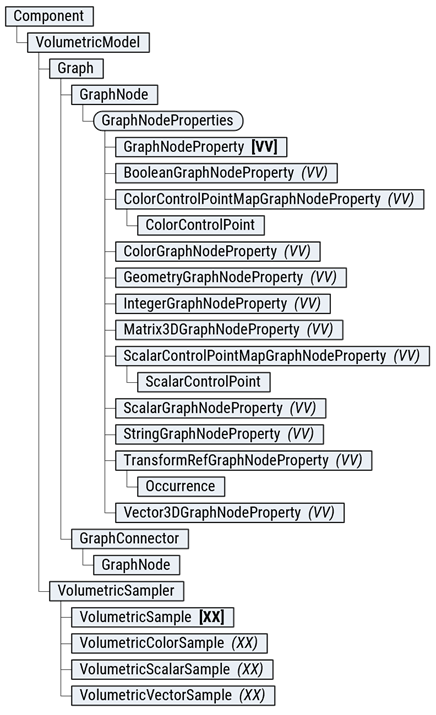
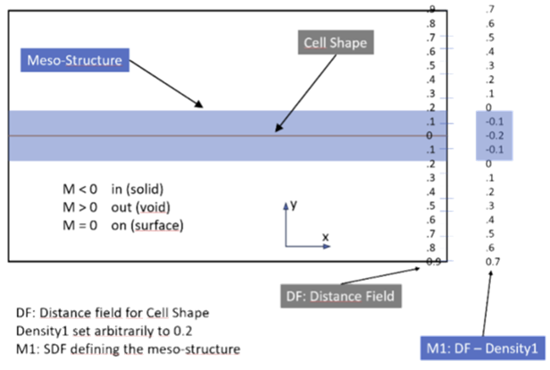

## Volumetric Modeling With the API

Creating custom volumetric features is considered an advanced use of the API, and you should have previous experience using the API and creating custom commands.

### Table of Contents

[Implicit Modeling Overview](#ImplicitModelingOverview)
      [Signed Distance Fields](#SignedDistanceField)
      [Levelset Functions](#LevelSetFunctions)
[Volumetric API Overview](#VolumetricAPIOverview)
      [Graphs](#Graphs)
      [Nodes, Properties, and Pins](#Nodes)
      [Connections](#Connections)
      [Channels](#Channels)
      [Directed Acyclic Graph (DAG)](#AcyclicGraph)
      [Functions](#Functions)
Detailed API Structure
      [DataTypes](#DataTypes)
      [Features and Models](#Features)
      [Primary Graph](#PrimaryGraph)
      [Cell Graph](#CellGraph)
      [Levelset Calculation](#LevelSet)
[ModelToMesh Conversion](#ModelToMesh)
[Example](#Example)

### What is Implicit Modeling

Implicit modeling is a technique used in computer graphics and computational geometry where shapes and objects are defined using mathematical functions rather than explicit geometric representations. This approach allows for more flexible and powerful manipulations of complex shapes, as it relies on mathematical expressions to describe the surfaces and volumes of objects. Implicit modeling is beneficial in applications such as computer-aided design (CAD), computational fluid dynamics, and medical imaging.

### What is a Signed Distance Field

A signed distance field (SDF) is a scalar field that represents the distance from any point in space to the closest surface of an object. The field's value is positive if the point is outside the object, negative if it is inside, and zero on the object's surface. This representation allows for efficient calculations of distances and interactions between objects, making it a key component in implicit modeling. SDFs are used in various applications, including collision detection, path finding, and shape blending.

### How is the Boundary of the Geometry Determined (Levelset Calculation)

The boundary of the geometry in implicit modeling is determined through a process called levelset calculation. A levelset is a contour where the implicit function (e.g., the signed distance field) has a constant value. The levelset calculated for any constant value defines an isosurface in 3D space. By identifying the zero levelset, the surface of the object is extracted. This method allows for precise and smooth representations of complex geometries, as it can effectively handle changes in topology and surface details. Levelset calculations are used in various fields such as fluid simulation, shape optimization, and computer graphics.

### Volumetric API Overview

The Volumetric API provides an effective way to perform implicit modeling through the concept of graphs. These graphs are composed of nodes and connections, enabling users to define and manipulate complex shapes and geometries efficiently. The graph editing capabilities provided in this API do not have an equivalent User Interface.

### Graphs

Graphs in the API represent the overall structure of the implicit modeling process, comprising multiple nodes and connections that perform mathematical operations and calculations necessary for defining shapes. Each model has two graphs: the PrimaryGraph and the CellGraph, which will be defined later.

### Nodes

Nodes are fundamental building blocks of the graph, representing specific mathematical operations or calculations. Nodes have properties, input pins, and output pins:

* Properties: Inputs to the node set by the user, defining parameters for mathematical operations.
* Input Pins: Receive information from other nodes.
* Output Pins: Send information to other nodes.

### Connections

Connections link nodes within the graph, providing the path for information to flow throughout the graph. Connections ensure that the data moves from one node to another, enabling the evaluation of complex operations and calculations.

### Channels - Nodes

Graph channels are nodes with one input and no output pins, representing pathways through which information flows from the graph, ultimately leading to the volume evaluation.

### Directed Acyclic Graphs (DAG)

Graphs created using the API must be Directed Acyclic Graphs (DAG), meaning no path in the graph should create a loop. Ensuring the graph is acyclic prevents infinite loops and ensures a clear, logical flow of information from input to output.

The Volumetric API enables users to construct sophisticated and efficient models for various applications by leveraging nodes, connections, and graph channels. The DAG requirement ensures the modeling process remains well-structured and computationally feasible.

### Functions

The API provides several nodes that allow the user to specify ‘functions’ to be evaluated on the Node inputs. These functions are specified as a string property belonging to the Node. There is a specific syntax that must be followed when writing these functions, and the supported operations are detailed below:

* **Predefined Inputs**
  The predefined inputs are variables, similar to constants, that change depending on whether your function takes a Scalar, Vector, or Color input:
  + **Scalar** - 'x' - scalar input
  + **Vector** - 'x', 'y', and 'z' are the inputs that match the input vector format.
  + **Color** – No function node has a color input.
* **Predefined Outputs:**

  Each of the functions is a scalar function. Therefore, Vector outputs require 3 functions to be defined; color outputs require four functions.
  + Scalar output property name: 'function'.
  + Vector output property names: 'x', 'y', and 'z'.
  + Color output property names: 'r', 'g', 'b', and 'a'.
* **Binary Operators:**
  + **Addition** '+'

     Usage: 'a + b'
  + **Subtraction** '-'

     Usage: 'a - b'
  + **Multiplication** '\*'

     Usage: 'a \* b'
  + **Division** '/'

     Usage: 'a / b'
  + **Exponentiation** '^'

     Usage: 'a^b'
  + **Modulo** 'mod'

     Usage: 'mod(a, b)'
  + **Maximum** 'max'

     Usage: 'max(a, b)' or 'max(a, b, c)'

     Note: Maximum can have a variable number of inputs
  + **Minimum** 'min'

     Usage: 'min(a, b)' or 'min(a, b, c)'

     Note: Minimum can have a variable number of inputs
  + **Power** 'pow'

     Usage: 'pow(a, b)'

     Note: a raised to the power of b
  + **Norm** 'norm'

     Usage: 'norm(a, b)'
  + **Norm Squared** 'norm2'

     Usage: 'norm2(a, b)'
  + **Clamp** 'clamp'

     Usage: 'clamp(value, minimum, maximum)

     Returns: max(b, min(a, c))
  + **Select** 'select'

     Usage: 'select(value1, value2, outVal1, outVal2)'

     Arguments:

      value1: First value to compare

      value2: Second value to compare

      outVal1: First output value

      outVal2: second output value

     Returns: if a < b ? c else d
* **Unary Operators**
  + **Floor** 'floor'

     Usage: 'floor(a)'
  + **Ceil** 'ceil'

     Usage: 'ceil(a)'
  + **Round** 'round'

     Usage: 'round(a)'
  + **Sine** 'sin'

     Usage: 'sin(a)'
  + **Cosine** 'cos'

     Usage: 'cos(a)'
  + **Tangent** 'tan'

     Usage: 'tan(a)'
  + **ArcSine** 'asin'

     Usage: 'asin(a)'
  + **Arccosine** 'acos'

     Usage: 'acos(a)'
  + **Arctangent** 'atan'

     Usage: 'atan(a)'
  + **Absolute Value** 'abs'

     Usage: 'abs(a)'
  + **Logarithm** 'log'

     Usage: 'log(a)'
  + **Exponential** 'exp'

     Usage: 'exp(a)'
  + **Square Root** 'sqrt'

     Usage: 'sqrt(a)'
  + **Arctangent2** 'atan2'

     Usage: 'atan2(a, b)'* **Constants**
  + **Pi** - 'pi'
  + **Pi multiplied by 2** - 'pi2'
  + **Euler’s Number** - 'e'

## Detailed API Structure

### DataTypes

To ensure maximum flexibility in graph design, pin types are standardized. There are three DataTypes used for graph pins:

* **Scalar:** Contains one scalar value, which can be any real number.
* **Vector:** Contains three scalar values (x, y, z) defining a position. These values can be any real number.
* **Color:** Contains four scalar values (r, g, b, a). Where r is red, g is green, b is blue, and a is alpha or opacity.

### Features and Models

Each feature created using the Volumetric API has an associated model. The model is central to defining and manipulating the geometry of the feature. A model is composed of two distinct graphs: the PrimaryGraph and the CellGraph. The CellGraph is a special graph which allows users to define repeating patterns throughout the volume and has valid coordinate inputs between the ranges of 0 and 1 in the x, y, and z dimensions. This provides a hexahedral element which enables one to define a unit cell. This unit cell is then patterned throughout the field. There are two channels in the cell graph, a Lattice Cell, and a Texture Cell. The lattice cell applies throughout the volume whereas the texture cell is only applied to the surface of the boundary.

### PrimaryGraph

The PrimaryGraph is the main graph that defines all the elements that do not have repetition and act globally. There are 6 channels in the PrimaryGraph, all of which are Nodes with:

* **BoundarySDF:** This channel receives an SDF that defines the limits of the geometry being evaluated. When the SDF of the lattice is evaluated, the maximum of the meso-structure SDF and the boundary SDF serves for limiting the meso-structure to the desired boundary. The BoundarySDF channel has a Scalar input.
* **Color:** This channel is used to define the color of the model anywhere within the field. The Color channel has a Color input.
* **LatticeDensity:** This channel is used to control the “Density” of the model. It modulates the output distance value of the Lattice Cell Shape, eventually pushing the zero level-set outwards by the density value. This helps to achieve the intended solid density for the meso-structure (see the figure below for an illustration in 2D.)
* **LatticeCoordinates:** This channel is used to transform (map) a global coordinate to a Cell coordinate. Applying different types of transformations, scaling, shrinking, twisting and other manipulations of a Lattice will be possible.
* **TextureDensity:** This channel is used to define the “Density” of the model as modified by the texture cell. This only affects the field near the Boundary of the volume.
* **TextureCoordinates:** This channel is used to translate a global coordinate to a Cell coordinate for scaling shrinking, twisting and other manipulations of a Texture.

### CellGraph

The CellGraph is a supplemental graph that defines repeated patterns throughout the volume. There are two outputs which define the shape of the lattice and textures which are then combined with the densities in from the PrimaryGraph.

* **CellLatticeShape:** Defines distance value for the lattice shape in cell coordinates from the PrimaryGraph.
* **CellTextureShape:** Defines distance value for the texture shape in cell coordinates from the PrimaryGraph.

